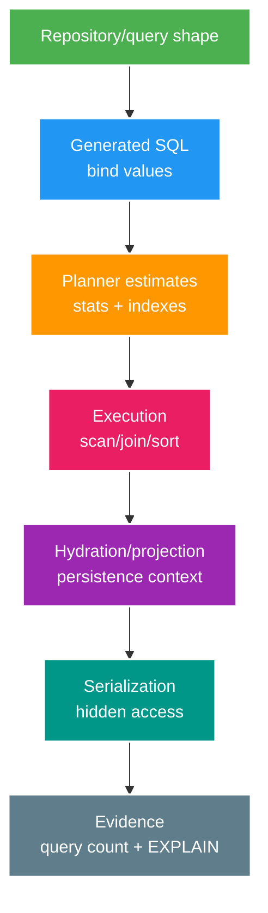

# Phân tích chuyên sâu: Fetch plan của JPA, keyset pagination và query plan bị thoái hóa

> Type: `DEEP_DIVE` 
> Domain: `database` 
> Target depth: `D4 — chẩn đoán ORM/query-plan regressions và thiết kế pagination ổn định ở scale` 
> Teaching readiness: `TEACHABLE_DRAFT` 
> Status: `DRAFT` 
> Evidence status: `NOT RUN` 
> Prerequisites: [JPA/query plan core](../core/jpa-n-plus-one-pagination-and-query-plans.md) 
> Related cases: `DB-01`; [question bank](../../question-bank/jpa-n-plus-one-pagination-and-query-plans.md) 
> Owner: `Project learner; Codex teaches, learner writes back` 
> Updated: `2026-07-26`

## 1. Từ repository method tới công việc thật trong database

Hãy lần theo toàn bộ đường đi: JPQL/Criteria/repository tạo SQL và bind parameter; PostgreSQL parse, lập kế hoạch rồi thực thi; JDBC nhận các row; cuối cùng JPA đưa dữ liệu vào persistence context, entity hoặc DTO trước khi serialize. Một method chỉ trả 20 object vẫn có thể chạy 21 query, lấy hàng nghìn row trùng do join hoặc nạp nhiều cột không dùng. Vì vậy tên method và số object trả về không nói được lượng công việc thật.

Project tránh JPA association nên giảm được truy cập lazy ngầm, nhưng N+1 vẫn xuất hiện nếu code gọi repository trong vòng lặp. Cách thường dùng là gom ID thành một batch, query một lần bằng projection, rồi tạo map để ghép kết quả với danh sách ban đầu.

## 2. Chọn cách lấy dữ liệu

Fetch join hoặc entity graph giải được một số N+1, nhưng join collection sẽ nhân row của parent. Hậu quả là pagination có thể sai, Hibernate phải phân trang trong memory, hoặc nhiều collection tạo tích Descartes rất lớn. DTO projection chọn đúng cột và join tường minh nên phù hợp với API đọc; entity phù hợp hơn khi cần theo dõi thay đổi để ghi. Batch fetch giảm số query nhưng đánh đổi bằng mệnh đề `IN` lớn, memory cao hơn và phụ thuộc vào association mapping.

Open Session in View giữ persistence context mở tới lúc serialize response. Nó làm code “có vẻ chạy được” nhưng che query lazy ở tầng web và khiến ranh giới transaction khó hiểu. Nên đóng việc lấy dữ liệu trong service/query boundary rõ ràng. Có thể log SQL an toàn ở môi trường không phải production và viết test đếm query cho đường quan trọng, nhưng phải nhớ rằng một query duy nhất vẫn có thể rất đắt nếu trả quá nhiều row.

## 3. So sánh offset và keyset pagination

Với offset pagination, `ORDER BY created_at,id LIMIT n OFFSET k` buộc database đi qua rồi bỏ ngày càng nhiều row khi `k` lớn. Insert hoặc delete đồng thời còn làm ranh giới page dịch chuyển, gây trùng hoặc bỏ sót. Keyset pagination mang cặp cuối `(createdAt,id)` trong cursor và dùng predicate `(created_at,id) < (?,?)` cùng một thứ tự xác định và index tương ứng. Lượng công việc nhờ đó gần với kích thước page. ID duy nhất làm tie-breaker là bắt buộc; chiều `ASC`/`DESC` và cách xử lý `NULL` phải được quy định rõ.

Cursor nên là giá trị opaque mà client không cần hiểu, được ký hoặc kiểm tra chặt, và phải gắn với filter, tenant, sort, version cùng thời hạn nếu cần. Không đưa secret vào cursor và không biến nội dung cursor thành SQL tùy ý. Keyset chống dịch page do insert/delete tốt hơn offset, nhưng một row bị update qua ranh giới sort vẫn có thể di chuyển. API phải nói rõ feed phản ánh dữ liệu sống hay một snapshot/version cố định.

Đếm tổng số row có thể đắt và con số có thể cũ ngay sau khi trả về. Một lựa chọn thực dụng là lấy thêm một row để suy ra `hasNext`; chỉ dùng ước lượng hoặc đếm bất đồng bộ khi sản phẩm chấp nhận sai số và độ trễ đó.

## 4. Cách đọc query plan

Chỉ chạy `EXPLAIN (ANALYZE, BUFFERS)` trong môi trường và với query an toàn, vì `ANALYZE` thực thi câu lệnh thật; với lệnh ghi phải tránh hoặc bọc rollback có chủ đích. Khi đọc plan, so sánh row ước lượng với row thực, số vòng `loops`, loại scan/join, sort có spill ra disk hay không, buffer đọc và thời gian lập kế hoạch so với thực thi. Index scan không phải lúc nào cũng tốt; đọc tuần tự có thể rẻ hơn nếu cần phần lớn bảng. Thứ tự cột của composite index phải theo equality, range và order trong access pattern; `INCLUDE`, selectivity và chi phí ghi đều là đánh đổi.

Prepared statement có thể dùng generic plan hoặc custom plan. Khi phân bố parameter lệch, cùng query có thể nhanh với tenant thường nhưng rất chậm với tenant nóng. Cần xem statistics có cũ không, planner ước lượng sai ở đâu, các cột có tương quan hay cần extended statistics không. Plan có thể đổi khi dữ liệu, PostgreSQL hoặc configuration đổi, nên phải chốt baseline phiên bản và test trên phân bố dữ liệu đại diện.

## 5. Các tình huống hỏng khó

**N+1 trong vòng lặp:** query parent rồi query tiếp theo từng ID làm p99 và số connection tăng; query count hoặc trace là bằng chứng, batch/projection là hướng sửa. **Join-fetch với pagination:** parent bị trùng hoặc thiếu và có thể phân trang trong memory; nên lấy page ID trước, rồi lấy detail ở bước hai và giữ lại thứ tự. **Keyset thiếu tie-breaker:** chỉ dùng timestamp sẽ bỏ sót row có cùng thời điểm; phải thêm ID vào order, predicate và index. **Plan regression:** dữ liệu lệch hoặc statistics sai khiến nested loop chạy hàng triệu vòng; cập nhật statistics hoặc sửa query/index rồi kiểm lại buffer và row thực, không ép hint một cách mù quáng.

## 6. Thí nghiệm và runbook điều tra

Dùng dataset có độ lệch và cardinality giống thực tế; benchmark cả cache lạnh và nóng một cách có kiểm soát. Lưu SQL/bind đã làm sạch, schema, index, statistics, phiên bản PostgreSQL/JPA, query plan, row, buffer, thời gian, số query và heap của ứng dụng. Thay đổi độ sâu page và tenant nóng. Regression test phải kiểm shape cùng số query; ngưỡng performance phải gắn với môi trường. Bằng chứng hiện `NOT RUN`.

### 6.1. Pathology A — fetch join sửa N+1 nhưng phá pagination

Một page 20 livestreams fetch join collection `tags`. SQL trả một row cho mỗi stream-tag pair, không phải một row cho mỗi stream. Hibernate phải de-duplicate entities; limit/offset có thể áp trên joined rows hoặc pagination bị làm trong memory tùy query/version. Page thiếu stream, memory tăng và count query có semantics khác. Thêm collection thứ hai còn tạo Cartesian product.

Fix phải bắt đầu từ output grain. Một option là query page IDs/projection trước với deterministic order, rồi batch fetch associations bằng second query và assemble theo original order. Entity graph/batch size giúp một số access patterns nhưng vẫn cần query-count và row-count evidence. Fetch join phù hợp to-one hoặc bounded collection khi không paginate; không phải universal N+1 switch.

### 6.2. Pathology B — keyset cursor bỏ/trùng rows dưới tie và concurrent insert

Cursor chỉ chứa `created_at` trong khi nhiều streams có cùng timestamp. Predicate `created_at < :cursor` bỏ các peers chưa trả; dùng `<=` gây duplicate. Order phải total, ví dụ `(created_at DESC, id DESC)`, và seek predicate lexicographic tương ứng. Index cần leading tenant/filter rồi order columns theo access pattern.

Cursor còn là API contract: bind tenant/filter/sort direction, encode version và ký hoặc validate để client không đổi scope. Concurrent insert trước cursor thường xuất hiện ở refresh chứ không trong continuation; cần product semantics rõ thay vì hứa snapshot vô hạn. Delete có thể tạo page ngắn nhưng không nên làm cursor quay ngược.

### 6.3. Pathology C — plan tốt ở staging, xấu cho hot tenant

Staging có data đều; production có một creator chiếm 40% rows. Planner estimate trung bình chọn nested loop/index scan, nhưng hot tenant lặp inner scan hàng triệu lần. Prepared/generic plan hoặc stale statistics có thể che parameter skew. Latency p99 tăng dù median bình thường.

Evidence là estimated so actual rows theo node/loops, buffers và parameter class; không phải chỉ total duration. Mitigation có thể là extended statistics, index/filter rewrite, pre-aggregation/partitioning hoặc query variant có kiểm soát. `ANALYZE` có thể sửa stale stats nhưng không giải quyết model/index sai. Pin PostgreSQL/JDBC/Hibernate version vì plan caching và generated SQL thay đổi.

## 6.4. Quy trình chẩn đoán đầu-cuối

1. Bật công cụ đếm SQL/query một cách an toàn; không log secret hoặc toàn bộ payload.
2. Tái hiện endpoint với representative graph access để phân biệt N+1, one huge join và lazy access sau session close.
3. Chụp exact SQL, bind class, schema/index/stats và data distribution.
4. Đọc plan từ ngoài vào trong: output rows, estimated/actual delta, loops, buffers, sort/spill.
5. Thử một thay đổi mỗi lần: projection, two-step fetch, index hoặc keyset; assert response semantics trước benchmark.
6. Thêm regression guard ở đúng layer: query count/SQL shape trong integration test và latency/load evidence ở environment ổn định.

`open-in-view` có thể che lazy boundary bằng cách kéo persistence context ra web layer, nhưng đổi transaction/query timing và dễ N+1 khi serialization. DTO projection làm read model rõ hơn nhưng tăng mapping/query variants. L2/query cache có invalidation/freshness contract và không chữa plan/cardinality sai.

## 6.5. Ra quyết định và dàn ý phỏng vấn

Offset đơn giản, hỗ trợ random page, nhưng work tăng theo depth và dễ drift. Keyset ổn định/bounded hơn cho next-page, đổi lại không random jump và cursor gắn với order/filter. Fetch join giảm round trips nhưng có row multiplication; batch fetch cân bằng hơn nhưng cần tune. Projection giảm materialization nhưng không dùng như domain entity.

Senior answer nên nối object access -> SQL count/rows -> physical plan -> evidence. Architect thêm cursor compatibility, hot-tenant isolation, cache/read-model choice và rollout. Expert phân tích generic plan/skew, multiple-bag/cartesian risk, snapshot semantics và version drift của ORM/planner.

## 7. Bài tập diễn đạt lại và tự kiểm tra

> **Bài viết của tôi — `LEARNER TODO`:** explain one N+1 fix and keyset cursor/index with plan evidence.

1. **Question:** Vì sao collection fetch join có thể làm page 20 streams sai hoặc tốn memory? 
   **Đọc lại nếu bí:** mục 2 và 6.1. 
   **Một câu trả lời tốt phải có:** result grain, duplication/cartesian, pagination boundary, two-step alternative và query-count/row evidence. 
   **My answer:** `LEARNER TODO`
2. **Question:** Thiết kế compound keyset cursor an toàn cho feed theo tenant như thế nào? 
   **Đọc lại nếu bí:** mục 3 và 6.2. 
   **Một câu trả lời tốt phải có:** total order/tie-breaker, lexicographic predicate, matching index, scope binding/version/signature và concurrent-write semantics. 
   **My answer:** `LEARNER TODO`
3. **Question:** Điều tra plan regression chỉ xảy ra ở hot tenant bằng evidence nào? 
   **Đọc lại nếu bí:** mục 4, 6.3–6.4. 
   **Một câu trả lời tốt phải có:** exact SQL/binds, skew, estimated/actual rows/loops/buffers, version/stats và controlled mitigation. 
   **My answer:** `LEARNER TODO`

## 8. Tài liệu tham khảo

- [PostgreSQL — Using EXPLAIN](https://www.postgresql.org/docs/current/using-explain.html)
- [Hibernate ORM User Guide — Fetching](https://docs.jboss.org/hibernate/orm/current/userguide/html_single/Hibernate_User_Guide.html#fetching)

- [ ] Evidence remains `NOT RUN`.
