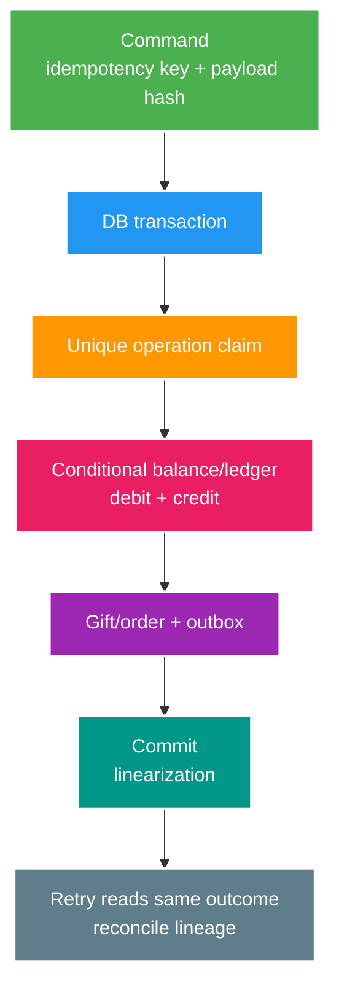

# Phân tích chuyên sâu: Điểm chốt của ledger, idempotency và đối soát

> Type: `DEEP_DIVE` 
> Domain: `database` 
> Target depth: `D4 — prove money-like conservation under concurrent retries/crashes and repair without rewriting history` 
> Teaching readiness: `TEACHABLE_DRAFT` 
> Status: `DRAFT` 
> Evidence status: `NOT RUN` 
> Prerequisites: [Ledger/lost update core](../core/ledger-lost-update-and-money-invariants.md) 
> Related cases: `DB-04`, `EVT-01`; [question bank](../../question-bank/ledger-lost-update-and-money-invariants.md) 
> Owner: `Project learner; Codex teaches, learner writes back` 
> Updated: `2026-07-26`

## 1. Phát biểu invariant trước khi thiết kế

Hãy viết invariant bằng câu có thể kiểm tra: số dư không âm nếu chính sách cấm thấu chi; mỗi operation key tạo tối đa một hiệu ứng nghiệp vụ; tổng debit và credit phải cân bằng; entry đã ghi là bất biến và kiểm toán được; balance phải bằng tổng ledger kể từ checkpoint hợp lệ. **Linearization point** là thời điểm operation có hiệu lực duy nhất trong mô hình đồng thời; ở đây thường là commit của database sở hữu ledger, không phải lúc HTTP trả response hay broker nhận message. Tiền phải dùng integer theo đơn vị nhỏ nhất hoặc `BigDecimal` với scale/rounding rõ ràng, tuyệt đối không dùng số thực nhị phân `float`.

## 2. Xử lý đồng thời

Đọc balance rồi ghi `old-amount` là mẫu read–modify–write có thể lost update. Có thể dùng câu update nguyên tử với điều kiện `balance >= amount AND version`, khóa row theo thứ tự wallet xác định, hoặc append ledger trong cùng transaction với account state được bảo vệ. Unique constraint trên `(wallet, operationKey)` chọn đúng một transaction thắng. Nếu cùng key nhưng payload hash khác, server phải trả conflict và ghi nhận tín hiệu bất thường; không được coi đó là retry hợp lệ.

Khi chuyển giữa hai wallet, mọi đường code phải khóa ID theo cùng thứ tự để giảm deadlock. Một transaction ghi operation, debit, credit, gift và outbox; constraint hoặc bước kiểm tra tổng bảo vệ invariant cuối. `SERIALIZABLE` vẫn có thể chủ động abort, vì vậy retry phải dùng lại operation key. Với wallet nóng, optimistic conflict không được retry vô hạn; cần hàng đợi, admission control hoặc reservation có owner rõ.

Balance đã tổng hợp hoặc cache chỉ là tối ưu đọc; ledger mới là lịch sử có thể đối soát. Cập nhật balance và ledger trong hai transaction tách rời sẽ tạo trạng thái không sửa được bằng retry đơn giản. Trigger/constraint đặt guard gần dữ liệu nhưng khó nhìn và giảm tính portable; service dễ đọc hơn nhưng database vẫn nên giữ hàng rào cuối cho invariant biểu diễn được.

## 3. Các lịch sử crash và mất response

Nếu process chết trước commit, transaction rollback và retry có thể xử lý lại. Nếu commit xong nhưng response bị mất, retry phải tìm operation cũ và trả cùng kết quả. Relay gửi trùng thì consumer dùng inbox hoặc business identity để bỏ hiệu ứng lặp. Timeout từ provider bên ngoài tạo trạng thái **unknown outcome**: phải hỏi lại provider bằng cùng idempotency key hoặc operation ID, không sinh key mới. Refund hay compensation phải tạo entry mới có liên kết, không xóa hoặc sửa entry gốc.

Outbox nằm cùng transaction giữ lại ý định publish một cách durable. Consumer chỉ acknowledge sau khi local commit thành công. Khi nói “exactly-once”, phải chỉ rõ invariant nào đạt hiệu ứng một lần; không nên tuyên bố callback hay câu lệnh vật lý chỉ chạy đúng một lần.

## 4. Đối soát và sửa sai

Đối soát cần tìm operation key trùng, nhóm transaction không cân, balance lệch với tổng ledger/checkpoint, gift không có ledger/outbox, outbox không có owner và trạng thái lệch với provider. Bước eventual phải có khoảng chờ hợp lý để tránh báo giả. Lệnh repair phải idempotent, có dry-run, actor, lý do và audit; sửa bằng compensating entry để giữ nguyên lịch sử.

Khi ledger lớn, có thể dùng checkpoint hoặc snapshot balance, nhưng entry sau checkpoint vẫn bất biến và tổng tăng dần phải được kiểm chứng. Archive không xóa nghĩa vụ audit và restore. Phần làm tròn, phí hay thuế cần account và quy tắc cân bằng riêng, không “nhét” vào sai số.

## 5. Ví nóng trở thành điểm nghẽn

Một account của creator nổi tiếng hoặc treasury có thể buộc mọi transaction nối đuôi nhau. Trước khi đổi thiết kế phải đo lock wait và conflict. Có thể rút ngắn transaction, gom credit theo batch, dùng settlement account theo recipient hoặc reservation/escrow, nhưng mọi cách đều phải giữ conservation và có đối soát. Chia cùng một balance sang nhiều shard mà không có owner sẽ gây chi vượt. Queue bất đồng bộ chỉ làm tải mượt hơn; backlog, trạng thái và owner vẫn phải rõ.

## 6. Bằng chứng khi chủ động tiêm lỗi

Lab cần chạy đồng thời cùng key và khác key, race khi không đủ tiền, deadlock, kill trước/sau commit và trước response, gửi trùng ở relay/consumer cùng timeout provider. Assertion phải kiểm conservation, tính duy nhất, outcome và outbox; chỉ kiểm HTTP status là chưa đủ. Bằng chứng hiện vẫn `NOT RUN`.

### 6.1. Pathology A — hai gifts cùng thấy đủ số dư

Wallet có 100 coins. Hai requests 80 coins cùng đọc balance 100 trước khi bên nào update. Nếu application tính `newBalance = 20` rồi ghi, cả hai có thể trả success nhưng chỉ trừ một lần; nếu ghi hai ledger debits mà không bảo vệ balance, balance âm hoặc conservation lệch. HTTP test tuần tự không phát hiện history này.

Linearization point phải nằm ở thao tác database bảo vệ invariant. Một conditional update `UPDATE wallet SET balance = balance - 80 WHERE id=? AND balance >= 80` cho đúng affected-row semantics; hoặc lock row rồi append debit/credit theo lock order. Ledger entries, balance projection và outbox phải commit cùng transaction. Test dùng barrier, chạy concurrent requests và assert: tối đa một operation success, balance không âm, tổng debit/credit bảo toàn và mỗi business operation có đúng một outcome.

### 6.2. Pathology B — response mất sau commit tạo duplicate business operation

Server commit gift nhưng connection bị cắt trước response. Client không biết success hay failure và retry. Nếu tạo idempotency key mới, server không thể nhận ra cùng intent. Nếu key cũ chỉ cache response ngoài transaction, crash có thể giữ effect mà mất cache. Key phải gắn với actor, operation type và canonical payload hash; record outcome cùng domain effect hoặc có state machine recoverable.

Same key + same payload trả outcome cũ. Same key + different payload là conflict, không phải retry hợp lệ. Retention phải dài hơn retry/reconciliation horizon; xóa key quá sớm có thể tái thực hiện effect. API status lookup và operation ledger giúp client giải quyết unknown outcome mà không đoán.

### 6.3. Pathology C — compensation “xóa” lịch sử và phá audit

Payment/gift đã tạo downstream effect rồi cần hoàn. Update row cũ thành `CANCELLED` hoặc delete debit làm mất lịch sử tiền đã đi qua hệ thống và khó đối chiếu provider. Compensation đúng thường là append reversing entries tham chiếu original operation, giữ currency/amount và lý do. Nó tạo trạng thái kinh doanh mới chứ không quay ngược thời gian.

External provider có thể success trong khi local timeout; compensation trước khi query provider có thể vừa refund vừa để charge tồn tại. Reconciliation so local operation state, provider reference và ledger totals; mismatch đi vào retry/manual queue có ownership, SLA và audit trail.

## 6.4. Hot-wallet, ordering và scale boundary

Một creator wallet nóng có thể biến row lock thành serial bottleneck. Sharding balance tùy tiện làm invariant tổng phức tạp hơn. Các option gồm append-only ledger với asynchronously maintained projection, partition theo account, reservation trước settlement hoặc tách hot aggregate theo business semantics. Không option nào bỏ nhu cầu idempotency/reconciliation.

Canonical lock order giảm deadlock nhưng không tăng capacity của một aggregate phải serialize. Queue theo wallet key làm ordering dễ thấy nhưng cần xử lý lag, poison message và failover. Quyết định phải dựa peak operations/account, acceptable staleness, fraud/security boundary và recovery time.

## 6.5. Quy trình chẩn đoán và thí nghiệm từng bước

1. Định nghĩa invariants bằng equation: balance không âm; tổng debit bằng tổng credit theo currency; một business operation có một terminal outcome.
2. Chọn business identity và database constraints trước khi test concurrency.
3. Dùng deterministic barriers cho insufficient-funds race và duplicate key; không dùng sleep làm bằng chứng chính.
4. Tiêm lỗi trước commit, sau commit/trước response, sau outbox publish và trước consumer ack.
5. Assert database rows, constraints, outbox/inbox và reconciliation result; status code chỉ là một signal.
6. Đo lock wait, abort/retry, hot-account throughput và oldest unresolved operation. Evidence `NOT RUN` cho tới khi procedure được thực thi.

Spring transaction proxy, PostgreSQL isolation và broker redelivery là ba boundary khác nhau. Một annotation không tạo atomicity với provider/broker. Exact lock/error behavior phải pin PostgreSQL/JPA version và query thật.

## 6.6. Cách lập luận khi phỏng vấn

Senior answer bắt đầu bằng invariant và one concrete race, rồi nêu linearization point, unique key và fault test. Architect thêm hot aggregate, audit/regulatory retention, reconciliation ownership và rollout. Expert phải reason về unknown outcome, same-key/different-payload, compensation as new event và residual risk khi external side không hỗ trợ idempotency/status.

### 6.7. Ba loại identity phải tách biệt

Request transport có thể gửi lại, operation key đại diện một ý định nghiệp vụ, còn ledger transaction ID đại diện effect đã commit. Nếu client đổi operation key sau timeout, server không còn cách nhận ra cùng ý định và có thể trừ tiền lần hai. Nếu dùng lại key với payload khác, đó là conflict chứ không phải retry. Reconciliation dùng các identity này để nối command, ledger, balance projection, outbox và provider outcome; so tổng tiền mà không truy được lineage chưa đủ để repair an toàn.

Khi điều tra, bắt đầu từ operation key rồi tìm đúng một owner outcome, các posting cân bằng, projection tương ứng và event downstream. Thiếu bước nào thì ghi trạng thái unknown và chạy repair idempotent; không tạo gift mới để “bù cho nhanh”. Cách trình bày này làm rõ idempotency không chỉ là một cột unique, mà là contract trả cùng outcome qua retry và đối soát được từ đầu tới cuối.

## 7. Bài tập diễn đạt lại và tự kiểm tra

> **Bài viết của tôi — `LEARNER TODO`:** specify gift ledger rows, operation key, lock order and reconciliation.

1. **Question:** Hai gifts đồng thời trên wallet 100 coins có thể phá invariant ra sao và linearize ở đâu? 
   **Đọc lại nếu bí:** mục 1–2 và 6.1. 
   **Một câu trả lời tốt phải có:** interleaving, atomic conditional/lock option, transaction scope và invariant assertions. 
   **My answer:** `LEARNER TODO`
2. **Question:** Thiết kế idempotency contract cho response-loss-after-commit như thế nào? 
   **Đọc lại nếu bí:** mục 3 và 6.2. 
   **Một câu trả lời tốt phải có:** business identity, payload hash, atomic outcome, retention, status/reconcile và conflict semantics. 
   **My answer:** `LEARNER TODO`
3. **Question:** Vì sao compensation nên append reversing entry thay vì sửa/xóa lịch sử? 
   **Đọc lại nếu bí:** mục 4 và 6.3–6.6. 
   **Một câu trả lời tốt phải có:** audit/conservation, external irreversibility, reconciliation ownership và residual risk. 
   **My answer:** `LEARNER TODO`

## 8. Tài liệu tham khảo

- [PostgreSQL — Constraints](https://www.postgresql.org/docs/current/ddl-constraints.html)
- [PostgreSQL — Explicit Locking](https://www.postgresql.org/docs/current/explicit-locking.html)

- [ ] Evidence remains `NOT RUN`.
