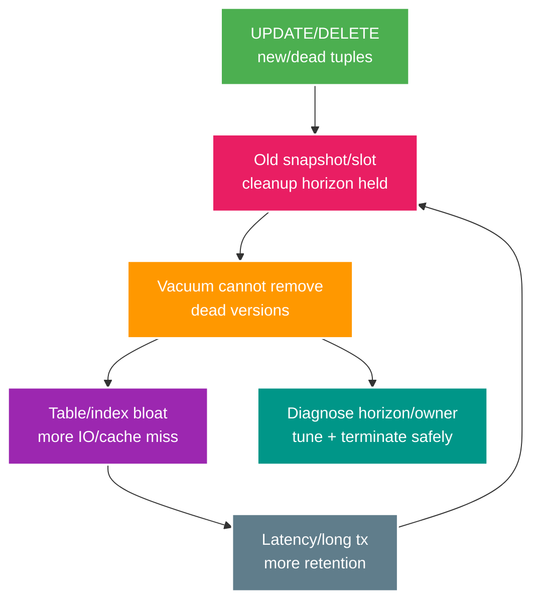

# Phân tích chuyên sâu: MVCC snapshot, bloat và xử lý khẩn cấp khi vacuum không theo kịp

> Type: `DEEP_DIVE` 
> Domain: `database` 
> Target depth: `D4 — chẩn đoán snapshot retention/bloat/autovacuum và recovery không phá workload` 
> Teaching readiness: `TEACHABLE_DRAFT` 
> Status: `DRAFT` 
> Evidence status: `NOT RUN` 
> Prerequisites: [Indexing/MVCC/Vacuum core](../core/indexing-mvcc-vacuum-and-bloat.md) 
> Related cases: `DB-02`; [question bank](../../question-bank/indexing-mvcc-vacuum-and-bloat.md) 
> Owner: `Project learner; Codex teaches, learner writes back` 
> Updated: `2026-07-26`

## 1. Chuỗi nguyên nhân của MVCC

Mỗi `UPDATE` thường tạo một phiên bản tuple mới; phiên bản cũ còn nằm đó cho tới khi không snapshot nào cần nhìn thấy nó và vacuum có thể dọn. Index có thể cùng lúc trỏ tới nhiều phiên bản. Transaction kéo dài giữ chân tuple cũ, còn replication slot hoặc standby feedback có thể giữ WAL và cleanup horizon. Table/index lớn lên, cache hit giảm, scan và write chậm hơn; latency cao lại làm transaction sống lâu hơn. Đây là vòng phản hồi làm sự cố tự khuếch đại.

## 2. Khả năng nhìn thấy tuple và HOT update

Snapshot quyết định phiên bản tuple nào được nhìn thấy dựa trên transaction ID và trạng thái commit, chứ database không có một “bản hiện tại” chung cho mọi transaction. Isolation level làm thời gian sống của snapshot khác nhau. HOT update có thể tránh thêm index entry khi cột được index không đổi và page còn chỗ; `fillfactor` vì vậy đánh đổi dung lượng với cơ hội HOT. Visibility map cho phép index-only scan bỏ bước kiểm heap khi page là all-visible, nhưng page bị update thường xuyên sẽ mất trạng thái này.

Vacuum đánh dấu chỗ trống để tái sử dụng, cập nhật visibility map và freeze metadata. `VACUUM` thường không trả kích thước file về hệ điều hành. `VACUUM FULL` ghi lại table, cần lock mạnh, disk và thời gian nên không phải nút bấm mặc định khi có sự cố. Với `REINDEX` và biến thể concurrent, phải kiểm đúng phiên bản PostgreSQL, loại lock và chi phí trước khi chạy.

## 3. Cách chẩn đoán

Hãy bắt đầu từ transaction hoặc `xmin` lâu nhất, session `idle in transaction`, tiến độ autovacuum, dead/live tuple, kích thước và tốc độ tăng của table/index, lần vacuum/analyze gần nhất, tuổi transaction ID, WAL bị replication slot giữ, standby feedback, I/O và lock. Các thống kê dead tuple chỉ là ước lượng. Quan trọng nhất là nối session trở lại endpoint hoặc job đã mở transaction và đo thời gian sống thật của nó.

Ngưỡng autovacuum tăng theo kích thước table, nên table lớn có nhiều update có thể cần `scale_factor`, threshold và cost theo từng table. Chạy quá yếu làm bloat; chạy quá mạnh tranh I/O với traffic. `ANALYZE` còn có vai trò riêng là cập nhật statistics cho planner. Partition có thể giới hạn churn và retention vào một phần dữ liệu nhưng không tự giải quyết query hoặc transaction xấu.

## 4. Xử lý tình huống khẩn cấp

Trong tình huống khẩn cấp, ưu tiên nguy cơ wraparound và an toàn dữ liệu. Chỉ dừng transaction/job giữ horizon sau khi xác định owner và tác động; sau đó sửa transaction boundary hoặc timeout `idle in transaction` ở pool/application. Chỉ xử lý replication slot bị bỏ sau khi xác nhận consumer và phương án phục hồi, vì drop slot làm mất vị trí resume. Cấp I/O headroom cho vacuum, tune theo table và theo dõi. Nếu bloat nặng, lập kế hoạch reindex/rewrite/partition với disk, lock và replica lag; không chạy `VACUUM FULL` mù trong giờ cao điểm.

Backup vật lý và replica mang theo bloat vật lý; rebuild logic có thể làm gọn nhưng đổi lại thời gian và rủi ro migration. Sau phục hồi cần đặt deadline cho transaction, phân trang query, cảnh báo slot và baseline autovacuum để lỗi không tái diễn.

## 5. Đánh đổi khi tạo index

Mỗi index làm tăng chi phí ghi, WAL, vacuum, lưu trữ và bản thân nó cũng có thể bloat. Chỉ xóa index “không dùng” sau khi kiểm tra cửa sổ quan sát, query hiếm nhưng quan trọng và unique constraint. Predicate của partial index, expression và collation phải khớp query. Thứ tự composite index đi theo access pattern. B-tree không thần kỳ khi predicate có selectivity thấp và trả phần lớn bảng; GIN, GiST và BRIN có ngữ nghĩa cùng chi phí bảo trì riêng.

## 6. Phòng lab tiêm lỗi

Trong database dùng một lần, tạo dataset có update liên tục, giữ một snapshot `REPEATABLE READ`, update nhiều row rồi quan sát dead tuple, vacuum không dọn được, kích thước và plan. Sau đó đóng snapshot và chạy vacuum để so sánh. Tái hiện thêm `idle in transaction` và replication slot bị bỏ. Ghi PostgreSQL version, configuration, statistics, plan, kích thước và thời gian; tuyệt đối không làm thí nghiệm phá hủy trên dữ liệu dùng chung. Bằng chứng hiện `NOT RUN`.

### 6.1. Pathology A — long snapshot giữ lại hàng triệu dead tuples

Một reporting transaction bắt đầu ở `REPEATABLE READ`, đọc một lần rồi bị bỏ quên. Trong lúc đó workload liên tục update trạng thái viewer session. Mỗi update tạo tuple version mới; version cũ không thể bị vacuum xóa nếu snapshot cũ vẫn có thể nhìn thấy nó. Table và indexes phình lên, cache hit giảm, scans đọc nhiều pages hơn và autovacuum chạy lâu nhưng không reclaim được như mong đợi.

Symptom “autovacuum đang chạy” không bác bỏ blocker horizon. Evidence cần nối `pg_stat_activity`/transaction age với dead tuple trend, relation size và plan buffers. Sau khi xác minh owner và ảnh hưởng, incident response ưu tiên dừng nguồn tạo long transaction hoặc terminate session theo runbook; chỉ sau đó vacuum mới có cơ hội tiến horizon. `VACUUM FULL` ngay lập tức thường là lựa chọn nguy hiểm vì rewrite, extra disk và exclusive lock.

### 6.2. Pathology B — replication slot không dùng làm primary hết disk

Logical/physical replication slot bảo PostgreSQL giữ WAL mà consumer chưa xác nhận. Nếu connector chết nhưng slot còn active về mặt cấu hình, retained WAL tăng không giới hạn theo write rate. Đây không phải table bloat, nên chỉ nhìn dead tuples sẽ bỏ sót. Disk pressure cuối cùng có thể chặn WAL write và làm primary outage.

Diagnostic phân biệt hai horizon: tuple cleanup bị giữ bởi snapshot/xmin và WAL recycling bị giữ bởi replication slot. Theo dõi retained bytes, restart/confirmed position, consumer health và disk burn rate. Không drop slot chỉ vì “cũ”: có thể làm mất recovery/change stream contract. Quyết định phải biết consumer có thể rebuild từ snapshot hay không, RPO là gì và ai sở hữu slot.

### 6.3. Pathology C — index bloat và HOT bị phá bởi một index tưởng vô hại

HOT update có thể tránh tạo entry mới cho mọi index khi indexed columns không đổi và page còn chỗ. Thêm index lên cột thường xuyên thay đổi, hoặc page quá đầy, làm nhiều updates không còn HOT. Write amplification tăng, indexes phình và vacuum phải xử lý nhiều hơn. Một index giúp một read query nhưng có thể làm toàn write workload đắt hơn.

Evidence cần `n_tup_hot_upd` tương quan với deployment index, per-index size/usage và write latency. Mitigation có thể là bỏ index ít giá trị, đổi fillfactor khi có lý do, batch/update pattern hoặc partition lifecycle; mỗi option có cost và phải đo lại.

## 6.4. Incident diagnostic theo thứ tự an toàn

1. Xác nhận symptom: disk, latency, buffer reads, autovacuum backlog hay wraparound warning.
2. Xác định loại retention: long transaction/prepared transaction, standby feedback, replication slot hay churn bình thường.
3. Tính tốc độ xấu đi và thời gian còn lại thay vì chỉ xem snapshot hiện tại.
4. Bảo vệ availability trước: giảm nonessential write/load, sửa blocker owner, đảm bảo disk headroom theo runbook.
5. Chọn maintenance ít khóa nhất; `VACUUM`, `REINDEX CONCURRENTLY` hoặc online alternative được đánh giá theo exact PostgreSQL version.
6. Xác minh sau xử lý bằng horizon, relation/index size trend, query buffers và workload latency. Reclaim logical tuples không đồng nghĩa OS file co ngay.

Lab phải chạy trong disposable database. Giữ một snapshot, tạo churn có kiểm soát, chụp stats trước/sau và giải phóng blocker. Kết quả chứng minh causal chain trong lab, không tự động chứng minh production có cùng root cause.

## 6.5. Ranh giới liên tầng và quyết định dài hạn

Connection pool có thể giữ transaction do request timeout/cancellation không đóng đúng; ORM read method đặt transaction quá rộng; batch consumer xử lý external I/O bên trong transaction. Replica feedback và CDC connector là owner ngoài application nhưng ảnh hưởng storage primary. Vì vậy guardrail cần transaction timeout/idle timeout thận trọng, slot ownership/alert, table-specific autovacuum tuning theo churn và capacity headroom.

Câu trả lời phỏng vấn tốt không dừng ở “vacuum dọn dead rows”. Senior phải kể snapshot horizon và evidence. Architect phải thêm ownership, SLO/disk budget và online recovery. Expert phải phân biệt tuple bloat, index bloat, retained WAL, wraparound risk và điều gì thay đổi theo version/workload.

### 6.6. Thứ tự containment để không chữa nhầm nguyên nhân

Nếu disk tăng nhanh, trước hết xác định đang tăng table/index hay WAL retained. WAL tăng do replication slot bị bỏ không được chữa bằng `VACUUM FULL`; dead tuple tăng vì snapshot cũ cũng không giảm chỉ bằng tăng worker autovacuum. Sau khi tìm cleanup horizon owner, quyết định có thể cancel transaction, dừng job hay giữ vì recovery/replication. Tiếp theo mới cấp headroom cho vacuum và đo dead tuple giảm, visibility/freeze tiến triển. Reindex/rewrite chỉ xử lý cấu trúc đã phình sau khi nguyên nhân giữ version được loại; làm ngược thứ tự sẽ phình lại.

Trong incident wraparound, correctness quan trọng hơn latency: ưu tiên vacuum cần thiết, chặn workload không quan trọng và theo dõi tuổi transaction ID. Trong incident chỉ có bloat performance, có thể lên kế hoạch online hơn và chấp nhận file chưa nhỏ ngay. Runbook cần ngưỡng escalation, disk headroom cho rewrite, lock mode, replica impact và đường abort. Bằng chứng “relation size giảm” không đủ nếu p99, write amplification hoặc replica lag xấu hơn.

## 7. Bài tập diễn đạt lại và tự kiểm tra

> **Bài viết của tôi — `LEARNER TODO`:** tell bloat feedback and safe incident steps.

1. **Question:** Một long-running transaction biến thành latency và disk incident theo chuỗi nào? 
   **Đọc lại nếu bí:** mục 1 và 6.1. 
   **Một câu trả lời tốt phải có:** snapshot horizon, tuple versions, vacuum limitation, observable evidence và recovery order. 
   **My answer:** `LEARNER TODO`
2. **Question:** Phân biệt table bloat với retained WAL do replication slot bằng evidence nào? 
   **Đọc lại nếu bí:** mục 3 và 6.2. 
   **Một câu trả lời tốt phải có:** hai retention mechanisms, metrics/positions, ownership và rủi ro của drop slot. 
   **My answer:** `LEARNER TODO`
3. **Question:** Vì sao thêm index có thể làm vacuum pressure nặng hơn? 
   **Đọc lại nếu bí:** mục 2 và 6.3–6.5. 
   **Một câu trả lời tốt phải có:** HOT eligibility, page/index write amplification, measurement và decision trade-off. 
   **My answer:** `LEARNER TODO`

## 8. Tài liệu tham khảo

- [PostgreSQL — Routine Vacuuming](https://www.postgresql.org/docs/current/routine-vacuuming.html)
- [PostgreSQL — MVCC](https://www.postgresql.org/docs/current/mvcc.html)

- [ ] Evidence remains `NOT RUN`.
