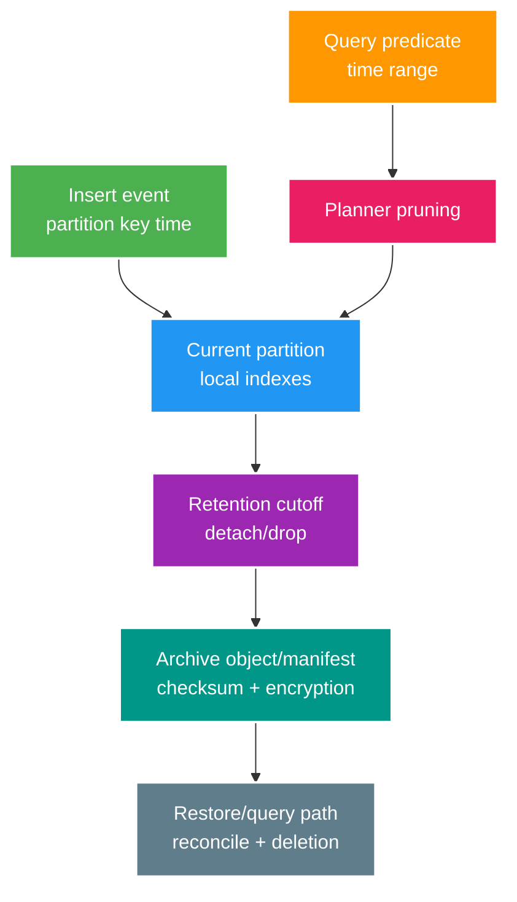

# Phân tích chuyên sâu: Partition pruning, retention, detach và khôi phục archive

> Type: `DEEP_DIVE` 
> Domain: `database` 
> Target depth: `D4 — operate time partitions, lifecycle deletion/archive and restore without data gaps` 
> Teaching readiness: `TEACHABLE_DRAFT` 
> Status: `DRAFT` 
> Evidence status: `NOT RUN` 
> Prerequisites: [Partitioning/retention core](../core/time-partitioning-retention-and-archive.md) 
> Related cases: `DB-08`; [question bank](../../question-bank/time-partitioning-retention-and-archive.md) 
> Owner: `Project learner; Codex teaches, learner writes back` 
> Updated: `2026-07-26`

## 1. Partitioning là cách tổ chức vòng đời dữ liệu vật lý

Declarative partitioning định tuyến row theo key hoặc range; planner chỉ bỏ qua partition khi predicate tương thích với partition key. Partitioning không làm mọi query nhanh hơn: quá nhiều partition tăng chi phí planning và metadata, predicate sai vẫn quét tất cả, còn index/constraint phải được quản lý trên từng partition. Độ hạt ngày, tuần hay tháng phải dựa trên volume, query, retention và thao tác bảo trì; đồng thời phải có cách xử lý default partition hoặc tạo partition tương lai.

## 2. Partition key, độ hạt dữ liệu và tính đúng

Phải quyết định partition theo **event time** hay **ingestion time**. Event đến muộn có thể nhắm vào partition đã đóng hoặc archive, nên cần grace period, default/quarantine hoặc quy trình mở lại. Tùy phiên bản và ràng buộc PostgreSQL, unique constraint trên partitioned table thường phải chứa partition key; điều này ảnh hưởng idempotency toàn cục và có thể buộc tách bảng owner riêng. Foreign key, update làm row chuyển partition và logic routing đều phải được kiểm chứng chính xác.

Index là cục bộ theo partition. Partition mới phải có đủ index và constraint trước khi nhận traffic. Automation nên tạo trước một khoảng thời gian và cảnh báo khi thiếu. Ranh giới thời gian nên chuẩn hóa theo UTC, còn business day phải chuyển đổi tường minh để không dính mơ hồ do DST.

## 3. Query và cơ chế loại bỏ partition không liên quan

Predicate nên tác động trực tiếp lên partition key, ví dụ `occurred_at >= ? AND occurred_at < ?`; bọc key trong function hoặc cast có thể làm planner không prune nếu expression không khớp. Dùng `EXPLAIN` để xem partition nào thực sự bị scan, row ước lượng và sort. Pagination xuyên nhiều partition cần total order và index phù hợp. Partition theo ngày trong nhiều năm tạo metadata lớn, nhưng partition theo tháng lại có thể làm partition hiện tại quá nóng; đây là đánh đổi phải đo.

Partition-wise join/aggregate phụ thuộc phiên bản và configuration. BRIN phù hợp dữ liệu lớn append theo thời gian có tương quan vật lý, còn B-tree phù hợp lookup/range chọn lọc hơn. Không chọn chỉ theo tên; phải đo trên dữ liệu đại diện.

## 4. Lưu giữ và archive dữ liệu

Drop partition cũ nhanh hơn delete từng row và tránh nhiều WAL/bloat, nhưng legal hold hoặc xóa chọn lọc theo tenant có thể xung đột với ranh giới partition. Retention policy phải có owner, cutoff và timezone rõ. Nếu cần archive: detach, lập manifest, kiểm count/min/max/checksum, export object đã mã hóa, ghi schema/version vào catalog, rồi chỉ drop sau khi nghiệm thu. Nếu không cần archive mới được drop trực tiếp. Tác động tới replica, backup và WAL vẫn phải theo dõi.

Archive chỉ đáng tin khi đã restore thử vào table hoặc database cách ly, kiểm checksum/schema, chạy query rồi mới cân nhắc attach với constraint đúng. Phải áp lại deletion ledger để dữ liệu đã xóa vì privacy không sống lại. Quyền truy cập, audit, chi phí, thời gian restore, vòng đời object và encryption key đều thuộc thiết kế.

## 5. Các kịch bản hỏng

Thiếu partition tương lai làm insert bị từ chối: phải tạo trước, cảnh báo default partition và có đường replay. Event muộn nhắm partition đã drop phải được quarantine hoặc định tuyến theo policy. Detach/drop sai cutoff cần ngăn bằng dry-run, approval, danh sách tên và bound chính xác, cùng archive/restore. Query quét mọi partition thì kiểm predicate, index và plan. Nếu checksum/schema archive lệch, tuyệt đối chưa xóa nguồn mà phải sửa pipeline.

Job phá hủy không được nối tên partition từ input chưa kiểm tra. Hãy resolve từ system catalog và xác minh bound thật trước khi thao tác.

## 6. Bằng chứng cần thu thập

Lab cần partition và phân bố dữ liệu đại diện, gồm event đến muộn. So sánh plan có/không pruning; thử insert khi thiếu partition; chạy đủ detach, archive, restore, checksum và deletion ledger; đo thời gian retention job, lock, WAL và replica lag. Bằng chứng hiện `NOT RUN`.

### 6.1. Pathology A — có partition nhưng query vẫn scan mọi partition

Table chia theo `created_at`, nhưng query dùng `WHERE date(created_at) = :day` hoặc filter theo một business timestamp khác. Predicate không khớp partition key/range theo cách planner prune được, nên plan chạm nhiều children. Nhiều partitions còn tăng planning/metadata overhead. Partitioning không tự tạo index phù hợp trong mỗi partition và không thay query design.

Evidence là `EXPLAIN` hiển thị partitions được prune, actual rows/buffers và planning time. Rewrite range predicate theo timezone boundary rõ, ví dụ `created_at >= start AND created_at < end`, rồi index theo filter/order thực tế. Exact runtime/plan-time pruning behavior phụ thuộc PostgreSQL version và prepared parameter visibility.

### 6.2. Pathology B — late event không có partition hoặc vào sai business day

Ingest event trễ hai tháng trong khi old partition đã detached. Insert có thể fail vì không có partition, rơi vào default partition hoặc bị route theo ingestion time thay event time. Nếu retention dùng event time nhưng business audit cần late corrections, drop cứng làm mất khả năng ingest/reconcile.

Policy phải định nghĩa clock và lateness window. Có thể giữ default quarantine bounded, reopen/archive partition theo controlled workflow hoặc reject với durable remediation queue. Timezone/DST và event timestamp trust là security/data-quality boundary. Monitor default partition growth và late-event age, không để default thành unbounded catch-all.

### 6.3. Pathology C — detach/drop nhanh nhưng archive không restore được

Operator detach partition, export object storage rồi drop source. File tồn tại nhưng thiếu schema version, row count/checksum, encryption key hoặc restore procedure. Khi audit cần dữ liệu, import fail hoặc IDs collide với current tables. Đây là “data deleted with a copy”, không phải verified archive.

Manifest cần partition bounds, schema/migration version, rows/checksum, object URI/version, encryption/key owner, created/verified time và deletion approval. Restore drill vào isolated table/schema, validate manifest/invariants rồi mới attach/query. Cache/search/derived data có rebuild strategy riêng.

## 6.4. Cách chọn partition key và độ hạt

Time grain quá nhỏ tạo hàng nghìn relations và operational overhead; quá lớn làm retention/drop và hot index lớn. Chọn theo data volume/time, most common predicates, retention unit, late-event window và maintenance window. Hash subpartition có thể phân tán hot writes nhưng tăng complexity; không dùng nếu time partitions đã đủ.

PostgreSQL uniqueness trên partitioned table có restrictions liên quan partition key; global business uniqueness có thể cần registry table/alternative model. Foreign keys, logical replication, backup và migration tooling phải được test trên exact version. Một `id` unique trong từng partition không tự thành globally unique contract.

## 6.5. Runbook vòng đời và bằng chứng

1. Pre-create future partitions và alert trước boundary; validate permissions/indexes/constraints giống template.
2. Theo dõi routing/default partition, skew và plan pruning cho representative queries.
3. Trước retention, compute cutoff theo authoritative clock và legal hold; freeze/record candidate bounds.
4. Detach với lock/time budget, export + manifest + checksum, restore-verify độc lập.
5. Chỉ drop/delete sau approval và retention delay; ghi deletion ledger để audit/idempotent retry.
6. Đo WAL/replica lag/storage và có pause/rollback point. Evidence `NOT RUN` cho tới drill hoàn chỉnh.

## 6.6. Dàn ý trả lời phỏng vấn

Senior giải thích partitioning là lifecycle/pruning tool, không phải magic performance. Architect thêm grain, retention/legal hold, archive ownership, global uniqueness và replica/WAL capacity. Expert phân tích parameter pruning, late data, attach/detach locks và restore-verified deletion.

### 6.7. Walkthrough một chu kỳ partition hoàn chỉnh

Trước kỳ mới, automation tạo partition với bound UTC chính xác, index và constraint giống template, rồi chạy synthetic insert/query để chắc routing và pruning. Trong kỳ, dashboard theo dõi row/byte growth, query quét bao nhiêu partition và default partition có nhận row không. Event đến muộn đi vào grace partition hoặc quarantine có reason; không tự mở lại archive mà không có approval. Khi qua retention cutoff, job dry-run liệt kê partition và bound từ catalog, kiểm legal hold rồi detach. Archive tạo manifest gồm schema version, count, min/max, checksum, object location và encryption key version. Chỉ sau khi restore thử hoặc acceptance policy đạt mới drop source.

Thí nghiệm phục hồi phải dùng một object archive thật: load vào table cách ly, kiểm manifest, chạy query nghiệp vụ, áp deletion ledger và đo thời gian. Nếu cần attach lại, constraint bound phải được validate để PostgreSQL không scan/khóa ngoài dự kiến. Failure ở bất kỳ bước nào giữ source hoặc object ở trạng thái có thể retry; job không được “đi tiếp cho xong”. Chu kỳ create → route → observe → detach → archive → restore mới chứng minh partitioning phục vụ data lifecycle, không chỉ giúp một query benchmark.

## 7. Bài tập diễn đạt lại và tự kiểm tra

> **Bài viết của tôi — `LEARNER TODO`:** choose partition grain and safe monthly archive/restore.

1. **Question:** Vì sao query vẫn scan nhiều partitions và bạn chứng minh root cause thế nào? 
   **Đọc lại nếu bí:** mục 3 và 6.1. 
   **Một câu trả lời tốt phải có:** predicate/key alignment, `EXPLAIN` pruning evidence, index/planning overhead và version/parameter boundary. 
   **My answer:** `LEARNER TODO`
2. **Question:** Thiết kế policy cho event đến muộn sau khi partition đã archive như thế nào? 
   **Đọc lại nếu bí:** mục 2, 4 và 6.2. 
   **Một câu trả lời tốt phải có:** authoritative time/lateness, reject/quarantine/reopen option, bounded default, reconciliation và security/data-quality risk. 
   **My answer:** `LEARNER TODO`
3. **Question:** Những evidence nào phải có trước khi drop partition? 
   **Đọc lại nếu bí:** mục 5 và 6.3–6.5. 
   **Một câu trả lời tốt phải có:** cutoff/legal hold, manifest/checksum, restore drill, approval/deletion ledger, capacity và rollback point. 
   **My answer:** `LEARNER TODO`

## 8. Tài liệu tham khảo

- [PostgreSQL — Table Partitioning](https://www.postgresql.org/docs/current/ddl-partitioning.html)

- [ ] Evidence remains `NOT RUN`.
