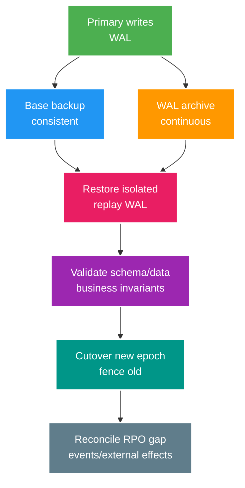

# Phân tích chuyên sâu: Timeline của PITR, failover và kiểm tra dữ liệu sau restore

> Type: `DEEP_DIVE` 
> Domain: `database` 
> Target depth: `D4 — lead database loss/failover recovery with RPO/RTO, timelines and business reconciliation` 
> Teaching readiness: `TEACHABLE_DRAFT` 
> Status: `DRAFT` 
> Evidence status: `NOT RUN` 
> Prerequisites: [Backup/restore/PITR core](../core/backup-restore-pitr-and-failover.md) 
> Related cases: `DB-09`; [question bank](../../question-bank/backup-restore-pitr-and-failover.md) 
> Owner: `Project learner; Codex teaches, learner writes back` 
> Updated: `2026-07-26`

## 1. Backup chỉ đáng tin khi đã restore thử

Base backup kết hợp WAL archive liên tục cho phép replay tới một thời điểm, LSN hoặc transaction trước lúc dữ liệu hỏng. Replication không phải backup vì lệnh xóa hoặc corruption cũng được nhân sang replica. Logical dump dễ di chuyển và chọn object nhưng restore chậm hơn, phải xử lý consistency, role, extension và kích thước lớn. Thiết kế phải định nghĩa RPO, RTO, retention, mã hóa, quyền truy cập, failure domain/region và lịch restore drill.

## 2. Quy trình PITR từng bước

Đầu tiên xác định sự kiện gây hỏng và recovery point bằng audit hoặc operation ID, không chỉ đoán theo giờ trên đồng hồ. Giữ lại evidence và snapshot hiện tại. Restore base backup vào môi trường cách ly có đúng PostgreSQL, extension, configuration và key; lấy đủ chuỗi WAL; replay tới target rồi dừng hoặc promote. Sau đó kiểm system catalog, migration, constraint, count, checksum, invariant nghiệp vụ và synthetic test của ứng dụng.

Nếu đưa toàn production quay về thời điểm T, mọi ghi hợp lệ sau T cũng mất. Với lỗi có phạm vi hẹp, thường nên restore một database bên cạnh, trích đúng row và merge/compensate có kiểm soát thay vì rewind toàn hệ thống. Các yêu cầu xóa dữ liệu vì privacy phát sinh sau backup phải được áp lại từ deletion ledger trước khi đưa dữ liệu phục vụ người dùng.

Giám sát WAL archive phải cho biết lần thành công cuối, tuổi, khoảng trống, dung lượng và khả năng chạy restore command. Backup cần checksum, encryption key và credential còn dùng được. Retention phải giữ một base backup cùng toàn bộ chuỗi WAL cần thiết. Job backup màu xanh nhưng chưa từng restore không phải bằng chứng phục hồi.

## 3. Timeline mới sau failover

Promotion tạo một timeline mới; primary cũ phải bị **fence**, nghĩa là bị ngăn nhận thêm lệnh ghi. Replica đang theo lịch sử cũ cần rewind hoặc rebuild tùy mức phân nhánh. Failover khi replication bất đồng bộ có thể mất commit vừa được báo thành công, đúng với RPO đã chấp nhận; request timeout tạo unknown outcome. Vì vậy runbook còn phải xử lý routing, connection pool, DNS, idempotency và endpoint tra cứu trạng thái.

Failback là một migration có kế hoạch, bắt kịp dữ liệu và epoch mới, không phải bật lại primary cũ. Khi đã split-brain, hai nhánh đều có lịch sử; phải chọn owner theo ledger/epoch rồi đối soát hiệu ứng bên ngoài. Replication đồng bộ giảm RPO nhưng tăng commit latency và coupling về availability.

## 4. Các tầng kiểm tra sau restore

Kiểm tra theo tầng. **Kỹ thuật:** server khởi động, WAL replay đủ, extension/role, checksum, constraint, schema history và backup. **Ứng dụng:** API quan trọng, authentication, migration, query plan, collation và timezone. **Nghiệp vụ:** ledger conservation, operation duy nhất, session/revocation, outbox/inbox và tham chiếu object. **Vận hành:** monitoring, backup chạy lại, replica, capacity, performance và security.

RPO thực phải dựa trên owner commit cuối cùng được phục hồi; RTO thực tính cả quyết định, restore, validation và cutover tới lúc service dùng được. Drill không được phá production và môi trường chứa PII phục hồi phải được bảo vệ, thu hồi sau khi dùng.

## 5. Runbook cho hỏng dữ liệu và disaster recovery

Trước hết chặn writer gây lỗi và ngăn backup tốt bị vòng retention ghi đè; giữ log và artifact điều tra. Chọn giữa repair có phạm vi, PITR vào side database hay failover toàn phần. Thông báo rõ impact và phần unknown. Restore và validate; fence owner cũ; cutover canary. Đối soát command, event, cache, search và provider ngoài; compensation phải để lại audit. Sau cùng theo dõi, postmortem và bổ sung drill phát hiện sớm.

Không coi replica là “bản sạch tức thời” nếu corruption đã replay tới đó. Delayed replica chỉ hữu ích khi độ trễ được chủ động cấu hình, giám sát và bảo vệ truy cập.

## 6. Phòng lab tạo bằng chứng

Trong database dùng một lần, tạo base backup và WAL archive, ghi các marker đã biết, chủ động làm hỏng/xóa rồi PITR về trước điểm lỗi và validate. Mô phỏng promotion, chặn primary cũ và làm mất response của ứng dụng. Đo thời gian cùng dữ liệu phục hồi thật. Với managed provider, phải kiểm ngữ nghĩa PITR bằng tài liệu chính thức và drill đúng dịch vụ. Bằng chứng hiện `NOT RUN`.

### 6.1. Pathology A — replica khỏe nhưng operator xóa nhầm vẫn mất dữ liệu

Streaming replica sao chép cả câu `DELETE` hợp lệ về mặt database. Nó bảo vệ availability trước node failure, không giữ lịch sử độc lập trước logical corruption, compromised credential hay bad migration. Nếu phát hiện sau retention window, replica không giúp quay lại trước event.

Backup chain cần base backup, WAL/archive continuity, encryption/key ownership và retention phù hợp detection time. Nhưng “backup job success” chỉ chứng minh bytes được tạo, chưa chứng minh có thể restore. Restore drill phải dùng artifact thật, bootstrap instance cách ly và validate data/application trước khi tính backup là usable.

### 6.2. Pathology B — full PITR sửa một delete nhưng xóa luôn good writes sau đó

Bad delete xảy ra lúc T; hệ thống tiếp tục nhận gifts hợp lệ trong 20 phút trước khi phát hiện. Restore toàn cluster về T-1 giây lấy lại rows bị xóa nhưng loại bỏ mọi good write sau T. Trong nhiều incident, side restore tới database cách ly, trích đúng rows và merge có kiểm soát an toàn hơn full cutover.

Quyết định cần blast radius, referential dependencies, volume, merge conflict và audit. Side restore vẫn phải tránh kích hoạt webhook/outbox như event mới, giữ original IDs/timestamps và reconcile derived caches/search. Full PITR phù hợp corruption rộng khi không thể repair chọn lọc, nhưng cần write freeze/capture và cutover plan.

### 6.3. Pathology C — promotion không fence primary cũ

Network partition làm orchestrator promote replica, nhưng primary cũ vẫn nhận traffic từ một pool. Hai writers tạo divergent histories. Khi network hồi phục không thể đơn giản “gộp WAL”; một phía phải được chọn và operations phía kia được reconcile theo business identity.

Fencing có thể dùng lease/epoch, routing authority hoặc infrastructure control nhưng phải ngăn old primary phục vụ write trước khi new primary mở. Timeline history giúp PostgreSQL biểu diễn nhánh sau recovery/promotion; restore chain phải chọn đúng timeline và target. RPO nói lượng data có thể mất; response-success-before-WAL-replication tạo unknown outcomes cần idempotency/reconciliation ở application.

## 6.4. Thứ tự kiểm tra sau restore

Validation bắt đầu từ physical/startup nhưng không kết thúc ở `SELECT 1`:

1. Instance start, recovery target/timeline và archive continuity đúng.
2. Schema/migration history/extensions/roles và critical configuration đúng baseline.
3. Row counts/checksums/invariants theo key business tables; sample không thay aggregate invariant.
4. Application read/write smoke trong isolated environment, không gửi broker/webhook/email thật.
5. Reconcile outbox, idempotency records, caches/search và external provider position.
6. Security/access keys, audit logging, monitoring và backup-after-recovery được khôi phục.

RTO được đo từ decision/restore/cutover đến service usable, không chỉ database process start. RPO được đo bằng business markers cuối cùng có mặt, không chỉ timestamp dashboard.

## 6.5. Chẩn đoán và thí nghiệm disaster recovery

Trong disposable environment, tạo markers `before`, `bad-event`, `after-good`; chụp base backup và archive WAL. Xóa/corrupt marker, restore tới target trước event và ghi exact command/config. Chạy validation ladder, đo thời gian, rồi thử side-restore merge. Một run khác promote replica, chứng minh old writer bị fenced và document loss/unknown operations.

Managed service che giấu command nhưng không bỏ contract: exact granularity, retention, cross-region copy, encryption key, restore target, network/IAM và expected time phải lấy từ official provider docs và drill. Version-specific PostgreSQL recovery configuration thay đổi; activation phải pin server/provider version.

## 6.6. Ra quyết định và dàn ý phỏng vấn

Logical dump dễ inspect/restore chọn lọc nhưng chậm và không cho arbitrary PITR. Physical base backup + WAL phục hồi toàn cluster/point nhưng cần chain/timeline và storage. Replica giảm failover time nhưng không thay backup. Side restore bảo toàn good writes nhưng merge khó; full PITR đơn giản về history nhưng blast radius lớn.

Senior answer phải nói “restore proof”, không chỉ “có backup”. Architect thêm RPO/RTO, retention, regional/key ownership và drill cadence. Expert phân tích timeline divergence, fencing, application side effects và reconciliation sau unknown outcome.

### 6.7. Chọn scoped repair, side restore hay full PITR

Scoped repair phù hợp khi tập row hỏng xác định được, nguồn đúng còn tồn tại và compensation giữ được referential/audit invariant. Side restore phù hợp khi cần đọc lịch sử trước lỗi nhưng production vẫn có nhiều write tốt sau đó; nó cô lập replay rồi cho phép merge chọn lọc. Full PITR phù hợp corruption rộng hoặc không thể xác định effect, nhưng yêu cầu freeze/capture write mới và chấp nhận mất mọi thay đổi sau target. Failover giải availability của primary, không tự đưa dữ liệu về trước operator error.

Quyết định phải ghi blast radius, recovery point confidence, good writes sau lỗi, external side effect, khả năng merge, RPO/RTO và người có quyền cutover. Trước phục vụ traffic, verify database timeline và fencing, sau đó invariant nghiệp vụ, rồi mới cache/search/outbox/provider. Nếu response đã trả thành công cho operation không còn trong timeline mới, idempotency và reconciliation quyết định thông báo hoặc compensation. Đây là lý do disaster recovery là bài toán application chứ không chỉ lệnh PostgreSQL.

## 7. Bài tập diễn đạt lại và tự kiểm tra

> **Bài viết của tôi — `LEARNER TODO`:** choose scoped restore/full PITR and define validation/cutover.

1. **Question:** Vì sao replica không thay backup và backup job success chưa đủ? 
   **Đọc lại nếu bí:** mục 1 và 6.1/6.4. 
   **Một câu trả lời tốt phải có:** replicated corruption, independent history, restore validation ladder và measured RTO/RPO. 
   **My answer:** `LEARNER TODO`
2. **Question:** Khi nào chọn side restore thay full PITR? 
   **Đọc lại nếu bí:** mục 2 và 6.2. 
   **Một câu trả lời tốt phải có:** good writes after incident, blast radius, referential/side-effect handling, merge validation và residual risk. 
   **My answer:** `LEARNER TODO`
3. **Question:** Một failover an toàn cần gì ngoài việc promote replica? 
   **Đọc lại nếu bí:** mục 3, 6.3 và 6.5. 
   **Một câu trả lời tốt phải có:** fencing, timeline/epoch, routing, RPO/unknown outcome, reconciliation và drill evidence. 
   **My answer:** `LEARNER TODO`

## 8. Tài liệu tham khảo

- [PostgreSQL — Continuous Archiving and PITR](https://www.postgresql.org/docs/current/continuous-archiving.html)
- [PostgreSQL — Backup and Restore](https://www.postgresql.org/docs/current/backup.html)

- [ ] Evidence remains `NOT RUN`.
