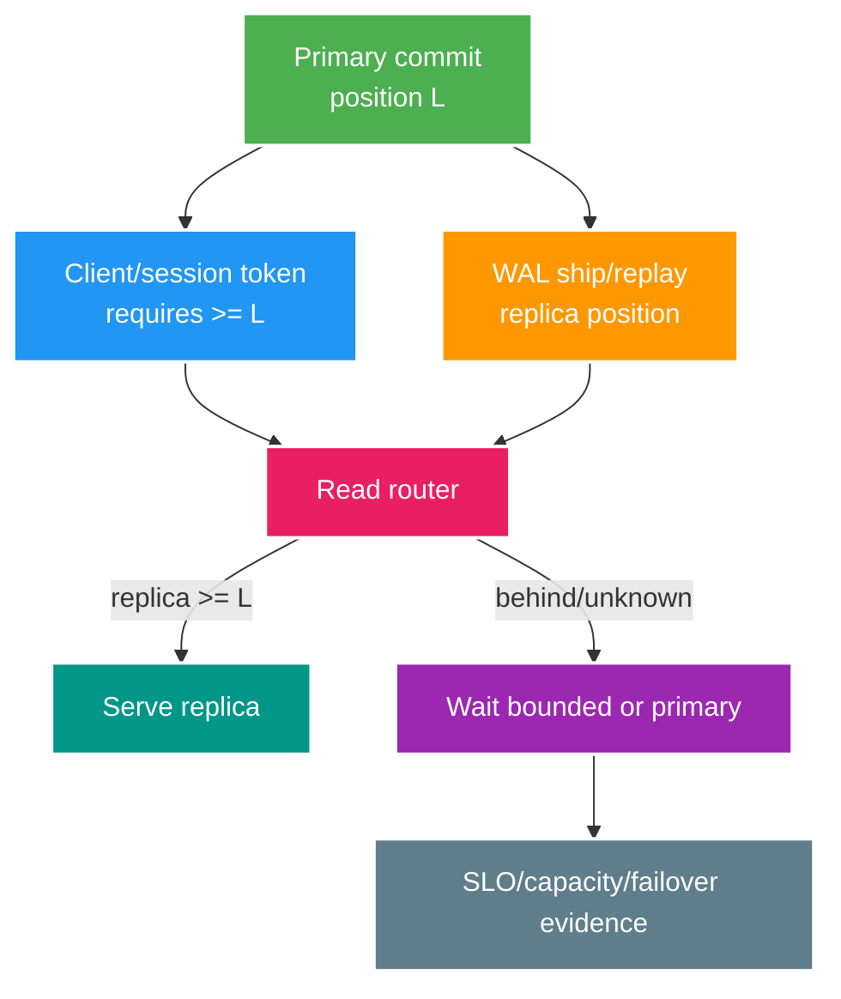

# Phân tích chuyên sâu: Replica lag, routing và token bảo đảm read-your-writes

> Type: `DEEP_DIVE` 
> Domain: `database` 
> Target depth: `D4 — design replica routing/failover without stale-security or broken post-write UX` 
> Teaching readiness: `TEACHABLE_DRAFT` 
> Status: `DRAFT` 
> Evidence status: `NOT RUN` 
> Prerequisites: [Replica lag core](../core/replica-lag-and-read-your-writes.md) 
> Related cases: `DB-07`; [question bank](../../question-bank/replica-lag-and-read-your-writes.md) 
> Owner: `Project learner; Codex teaches, learner writes back` 
> Updated: `2026-07-26`

## 1. Vị trí commit khác với thời gian trên đồng hồ

Khi primary commit, nó tạo một vị trí WAL/LSN. Replica nhận và replay WAL bất đồng bộ nên luôn có một khoảng cách. Lag có thể đo theo byte hoặc thời gian và tăng vì network, I/O, query dài, conflict hoặc replication slot. Con số “lag 2 giây” chỉ là tín hiệu quan sát, không bảo đảm row cụ thể đã nhìn thấy. Vì vậy đọc ngay sau ghi có thể trả 404 hoặc dữ liệu cũ; các quyết định revoke, ownership hay số dư không được mù quáng tin replica.

## 2. Các chiến lược bảo đảm read-your-writes

Có bốn cách thường dùng. Một là route lượt đọc của user về primary trong một cửa sổ hữu hạn; đơn giản nhưng chỉ ước lượng theo thời gian. Hai là mang token vị trí commit và chỉ đọc replica đã replay tới token. Ba là ghim session vào replica có vị trí không lùi. Bốn là trả luôn representation trong response ghi để tránh lượt đọc tức thời. Token phải opaque, có integrity và giới hạn để client không đưa LSN tùy ý gây DoS. Nếu replica chưa theo kịp, chỉ chờ trong deadline rồi fallback primary hoặc trả lỗi retry rõ ràng.

Lượt đọc rủi ro cao như authorization, session, revoke và trạng thái giao dịch wallet thường phải tới primary hoặc owner hiện hành. Feed, search và analytics có thể đọc replica nếu chấp nhận stale. Hợp đồng này cần viết theo từng endpoint. Cache cũng là một replica logic, nên phải tính cả version và invalidation trong cùng chuỗi consistency.

## 3. Connection và transaction khi routing

Quyết định routing phải có trước khi transaction lấy connection. `readOnly` chỉ là hint, không phải hàng rào bảo mật và có thể không được driver/database thực thi như mong đợi. Không đổi primary/replica giữa một transaction vì các statement sẽ nhìn hai lịch sử khác nhau. Routing datasource dựa trên `ThreadLocal` có thể mất context khi async; nên dùng service/query boundary tường minh và test nguồn connection. Replica có thể từ chối ghi, nhưng đó không phải lớp bảo vệ duy nhất.

Khi workflow đi qua event bất đồng bộ, read-your-writes cần operation status hoặc vị trí workflow ở cấp nghiệp vụ; không nên phát tán DB LSN như một token chung cho mọi hệ thống.

## 4. Các kiểu replica lag bất thường

Query dài trên replica có thể xung đột với WAL apply tùy cấu hình hot standby. Các nguyên nhân khác gồm I/O hoặc network bão hòa, primary sinh WAL đột biến, replay bị pause và slot/feedback giữ dữ liệu. Cần theo dõi riêng receive/replay LSN, thời gian, WAL retained, conflict, query/resource của từng replica và tốc độ ghi primary. Một metric lag tổng hợp có thể che một replica riêng lẻ đã tụt rất xa.

Load balancer có thể loại replica stale bằng threshold và hysteresis, nhưng nếu mọi replica cùng chậm thì toàn bộ lượt đọc dồn về primary và làm primary sập. Cần admission control, cache/degraded response và ưu tiên endpoint. Autoscale application không giải quyết được bottleneck của primary, thậm chí còn đẩy thêm connection/query vào nó.

## 5. Điều gì thay đổi khi failover

Promotion chọn một replica tại vị trí WAL cụ thể; commit đã báo thành công nhưng chưa tới đó có thể mất trong giới hạn RPO. Primary mới có epoch/timeline mới, primary cũ phải bị fence để tránh split-brain. Pool và DNS phải reconnect; transaction không rõ kết quả chỉ được retry với cùng idempotency key. Các replica khác phải trỏ lại hoặc rebuild. Token read-your-writes từ timeline cũ có thể không còn so sánh được, nên phải invalidate hoặc route về owner mới và đối soát outcome.

Replication đồng bộ giảm RPO nhưng tăng latency và làm availability của commit phụ thuộc standby; phải kiểm đúng mode cụ thể. Thêm read replica không làm tăng write capacity của primary.

## 6. Phòng lab tạo bằng chứng

Tạm dừng hoặc làm chậm replay của replica, ghi ở primary rồi đọc qua từng route để kiểm position token, primary fallback và đường security. Tiêm query dài, lag, mọi replica unhealthy và mất response quanh failover. Đo lag, latency, tải primary, RPO và invariant cuối. Bằng chứng hiện `NOT RUN`.

### 6.1. Pathology A — create thành công nhưng GET trả 404

Client tạo livestream trên primary rồi ngay lập tức GET qua load balancer. Replica được chọn chưa replay WAL chứa row mới nên trả 404. Retry GET có thể tiếp tục chạm replicas chậm khác; dùng cache 404 còn kéo dài inconsistency. Đây là expected asynchronous replication behavior, không nhất thiết là mất dữ liệu.

Read-your-writes contract có nhiều option. Sticky-primary theo user/session trong một bounded window đơn giản nhưng tăng primary load và clock-based window không chứng minh replica đã catch up. Position token mạnh hơn: write response mang commit/WAL position hoặc logical version; read chỉ dùng replica đã đạt position, nếu chưa thì wait bounded hoặc fallback primary. Token cần integrity, tenant binding và versioning; không để client tự nâng position tùy ý.

### 6.2. Pathology B — authorization đọc replica mở lại quyền vừa thu hồi

Moderator bị ban/revoke trên primary nhưng authorization request đọc stale replica và vẫn cho phép publish/chat. Với read-only feed, vài giây stale có thể chấp nhận; với security/ownership/balance invariant, stale result có thể gây tác động không đảo ngược. Vì vậy routing không chỉ theo HTTP method hay “read query”, mà theo risk của decision.

High-risk reads route primary hoặc dùng state đã được version/fence rõ. Cache cũng là replica logic và phải có invalidation/version contract. Evidence cần scenario revoke rồi lập tức attempt action, không chỉ đo generic lag. Residual risk phải được nêu nếu hệ thống chọn availability/staleness thay vì strong decision.

### 6.3. Pathology C — failover làm token/route chỉ về timeline cũ

Primary cũ trả success nhưng response mất, sau đó failover xảy ra trước khi WAL tới candidate. Client retry trên primary mới có thể không thấy operation; hoặc old primary quay lại nhận writes gây split-brain nếu không fenced. LSN chỉ có nghĩa trong timeline/context phù hợp; so sánh token mù qua promotion có thể sai.

Failover protocol cần promotion authority, fencing old writer, epoch/timeline trong token, documented RPO và reconciliation cho unknown outcome. “Replica healthy” không chỉ là TCP up; cần replay position, lag, timeline và data correctness gate. Application phải có behavior khi không replica nào đạt token: wait, primary fallback hay explicit retryable response.

## 6.4. Chính sách routing theo endpoint và invariant

Phân loại tối thiểu: immutable/public content có thể đọc replica; feed/statistics chấp nhận bounded staleness; read-after-write UI cần session/token guarantee; authorization, wallet, idempotency status và workflow transition thường cần authoritative state. Transaction phải pin một connection/source; đọc primary rồi ghi qua route khác có thể phá assumption.

Routing layer phải quan sát được decision: source chosen, required/observed position, fallback reason và lag bucket, với labels bounded và không lộ token nhạy cảm. Nếu fallback tăng, primary capacity plan phải chịu được. Circuit breaker trên replica không được biến mọi traffic sang primary không admission control.

## 6.5. Quy trình chẩn đoán và thí nghiệm từng bước

1. Ghi write marker có business ID và capture authoritative outcome/position.
2. Tạm dừng replay trong disposable topology hoặc dùng controlled delay; xác nhận replica còn query được nhưng behind.
3. Chạy immediate reads qua từng policy: random replica, sticky-primary, position wait và primary fallback.
4. Ghi latency, stale/miss rate, fallback rate, primary load và time-to-catch-up; test cả all-replicas-unhealthy.
5. Tiêm failover quanh commit/response, xác minh epoch/fencing và reconcile operation identity.
6. Lặp với authorization revoke để chứng minh risk-based routing. Không dùng sleep “đủ lâu” như correctness proof.

PostgreSQL functions/managed-provider APIs và failover semantics khác nhau theo version/vendor. Theory cung cấp model; activation phải pin topology, synchronous settings, pool/router implementation và provider SLA.

## 6.6. Dàn ý trả lời phỏng vấn

Senior cần giải thích commit != replica visibility, đưa create-then-404 example và chọn RYW strategy có fallback. Architect thêm endpoint risk classification, primary capacity, failover/RPO và observability. Expert phải reason về timeline/epoch, unknown outcome, fencing và token security thay vì chỉ nói “đợi replica sync”.

### 6.7. Khi nào không nên route một lượt đọc sang replica

Hãy hỏi kết quả stale có tạo effect không đảo ngược hay không. Feed và thống kê thường chỉ ảnh hưởng trải nghiệm nên có thể dùng stale budget. Trang vừa tạo cần read-your-writes để tránh 404 khó hiểu. Authorization, revoke, idempotency status và wallet dùng kết quả đọc để quyết định write/effect, nên thường phải tới owner hoặc có token/version proof. `GET` không đồng nghĩa an toàn để đọc replica; semantics của decision mới quyết định.

Router cần deadline: nếu replica chưa đạt required position, chỉ chờ một phần request budget rồi fallback hoặc trả response retryable. Fallback không được vô hạn vì khi tất cả replica lag, primary sẽ nhận một làn sóng tải tương quan. Metric cần phân biệt read bình thường, read có required position, wait, fallback và reject theo endpoint class. Sau failover, epoch/timeline đổi; token cũ phải route về owner mới hoặc bị từ chối có kiểm soát, không so LSN như số toàn cục.

## 7. Bài tập diễn đạt lại và tự kiểm tra

> **Bài viết của tôi — `LEARNER TODO`:** choose endpoint routing and RYW token/failover behavior.

1. **Question:** Vì sao một fixed sticky window không chứng minh read-your-writes và position token cải thiện gì? 
   **Đọc lại nếu bí:** mục 1–2 và 6.1. 
   **Một câu trả lời tốt phải có:** replay position, variable lag, wait/fallback policy, token binding và capacity cost. 
   **My answer:** `LEARNER TODO`
2. **Question:** Endpoint nào không nên đọc stale replica dù chỉ là SELECT? 
   **Đọc lại nếu bí:** mục 6.2 và 6.4. 
   **Một câu trả lời tốt phải có:** risk/invariant classification, concrete revoke/balance example, authoritative route và residual availability trade-off. 
   **My answer:** `LEARNER TODO`
3. **Question:** Failover làm RYW token và retry contract phức tạp thêm thế nào? 
   **Đọc lại nếu bí:** mục 5, 6.3 và 6.5. 
   **Một câu trả lời tốt phải có:** timeline/epoch, fencing, RPO, unknown outcome, reconciliation và evidence lab. 
   **My answer:** `LEARNER TODO`

## 8. Tài liệu tham khảo

- [PostgreSQL — Warm Standby](https://www.postgresql.org/docs/current/warm-standby.html)
- [PostgreSQL — Replication Functions](https://www.postgresql.org/docs/current/functions-admin.html#FUNCTIONS-RECOVERY-INFO-TABLE)

- [ ] Evidence remains `NOT RUN`.
