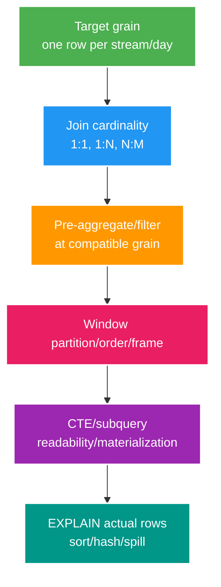

# Phân tích chuyên sâu: Độ hạt SQL, window frame và ranh giới query plan của CTE

> Type: `DEEP_DIVE` 
> Domain: `database` 
> Target depth: `D4 — reason query correctness/performance from row grain, duplicates, frames and plans` 
> Teaching readiness: `TEACHABLE_DRAFT` 
> Status: `DRAFT` 
> Evidence status: `NOT RUN` 
> Prerequisites: [SQL joins/aggregation/window/CTE core](../core/sql-joins-aggregation-window-and-cte.md) 
> Related cases: `SQL-01`; [question bank](../../question-bank/sql-joins-aggregation-window-and-cte.md) 
> Owner: `Project learner; Codex teaches, learner writes back` 
> Updated: `2026-07-26`

## 1. Khai báo độ hạt trước khi viết query

Trước khi viết SQL, hãy nói rõ một row đầu ra đại diện cho cái gì; đó là **grain** hay độ hạt. Join gift với tag và viewer có thể nhân số row, rồi `SUM(gift)` sau quan hệ nhiều-nhiều sẽ tính thừa. Mỗi nhánh cần được aggregate về đúng grain trước khi join, hoặc dùng semi-join khi chỉ cần kiểm tra tồn tại. `DISTINCT` có thể che mô hình sai và còn thêm chi phí sort/hash, chứ không tự sửa ngữ nghĩa.

## 2. Ngữ nghĩa của phép join

`INNER JOIN` chỉ giữ cặp khớp. `LEFT JOIN` giữ row bên trái, nhưng đặt predicate của bảng phải trong `WHERE` có thể loại row `NULL` và biến nó thành inner join trên thực tế; điều kiện thuộc quan hệ nên đặt trong `ON` hoặc xử lý `NULL` tường minh. `NOT IN` gặp `NULL` cho kết quả unknown, nên anti-join thường dùng `NOT EXISTS` với điều kiện tương quan. `EXISTS` chỉ kiểm tồn tại nên không nhân row bên phải. Luôn lý luận theo logic ba giá trị của `NULL`.

Ước lượng cardinality quyết định planner chọn nested loop, hash join hay merge join. Index trên join key và filter phải dựa trên access pattern. Thứ tự join do planner biến đổi theo statistics và phiên bản; thứ tự viết trong SQL không phải cam kết vật lý.

## 3. Phép gom nhóm và window function

`GROUP BY` thu nhiều row thành một row cho mỗi group, còn window function giữ nguyên row chi tiết. `row_number` chỉ xác định khi `ORDER BY` có tie-breaker duy nhất. Running total dùng frame mặc định có thể gom các peer cùng giá trị order; nếu muốn cộng từng row hãy ghi rõ `ROWS BETWEEN UNBOUNDED PRECEDING AND CURRENT ROW`. `RANGE` xử lý các peer như một nhóm. `lag/lead` và bài toán top-N theo group đều phụ thuộc order và ý nghĩa khác nhau của `row_number`, `rank`, `dense_rank`.

Muốn filter kết quả window thì đặt nó trong subquery hoặc CTE rồi filter ở lớp ngoài. Ranh giới ngày phải tính timezone, còn tiền cần kiểu số và rounding đúng. Sau join, luôn dùng fixture tính tay hoặc invariant để kiểm aggregate.

## 4. CTE và truy vấn đệ quy

CTE giúp đặt tên từng bước và làm query dễ đọc, không tự động nhanh hơn. Tùy phiên bản PostgreSQL, CTE có thể được inline hoặc buộc `MATERIALIZED`/`NOT MATERIALIZED`. Materialization có thể chặn predicate pushdown nhưng tránh tính lại một bước đắt nhiều lần; phải xem plan. Recursive CTE gồm anchor và recursive term, đồng thời phải chặn cycle, giới hạn depth/row và định nghĩa path rõ.

Không chạy traversal đồ thị không giới hạn ngay trong request path. Với analytics lặp lại, cân nhắc temporary table hoặc materialized view có freshness contract và index phù hợp.

## 5. Query plan và các tình huống hỏng khó

Các lỗi điển hình gồm tổng sai do join N:M, predicate của `LEFT JOIN` làm mất row có giá trị zero, offset sâu phải bỏ nhiều row, window sort spill vì cardinality/work_mem và CTE materialize hàng triệu row rồi mới filter. Dùng `EXPLAIN (ANALYZE, BUFFERS)` để xem estimated/actual rows, sort method, disk, loops và temporary I/O. Tăng `work_mem` toàn cục có thể nhân memory theo mỗi operation và session; trước tiên phải sửa grain, query và index.

## 6. Phòng lab tạo bằng chứng

Test cần hai tầng: fixture nhỏ tính tay có row trùng, `NULL`, tie và timezone boundary để chứng minh tính đúng; dataset có skew thực tế để đọc performance plan. Assertion phải kiểm cả row lẫn giá trị và invariant như tổng ledger. Lưu plan cùng volume, rồi so pre-aggregate, `EXISTS`, window và index. Bằng chứng hiện `NOT RUN`.

### 6.1. Pathology A — tổng doanh thu bị nhân nhưng query vẫn “trông đúng”

Giả sử một stream có hai gift rows và ba tag rows. Nếu join `stream -> gift` rồi `stream -> tag`, result trung gian có sáu rows. `SUM(gift.amount)` vì thế gấp ba lần giá trị thật. Lỗi nguy hiểm ở chỗ query vẫn chạy, plan vẫn hợp lệ và một fixture chỉ có một tag sẽ không phát hiện ra. `DISTINCT` trên toàn row cũng không cứu được nếu các cột tag khác nhau; `SUM(DISTINCT amount)` lại làm mất hai gift có cùng giá trị.

Cách reasoning đúng bắt đầu bằng grain: output cần một row cho mỗi `stream_id, business_day`. Gift phải được aggregate về grain đó trước khi join với một relation khác. Nếu chỉ cần biết stream có tag nào đó, `EXISTS` diễn đạt semi-join đúng hơn join lấy rows. Test phải dùng fixture có ít nhất hai rows ở cả hai nhánh và đối chiếu với tổng được tính bằng tay. Evidence phân biệt lỗi cardinality với lỗi money/timezone là số rows sau từng plan node và subtotal của từng CTE.

### 6.2. Pathology B — running total thay đổi khi thêm row có cùng timestamp

Một dashboard dùng `SUM(amount) OVER (ORDER BY created_at)` nhưng nhiều gift có cùng `created_at`. Với default frame phụ thuộc kiểu `ORDER BY`, peer rows có thể cùng xuất hiện trong frame; kết quả nhảy theo nhóm thay vì tăng từng row. Ngay cả khi đổi sang `ROWS`, thứ tự giữa peers vẫn không deterministic nếu thiếu tie-breaker. Pagination hoặc replay có thể trả một thứ tự khác và làm người vận hành tưởng dữ liệu bị sửa.

Hợp đồng phải chỉ rõ muốn total theo event hay theo time bucket. Total theo event dùng order unique, ví dụ `(created_at, gift_id)`, và frame `ROWS BETWEEN UNBOUNDED PRECEDING AND CURRENT ROW`. Total theo bucket có thể chủ ý dùng peer semantics nhưng cần giải thích trong API. Test chèn peers theo nhiều thứ tự, chạy lại sau `ANALYZE`, và assert cả set lẫn sequence.

### 6.3. Pathology C — CTE dễ đọc nhưng chặn filter sớm

Một CTE tính toàn bộ gift trong 90 ngày rồi outer query lọc một streamer. Nếu CTE bị materialize, PostgreSQL phải đọc, aggregate và có thể spill toàn tập trước khi biết streamer cần lấy. Nếu được inline, planner có thể đẩy predicate xuống; nhưng một CTE tham chiếu nhiều lần lại có thể bị tính lặp. Vì behavior phụ thuộc PostgreSQL version, số lần tham chiếu và từ khóa `MATERIALIZED`, không được kết luận “CTE luôn chậm” hay “planner luôn tối ưu”.

Diagnostic cần so sánh plan với `MATERIALIZED` và `NOT MATERIALIZED`, quan sát `actual rows`, `loops`, temporary blocks và predicate placement. Quyết định dựa trên reuse, selectivity và memory, không dựa trên style preference.

## 6.4. Quy trình chẩn đoán và ranh giới vận hành

1. Viết grain mong muốn và cardinality của từng edge trước khi mở `EXPLAIN`.
2. Tạo fixture nhỏ có duplicates, `NULL`, ties và boundary ngày; tính expected result bằng tay.
3. Chạy query từng CTE/subquery để đếm rows tại mỗi grain. Sai correctness phải sửa trước performance.
4. Với dataset representative, chạy `EXPLAIN (ANALYZE, BUFFERS)` trong môi trường an toàn; so estimated/actual rows, loops, sort method và temporary I/O.
5. Kiểm tra index có cùng leading filter/order, statistics có phản ánh skew và parameter của tenant nóng có plan khác tenant thường hay không.
6. Pin PostgreSQL version và configuration. `work_mem` áp dụng theo sort/hash operation, nên tăng global có thể nhân memory theo operation và connection.

Boundary application cũng quan trọng: JPA projection có thể vô tình đổi grain; serializer có thể biến `NULL` thành `0`; timezone của database và business day có thể khác nhau. Query đúng về SQL nhưng sai business invariant vẫn là lỗi.

## 6.5. Quyết định kiến trúc và dàn ý phỏng vấn

Pre-aggregation bảo vệ correctness và giảm rows sớm nhưng thêm stage/query object. Window function giữ detail và analytics trong một pass nhưng đòi hỏi order/frame rõ. Materialized view giảm latency đọc nhưng có freshness/rebuild contract. Với request path, ưu tiên bounded query và index; analytics lớn nên có workload boundary riêng thay vì tăng tài nguyên OLTP vô hạn.

Câu trả lời Senior nên đi theo chuỗi: khai báo grain -> dự đoán cardinality -> chọn join/aggregate/window semantics -> chứng minh bằng fixture -> đọc plan. Ở level Architect, thêm workload isolation, freshness và migration của query contract. Ở level Expert, giải thích peer frame, skew/cardinality misestimate, spill và version-sensitive CTE planning.

### 6.6. Tách lỗi tính đúng khỏi lỗi hiệu năng

Query trả sai tổng phải được sửa grain và join trước khi tối ưu plan. Query trả đúng trên fixture nhỏ nhưng chậm ở dữ liệu thật mới đi vào statistics, index, join algorithm và spill. Nếu trộn hai bước, thêm `DISTINCT` hoặc materialize CTE có thể làm kết quả “trông đúng” nhưng giữ mô hình sai, còn tăng `work_mem` có thể che sort spill ở một session rồi làm toàn hệ thống thiếu memory. Checklist điều tra là: viết expected grain, đếm row sau từng join, kiểm `NULL`, tie và timezone, sau đó mới so estimated với actual row và buffer. Mỗi rewrite phải chạy lại cả assertion tính đúng lẫn plan trên phân bố đại diện.

Khi phỏng vấn, đừng mở đầu bằng “thêm index”. Hãy nói row đầu ra đại diện gì, quan hệ nào nhân row, order/frame có deterministic không, rồi chỉ ra node trong plan làm nhiều physical work. Cách này chứng minh bạn phân biệt được bug nghiệp vụ với bottleneck và biết dùng evidence để sửa đúng lớp.

## 7. Bài tập diễn đạt lại và tự kiểm tra

> **Bài viết của tôi — `LEARNER TODO`:** define stream/day grain and fix one overcount/window frame.

1. **Question:** Vì sao `DISTINCT` không phải cách sửa tổng tiền bị nhân sau many-to-many join? 
   **Đọc lại nếu bí:** mục 6.1. 
   **Một câu trả lời tốt phải có:** target grain, row multiplication, vì sao hai dạng `DISTINCT` đều có thể sai và cách pre-aggregate/semi-join. 
   **My answer:** `LEARNER TODO`
2. **Question:** Thiết kế running total deterministic khi nhiều gift có cùng timestamp như thế nào? 
   **Đọc lại nếu bí:** mục 3 và 6.2. 
   **Một câu trả lời tốt phải có:** business semantics, unique tie-breaker, explicit frame và test peers. 
   **My answer:** `LEARNER TODO`
3. **Question:** Khi nào materialize CTE giúp và khi nào gây plan regression? 
   **Đọc lại nếu bí:** mục 4, 6.3–6.4. 
   **Một câu trả lời tốt phải có:** reuse, predicate pushdown, estimated/actual evidence, version/config boundary và residual risk. 
   **My answer:** `LEARNER TODO`

## 8. Tài liệu tham khảo

- [PostgreSQL — Window Functions](https://www.postgresql.org/docs/current/tutorial-window.html)
- [PostgreSQL — WITH Queries](https://www.postgresql.org/docs/current/queries-with.html)

- [ ] Evidence remains `NOT RUN`.
