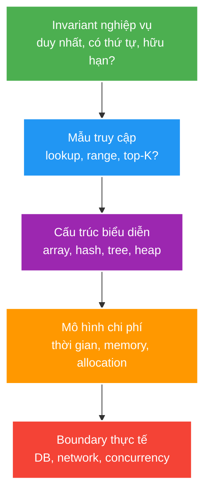

# Collections, Data Structures and Complexity

> Type: `CORE`<br>
> Domain: `java`<br>
> Target depth: `D3 — chọn cấu trúc theo invariant/access pattern, giải thích complexity và đo hot path trên workload thật`<br>
> Teaching readiness: `TEACHABLE_DRAFT`<br>
> Status: `DRAFT`<br>
> Evidence status: `NOT RUN`<br>
> Prerequisites: [Object semantics and generics](language-object-semantics-and-generics.md)<br>
> Related cases: [`FEED-UC-01`](../../../../use-case-catalog.md#31-foundation-và-senior-cases), [`VIEWCOUNT-UC-01`](../../../../use-case-catalog.md#31-foundation-và-senior-cases)<br>
> Owner: `Project learner; Codex assists`<br>
> Updated: `2026-07-26`

Source canonical cho [Collections question bank](../../question-bank/collections-data-structures-and-complexity.md). Complexity trong file này là model; D3 chỉ đạt khi có dataset/workload và measurement.

## 0. Cách học file này

Đọc từ bài toán cần bảo vệ, không học thuộc bảng Big-O trước. Mỗi cấu trúc dữ liệu là một cách biểu diễn giúp một nhóm thao tác rẻ hơn bằng cách chấp nhận nhóm thao tác khác đắt hơn. Sau mỗi ví dụ, hãy tự trả lời ba câu: invariant nào phải giữ, operation nào nằm trên hot path, và dữ liệu lớn nhất có thể là bao nhiêu. Chỉ chuyển sang deep-dive sau khi giải thích được lựa chọn bằng workload thay vì bằng tên class quen thuộc.

## 1. Learning objectives

1. Chọn `List`, `Set`, `Map`, queue/deque/heap theo operation và invariant quan trọng nhất.
2. Phân tích time/space complexity gồm average/worst/amortized và chi phí ẩn từ allocation/cache locality.
3. Nhận diện unbounded materialization, mutable key, bad comparator và concurrent-access failure.

## 2. Mental model do người dạy cung cấp

Hãy coi data structure như một **index nằm trong memory**. Dữ liệu logic giống nhau có thể được đặt thành dãy liên tiếp, bucket theo hash, cây có thứ tự hoặc heap theo priority. Representation quyết định đường đi mà CPU phải thực hiện để trả lời một câu hỏi. Vì vậy câu hỏi đúng không phải “`ArrayList` hay `HashMap` nhanh hơn?”, mà là “hệ thống hỏi dữ liệu điều gì nhiều nhất, cần giữ invariant gì, và chấp nhận trả giá ở đâu?”.



Big-O chỉ mô tả tốc độ tăng chi phí khi `n` tăng. Nó không nói một database round trip mất bao lâu, object có vừa CPU cache hay không, hoặc một queue có giữ hàng triệu payload trong heap hay không. Senior engineer dùng Big-O để loại thiết kế sai về hướng tăng trưởng, rồi dùng measurement để quyết định ở workload thật.

## 3. Cơ chế hoạt động

Collection interface mô tả contract; implementation chọn representation và cost profile. `ArrayList` lưu phần tử liên tiếp, random access nhanh và append amortized O(1), nhưng insert/remove giữa phải dịch chuyển. Linked structure tối ưu một số relink operation khi đã có node/iterator, không làm lookup index nhanh hơn và thường tốn locality/allocation.

Hash table tính hash, chọn bucket rồi dùng equality giải collision. Average O(1) phụ thuộc hash distribution, load factor và stable key semantics; nó không phải guarantee mọi input. Ordered tree dựa comparator, thường O(log n) và cung cấp range/order semantics. Heap/priority queue tối ưu lấy min/max, không phải arbitrary search.

Big-O bỏ constant và machine effects để mô tả growth. Amortized analysis phân bổ rare resize/rebuild trên nhiều operation. Trong backend, phải cộng thêm database/network round trip, serialization, allocation và materialization: tối ưu O(n) trong memory không cứu được `findAll()` hàng triệu row.

### 3.1. Ví dụ 1 — kiểm tra viewer đã xuất hiện chưa

Giả sử một batch có 100.000 `viewerId` và ta cần loại duplicate. Dùng `List.contains` cho từng phần tử khiến số phép so sánh có thể tăng gần O(n²). `HashSet.add` vừa kiểm tra membership vừa ghi nhận phần tử, nên toàn batch có expected O(n), đổi lại tốn thêm memory và đòi hỏi equality/hash ổn định. Nếu uniqueness phải tồn tại qua nhiều process hoặc sau restart, `HashSet` không còn là owner; database unique constraint hay Redis atomic operation mới phải giữ invariant.

```java
Set<Long> seen = new HashSet<>();
for (Long viewerId : viewerIds) {
    if (seen.add(viewerId)) {
        processFirstOccurrence(viewerId);
    }
}
```

### 3.2. Ví dụ 2 — lấy top 100 livestream

Sort toàn bộ một triệu phần tử tốn O(n log n) và giữ toàn bộ kết quả. Một min-heap kích thước `k = 100` chỉ giữ 100 ứng viên tốt nhất: mỗi phần tử mới so với phần tử nhỏ nhất, tổng chi phí O(n log k), memory O(k). Nhưng nếu UI cần pagination ổn định qua toàn bộ ranking, heap cục bộ không đủ; sort/index ở database hoặc search engine mới phù hợp.

### 3.3. Ví dụ 3 — queue phải nói được khi đầy

Queue giữa producer và consumer không chỉ lưu thứ tự. Capacity là ngân sách latency và memory. Khi đầy, hệ thống phải chọn rõ: block producer, reject, drop newest, drop oldest hay chuyển sang durable broker. Không có lựa chọn trung lập; unbounded queue chỉ trì hoãn quyết định đến lúc heap hoặc timeout sụp đổ.

### 3.4. Counterexample — `LinkedList` không làm `add(index, value)` thành O(1)

Việc nối một node mới là O(1) **sau khi đã có node đích**. Nhưng API theo index phải đi từ đầu hoặc cuối để tìm vị trí, tức O(n), đồng thời mỗi node thêm allocation và pointer chasing. Vì vậy `ArrayList` thường tốt hơn cho iteration và indexed access dù việc dịch phần tử nghe có vẻ đắt.

## 4. Invariant và boundary

1. Collection type phải biểu diễn đúng semantics: uniqueness, ordering, multiplicity, priority hoặc bounded FIFO.
2. Equality/comparator phải nhất quán với operation mà collection dựa vào.
3. Memory/result size phải có bound; pagination/streaming là API boundary, không chỉ implementation detail.
4. Thread safety là property của toàn compound operation, không chỉ của collection class.

## 5. Thuật ngữ và distinction

| Thuật ngữ | Định nghĩa | Dễ nhầm | Phân biệt |
| --- | --- | --- | --- |
| Average complexity | Kỳ vọng dưới input/hash assumptions | Worst-case | Adversarial collision có thể khác xa average |
| Amortized | Trung bình trên chuỗi operation | Average input | Không cần distribution xác suất |
| Stable ordering | Thứ tự lặp có contract | Sorted ordering | Insertion/order contract không đồng nghĩa sort |
| Comparator consistency | `compare(a,b)==0` phù hợp equality expectation | Total order | Vi phạm gây mất/merge phần tử trong sorted set/map |
| Bounded queue | Capacity hữu hạn và overflow policy | Queue thông thường | Boundary bảo vệ memory/backpressure |

## 6. Misconceptions

| Misconception | Vì sao sai | Counterexample |
| --- | --- | --- |
| `HashMap` luôn O(1) | Phụ thuộc collision/resize/key contract | Bad hash hoặc mutable key |
| `LinkedList` insert luôn O(1) | Tìm vị trí vẫn O(n) | `add(index, value)` phải traverse |
| `ConcurrentHashMap` làm workflow atomic | Nhiều get/check/put vẫn race | Cần `compute`, CAS hoặc lock/invariant owner |
| Dùng `Set` tự động sửa duplicate business data | Nó chỉ dedup theo equality hiện tại | Sai equality che lỗi thay vì bảo vệ DB invariant |
| Parallel processing sửa được algorithm xấu | Work split/merge có overhead và shared bottleneck | N+1/database round trips vẫn còn |

## 7. Failure modes kinh điển

Hai chuỗi nhân quả đáng nhớ:

- `findAll()` → materialize mọi row thành entity/object → heap tăng → GC chạy dày → request giữ connection lâu → pool cạn. Root cause là thiếu bound từ API/query, không phải “GC yếu”.
- `containsKey` rồi `put` trên shared map → hai thread cùng nhìn thấy “chưa có” → cả hai tạo/ghi → duplicate side effect. Root cause là compound transition không atomic, dù từng method riêng lẻ thread-safe.

| Failure | Trigger | Symptom | Root mechanism |
| --- | --- | --- | --- |
| Unbounded list | `findAll`/collect toàn bộ | Heap/GC/latency tăng | Result materialization không bound |
| Collision/mutable key | Hash kém hoặc key đổi | Lookup sai/CPU spike | Bucket/equality invariant bị phá |
| Comparator bug | Non-transitive/inconsistent comparator | Missing/duplicated ordering | Tree contract không còn total order hợp lệ |
| Compound race | Check-then-act trên shared map | Duplicate/negative count | Các call riêng thread-safe, sequence không atomic |
| Priority starvation | Priority queue không aging/fairness | Low-priority item chờ mãi | Policy không có starvation bound |

## 8. Solution patterns

Chọn solution từ nơi invariant phải sống. Invariant chỉ có scope một request có thể dùng collection thường. Invariant chung trong một JVM cần confinement, atomic method hoặc synchronization. Invariant bền vững qua cluster/restart phải được sở hữu bởi database, broker hay distributed store. Collection trong Java có thể tối ưu đường đi, nhưng không được giả làm durable source of truth.

| Pattern | Bảo vệ | Giới hạn | Khi dùng |
| --- | --- | --- | --- |
| Immutable stable key | Hash/tree membership | Mapping overhead | Cache/dedup/index key |
| Cursor pagination | Bounded memory và stable traversal | Cần deterministic key | Feed/history lớn |
| Bounded deque/queue | Memory/backpressure | Phải chọn reject/drop/block | Async buffer/slow consumer |
| Frequency map/set | O(n) membership/count | Memory O(k) | Dedup, counting, two-sum style logic |
| Heap/top-K | O(n log k) thay full sort | Không hỗ trợ arbitrary ranking update rẻ | Leaderboard/window top-K |

## 9. Trade-off matrix

| Option | Correctness | Complexity | Performance | Operability | Evolution |
| --- | --- | --- | --- | --- | --- |
| List + linear scan | Dễ hiểu, duplicate cho phép | Thấp | O(n) mỗi lookup | Dễ profile | Tệ khi scale |
| Hash map/set | Cần stable equality | Vừa | Average O(1), memory cao hơn | Collision khó thấy nếu thiếu metric | Tốt cho membership |
| Tree map/set | Cần comparator đúng | Vừa | O(log n), range/order | Predictable hơn | Tốt cho ordered query |
| Database/query owner | Durable invariant/query planner | Cross-layer | Network/I/O nhưng tránh full materialization | Có plan/index metric | Phù hợp dữ liệu lớn |

## 10. Deep-dive

- [Hash tables, tree bins, concurrent collections and bounded queues](../deep-dives/hash-tables-concurrent-collections-and-bounded-queues.md).
- Complexity model phải được nối sang SQL query plan hoặc load test khi data vượt process memory.

## 11. Liên hệ learning case

| Case | Áp dụng | Detail giữ ở case |
| --- | --- | --- |
| `FEED-UC-01` | Pagination, bounded result, sort key | Dataset/query plan/API cursor |
| `VIEWCOUNT-UC-01` | Counter map/set, dedup và compound atomicity | Exact/approximate implementation |
| `CHAT-UC-01` | Bounded queue và slow-consumer policy | WebSocket workload/drop policy |

## 12. Interview answer outline

**Bản 30 giây:** “Tôi chọn collection theo invariant và access pattern. `ArrayList` tốt cho iteration/random access, hash structure cho membership expected O(1), tree cho order/range O(log n), heap cho top-K. Sau Big-O tôi kiểm tra memory bound, equality/comparator, concurrency scope và chi phí DB/network.”

**Bản 2 phút:** bổ sung một ví dụ workload, nói average/worst/amortized, chỉ ra một failure như mutable key hoặc unbounded queue, rồi chốt measurement cần có. Cách trả lời này thể hiện quyết định engineering thay vì đọc thuộc API.

## 13. Tóm tắt cô đọng

- Data structure là quyết định về representation, invariant và cost profile.
- Complexity là model tăng trưởng; workload, locality, allocation và I/O quyết định latency thật.
- Thread-safe method không tự biến compound workflow thành atomic.
- Mọi collection hoặc result có thể tăng theo input đều cần memory bound.
- Durable/distributed invariant phải có owner ngoài process memory.

## 14. Learner write-back

Chỉ viết sau khi đã đọc và tự diễn đạt lại, không chép nguyên văn:

1. Với một use case trong project, operation nóng nhất và invariant là gì?
2. Bạn chọn representation nào, trả giá ở operation nào?
3. Khi dữ liệu/phạm vi concurrency tăng, owner nào phải thay thế collection cục bộ?

`LEARNER TODO — viết mental model 5–8 câu và một ví dụ từ live-stream-backend.`

## 15. Guided self-check

1. **Question:** Với membership lookup nhiều và iteration có thứ tự, tôi chọn gì và assumption nào phải đo?<br>**Đọc lại nếu bí:** mục 2, 3.1 và trade-off matrix.<br>**Rubric:** nêu được hash/set hoặc ordered alternative, equality, ordering contract, memory và workload đo.<br>**My answer:** `LEARNER TODO`
2. **Question:** Vì sao `HashMap` average O(1) vẫn có thể gây incident CPU hoặc lookup sai?<br>**Đọc lại nếu bí:** mục 3, 7 và deep-dive.<br>**Rubric:** phân biệt collision/resize với mutable-key contract; không gọi O(1) là guarantee tuyệt đối.<br>**My answer:** `LEARNER TODO`
3. **Question:** Khi nào O(n) in-memory không phải bottleneck chính vì database/network mới là owner cost?<br>**Đọc lại nếu bí:** mục 2 và 3.2.<br>**Rubric:** nhận ra round trip, full materialization/query plan và đề xuất evidence thay vì chỉ so Big-O.<br>**My answer:** `LEARNER TODO`

## 16. Official references

- [Java SE 21 Collections Framework](https://docs.oracle.com/en/java/javase/21/docs/api/java.base/java/util/doc-files/coll-overview.html)
- [Java SE 21 `Map`](https://docs.oracle.com/en/java/javase/21/docs/api/java.base/java/util/Map.html)
- [Java SE 21 concurrent package](https://docs.oracle.com/en/java/javase/21/docs/api/java.base/java/util/concurrent/package-summary.html)

## 17. Teach-back checklist

- [ ] Tôi chọn collection từ operation/invariant thay vì thói quen.
- [ ] Tôi giải thích average/worst/amortized bằng ví dụ.
- [ ] Tôi nêu memory bound và overflow policy.
- [ ] Tôi không gọi compound workflow atomic chỉ vì dùng concurrent collection.
- [ ] Evidence đo complexity/workload vẫn `NOT RUN`.
