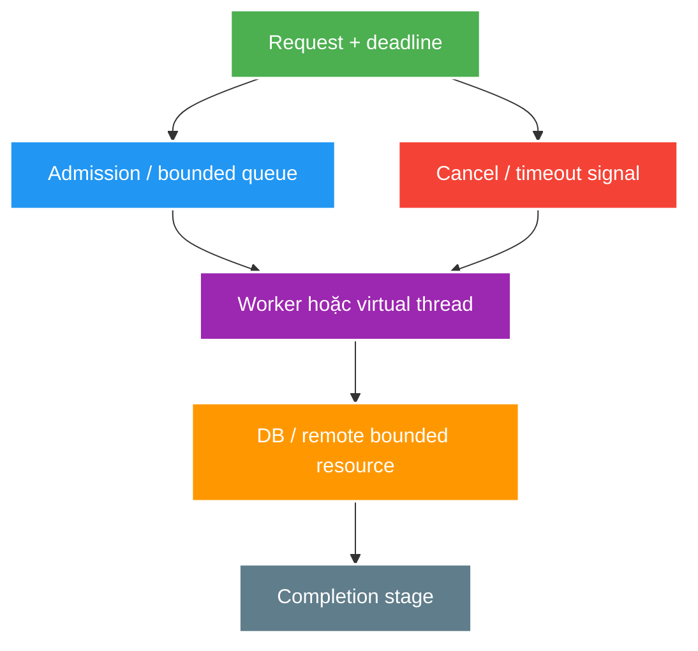

# Executors, CompletableFuture and Concurrency Control

> Type: `CORE` 
> Domain: `java` 
> Target depth: `D3 — thiết kế bounded async pipeline có timeout/cancellation/context và tái hiện saturation` 
> Teaching readiness: `TEACHABLE_DRAFT` 
> Status: `DRAFT` 
> Evidence status: `NOT RUN` 
> Prerequisites: [JMM and thread safety](jmm-synchronization-and-thread-safety.md), [Java 21 virtual threads](java21-platform-baseline.md) 
> Related cases: [`RECONNECT-UC-01`](../../../../use-case-catalog.md#reconnect-uc-01), [`NOTIFY-UC-01`](../../../../use-case-catalog.md#31-foundation-và-senior-cases) 
> Owner: `Project learner; Codex assists` 
> Updated: `2026-07-26`

Source canonical cho [Executor/CompletableFuture question bank](../../question-bank/executors-completablefuture-and-concurrency-control.md). Async syntax không tự tạo capacity, timeout propagation hoặc backpressure.

## 0. Cách học file này

Vẽ đường đi của task từ admission tới completion, ghi capacity tại queue, worker, connection pool và downstream. Sau đó đặt deadline/cancellation/context lên cùng hình. Nếu chỉ nhìn `CompletableFuture` syntax mà không thấy bounded resource và lifetime owner, thiết kế vẫn thiếu phần quan trọng nhất.

## 1. Learning objectives

1. Chọn executor/thread model theo CPU/blocking/resource budget và ownership lifecycle.
2. Compose `CompletableFuture` với executor, timeout, exception, cancellation và context semantics rõ.
3. Thiết kế bounded admission/queue/rejection để overload degrade có chủ đích.

## 2. Mental model do người dạy cung cấp

Executor là admission và scheduling policy cho task, không tạo thêm năng lực downstream. Queue giữ latency debt; worker/virtual thread chỉ là nơi code chạy; connection/quota mới thường là resource thật. `CompletableFuture` mô tả completion graph, còn cancellation và context propagation là protocol phải thiết kế riêng.

## 3. Cơ chế hoạt động

Executor tách task submission khỏi execution policy. Pool sizing không phải số magic: CPU-bound thường bị giới hạn bởi cores; blocking workload bị giới hạn bởi downstream connection/quota/memory/latency. Queue không tạo capacity, chỉ đổi thời điểm overload thành queue wait và memory retention.

`Future` đại diện pending result và basic cancellation/query. `CompletableFuture` vừa là `Future` vừa là `CompletionStage`; non-async continuation có thể chạy trên thread hoàn thành stage, còn async method không truyền executor thường dùng common pool. Vì vậy library code ngầm dùng common pool có thể gây interference/context loss.

`thenApply` map value; `thenCompose` flatten async dependency; `allOf` chỉ báo completion và caller vẫn phải thu kết quả/failure. `get`/`join` có exception wrapper khác nhau. Timeout của wrapper không đảm bảo underlying I/O/task dừng; cancellation là cooperative và `CompletableFuture.cancel` được biểu diễn như exceptional completion, không sở hữu computation để chắc chắn interrupt nó.

Virtual thread giảm chi phí thread-per-task cho blocking style, nhưng connection pool, rate limit, heap và downstream capacity vẫn hữu hạn. Backpressure/admission control phải giới hạn resource thật, không pool virtual threads như platform threads.

### 3.1. Worked example — continuation chạy ở đâu

`thenApply` có thể chạy ngay trên thread hoàn thành stage trước; `thenApplyAsync` không truyền executor thường vào common pool. Nếu continuation block JDBC, nó có thể chiếm worker dùng chung với unrelated work. Production code nên nêu executor/lifetime rõ hoặc giữ blocking style trên virtual thread nhưng vẫn giới hạn DB permits.

### 3.2. Worked example — timeout không đồng nghĩa stop work

Request fan-out gọi remote API 2 giây nhưng wrapper `orTimeout(200ms)` trả lỗi cho caller sau 200 ms. Nếu client call không nhận cancellation/deadline, 1,8 giây còn lại vẫn giữ socket/permit và có thể tạo side effect. Khi traffic cao, “zombie work” tích lũy sau hàng loạt response timeout và làm recovery chậm hơn.

## 4. Invariant và boundary

1. Mọi executor có owner, purpose, queue/capacity, rejection, shutdown và metric rõ.
2. Request deadline/cancellation phải propagate tới downstream khi API hỗ trợ; không trả timeout trong khi work tiếp tục vô hạn.
3. MDC/security/trace/transaction context không được giả định tự động qua arbitrary async boundary.
4. Blocking join/get không xuất hiện trong executor cần chính continuation đó để progress.

## 5. Thuật ngữ và distinction

| Thuật ngữ | Định nghĩa | Dễ nhầm | Phân biệt |
| --- | --- | --- | --- |
| Concurrency limit | Số work đang in-flight | Thread count | Virtual threads có thể nhiều hơn resource permits |
| Queue bound | Số task chờ tối đa | Backpressure hoàn chỉnh | Còn cần reject/drop/retry contract |
| Cancellation | Yêu cầu ngừng/cooperative state | Interruption guarantee | Underlying operation có thể không dừng |
| Deadline | Absolute/latest completion budget | Per-hop timeout | Deadline giúp chia remaining budget |
| Structured lifetime | Child work không vượt owner scope | `allOf` | Java 21 structured concurrency là preview, không baseline API mặc định |

## 6. Misconceptions

| Misconception | Vì sao sai | Counterexample |
| --- | --- | --- |
| Async luôn non-blocking | Task/continuation có thể block | JDBC call trong common pool |
| Unbounded queue hấp thụ spike an toàn | Queue tăng wait/memory và stale work | OOM/timeout storm |
| `orTimeout` hủy downstream I/O | Nó complete future exceptionally | HTTP/DB work vẫn chạy nếu không cancel được |
| `CompletableFuture.cancel(true)` luôn interrupt | CF không trực tiếp điều khiển computation | Task tiếp tục side effect |
| Virtual threads bỏ nhu cầu bulkhead | Downstream/quota vẫn bounded | 100k virtual threads chờ 20 DB connections |

## 7. Failure modes kinh điển

| Failure | Trigger | Symptom | Root mechanism |
| --- | --- | --- | --- |
| Pool starvation | Blocking task chiếm worker | Continuation/request treo | Shared finite executor exhausted |
| Queue collapse | Arrival > service lâu dài | Queue age/p99/OOM | No admission/load shedding |
| Async leak | Fire-and-forget không owner | Work tiếp tục sau request/shutdown | Lifetime/cancellation missing |
| Context loss | Thread hop | Missing trace/security/MDC | Thread-local context không propagate |
| Deadlock by join | Task wait child trên same saturated pool | No progress | Dependency cycle/resource starvation |

## 8. Solution patterns

| Pattern | Bảo vệ | Giới hạn | Khi dùng |
| --- | --- | --- | --- |
| Purpose-specific executor | Isolation/metric | More pools/config | Distinct workload/SLO |
| Bounded queue + rejection | Memory/latency | Caller needs policy | Platform-thread workers |
| Semaphore/bulkhead | Downstream capacity | Permit sizing | Virtual thread/async calls |
| Deadline propagation | End-to-end latency | API support | Request fan-out |
| Explicit context wrapper | Trace/security continuity | Boilerplate/integration | Async boundary |

## 9. Trade-off matrix

| Option | Correctness | Complexity | Performance | Operability | Evolution |
| --- | --- | --- | --- | --- | --- |
| Common pool implicit | Hidden interference | Thấp code | Good CPU tasks only | Poor ownership | Fragile |
| Dedicated bounded pool | Clear isolation | Vừa | Stable if sized | Strong metrics | Config overhead |
| Virtual thread per task | Simple blocking code | Vừa | High I/O concurrency | Need pinning/downstream metrics | Java 21 baseline |
| Reactive pipeline | Explicit async/backpressure model | Cao | Good high fan-out if end-to-end non-blocking | Debug/context learning cost | Different programming model |

## 10. Deep-dive

- [Executor saturation, cancellation, context and backpressure](../deep-dives/executors-cancellation-context-and-backpressure.md).
- [Virtual-thread pinning](../deep-dives/virtual-threads-and-pinning.md) thuộc JDK-01 preview.

## 11. Liên hệ learning case

| Case | Áp dụng | Detail giữ ở case |
| --- | --- | --- |
| `RECONNECT-UC-01` | Admission/retry/deadline/resource budget | Reconnect workload/topology |
| `NOTIFY-UC-01` | Bounded fan-out/executor/queue | Broker and delivery policy |
| `LIVE-UC-01` | Concurrency budget and saturation | 100k capacity evidence |

## 12. Interview answer outline

Nêu task lifecycle và bounded resources trước API method. Phân biệt `thenApply`/`thenCompose`, async/non-async executor, timeout với cooperative cancellation, platform pool với virtual thread + downstream bulkhead. Kết thúc bằng saturation metrics: in-flight, queue age, rejection, permit/connection wait và zombie work.

## 13. Tóm tắt và learner write-back

- Queue không tạo capacity; nó lưu nợ và cần bound/rejection policy.
- Async không đồng nghĩa non-blocking.
- Timeout response không chắc dừng computation.
- Virtual thread không làm DB/socket/quota vô hạn.
- Executor, task lifetime và context đều cần owner.

`LEARNER TODO — vẽ một fan-out chain, ghi executor, deadline, cancellation và mọi capacity.`

## 14. Guided self-check

1. **Question:** Pool, queue và concurrency limit khác nhau thế nào? **Đọc lại nếu bí:** mục 2–4. **Rubric:** execution slots, waiting debt, real in-flight resource và overload point. **My answer:** `LEARNER TODO`
2. **Question:** Các continuation khác nhau thế nào? **Đọc lại nếu bí:** mục 3 và 3.1. **Rubric:** map vs flatten; completer thread vs explicit/default executor; blocking risk. **My answer:** `LEARNER TODO`
3. **Question:** Timeout/cancellation/context qua fan-out ra sao? **Đọc lại nếu bí:** mục 3.2, 4 và deep-dive. **Rubric:** remaining deadline, cooperative downstream cancel, child lifetime owner, MDC/security propagation. **My answer:** `LEARNER TODO`

## 15. Official references

- [Java SE 21 `ExecutorService`](https://docs.oracle.com/en/java/javase/21/docs/api/java.base/java/util/concurrent/ExecutorService.html)
- [Java SE 21 `ThreadPoolExecutor`](https://docs.oracle.com/en/java/javase/21/docs/api/java.base/java/util/concurrent/ThreadPoolExecutor.html)
- [Java SE 21 `CompletableFuture`](https://docs.oracle.com/en/java/javase/21/docs/api/java.base/java/util/concurrent/CompletableFuture.html)
- [JEP 444 — Virtual Threads](https://openjdk.org/jeps/444)

## 16. Teach-back checklist

- [ ] Tôi vẽ được bounded resources và overload path.
- [ ] Tôi giải thích executor/continuation/cancellation semantics.
- [ ] Tôi không gọi timeout là work cancellation.
- [ ] Tôi bảo vệ platform/virtual/reactive decision bằng workload.
- [ ] Saturation experiment/evidence vẫn `NOT RUN`.
