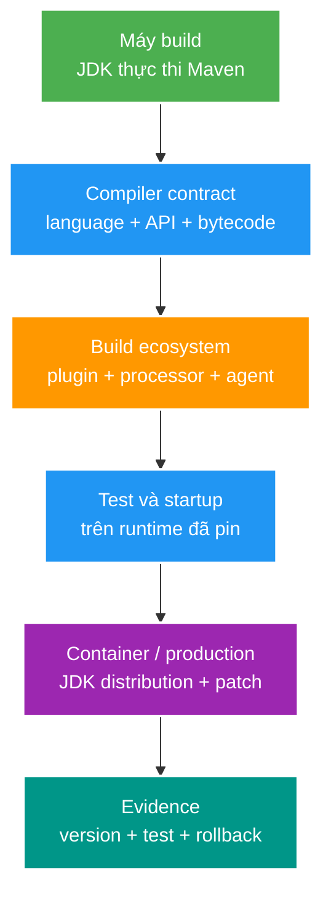
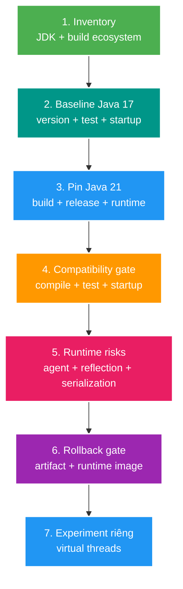

# Java 21 platform baseline cho Spring Boot service

> Type: `CORE`<br>
> Domain: `java`<br>
> Target depth: `D2 trước implementation; JDK-01 chỉ đạt D3 sau build/runtime/experiment evidence`<br>
> Teaching readiness: `TEACHABLE_DRAFT`<br>
> Status: `DRAFT`<br>
> Evidence status: `NOT RUN`<br>
> Prerequisites: Java compilation/runtime fundamentals, Maven lifecycle<br>
> Related cases: [JDK-01](../../../../cases/jdk-01-java21-platform-baseline.md)<br>
> Owner: `Project learner; Codex prepares canonical draft`<br>
> Updated: `2026-07-26`

Đây là bản giải thích canonical để đọc và phản biện, không phải bằng chứng người học đã hiểu. Agent cung cấp mental model ở đầu bài; phần “Bài tập diễn đạt lại” và “My answer” ở cuối bài mới là phần người học tự viết. Chi tiết riêng của repository chỉ nằm trong JDK-01.

## 0. Cách dùng tài liệu này

Tài liệu dành cho developer đã biết build/chạy một ứng dụng Java nhưng chưa từng quản lý **platform baseline** một cách có hệ thống. Đọc lần đầu theo thứ tự từ mục 1 đến mục 11; đừng bắt đầu bằng self-check. Thời gian đọc dự kiến 45–60 phút.

Sau lần đọc đầu, dùng mục 13 để cô đọng, rồi viết mục 14 bằng lời của mình. Mục tiêu của core không phải nhớ mọi JEP trong Java 21. Mục tiêu là hiểu tại sao nâng Java là một thay đổi xuyên suốt từ máy build tới production runtime và biết evidence nào còn thiếu trước khi kết luận “đã migrate xong”.

## 1. Learning objectives

Sau topic này, tôi có thể:

1. Phân biệt JDK chạy build, language/API target, bytecode target và JRE/JDK thực sự chạy application.
2. Giải thích vì sao “Maven build pass trên máy tôi” chưa chứng minh platform baseline tái lập.
3. Phân loại feature Java 21 thành final, preview hoặc incubator trước khi dùng.
4. Lập migration gate Java 17 -> 21 có compatibility, regression và rollback evidence.
5. Giải thích Java 21 tạo điều kiện cho virtual threads nhưng không tự chứng minh nên bật chúng.

## 2. Mental model cốt lõi — phần Agent dạy

Hãy hình dung source code phải đi qua một **đường ống có nhiều cửa kiểm soát** trước khi trở thành service đang chạy. Số `21` trong `pom.xml` chỉ mô tả ý định ở một cửa; nó không tự điều khiển các cửa còn lại.



Đi từ trên xuống:

1. Một JDK cụ thể khởi động Maven và chạy plugins.
2. Compiler quyết định source syntax, Java SE API được phép dùng và class-file version sinh ra.
3. Annotation processor, test engine, bytecode agent và framework phải hiểu JDK/class file mới.
4. Test và application startup phải chạy trên runtime mà ta định support.
5. Container/production phải thật sự dùng distribution và patch đã chọn.
6. Cuối cùng, version output, tests, startup log và rollback rehearsal mới tạo thành evidence.

Nếu bất kỳ hai tầng nào lệch nhau, ta có **platform drift**. Ví dụ, CI compile class file Java 21 nhưng production image vẫn chạy Java 17. Build có thể xanh, nhưng application sẽ không load được class ở production.

> **Câu cần nhớ:** Platform baseline không phải “một version property”; nó là một contract xuyên suốt build -> compile -> test -> runtime -> operations, được chứng minh bằng evidence.

## 3. Cơ chế hoạt động

### 3.1. Platform baseline là một chuỗi, không phải một con số trong POM

Một service chỉ có baseline tái lập khi các lớp trên được khai báo và kiểm chứng. `<java.version>21</java.version>` có thể cấu hình compiler target qua Spring Boot parent, nhưng không bắt host hoặc CI phải chạy Maven bằng JDK 21. Ngược lại, Maven chạy bằng JDK mới hơn cũng không tự giới hạn code vào API Java 21 nếu compiler release không được khóa.

| Lớp | Câu hỏi cần trả lời | Failure nếu bỏ qua |
| --- | --- | --- |
| Build JDK | Process Maven đang chạy bằng JDK nào? | Plugin/test có thể dùng behavior của JDK ngẫu nhiên trên host |
| Compiler release | Source, bytecode và public Java SE API target nào? | Compile nhầm API chỉ có ở JDK mới hơn target |
| Dependency/plugin | Framework, annotation processor, agent và plugin có hỗ trợ JDK không? | Compile pass nhưng test/startup/instrumentation fail |
| Runtime image | Artifact thực sự chạy bằng distribution/patch nào? | Build và production khác behavior hoặc support policy |
| CI/deployment | Matrix, logs và rollback artifact có tái lập không? | Không chứng minh được regression thuộc code hay môi trường |

`javac --release 21` kết hợp language rules, class-file target và Java SE API surface của release 21. Nó mạnh hơn chỉ đặt `-source`/`-target`, nhưng vẫn không chọn JDK executable chạy Maven, không khóa vendor/patch và không kiểm chứng third-party library hay runtime image. Maven Toolchains giải quyết việc chọn JDK cho plugin hỗ trợ toolchain; CI/container vẫn phải pin và xuất version evidence.

### 3.2. Final, preview và incubator là ba compatibility contract khác nhau

| Loại | Ý nghĩa | Activation | Policy phù hợp cho baseline |
| --- | --- | --- | --- |
| Final | Java SE/JDK feature đã delivered | Dùng bình thường nếu framework/tooling hỗ trợ | Có thể dùng sau test và review |
| Preview | Thiết kế gần hoàn thiện nhưng còn lấy feedback | Compile và runtime cần `--enable-preview`; có thể đổi/remove ở release sau | Không đưa vào production baseline nếu chưa có ADR, pin version và migration plan |
| Incubator | API/tool còn đang thử nghiệm, thường ở module `jdk.incubator.*` | Cần add module/flags phù hợp | Chỉ dùng trong lab hoặc use case có constraint mạnh |

LTS là support/lifecycle policy của vendor, không có nghĩa mọi feature trong release đều final hoặc mọi dependency đều tương thích. Java 21 là LTS phổ biến, nhưng String Templates, Structured Concurrency và Scoped Values trong Java 21 vẫn là preview; Vector API vẫn incubator. Virtual Threads, Record Patterns, Pattern Matching for `switch` và Sequenced Collections là final trong Java 21.

### 3.3. Java 17 -> 21: chọn feature theo problem, không refactor theo release note

| Java 21 capability | Contract ở Java 21 | Giá trị có thể có | Guardrail |
| --- | --- | --- | --- |
| Virtual Threads | Final | Giữ code blocking/thread-per-request dễ đọc khi concurrency I/O cao | Benchmark, downstream limit và JFR trước khi bật |
| Sequenced Collections | Final | API first/last/reversed thống nhất cho collection có encounter order | Không thay collection nếu access pattern không cần |
| Record Patterns | Final | Deconstruct immutable data rõ hơn | Không ép domain mutable/entity thành record |
| Pattern Matching for `switch` | Final | Exhaustive type/state handling dễ kiểm tra hơn | Xử lý `null`, sealed hierarchy và compatibility rõ ràng |
| Generational ZGC | Final runtime capability | Có thể giảm pause cho workload/heap phù hợp | Không đổi GC nếu chưa có allocation/latency evidence |
| Preview/incubator APIs | Chưa final | Học/lab để hiểu hướng phát triển | Không trở thành baseline ngầm |

JDK-01 chỉ sở hữu platform/toolchain/Java 21/virtual-thread slice. Java language, collections, algorithm và complexity rộng hơn thuộc `JAVA-01`; JVM/GC diagnostic sâu thuộc `JVM-01`.

### 3.4. Migration gate an toàn



1. **Inventory:** JDK distribution/patch, Maven Wrapper, plugins, dependencies, annotation processors, agents, container base image và CI runner.
2. **Characterize:** lưu version output, clean compile, relevant tests, startup và observable behavior trước thay đổi.
3. **Change one platform boundary:** đưa build/release/runtime về Java 21; không trộn Spring Boot major upgrade vào cùng hypothesis.
4. **Verify:** compile/test/startup chưa đủ cho full business confidence nhưng phải phát hiện binary/reflection/plugin/agent/config regression trong scope hiện có.
5. **Rollback:** artifact/config/runtime image cũ phải quay lại được; migration schema/API không thuộc JDK-01.
6. **Experiment:** chỉ sau baseline mới đánh giá virtual threads bằng workload blocking I/O và diagnostic.

### 3.5. Worked example 1 — build JDK 25 nhưng target Java 21

Giả sử laptop cài JDK 25 và Maven được khởi động bằng JDK 25, nhưng project muốn support Java 21. Cấu hình compiler dùng `--release 21` có ba tác dụng liên quan nhau:

1. compiler chỉ chấp nhận language rules của Java 21;
2. class file sinh ra có target phù hợp Java 21;
3. code chỉ được tham chiếu public Java SE API thuộc release 21.

Tuy nhiên, `--release 21` không biến process Maven thành JDK 21. Một Maven plugin hoặc annotation processor vẫn đang chạy trong JDK 25 process. Nó cũng không chứng minh container production dùng Java 21. Vì vậy evidence cần ít nhất hai dòng độc lập: Maven/build JDK và runtime JDK.

```text
./mvnw -version        -> JDK đang chạy Maven
javac --release 21     -> compiler contract
java -version          -> runtime được kiểm tra
```

Ba dòng này trả lời ba câu hỏi khác nhau. Đây là lý do không nên nói chung chung “project dùng Java 21”.

### 3.6. Worked example 2 — local pass, production fail

Giả sử developer đổi `<java.version>` thành `21`, chạy test bằng IDE JDK 21 và mọi test đều xanh. Docker image vẫn dựa trên Java 17. Khi deploy, JVM 17 đọc class file do Java 21 compiler sinh ra và từ chối load vì class-file version mới hơn runtime hỗ trợ.

Causal chain là:

`POM target 21 -> compiler sinh bytecode 21 -> test local bằng runtime 21 pass -> image vẫn Java 17 -> class loading fail khi startup`.

Lỗi không nằm trong business code. Root cause là build/runtime drift. Cách sửa không phải catch exception hay rollback một feature Java, mà là pin và kiểm chứng runtime image trong cùng platform contract.

### 3.7. Phản ví dụ — nâng JDK, framework và execution model cùng lúc

Nếu một change đồng thời nâng Java 17 -> 21, Spring Boot major version và bật virtual threads, khi latency hoặc startup thay đổi ta có ba nhóm nguyên nhân độc lập. Test đỏ cũng khó cho biết lỗi đến từ JDK, framework hay executor. JDK-01 vì thế tách migration baseline khỏi virtual-thread experiment; JDK-02 mới sở hữu quyết định JDK LTS tiếp theo.

## 4. Invariant và boundary

1. Declared target, JDK chạy build, JDK chạy test và runtime evidence không được mâu thuẫn âm thầm.
2. Một build chỉ được gọi là Java 21 baseline khi compiler/API target và runtime path đều được kiểm chứng; version string trong POM không đủ.
3. Preview/incubator feature không được đi vào baseline như final API.
4. JDK upgrade không được đồng nghĩa với framework major upgrade; mỗi thay đổi phải có hypothesis và rollback boundary riêng.
5. Compile pass không chứng minh business behavior, performance hoặc production compatibility.
6. Java 21 enable khả năng thử virtual threads; suitability thuộc workload, downstream capacity và operations.

Boundary quan trọng:

- Java SE API compatibility không bao phủ internal JDK API, bytecode agent, JNI/native library hoặc reflection hack.
- Source compatibility, binary compatibility và behavioral compatibility là ba câu hỏi khác nhau.
- Vendor distribution/patch/support policy là deployment decision riêng với language level.
- JDK 25 là decision của `JDK-02`; không suy diễn từ Java 21 baseline.

## 5. Thuật ngữ và distinction

| Thuật ngữ | Định nghĩa ngắn | Dễ nhầm với | Điểm phân biệt |
| --- | --- | --- | --- |
| JDK | Compiler, tools và runtime để develop/run Java | JRE/runtime image | Build process cần JDK; production có thể dùng runtime image phù hợp |
| Build JDK | JDK process thực thi Maven/plugins | Compiler release | Có thể chạy JDK 25 nhưng compile `--release 21` |
| `--release` | Khóa language rules, class-file target và Java SE API surface | `-source`/`-target` | Không chỉ đổi syntax/bytecode; ngăn dùng API SE mới hơn target |
| Toolchain | Cơ chế chọn JDK cho build plugins hỗ trợ | `JAVA_HOME` ngẫu nhiên | Tách selection khỏi JDK khởi động Maven, nhưng cần verify plugin coverage |
| LTS | Support lifecycle do vendor cung cấp | “ổn định tuyệt đối” | Không bảo đảm library compatibility hay mọi feature final |
| Preview | Feature Java SE cần thêm feedback | Incubator | Preview thuộc spec nhưng cần flags và có thể đổi |
| Incubator | API/tool thử nghiệm trong JDK | Preview | Thường ở module incubator, contract yếu hơn |
| Runtime evidence | Output/chứng cứ artifact chạy dưới JDK cụ thể | Declared property | Evidence quan sát được, không chỉ configuration intent |

## 6. Misconceptions

| Misconception | Vì sao sai | Counterexample/evidence |
| --- | --- | --- |
| “Đổi `<java.version>` là đã nâng JDK” | Host/CI có thể vẫn chạy Maven hoặc application bằng JDK khác | So sánh `java -version`, Maven version và runtime startup evidence |
| “Chạy Maven bằng JDK 21 là code chỉ dùng API 21” | Compiler target có thể không được khóa | Một API JDK mới hơn có thể compile nếu build JDK mới và không dùng `--release` phù hợp |
| “LTS nghĩa là mọi feature production-ready” | Preview/incubator status độc lập với LTS | Java 21 chứa cả final, preview và incubator JEPs |
| “Compile pass nghĩa là upgrade an toàn” | Agent, reflection, serialization, startup và behavior có thể fail | Cần tests/startup/runtime evidence và risk-based verification |
| “Java 21 bắt buộc bật virtual threads” | Virtual threads là execution option, không phải migration requirement | CPU-bound hoặc DB-pool-bound workload có thể không cải thiện |
| “JDK mới luôn nhanh hơn nên không cần baseline” | Workload, GC, JIT warm-up và dependency interaction quyết định kết quả | Chỉ claim sau measurement có controls |

## 7. Failure modes kinh điển

### Failure story 1 — accidental API drift

Build host dùng JDK mới hơn target nhưng compiler không khóa `--release`. Developer gọi một Java SE API chỉ có ở JDK mới. Code compile vì API tồn tại trên build host; runtime cũ không có method/class đó. Symptom thường là compile failure ở môi trường khác hoặc linkage error khi chạy. Evidence phân biệt lỗi này với dependency conflict là: kiểm tra API thuộc JDK nào, compiler arguments và runtime version.

### Failure story 2 — tool/agent không theo kịp class-file/runtime

Application code có thể compile nhưng coverage agent, bytecode enhancer, annotation processor hoặc monitoring agent không hiểu class-file version/runtime behavior mới. Symptom xuất hiện ở test, startup hoặc instrumentation chứ không nhất thiết ở compile. Vì vậy compatibility inventory phải bao gồm build ecosystem, không chỉ production dependencies.

Bảng dưới đây dùng để ôn nhanh sau khi đã hiểu hai causal story trên:

| Failure | Trigger | Observable symptom | Root mechanism |
| --- | --- | --- | --- |
| Build/runtime drift | Developer, CI và container dùng JDK khác nhau | Pass local, fail CI/startup | Platform layers không được pin/ghi evidence |
| Accidental new API | Build bằng JDK mới nhưng target cũ không dùng `--release` | `NoSuchMethodError`/compile fail ở môi trường cũ | Bytecode/API contract lệch |
| Plugin/agent incompatibility | JDK đổi class-file/runtime internals | Build/test/instrumentation fail | Tool không hỗ trợ release mới |
| Preview leakage | Compile có flag nhưng runtime/deploy thiếu hoặc release sau đổi API | Startup/class loading fail | Preview contract không ổn định và cần flag ở cả hai phía |
| False confidence | Chỉ context smoke test pass | Business/security regression không bị phát hiện | Verification scope quá hẹp |
| Mixed upgrade diagnosis | Đổi JDK, Spring Boot và dependencies cùng lúc | Không cô lập được nguyên nhân regression | Quá nhiều independent variables |

## 8. Solution patterns

Không có một flag duy nhất bảo vệ toàn bộ baseline. Wrapper/BOM làm build graph ổn định hơn; `--release` bảo vệ compiler contract; toolchain/CI setup chọn JDK; characterization tests bảo vệ behavior quan sát được; runtime image pin bảo vệ deployment. Các pattern phải ghép theo layer trong mental model, không thay thế lẫn nhau.

| Pattern | Bảo vệ điều gì | Giới hạn | Khi nên dùng |
| --- | --- | --- | --- |
| Maven Wrapper + pinned plugin/BOM | Build graph tái lập hơn | Không pin JDK host | Mọi CI build |
| Compiler `--release` | Language/API/class-file contract | Không chọn runtime/toolchain | Khi target một Java SE release rõ ràng |
| Maven Toolchains/CI JDK setup | Chọn đúng JDK cho build | Plugin phải toolchain-aware; runtime vẫn cần pin | Multi-JDK host hoặc CI matrix |
| Compatibility matrix | Dependency/plugin/agent/container risk | Không thay tests thực tế | Trước platform upgrade |
| Characterization baseline | Phát hiện behavior drift trong scope hiện có | Chất lượng phụ thuộc test coverage | Trước change có blast radius rộng |
| Time-boxed defer | Tránh upgrade mù khi prerequisite thiếu | Cần owner/revisit trigger | Khi risk lớn hơn benefit hiện tại |

## 9. Trade-off matrix

Quyết định của JDK-01 không phải “Java 21 tốt hay xấu”. Ba option khác nhau ở số independent variables và khả năng rollback. Giữ Java 17 giảm change ngắn hạn nhưng không giải quyết drift nếu environment vẫn không pin. Java 21 baseline rồi experiment riêng giữ causal isolation tốt nhất. Nâng thẳng JDK 25 cùng framework line mới có thể hợp lý trong một chương trình migration khác, nhưng không phù hợp hypothesis nhỏ của JDK-01.

| Option | Correctness | Complexity | Performance | Security/operability | Cost/evolution |
| --- | --- | --- | --- | --- | --- |
| Giữ Java 17 | Ít change nhưng giữ platform drift nếu không pin | Thấp ngắn hạn | Không có virtual-thread option | Support horizon và repeatability vẫn phải xử lý | Dồn migration cost về sau |
| Java 21 baseline, virtual threads deferred/lab | Cô lập JDK migration, framework hiện tại hỗ trợ | Vừa | Chưa claim benefit trước lab | Rollback/diagnostic rõ hơn | Bước tiến LTS nhỏ, phù hợp JDK-01 |
| JDK 25 + Spring Boot line mới | Có LTS mới hơn nhưng trộn nhiều compatibility boundary | Cao | Có runtime improvements mới nhưng chưa chắc liên quan workload | Test/rollback/operations phức tạp hơn | Thuộc JDK-02 sau safety net |

## 10. Deep-dive: internals và cross-layer interaction

Core theory chỉ cần nhớ: virtual thread là `Thread` do JDK schedule lên carrier platform thread; blocking operation có thể unmount virtual thread để carrier chạy task khác. Nó tăng khả năng giữ nhiều concurrent tasks chờ I/O, không tăng CPU, connection pool hay downstream quota.

Đọc [Virtual threads, pinning và downstream backpressure](../deep-dives/virtual-threads-and-pinning.md) để học scheduler, mount/unmount, pinning theo JDK version, Spring Boot lifecycle, JFR và experiment design.

## 11. Liên hệ learning case

| Case | Theory được áp dụng | Project detail chỉ giữ ở case |
| --- | --- | --- |
| [JDK-01](../../../../cases/jdk-01-java21-platform-baseline.md) | Platform layers, release classification, migration gate, virtual-thread boundary | POM Java 17, Spring Boot version, smoke test, scheduler và commands |

## 12. Góc nhìn phỏng vấn

### 12.1. Câu trả lời 30 giây

Một câu trả lời tốt không dừng ở “Java 21 là LTS”. Hãy mở bằng: platform baseline gồm build JDK, compiler `--release`, dependency/tool compatibility và runtime JDK. Sau đó nói migration chỉ hoàn tất khi compile/test/startup/rollback evidence cùng trỏ về contract đã pin.

### 12.2. Outline Senior khoảng 2 phút

1. Nêu problem: version property không kiểm soát toàn supply chain.
2. Kể platform chain từ Maven JDK tới production runtime.
3. Phân biệt `--release` bảo vệ compiler contract với toolchain/runtime selection.
4. Nêu hai failure: build/runtime drift và plugin/agent incompatibility.
5. Trình bày migration gate cùng rollback.
6. Kết luận virtual threads là experiment riêng theo workload, không phải lợi ích tự động của upgrade.

### 12.3. Follow-up thường gặp

- “Build bằng JDK 25 nhưng release 21 có hợp lệ không?” — đọc mục 3.5.
- “Compile và unit test pass đã đủ chưa?” — đọc mục 3.4 và 7.
- “Tại sao không bật virtual threads ngay?” — đọc mục 10 và deep-dive liên kết.

## 13. Tóm tắt cô đọng

1. Java baseline là contract nhiều tầng, không phải một property.
2. Build JDK, compiler release và runtime JDK là ba khái niệm khác nhau.
3. `--release` khóa language/API/class-file contract nhưng không pin Maven process hoặc production image.
4. Final, preview, incubator và LTS mô tả các dimension khác nhau.
5. Migration an toàn phải có baseline trước, change được cô lập, compatibility gate và rollback.
6. Compile pass chỉ chứng minh source/build slice; không chứng minh startup, agent, serialization, performance hoặc business behavior.
7. Virtual threads là execution option cần experiment riêng; Java 21 migration không bắt buộc bật.

## 14. Bài tập diễn đạt lại — phần của tôi

Viết 8–15 câu theo scaffold sau:

1. **Bối cảnh:** Vì sao chỉ đổi `<java.version>` chưa đủ?
2. **Mental model:** Kể sáu tầng từ build JDK đến evidence.
3. **Mechanism:** `--release` bảo vệ gì và không bảo vệ gì?
4. **Failure:** Chọn một drift scenario và kể causal chain.
5. **Decision:** Vì sao JDK-01 tách Java 21 baseline khỏi virtual-thread experiment?

> **Bài viết của tôi — `LEARNER TODO`:** lần đầu được nhìn mục 13; lần thứ hai đóng file và nói lại trong khoảng hai phút.

## 15. Self-check có hướng dẫn

1. **Question:** Vì sao `<java.version>21</java.version>` chưa chứng minh service chạy bằng Java 21?<br>
   **Đọc lại nếu bí:** mục 2 và 3.1.<br>
   **Một câu trả lời tốt phải có:** declared intent, build JDK, compiler contract, runtime evidence.<br>
   **My answer:** `LEARNER TODO`
2. **Question:** `--release 21` bảo vệ ba thứ gì và không bảo vệ ba thứ gì?<br>
   **Đọc lại nếu bí:** mục 3.1 và 3.5.<br>
   **Một câu trả lời tốt phải có:** language/API/class-file; Maven JDK/vendor-runtime/third-party compatibility.<br>
   **My answer:** `LEARNER TODO`
3. **Question:** LTS, final, preview và incubator liên hệ thế nào?<br>
   **Đọc lại nếu bí:** mục 3.2.<br>
   **Một câu trả lời tốt phải có:** support policy tách khỏi feature maturity và activation contract.<br>
   **My answer:** `LEARNER TODO`
4. **Question:** Hãy nêu migration gate Java 17 -> 21 theo thứ tự và evidence của từng bước.<br>
   **Đọc lại nếu bí:** mục 3.4.<br>
   **Một câu trả lời tốt phải có:** inventory, baseline, pin, verify, runtime risk, rollback, experiment riêng.<br>
   **My answer:** `LEARNER TODO`
5. **Question:** Vì sao không nâng JDK 25 và Spring Boot cùng JDK-01?<br>
   **Đọc lại nếu bí:** mục 3.7 và 9.<br>
   **Một câu trả lời tốt phải có:** independent variables, causal isolation, rollback và scope owner.<br>
   **My answer:** `LEARNER TODO`
6. **Question:** Compile/test pass cho phép claim gì và chưa cho phép claim gì?<br>
   **Đọc lại nếu bí:** mục 3.4, 4 và 7.<br>
   **Một câu trả lời tốt phải có:** scope evidence cụ thể và các gap startup/runtime/behavior/performance.<br>
   **My answer:** `LEARNER TODO`
7. **Question:** Virtual threads giải quyết resource scarcity nào, và không làm resource nào nhiều hơn?<br>
   **Đọc lại nếu bí:** mục 10.<br>
   **Một câu trả lời tốt phải có:** waiting thread cost so với CPU, connection, quota và downstream capacity.<br>
   **My answer:** `LEARNER TODO`
8. **Question:** Nếu CI dùng JDK 21 nhưng container production chạy JDK 17, invariant nào bị phá?<br>
   **Đọc lại nếu bí:** mục 2, 3.6 và 4.<br>
   **Một câu trả lời tốt phải có:** build/runtime alignment, class loading symptom và evidence cần kiểm tra.<br>
   **My answer:** `LEARNER TODO`

## 16. Official references

- [JDK 21 release project và danh sách JEP](https://openjdk.org/projects/jdk/21/)
- [JEPs integrated từ JDK 17 đến JDK 21](https://openjdk.org/projects/jdk/21/jeps-since-jdk-17)
- [JEP 444: Virtual Threads](https://openjdk.org/jeps/444)
- [Oracle Java SE Support Roadmap](https://www.oracle.com/java/technologies/java-se-support-roadmap.html)
- [Apache Maven Compiler Plugin: dùng `--release`](https://maven.apache.org/plugins/maven-compiler-plugin/examples/set-compiler-release.html)
- [Apache Maven: Guide to Using Toolchains](https://maven.apache.org/guides/mini/guide-using-toolchains)
- [Spring Boot 3.4 System Requirements](https://docs.spring.io/spring-boot/3.4/system-requirements.html)

## 17. Teach-back checklist

- [ ] Tôi viết lại được platform chain mà không nhìn notes.
- [ ] Tôi phân biệt build JDK, compiler release, toolchain và runtime JDK.
- [ ] Tôi phân loại đúng final/preview/incubator và không đồng nhất LTS với feature status.
- [ ] Tôi giải thích được ít nhất hai failure theo causal chain.
- [ ] Tôi bảo vệ được Java 21 now vs Java 17 defer vs JDK 25 combined upgrade.
- [ ] Tôi hoàn thành self-check bằng lời của mình và được phản biện trước khi chuyển checkpoint.
