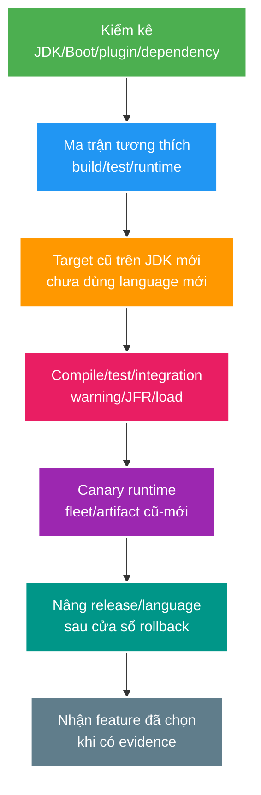

# JDK Platform Migration Strategy: Java 21 → Java 25 LTS

> Type: `CORE` 
> Domain: `java` 
> Target depth: `D3 — audit compatibility, separate runtime/toolchain/language change and stage LTS rollout with rollback` 
> Teaching readiness: `TEACHABLE_DRAFT` 
> Status: `DRAFT` 
> Evidence status: `NOT RUN` 
> Version snapshot: `2026-07-26`; re-check JDK/Spring/dependencies when `JDK-02` becomes active 
> Prerequisites: [Java 21 baseline](java21-platform-baseline.md) 
> Related cases: `JDK-02` preview; [question bank](../../question-bank/jdk25-spring-boot-migration-decision.md) 
> Owner: `Project learner; Codex teaches, learner writes back` 
> Updated: `2026-07-26`

## 1. Migration is a compatibility graph

Phải tách riêng các biến: JDK chạy Maven/plugin/test; `--release` quyết định bytecode và API được phép dùng; JDK production chạy artifact; feature ngôn ngữ trong source; phiên bản framework/dependency/agent/native library và container image. Mỗi bước chỉ nâng một chiều để cô lập failure. Compile thành công không chứng minh reflection, serializer, TLS, GC hoặc hiệu năng sẽ đúng ở runtime.

Theo snapshot của tài liệu, OpenJDK 25 phát hành GA ngày 2025-09-16 và được phần lớn vendor cung cấp dưới dạng LTS. Project hiện khai báo Java 17/Spring Boot 3.4; cursor học tập vẫn đưa project lên baseline Java 21 trước. Quyết định JDK 25 chỉ được mở sau khi baseline này có evidence.

## 2. Critical Spring boundary

Tài liệu chính thức của Spring Boot 3.4.13 hỗ trợ Java 17 đến 24, **không gồm 25**. Spring Boot 3.5.16 hỗ trợ tới Java 25. Do đó đường nâng JDK 25 được hỗ trợ phải đánh giá cả dòng framework — ít nhất Boot 3.5 tại snapshot này — và các dependency do BOM quản lý; chỉ đổi `<java.version>25` là chưa đủ. Spring Boot 4.1 hỗ trợ Java mới hơn nhưng là một major migration riêng cho framework/Servlet, không mặc định phải làm cùng JDK upgrade.

Khi case active phải kiểm tra lại patch version và third-party starter. Tuyên bố tương thích của Boot không chứng nhận mọi JDBC driver, Redis/Rabbit client, JWT library, Lombok/annotation processor, Maven plugin, Mockito/Byte Buddy, agent hoặc Testcontainers image.

## 3. Inventory and matrix

Ghi rõ vendor/distribution/kiến trúc CPU; Maven wrapper, compiler, Surefire, Failsafe, JaCoCo; Lombok/MapStruct; Spring Boot/Framework/Data/Security/Hibernate; driver PostgreSQL; Redis/Rabbit/JWT; thư viện test/mock/agent; Docker base image và JDK của CI/local/production. Đọc release note/issue chỉ là bước chuẩn bị, cuối cùng vẫn phải chạy đúng tổ hợp thực tế.

Ma trận cần phủ JDK build 21/25 × target release 21/25 × runtime 21/25 × Boot cũ/mới. Nếu tooling cho phép, bắt đầu bằng build/test trên JDK mới nhưng vẫn target release cũ, rồi deploy cùng artifact tương thích lên runtime mới theo canary. Chỉ nâng bytecode/source sau khi không còn nhu cầu rollback về runtime cũ, hoặc khi chấp nhận duy trì hai artifact.

`--release` kiểm soát đồng thời API được phép dùng và bytecode đầu ra, chặt chẽ hơn chỉ đặt `source`/`target`. Cần kiểm thêm multi-release JAR, service loading và reflection. CI phải ép đúng toolchain thay vì phụ thuộc `JAVA_HOME` trên máy developer; evidence lưu `mvn -version`, `java -version` và kết quả kiểm classfile.

## 4. JDK 21→25 feature landscape

Dùng danh sách JEP chính thức kể từ Java 21 và release note; phân loại rõ feature đã final/product với preview/incubator/experimental. Ví dụ, JDK 24 JEP 491 loại phần lớn pinning do monitor `synchronized`, nhưng native call và class initialization vẫn có thể pin nên JFR vẫn cần thiết. Scoped Values final ở JDK 25 (JEP 506), còn Structured Concurrency vẫn preview (JEP 505); muốn dùng trong production phải chấp nhận `--enable-preview`, khóa source/runtime cùng release và không để preview type rò vào public library API. Compact Object Headers là product feature ở JDK 25 (JEP 519) nhưng không tự động bật; cần benchmark và kiểm tương thích tool/agent.

JFR, GC, default runtime, API bị deprecate/remove và security provider/certificate đều có thể đổi hành vi. “JDK mới nhanh hơn” không phải bảo đảm. Chỉ nhận một feature mới khi có bài toán, evidence và quy tắc vận hành; giá trị của upgrade còn nằm ở bản vá và thời hạn hỗ trợ, không chỉ performance.

Preview feature không được âm thầm trở thành core API. Bytecode preview yêu cầu đúng release và flag bật preview, có vòng đời ngắn và thường phải migrate ở mỗi JDK. Baseline production nên ưu tiên feature ổn định; thử nghiệm preview phải được giới hạn thời gian và phạm vi.

## 5. Compatibility risks

Các bề mặt cần kiểm gồm strong encapsulation và internal API; reflection/proxy/agent; flag/API bị deprecate hoặc remove; công cụ bytecode; annotation processing; native/JNI; serializer; locale/timezone/charset; TLS/certificate/crypto; GC/heap/container ergonomics; thread scheduling/`ThreadLocal` và giả định trong test. Chạy `jdeps`, đọc compiler warning và runtime log, nhưng nhớ rằng tool tĩnh không tìm hết đường reflection hoặc cấu hình chỉ mở lúc chạy.

Với virtual thread, JDK 24 thay đổi monitor pinning nên kết luận từ Java 21 không thể sao chép nguyên xi; database/HTTP pool và native pinning vẫn còn. Phải chạy lại JFR/load. Compact header thay đổi object layout, hiệu năng và có thể ảnh hưởng agent; chỉ bật qua canary có rollback.

## 6. Rollout

Thực hiện theo tầng: ma trận local/CI; unit/integration/Testcontainers; khởi động mọi profile và kiểm security/serialization/migration; load/JFR/GC; cuối cùng là resource trong container. Build artifact bất biến. Canary gắn nhãn runtime/JDK và quan sát error, p99, CPU, RSS, GC, thread, pool cùng metric nghiệp vụ. Fleet cũ-mới phải đọc được cache/session/token/event của nhau. Chỉ rollback cùng bytecode về runtime cũ nếu target release còn cũ; sau khi phát hành bytecode 25, lựa chọn là rollback ứng dụng nhưng vẫn trên JDK 25 hoặc giữ dual artifact.

Không thay đồng thời major Boot, JDK, language feature, virtual thread và GC tuning. Một đường hỗ trợ có thể nâng Boot 3.4→3.5 trên JDK hiện tại, sau đó đổi runtime JDK 25, cuối cùng mới nâng target/feature. Quyết định chính xác phụ thuộc baseline thực tế và evidence của từng cạnh.

## 7. Exit criteria/evidence

Gate hoàn tất gồm: mọi plugin/dependency tương thích; compile, test và các profile pass; không còn illegal access hoặc agent failure; performance/resource nằm trong sai lệch chấp nhận; security/TLS/serialization/migration đã kiểm; có canary, rollback, runbook và vendor support. File evidence phải lưu version, command và raw result. Hiện trạng vẫn `NOT RUN`; chưa có thay đổi runtime của project.

## 7.1. Worked example tối thiểu — build JDK khác target runtime

Giả sử CI dùng JDK 25 để chạy Maven nhưng application vẫn phải chạy trên Java 21. Compiler cấu hình `--release 21`; source không được gọi API chỉ có ở 25 và classfile target là 21. Tuy nhiên Maven plugins, annotation processors và test/coverage agents chạy *bên trong build JVM 25*, nên chúng phải hỗ trợ 25. Sau build, chính artifact phải được test bằng runtime 21 vì generated/transitive classes hoặc multi-release JAR có thể nằm ngoài điều compiler source chính đã kiểm.

Input của matrix là: build JDK 25, `release=21`, test runtime 21 và 25, same artifact digest. Expected: compile/test pass ở cả runtime, classfile scan không có major version vượt target và contracts giống nhau. Nếu test chỉ chạy JDK 25, evidence mới chứng minh new runtime—not backward runtime compatibility.

## 7.2. Worked example gần project — tách Boot upgrade khỏi JDK runtime

Tại snapshot này, Boot 3.4 không công bố support Java 25 còn Boot 3.5 có. Một staged candidate không đổi tất cả cùng lúc:

1. Đo baseline hiện tại và pin Java/Boot/dependency/plugin versions.
2. Upgrade Boot 3.4 -> 3.5 trong khi vẫn giữ current supported JDK/target; chạy API/security/JPA/Redis/Rabbit/Testcontainers contracts và rollback.
3. Giữ target bytecode 21, chạy same artifact trên runtime 25 canary; so JFR/GC/resources/TLS/serialization/mixed fleet.
4. Chỉ khi rollback window sang runtime 21 không còn cần mới cân nhắc `--release 25` và feature mới.

Nếu stage 2 lỗi Hibernate query, ta biết framework/dependency edge có vấn đề. Nếu stage 3 mới lỗi agent/JIT/resource, ta tập trung runtime edge. Cách tách này giảm search space và giữ rollback rõ; nó không tuyên bố candidate đã được chọn hay tested trong project.

## 7.3. Phản ví dụ — đổi một property rồi coi compile xanh là migration

Đổi `<java.version>25`, dùng local JDK 25, tắt JaCoCo/Mockito lỗi và deploy cùng lúc virtual threads + GC flag là phản ví dụ. Compile xanh không kiểm official framework support, production base image, agents, reflection, TLS, cache/event format, load hoặc rollback. Khi regression xảy ra, nhiều dimensions thay cùng lúc nên không biết root cause. Tắt tool kiểm chứng còn làm evidence yếu hơn.

## 7.4. Invariants và decision checklist

- Mỗi stage chỉ thay một compatibility edge đủ nhỏ để khoanh vùng và rollback.
- Artifact provenance gồm build JDK, target, dependency/plugin/agent versions và digest.
- Runtime compatibility được chứng minh bằng chạy artifact trên runtime đó, không suy từ compile.
- Mixed fleet phải đọc/ghi API, token/session, cache/event/schema theo cả hai chiều.
- Preview/experimental feature không đi vào production core nếu chưa có explicit governance/flags/migration plan.
- Version snapshot phải re-check tại activation; docs hiện tại không phải support guarantee tương lai.

## 8. Learner write-back và guided self-check

> **Bài viết của tôi — `LEARNER TODO`:** build compatibility matrix and choose staged Boot/JDK path.

1. **Question:** Phân biệt build JDK, `--release`, test runtime và production runtime bằng một matrix cụ thể. 
   **Đọc lại nếu bí:** mục 1, 3 và 7.1. 
   **Một câu trả lời tốt phải có:** vai trò từng layer, plugin/processor gap, same-artifact runtime proof và classfile/provenance evidence. 
   **My answer:** `LEARNER TODO`
2. **Question:** Vì sao nên nâng framework line trước rồi mới canary JDK 25? 
   **Đọc lại nếu bí:** mục 2, 6 và 7.2. 
   **Một câu trả lời tốt phải có:** official support snapshot, dependency isolation, staged failure attribution, mixed-fleet/rollback boundary và requirement recheck. 
   **My answer:** `LEARNER TODO`
3. **Question:** Đánh giá một JDK feature final/preview/product flag trước production như thế nào? 
   **Đọc lại nếu bí:** mục 4–5 và 7.3–7.4. 
   **Một câu trả lời tốt phải có:** lifecycle/enablement, bytecode/runtime coupling, problem/evidence, operability/rollback và không bundling unrelated changes. 
   **My answer:** `LEARNER TODO`

## 9. Official references

- [OpenJDK — JDK 25](https://openjdk.org/projects/jdk/25/)
- [OpenJDK — JEPs since JDK 21](https://openjdk.org/projects/jdk/25/jeps-since-jdk-21)
- [Spring Boot 3.4 — System Requirements](https://docs.spring.io/spring-boot/3.4/system-requirements.html)
- [Spring Boot 3.5 — System Requirements](https://docs.spring.io/spring-boot/3.5/system-requirements.html)
- [JEP 491 — Synchronize Virtual Threads without Pinning](https://openjdk.org/jeps/491)

- [ ] Evidence remains `NOT RUN`.
