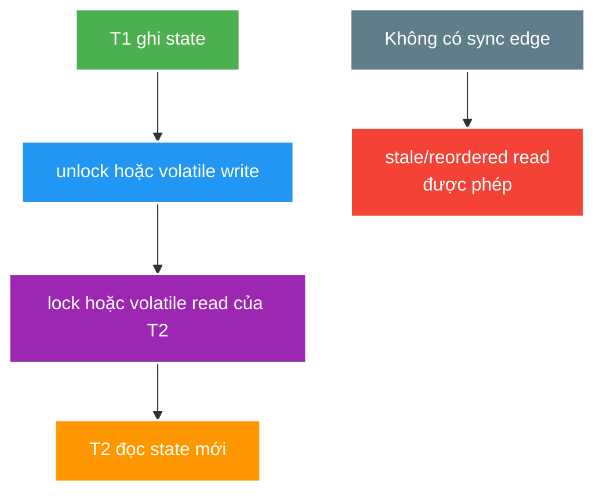

# Java Memory Model, Synchronization and Thread Safety

> Type: `CORE` 
> Domain: `java` 
> Target depth: `D3 — tái hiện race, chỉ ra happens-before thiếu và sửa bằng ownership/synchronization có test lặp` 
> Teaching readiness: `TEACHABLE_DRAFT` 
> Status: `DRAFT` 
> Evidence status: `NOT RUN` 
> Prerequisites: [Object semantics](language-object-semantics-and-generics.md), [JVM runtime](jvm-class-loading-bytecode-and-memory.md) 
> Related cases: [`STREAM-UC-01`](../../../../use-case-catalog.md#31-foundation-và-senior-cases), [`VIEWCOUNT-UC-01`](../../../../use-case-catalog.md#31-foundation-và-senior-cases) 
> Owner: `Project learner; Codex assists` 
> Updated: `2026-07-26`

Source canonical cho [JMM question bank](../../question-bank/jmm-synchronization-and-thread-safety.md). File phân biệt language memory model với database transaction/distributed consistency.

## 0. Cách học file này

Với mỗi đoạn concurrent code, viết actions của từng thread rồi tìm happens-before edge; đừng dựa vào thứ tự log hay xác suất. Tách bốn câu hỏi: operation có atomic không, write có visible không, ordering nào được đảm bảo và mọi thread có progress không.

## 1. Learning objectives

1. Phân biệt atomicity, visibility, ordering và liveness.
2. Dùng happens-before để chứng minh publication/communication đúng thay vì dựa vào “thường chạy được”.
3. Chọn confinement, immutability, lock, volatile, atomic/CAS hoặc message passing theo invariant.

## 2. Mental model do người dạy cung cấp

Mỗi thread có program order riêng; JMM quy định khi action của thread này được đảm bảo quan sát bởi thread khác. Happens-before là cầu nối pháp lý giữa hai timeline. Không có cầu, compiler/CPU/cache vẫn có thể tạo kết quả hợp lệ theo model nhưng trái trực giác wall-clock. Synchronization vừa tạo ordering/visibility, và một số primitive còn tạo mutual exclusion/atomic transition.

## 3. Cơ chế hoạt động

Data race xuất hiện khi hai thread truy cập cùng variable, ít nhất một write và không có ordering/synchronization phù hợp. JMM cho phép compiler/CPU/JIT reorder miễn single-thread semantics và memory-model rule được giữ; vì vậy wall-clock order hoặc log order không chứng minh visibility.

Happens-before là partial order đảm bảo visibility/ordering. Các edge quan trọng gồm program order, monitor unlock-before-lock, volatile write-before-read cùng variable, thread start/join, class initialization và transitivity.

`synchronized` cung cấp mutual exclusion và memory effects ở monitor boundary. `volatile` cung cấp visibility/order cho variable và liên quan, nhưng compound read-modify-write như `count++` vẫn không atomic. Atomic classes dùng CAS/retry cho single-variable state; multi-variable invariant vẫn cần state ownership/lock/immutable snapshot phù hợp.

Safe publication có thể qua final-field construction rule đúng, static initialization, volatile reference, lock hoặc concurrent container contract. `this` escape trong constructor có thể làm thread khác quan sát object chưa fully constructed.

Thread safety không chỉ không corrupt data; còn có progress. Deadlock, livelock, starvation và unbounded blocking là liveness failures.

### 3.1. Worked example — volatile không làm increment atomic

Hai thread có thể cùng đọc `count = 10`, cùng tính 11 và cùng ghi 11. `volatile` làm các read/write visible và ordered quanh variable, nhưng ba bước read–compute–write vẫn xen kẽ. Dùng `AtomicInteger.incrementAndGet`, lock hoặc single owner tùy invariant; nếu counter nằm qua nhiều node thì owner phải chuyển sang durable atomic store/database.

### 3.2. Worked example — safe publication

Thread A dựng immutable config hoàn chỉnh rồi gán reference vào volatile field; thread B đọc cùng volatile field sau đó thấy cả state được dựng trước write nhờ transitivity. Nếu constructor đăng ký `this` vào listener trước khi hoàn tất, thread khác có thể gọi object nửa xây dựng; `final` không cứu được `this` escape sai.

## 4. Invariant và boundary

1. Mọi shared mutable invariant có owner và synchronization protocol duy nhất, được document/test.
2. Read/write ngoài protocol không được coi “harmless” chỉ vì operation primitive/reference atomic.
3. Lock scope không chứa unbounded external I/O nếu có thể tách state decision khỏi side effect.
4. In-process synchronization không bảo vệ nhiều JVM/database/message consumer; boundary phải chuyển sang durable owner/coordination phù hợp.

## 5. Thuật ngữ và distinction

| Thuật ngữ | Định nghĩa | Dễ nhầm | Phân biệt |
| --- | --- | --- | --- |
| Atomicity | Operation/invariant không quan sát intermediate state | Visibility | Atomic write chưa chắc thread khác thấy kịp |
| Visibility | Write được thread khác quan sát theo model | Wall-clock recency | Cần happens-before edge |
| Ordering | Constraint trên observable actions | Execution timestamp | Implementation có thể reorder hợp lệ |
| Linearizability | Operation trông như xảy ra tại một instant giữa invoke/return | Serializability | Khác database transaction schedule |
| Lock-free | System-wide progress không phụ thuộc một stalled thread | Wait-free | Individual operation vẫn có thể retry/starve |

## 6. Misconceptions

| Misconception | Vì sao sai | Counterexample |
| --- | --- | --- |
| `volatile int count; count++` thread-safe | Increment là read-modify-write | Lost update |
| Dùng concurrent collection là workflow atomic | Compound sequence có race | get/check/put duplicate |
| `final` làm object graph immutable | Referenced object vẫn mutable | Final list bị add/remove |
| Unit test pass chứng minh race không có | Interleaving nondeterministic | Stress/repeat/barrier test mới tăng khả năng tái hiện |
| In-memory lock bảo vệ cluster | Mỗi JVM có lock riêng | Hai node cùng update database |

## 7. Failure modes kinh điển

| Failure | Trigger | Symptom | Root mechanism |
| --- | --- | --- | --- |
| Lost update | Concurrent read-modify-write | Counter/balance thiếu | Không atomic/serialized |
| Unsafe publication | Reference escape không HB | Default/stale field hiếm gặp | Construction visibility thiếu |
| Deadlock | Lock-order cycle | Threads BLOCKED, no progress | Circular wait |
| Livelock | Threads liên tục backoff/respond nhau | CPU cao, no commit | Activity không tạo progress |
| Starvation | Unfair lock/pool/priority | Request chờ vô hạn | Resource access không bounded/fair |

## 8. Solution patterns

| Pattern | Bảo vệ | Giới hạn | Khi dùng |
| --- | --- | --- | --- |
| Thread confinement | Loại shared mutation | Handoff/copy cost | Request-local/actor-owned state |
| Immutability + safe publication | Read concurrency | Update tạo version mới | Config/snapshot/value object |
| Monitor/explicit lock | Multi-field invariant | Contention/deadlock | Critical section bounded |
| Atomic/CAS | Single state transition | Retry/ABA/composition | Counter/state word |
| Durable conditional update | Cross-node invariant | Database contention | Stream/wallet state |

## 9. Trade-off matrix

| Option | Correctness | Complexity | Performance | Operability | Evolution |
| --- | --- | --- | --- | --- | --- |
| Coarse lock | Dễ chứng minh | Thấp | Contention cao | Thread dump rõ | Khó scale hot key |
| Fine locks | Có thể parallel hơn | Cao | Overhead/deadlock risk | Diagnose khó | Fragile khi invariant đổi |
| Lock-free/CAS | Tốt cho state nhỏ | Rất cao | Tốt khi contention vừa; retry khi cao | Hard to debug | Khó compose |
| Single owner/queue | Sequential invariant rõ | Architecture cost | Bounded by owner throughput | Queue lag observable | Scale bằng partition |
| DB constraint/lock | Cross-node durable | Cross-layer | I/O/lock wait | Query/lock metric | Strong invariant owner |

## 10. Deep-dive

- [Happens-before, publication, locking and race diagnosis](../deep-dives/jmm-happens-before-publication-and-locking.md).
- Async executor/cancellation/backpressure thuộc [Executors core](executors-completablefuture-and-concurrency-control.md).

## 11. Liên hệ learning case

| Case | Áp dụng | Detail giữ ở case |
| --- | --- | --- |
| `STREAM-UC-01` | State transition race/atomicity | Current webhook/repository path |
| `VIEWCOUNT-UC-01` | Counter exactness/CAS/ownership | Exact-vs-approximate design |
| `GIFT-UC-01` | Lost update and multi-node boundary | Wallet transaction/DB invariant |

## 12. Interview answer outline

Bắt đầu bằng atomicity/visibility/ordering/liveness, vẽ một happens-before edge, dùng `volatile count++` làm counterexample. Sau đó chọn confinement/immutable/lock/CAS theo invariant và chốt rằng in-process primitive không bảo vệ cluster/database. Nêu stress/repeated test là reproducer, không phải proof tuyệt đối.

## 13. Tóm tắt và learner write-back

- Wall-clock order không tạo visibility guarantee.
- `volatile` không làm compound operation atomic.
- Safe publication cần construction đúng và synchronization edge.
- Thread safety gồm cả progress/liveness.
- Synchronization scope phải trùng invariant scope.

`LEARNER TODO — vẽ HB graph cho một shared state trong project và nêu boundary nhiều node.`

## 14. Guided self-check

1. **Question:** Atomicity, visibility và ordering khác nhau thế nào? **Đọc lại nếu bí:** mục 2–3.1. **Rubric:** volatile read/write visible/ordered nhưng increment vẫn lost update. **My answer:** `LEARNER TODO`
2. **Question:** Chứng minh safe publication bằng HB ra sao? **Đọc lại nếu bí:** mục 3 và 3.2. **Rubric:** construction program order → volatile/lock/static-init edge → consumer read, transitivity. **My answer:** `LEARNER TODO`
3. **Question:** Khi nào in-memory lock sai boundary? **Đọc lại nếu bí:** mục 4, 8–9. **Rubric:** nhiều JVM/restart/durable invariant và DB conditional update/queue owner. **My answer:** `LEARNER TODO`

## 15. Official references

- [JLS 17 — Threads and Locks](https://docs.oracle.com/javase/specs/jls/se21/html/jls-17.html)
- [Java SE 21 `java.util.concurrent`](https://docs.oracle.com/en/java/javase/21/docs/api/java.base/java/util/concurrent/package-summary.html)
- [Java SE 21 `AtomicInteger`](https://docs.oracle.com/en/java/javase/21/docs/api/java.base/java/util/concurrent/atomic/AtomicInteger.html)

## 16. Teach-back checklist

- [ ] Tôi vẽ happens-before graph cho publication/state change.
- [ ] Tôi không trộn atomicity với visibility.
- [ ] Tôi nêu liveness failure bên cạnh data corruption.
- [ ] Tôi chọn synchronization theo invariant boundary, kể cả multi-node.
- [ ] Concurrency reproducer/evidence vẫn `NOT RUN`.
