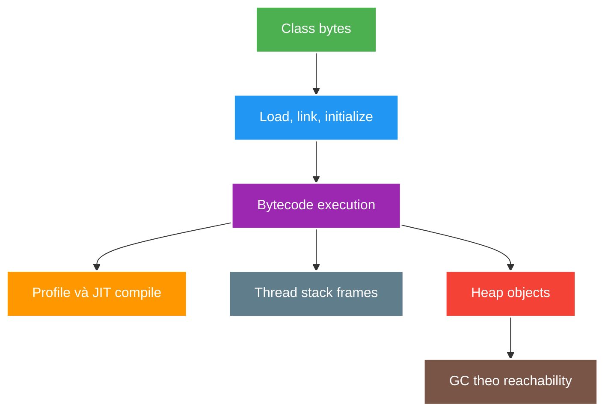

# JVM Class Loading, Bytecode and Memory

> Type: `CORE` 
> Domain: `java` 
> Target depth: `D3 — phân loại CPU/memory/class-loading failure và thu thập đúng JFR, heap hoặc thread evidence trước tuning` 
> Teaching readiness: `TEACHABLE_DRAFT` 
> Status: `DRAFT` 
> Evidence status: `NOT RUN` 
> Prerequisites: [Java 21 platform baseline](java21-platform-baseline.md) 
> Related cases: [`JVM-UC-01`](../../../../use-case-catalog.md#31-foundation-và-senior-cases), [JDK-01](../../../../cases/jdk-01-java21-platform-baseline.md) 
> Owner: `Project learner; Codex assists` 
> Updated: `2026-07-26`

Source canonical cho [JVM memory question bank](../../question-bank/jvm-class-loading-bytecode-and-memory.md). JVM implementation details được pin theo Java/HotSpot 21 khi cần; không xem heuristic là language guarantee.

## 0. Cách học file này

Theo một request từ class được load tới bytecode/JIT, stack frame và object heap; sau đó cộng mọi vùng memory ngoài heap. Khi gặp incident, phân loại symptom rồi chọn artifact. Không học flag GC trước mental model về allocation, reachability và process budget.

## 1. Learning objectives

1. Giải thích loading, linking, initialization và class identity theo `(binary name, defining class loader)`.
2. Phân biệt stack, heap, metaspace, code cache, native/direct memory và thread resource.
3. Chọn diagnostic artifact từ symptom thay vì đổi heap/GC flag theo đoán mò.

## 2. Mental model do người dạy cung cấp

JVM biến class bytes thành class identity, xác minh/link/init rồi thực thi bytecode. Interpreter giúp chạy sớm và thu profile; JIT compile đường nóng theo assumption có thể bị deoptimize. Mỗi thread mang stack execution state; object sống theo reachability trên heap; class metadata, compiled code, direct buffer và thread stack dùng native/process memory. GC thu object unreachable, không hiểu “hết giá trị nghiệp vụ”.

## 3. Cơ chế hoạt động

Class lifecycle gồm loading binary representation, linking (verify, prepare, resolve theo nhu cầu) và initialization chạy static initialization khi trigger theo specification. Delegation giúp tránh duplicate core classes nhưng application/plugin/container có thể tạo nhiều class-loader namespace.

JVM thực thi bytecode, interpreter thu thập profile rồi JIT compile hot methods/paths. Optimization có thể inline/specialize và deoptimize khi assumption không còn đúng. Vì vậy microbenchmark cần warm-up/fork và không suy luận production từ cold run.

Mỗi thread có stack frames; object/array thường ở heap về logical model dù JIT có thể scalar-replace allocation không escape. Metaspace lưu class metadata bằng native memory; code cache chứa compiled code; direct buffers/native libraries/thread stacks tiêu memory ngoài Java heap. `-Xmx` không phải process memory limit.

GC tìm reachability từ GC roots, không biết business object “không còn cần”. Leak trong managed runtime là object vẫn reachable ngoài intended lifetime, thường do static/thread-local/listener/cache/classloader reference.

### 3.1. Worked example — vì sao heap chưa đầy vẫn OOMKill

Container giới hạn 1 GiB, `-Xmx768m`, nhưng 300 platform thread × 1 MiB stack đã có budget danh nghĩa khoảng 300 MiB, chưa tính metaspace, code cache, direct buffer và JVM native overhead. RSS có thể vượt limit khi heap chưa chạm Xmx. Fix phải đo native/thread/direct contributors hoặc giảm concurrency/budget, không chỉ tăng heap.

### 3.2. Worked example — leak khác allocation pressure

Nếu heap sau mỗi full collection quay về baseline nhưng GC chạy dày, vấn đề là allocation rate. Nếu live set sau collection tăng dần và dominator tree chỉ tới static cache/listener, đó là retention leak. Cả hai có thể cho p99 xấu nhưng evidence và fix khác nhau.

## 4. Invariant và boundary

1. Class chỉ cast-compatible khi name và defining loader identity phù hợp.
2. Heap dump/JFR/thread dump phải được chụp gần symptom và gắn workload/timestamp/version.
3. Process/container memory budget phải gồm heap + metaspace + code cache + thread stacks + direct/native overhead.
4. Không tuning collector/heap trước khi phân biệt leak, allocation pressure, live-set growth, CPU hot loop và blocking/starvation.

## 5. Thuật ngữ và distinction

| Thuật ngữ | Định nghĩa | Dễ nhầm | Phân biệt |
| --- | --- | --- | --- |
| Loading | Tạo `Class` từ binary | Initialization | Static initializer chạy sau |
| Defining loader | Loader tạo class identity | Initiating loader | Loader request class có thể khác defining loader |
| Heap | Managed object storage | Process RSS | RSS còn native/stack/code/direct memory |
| Live set | Object reachable cần giữ qua collection | Heap capacity | Capacity có headroom/unreachable space |
| Leak | Retention ngoài intended lifetime | High allocation | Allocation cao có thể được reclaim bình thường |

## 6. Misconceptions

| Misconception | Vì sao sai | Counterexample |
| --- | --- | --- |
| Java không có memory leak | GC chỉ reclaim unreachable object | Static cache/listener retains object |
| `-Xmx` bằng memory container cần | Native/thread/direct/metaspace nằm ngoài | OOMKill khi heap chưa full |
| Stack chứa object, heap chứa reference | Đây là simplification sai/không hữu ích | Frames chứa locals/operand values; object placement có optimization |
| JIT luôn làm code nhanh dần | Compilation/deoptimization/code-cache pressure có cost | Workload/type profile thay đổi |
| `ClassCastException` luôn do type khác | Cùng name từ loader khác là class khác | Plugin/devtools/container reload |

## 7. Failure modes kinh điển

| Failure | Trigger | Symptom | Root mechanism |
| --- | --- | --- | --- |
| Heap retention | Unbounded cache/listener/session | Old-gen/live set tăng | Reachability chain giữ object |
| Allocation pressure | DTO/string/temporary burst | GC frequent/CPU/p99 | High allocation rate dù leak không có |
| Native OOM | Direct buffer/thread/metaspace | Process OOM/RSS cao | Non-heap budget cạn |
| Classloader leak | Reload/plugin giữ static/thread | Metaspace tăng qua redeploy | Old loader graph còn reachable |
| Deadlock/starvation | Lock cycle/pool saturation | No progress, CPU có thể thấp | Thread state/resource dependency |

## 8. Solution patterns

| Pattern | Bảo vệ | Giới hạn | Khi dùng |
| --- | --- | --- | --- |
| Symptom-first evidence | Tránh tuning mù | Cần tooling/runbook | Mọi JVM incident |
| Bounded cache/queue | Retention/memory | Eviction correctness | Session/viewer/message buffers |
| Explicit resource/thread budget | Container stability | Workload-specific | Production sizing |
| Classloader-safe cleanup | Redeploy/plugin lifecycle | Framework hooks | Listener/thread/thread-local |
| JMH/JFR | JIT-aware measurement | Lab không tự đại diện production | Hot code/runtime diagnosis |

## 9. Trade-off matrix

| Option | Correctness | Complexity | Performance | Operability | Cost/evolution |
| --- | --- | --- | --- | --- | --- |
| Larger heap | Chỉ trì hoãn leak | Thấp | Ít GC hơn nhưng pause/live-set cost có thể tăng | OOM muộn hơn, triage khó | Memory cost |
| Reduce allocation/retention | Fix root cause | Vừa/cao | Thường cải thiện CPU/p99 | Cần profile | Durable |
| More threads | Không sửa blocking/deadlock | Thấp | Có thể tăng throughput rồi cạn memory/context switch | Thread dump phức tạp | Limited |
| Bounded concurrency | Giữ resource invariant | Cần reject/queue policy | Stable under load | Observable saturation | Evolvable |

## 10. Deep-dive

- [Class loading, memory regions and classloader leaks](../deep-dives/jvm-class-loading-memory-and-classloader-leaks.md).
- [GC, JIT, safepoints and JFR diagnostics](../deep-dives/jvm-gc-jit-safepoints-and-diagnostics.md).

## 11. Liên hệ learning case

| Case | Áp dụng | Detail giữ ở case |
| --- | --- | --- |
| `JVM-UC-01` | Allocation/live set/JFR diagnosis | Workload and before/after evidence |
| `LIVE-UC-01` | Thread/process memory budget | 100k capacity model |
| `CHAT-UC-01` | Queue/connection retention | Slow-consumer implementation |

## 12. Interview answer outline

Nói class lifecycle/identity, interpreter–JIT–deoptimization, rồi vẽ process memory gồm heap và non-heap. Khi chẩn đoán, map symptom tới evidence: JFR/CPU profile cho hot/allocation, heap dump cho retention, thread dump cho lock/starvation, native memory/RSS cho non-heap. Không đề xuất tuning trước classification.

## 13. Tóm tắt và learner write-back

- Class identity gồm binary name và defining loader.
- Xmx không phải process budget.
- High allocation và memory leak là hai cơ chế khác nhau.
- GC reclaim theo reachability; root chain giải thích retention.
- JIT-aware measurement cần warm-up/fork và workload thực.

`LEARNER TODO — vẽ process memory budget và artifact decision tree cho JVM-UC-01.`

## 14. Guided self-check

1. **Question:** Loading/linking/initialization khác nhau và class identity gồm gì? **Đọc lại nếu bí:** mục 2–5. **Rubric:** lifecycle đúng thứ tự và `(name, defining loader)`. **My answer:** `LEARNER TODO`
2. **Question:** Heap chưa full nhưng container OOMKilled vì sao? **Đọc lại nếu bí:** mục 3.1 và 4. **Rubric:** thread stack, metaspace, code cache, direct/native + RSS budget. **My answer:** `LEARNER TODO`
3. **Question:** CPU spike, leak và allocation pressure cần artifact gì? **Đọc lại nếu bí:** mục 3.2, 7–8. **Rubric:** JFR/profile, heap dump/dominator, allocation/live-set distinction và timestamp/workload. **My answer:** `LEARNER TODO`

## 15. Official references

- [JVM Specification 21](https://docs.oracle.com/javase/specs/jvms/se21/html/)
- [JVMS 5 — Loading, Linking, and Initializing](https://docs.oracle.com/javase/specs/jvms/se21/html/jvms-5.html)
- [Java SE 21 Troubleshooting Guide](https://docs.oracle.com/en/java/javase/21/troubleshoot/)
- [Java SE 21 JFR troubleshooting](https://docs.oracle.com/en/java/javase/21/troubleshoot/troubleshoot-performance-issues-using-jfr.html)

## 16. Teach-back checklist

- [ ] Tôi vẽ được JVM/process memory budget.
- [ ] Tôi phân biệt leak, allocation pressure và native memory exhaustion.
- [ ] Tôi giải thích class identity/classloader leak.
- [ ] Tôi chọn JFR/heap/thread dump từ symptom.
- [ ] JVM workload/evidence vẫn `NOT RUN`.
