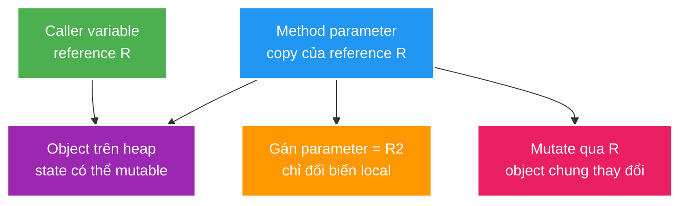

# Java Language, Object Semantics and Generics

> Type: `CORE`<br>
> Domain: `java`<br>
> Target depth: `D3 — giải thích được type/object semantics, thiết kế value object và tái hiện lỗi equality/generics trên code thật`<br>
> Teaching readiness: `TEACHABLE_DRAFT`<br>
> Status: `DRAFT`<br>
> Evidence status: `NOT RUN`<br>
> Prerequisites: [Java 21 platform baseline](java21-platform-baseline.md)<br>
> Related cases: [JDK-01](../../../../cases/jdk-01-java21-platform-baseline.md), [`GIFT-UC-01`](../../../../use-case-catalog.md#gift-uc-01)<br>
> Owner: `Project learner; Codex assists`<br>
> Updated: `2026-07-26`

Artifact này là source canonical cho [question bank cùng tên](../../question-bank/language-object-semantics-and-generics.md). Nó không chứng minh `JAVA-01` đã hoàn tất; learner write-back, test và project evidence vẫn chưa có.

## 0. Cách dùng tài liệu này

Tài liệu dành cho developer đã viết Java nhưng vẫn dễ nhầm “object được truyền by reference”, dùng `equals/hashCode` theo thói quen hoặc học thuộc PECS mà chưa hiểu type safety. Đọc từ mục 1 đến 11, sau đó mới viết learner section. Thời gian đọc khoảng 60–90 phút.

Mục tiêu không phải học thuộc toàn bộ JLS. Bạn cần hình dung được ba lớp: biến giữ **value**, reference value có thể trỏ tới **object**, còn generic type chỉ cho compiler biết operation nào an toàn. Khi ba lớp này bị trộn, lỗi thường xuất hiện ở collection, persistence hoặc serialization boundary.

## 1. Learning objectives

Sau topic này, tôi có thể:

1. Phân biệt value, reference, object identity, logical equality và Java pass-by-value.
2. Thiết kế immutable value object có `equals/hashCode` ổn định và boundary validation rõ.
3. Giải thích invariance, wildcard, type erasure và nhận diện heap pollution/raw-type escape.

## 2. Mental model cốt lõi — phần Agent dạy

Java luôn copy **giá trị của biến** khi gọi method. Với primitive, giá trị đó là số/boolean/char. Với reference type, giá trị được copy là một reference; caller và callee có thể có hai biến khác nhau cùng trỏ một object.



Identity trả lời “có phải cùng object không?”. Logical equality trả lời “theo business/type contract, hai object có cùng giá trị không?”. Hash collection cần equality và hash ổn định trong thời gian membership.

Generics tạo một “hàng rào compile-time”. `List<Integer>` không phải `List<Number>` vì write operation có thể đưa `Double` vào list chỉ chấp nhận `Integer`. Wildcard mô tả quyền đọc/ghi ở API boundary; erasure giải thích vì sao runtime không còn đầy đủ type argument và unchecked boundary có thể làm lỗi xuất hiện muộn.

> **Câu cần nhớ:** Java copy variable values; equality là contract của type; generics giới hạn operation an toàn ở compile time nhưng raw/unchecked boundary có thể phá hàng rào đó.

## 3. Cơ chế hoạt động

Java luôn truyền **giá trị**. Với primitive, giá trị được copy là primitive value; với reference type, giá trị được copy là reference tới object. Gán lại parameter không đổi reference của caller, nhưng mutate object qua copied reference có thể làm caller quan sát thấy state mới.

Mỗi object có identity; `==` trên reference hỏi hai reference có trỏ cùng object không. `equals` mô tả logical equality do type định nghĩa. Khi override `equals`, phải giữ reflexive, symmetric, transitive, consistent và false với `null`; object bằng nhau phải có cùng `hashCode`.

Generics chủ yếu được kiểm tra ở compile time. `List<Integer>` không phải subtype của `List<Number>` vì nếu cho phép, caller có thể thêm `Double` vào list thực chất chỉ chứa `Integer`. Wildcard diễn đạt quyền: `? extends T` phù hợp để đọc `T`, `? super T` phù hợp để ghi `T`; mnemonic PECS chỉ là hệ quả của type safety, không phải luật thay thế reasoning.

Type erasure xóa phần lớn type argument khỏi runtime representation, thêm cast/bridge method khi cần. Vì vậy không thể `new T()`, không thể tạo generic array an toàn theo cách trực tiếp và overload chỉ khác type argument sẽ đụng erasure.

Records diễn đạt data carrier với state description và generated accessors/equality; chúng không tự làm object graph sâu bên trong immutable. Sealed types giới hạn subtype set, hữu ích khi domain state/command có tập biến thể đóng.

### Worked example 1 — gán lại reference khác với mutate object

```java
static void change(List<String> names) {
    names.add("viewer-2");       // mutate object chung
    names = new ArrayList<>();   // chỉ gán lại parameter local
    names.add("viewer-3");
}
```

Caller thấy `viewer-2` vì cả hai reference từng trỏ cùng list. Caller không thấy `viewer-3` vì parameter đã được gán sang list mới. Đây là pass-by-value của reference, không phải pass-by-reference.

### Worked example 2 — value object bảo vệ business meaning

```java
public record StreamId(long value) {
    public StreamId {
        if (value <= 0) throw new IllegalArgumentException("streamId must be positive");
    }
}
```

So với truyền `long` cho mọi ID, `StreamId` ngăn trộn user ID với stream ID ở compile time và đặt validation tại creation boundary. Record tạo equality theo components, phù hợp khi components thực sự đại diện toàn bộ value semantics.

### Worked example 3 — hiểu PECS từ allowed operations

```java
static double sum(List<? extends Number> values) {
    return values.stream().mapToDouble(Number::doubleValue).sum();
}

static void addDefaults(List<? super Integer> target) {
    target.add(0);
}
```

`? extends Number` có unknown subtype nên đọc ra tối thiểu là `Number`, nhưng không thể thêm một `Integer` vì list thật có thể là `List<Double>`. `? super Integer` cho phép thêm `Integer`; khi đọc chỉ chắc chắn nhận `Object`. PECS là bản tóm tắt của reasoning này.

### Phản ví dụ — record chứa mutable list

`record ViewerBatch(List<Long> ids)` chỉ làm reference component final. Nếu constructor giữ nguyên mutable list từ caller, caller có thể `add` sau khi record được tạo; equality/hash/serialized value của record thay đổi. Defensive copy bằng `List.copyOf` mới bảo vệ shallow collection boundary.

## 4. Invariant và boundary

1. Field tham gia equality/hash phải ổn định trong suốt thời gian object nằm trong hash-based collection.
2. Value object phải canonicalize/validate tại creation boundary; không để hai representation khác nhau mang cùng business meaning mà equality lại khác.
3. Generic API không được đưa raw/unchecked value ra consumer mà không có checked boundary.
4. JPA entity identity, lifecycle/proxy và generated database ID là boundary khác value-object equality; không copy một equality strategy cho mọi entity.

## 5. Thuật ngữ và distinction

| Thuật ngữ | Định nghĩa ngắn | Dễ nhầm với | Điểm phân biệt |
| --- | --- | --- | --- |
| Identity | Object instance cụ thể | Equality | Hai object khác identity vẫn có thể logically equal |
| Immutability | Observable state không đổi sau construction | `final` reference | `final` không làm object được trỏ tới immutable |
| Invariance | `G<A>` và `G<B>` không có subtype relation chỉ vì `A <: B` | Covariance | Java dùng wildcard để mô tả variance tại use site |
| Erasure | Runtime representation xóa đa số type argument | Reification | Array reified component type; generic type argument thường không |
| Heap pollution | Variable parameterized type trỏ tới value sai type contract | Ordinary cast failure | Thường bắt đầu từ raw type, unchecked cast hoặc generic varargs |

## 6. Misconceptions

| Misconception | Vì sao sai | Counterexample/evidence |
| --- | --- | --- |
| Java truyền object by reference | Java copy reference value | Gán `param = new X()` không đổi reference của caller |
| Override `equals` là đủ | Hash collection dùng cả hash và equality | Equal objects khác hash có thể không được tìm thấy đúng bucket |
| Record luôn immutable | Component có thể trỏ mutable list/entity | Mutate component làm observable record state thay đổi |
| `? extends T` là read-only collection | Không thêm `T` được, nhưng source/captured object vẫn có thể mutate | `clear()` và external mutation vẫn có thể xảy ra |
| Generics đảm bảo runtime type safety tuyệt đối | Raw type/unchecked boundary có thể phá contract | Failure xuất hiện muộn tại compiler-inserted cast |

## 7. Failure modes kinh điển

**Mutable hash key:** object được insert với hash H1 vào bucket tương ứng. Sau mutation, `hashCode()` trả H2; lookup đi bucket H2 và không thấy entry vẫn nằm ở bucket H1. Collection không tự “reindex” khi field đổi.

**Heap pollution:** raw/unchecked code đưa value sai type vào generic container. Write có thể không fail vì runtime container chỉ thấy raw `List`; failure xuất hiện khi typed consumer đọc và compiler-inserted cast chạy. Nơi throw exception khác nơi contract bị phá.

Bảng dưới cô đọng các failure sau khi đã hiểu hai causal story:

| Failure | Trigger | Observable symptom | Root mechanism |
| --- | --- | --- | --- |
| Mutable hash key | Field trong `hashCode` đổi sau `put` | `contains/get/remove` trả sai | Object nằm ở bucket theo hash cũ |
| Asymmetric equality | Base/subclass dùng tiêu chí khác | Kết quả phụ thuộc chiều gọi | Liskov/equality contract bị phá |
| Shallow immutable DTO | Expose mutable component | Cache/audit value đổi ngoài ý muốn | Defensive copy thiếu |
| Heap pollution | Raw list/generic varargs/cast | `ClassCastException` ở xa nguồn | Compile-time guarantee bị bypass |
| Entity recursion | Lombok-generated equality/toString qua relation/proxy | Stack overflow/query ngoài ý muốn | Generated object semantics không khớp persistence lifecycle |

## 8. Solution patterns

Không có một equality strategy cho mọi class. Value object thường dùng immutable components và structural equality. Entity cần policy dựa trên lifecycle/identity; DTO cần defensive copy tại trust boundary. Generic adapter phải cô lập raw/unchecked operation và validate trước khi trả typed value cho core.

| Pattern | Bảo vệ điều gì | Giới hạn | Khi nên dùng |
| --- | --- | --- | --- |
| Immutable value object | Equality/invariant ổn định | Cần conversion/serialization rõ | Money, StreamId, typed token kind |
| Static factory/canonical constructor | Validation/canonicalization một chỗ | Có thể tăng type count | Representation có business rule |
| Explicit equality fields | Tránh generated semantics ngoài ý muốn | Phải review lifecycle | Value/entity có identity rule rõ |
| Bounded wildcard | Type-safe reuse | Signature khó đọc nếu lạm dụng | Producer/consumer API |
| Defensive copy | Chặn external mutation | Allocation cost | Collection/array đi qua trust boundary |

## 9. Trade-off matrix

| Option | Correctness | Complexity | Performance | Security/operability | Cost/evolution |
| --- | --- | --- | --- | --- | --- |
| Primitive/String everywhere | Invariant yếu, dễ trộn meaning | Ban đầu thấp | Ít allocation | Audit khó vì semantic mơ hồ | Refactor lan rộng |
| Domain value objects | Invariant/equality rõ | Thêm type/mapping | Allocation thường chấp nhận được | Validation/redaction tập trung | Dễ đổi rule có chủ đích |
| Inheritance hierarchy mở | Dễ extension nhưng equality/exhaustiveness khó | Vừa/cao | Thường không quyết định | Khó audit variant | Binary/source evolution linh hoạt hơn |
| Sealed hierarchy | Exhaustive reasoning tốt | Tập subtype đóng | Tương đương | Review state/command rõ | Thêm variant cần sửa owner module |

## 10. Deep-dive: internals và cross-layer interaction

- [Equality, erasure, variance và mutable hash keys](../deep-dives/equality-erasure-variance-and-mutable-keys.md).
- Persistence boundary: entity/proxy/database identity không đồng nhất với domain value equality.
- Serialization boundary: constructor/field evolution có thể phá compatibility dù Java type vẫn compile.

## 11. Liên hệ learning case

| Case | Theory được áp dụng | Project detail chỉ giữ ở case |
| --- | --- | --- |
| `GIFT-UC-01` | Immutable Money, equality và canonical scale | Wallet schema, request DTO, transaction path |
| `VIEWCOUNT-UC-01` | Value/reference mutation và collection membership | Counter implementation/workload |
| `AUTHZ-UC-01` | Typed role/owner identifiers | Current endpoint/security matcher |

## 12. Góc nhìn phỏng vấn

### Câu trả lời 30 giây

“Java luôn pass-by-value; với object, value được copy là reference. `==` so identity, `equals` định nghĩa logical equality và equal objects phải có cùng hash. Generics là compile-time type safety, invariant theo mặc định; wildcards diễn đạt read/write capability và erasure làm type arguments phần lớn không reified ở runtime.”

### Outline Senior khoảng 2 phút

1. Minh họa reference copy bằng reassign và mutation.
2. Nêu equality/hash contract cùng mutable-key failure.
3. Phân biệt value-object equality với entity lifecycle/proxy identity.
4. Giải thích invariance từ write-safety, rồi suy ra `extends/super`.
5. Nêu erasure/unchecked boundary và heap pollution failure location.

## 13. Tóm tắt cô đọng

1. Method nhận bản copy của variable value; reference copy vẫn có thể trỏ cùng mutable object.
2. `==` trên reference so identity; `equals` là logical contract.
3. Equal objects phải cùng hash; fields tham gia hash phải ổn định khi object ở hash collection.
4. `final` reference và record không tạo deep immutability.
5. Generic classes invariant để bảo vệ cả read và write operation.
6. `extends` chủ yếu cho typed read, `super` cho typed write; hãy reason từ allowed operations.
7. Erasure làm lỗi từ raw/unchecked boundary có thể xuất hiện muộn tại typed read.
8. Value object, entity và DTO có lifecycle/boundary khác nên không dùng cùng equality template máy móc.

## 14. Bài tập diễn đạt lại — phần của tôi

Viết 10–15 câu: mô tả reference copy; phân biệt identity/equality; kể mutable-key causal chain; giải thích invariance và một wildcard signature; nêu erasure boundary; chọn equality strategy cho một `Money` value object và một generated-ID entity.

> **Bài viết của tôi — `LEARNER TODO`:** lần đầu được nhìn mục 13; lần sau đóng file và nói lại khoảng hai phút.

## 15. Self-check có hướng dẫn

1. **Question:** Java pass-by-value giải thích thế nào khi method mutate được object của caller?<br>
   **Đọc lại nếu bí:** mục 2 và worked example 1.<br>
   **Một câu trả lời tốt phải có:** copy reference value, shared object, reassign khác mutation.<br>
   **My answer:** `LEARNER TODO`
2. **Question:** Vì sao mutable JPA entity hoặc mutable key trong `HashSet` dễ gây lỗi khó debug?<br>
   **Đọc lại nếu bí:** mục 4 và 7.<br>
   **Một câu trả lời tốt phải có:** stable hash membership, lifecycle/proxy boundary và symptom lookup sai.<br>
   **My answer:** `LEARNER TODO`
3. **Question:** Thiết kế signature đọc từ subtype và ghi vào supertype bằng wildcard thế nào, và giới hạn của PECS là gì?<br>
   **Đọc lại nếu bí:** worked example 3.<br>
   **Một câu trả lời tốt phải có:** allowed read/write operations, unknown captured type và `Object` read từ `super`.<br>
   **My answer:** `LEARNER TODO`

## 16. Official references

- [Java Language Specification 21](https://docs.oracle.com/javase/specs/jls/se21/html/)
- [JLS 4 — Types, Values, and Variables](https://docs.oracle.com/javase/specs/jls/se21/html/jls-4.html)
- [JLS 8 — Classes](https://docs.oracle.com/javase/specs/jls/se21/html/jls-8.html)
- [JLS 18 — Type Inference](https://docs.oracle.com/javase/specs/jls/se21/html/jls-18.html)
- [JEP 395 — Records](https://openjdk.org/jeps/395)

## 17. Teach-back checklist

- [ ] Tôi giải thích được Java pass-by-value bằng object/reference diagram.
- [ ] Tôi bảo vệ được equality/hash strategy cho value object và entity.
- [ ] Tôi dùng wildcard từ quyền đọc/ghi thay vì học thuộc PECS máy móc.
- [ ] Tôi tái hiện được mutable-key hoặc heap-pollution failure bằng test nhỏ.
- [ ] Tôi link được claim D3 tới test/case thật; hiện tại evidence vẫn `NOT RUN`.
