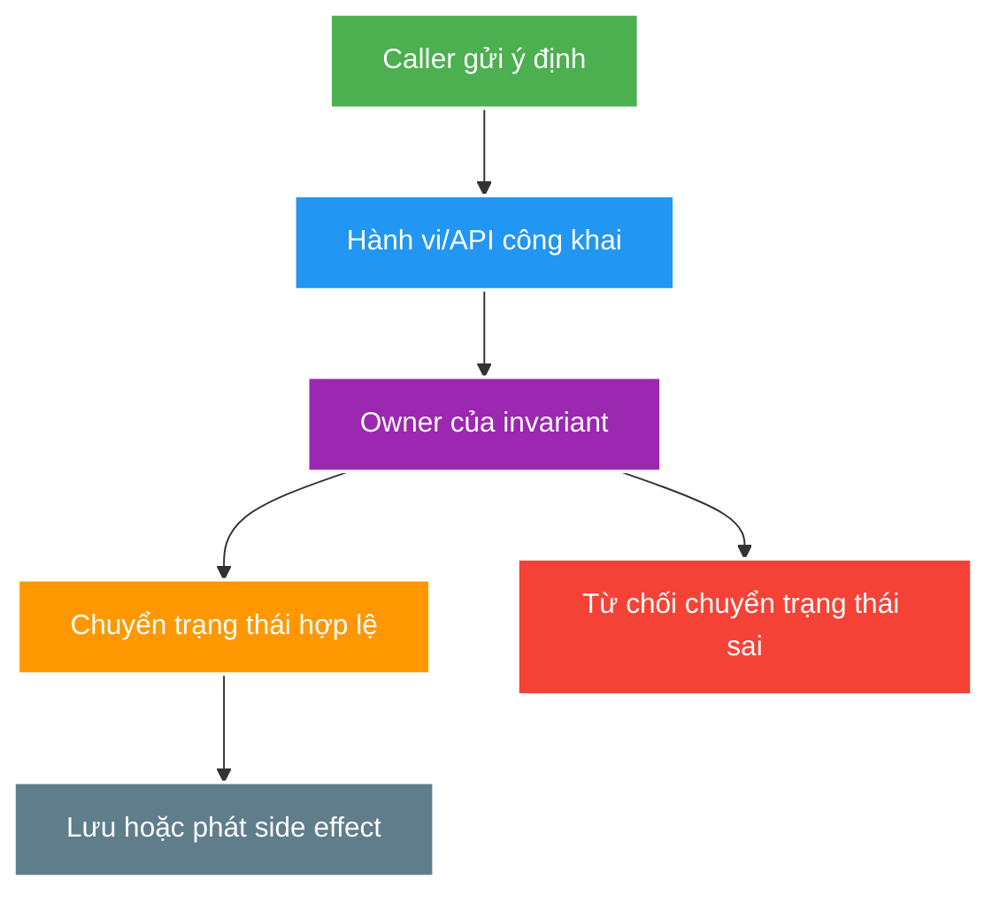

# Object-Oriented Design, SOLID and Patterns

> Type: `CORE` 
> Domain: `java` 
> Target depth: `D3 — refactor một boundary thật, giữ behavior bằng test và bảo vệ trade-off thay vì gọi tên pattern` 
> Teaching readiness: `TEACHABLE_DRAFT` 
> Status: `DRAFT` 
> Evidence status: `NOT RUN` 
> Prerequisites: [Object semantics and generics](language-object-semantics-and-generics.md) 
> Related cases: [`STREAM-UC-01`](../../../../use-case-catalog.md#31-foundation-và-senior-cases), [`PAYOUT-UC-01`](../../../../use-case-catalog.md#31-foundation-và-senior-cases) 
> Owner: `Project learner; Codex assists` 
> Updated: `2026-07-26`

Source canonical cho [OOD question bank](../../question-bank/object-oriented-design-solid-and-patterns.md). Pattern name không phải learning evidence; design chỉ có giá trị khi invariant, coupling và change cost được làm rõ.

## 0. Cách học file này

Đừng bắt đầu bằng acronym SOLID hoặc pattern catalog. Chọn một business rule, chỉ ra state nào được phép chuyển, ai sở hữu rule, rồi thử thay một requirement. Thiết kế tốt khi thay đổi có blast radius dự đoán được và caller khó tạo state sai; số class/interface không phải thước đo.

## 1. Learning objectives

1. Dùng encapsulation, cohesion, coupling và dependency direction để bảo vệ invariant/change boundary.
2. Áp dụng SOLID như diagnostic heuristics, không như luật tăng số interface/class.
3. Chọn composition/inheritance và pattern từ variability/failure/testability cụ thể.

## 2. Mental model do người dạy cung cấp

Object/module là một **boundary sở hữu quyết định**. Nó nhận command hợp lệ, kiểm tra invariant và tạo state transition; representation nội bộ không phải thứ caller tùy ý sửa. SOLID giúp chẩn đoán khi boundary có quá nhiều lý do thay đổi, subtype phá contract hoặc policy phụ thuộc detail. Pattern chỉ là tên cho một cách sắp xếp đã chứng minh phù hợp với force cụ thể.

## 3. Cơ chế hoạt động

Encapsulation là kiểm soát state transition qua behavior/API; `private` field cộng getter/setter cho mọi thứ chưa chắc bảo vệ gì. Cohesion hỏi các responsibility có cùng lý do thay đổi không. Coupling gồm compile-time dependency, runtime coordination, shared data và temporal ordering.

SRP tập trung reason to change; OCP yêu cầu extension point ở variability đã biết, không dự đoán mọi tương lai; LSP yêu cầu subtype giữ behavioral contract; ISP tránh ép consumer phụ thuộc capability không dùng; DIP hướng high-level policy tới abstraction tại boundary cần thay thế.

Composition thường làm dependency/ownership rõ và tránh fragile base-class contract. Inheritance phù hợp khi có substitutability thật và invariant chung ổn định. Pattern là vocabulary cho recurring force: Strategy cho policy thay đổi, State cho transition, Decorator cho behavior composition, Adapter cho boundary, Factory cho creation rule. Pattern không xóa failure/cost.

### 3.1. Worked example — encapsulation thật

Một `LiveStream` có setter `setStatus` công khai cho phép caller nhảy từ `CREATED` thẳng sang `ENDED`. Encapsulation tốt hơn là `start(now)` và `end(now)`: object kiểm tra current state, cập nhật timestamp liên quan và từ chối transition sai. `private` field chỉ che dữ liệu; behavior mới bảo vệ invariant.

### 3.2. Worked example — Strategy có lý do tồn tại

Nếu gift fee có policy khác nhau theo campaign/region và được chọn runtime, `FeePolicy` giúp cô lập variability, test từng policy và giữ application flow ổn định. Nếu hệ thống luôn có đúng công thức cố định, tạo interface + factory + một implementation chỉ tăng navigation. OCP không yêu cầu đoán mọi extension tương lai.

### 3.3. LSP bằng contract

Nếu base `NotificationSender.send` hứa “trả về khi message đã được durable accept”, subtype chỉ ghi log rồi trả về đã phá postcondition dù type compile. Test contract dùng chung cho mọi implementation mới là bằng chứng substitutability; inheritance syntax không chứng minh LSP.

## 4. Invariant và boundary

1. Một business invariant phải có owner rõ; không phân tán check ở controller/cache/consumer.
2. Abstraction nằm ở volatility/trust boundary thật, không mặc định tạo interface cho mọi class.
3. Public API của module không expose persistence/framework detail nếu consumer không cần.
4. Refactor phải giữ observable behavior bằng characterization/regression tests.

## 5. Thuật ngữ và distinction

| Thuật ngữ | Định nghĩa | Dễ nhầm | Phân biệt |
| --- | --- | --- | --- |
| Encapsulation | Bảo vệ invariant qua API/behavior | Information hiding | Hiding hỗ trợ nhưng không đủ |
| Cohesion | Responsibility cùng purpose/change reason | Small class | Class nhỏ vẫn có thể incoherent |
| Coupling | Chi phí phối hợp/thay đổi giữa components | Dependency count | Một shared DB/temporal contract có coupling cao dù ít import |
| Abstraction | Contract che detail tại boundary | Interface | Interface không tự tạo abstraction tốt |
| Pattern | Giải pháp có force/trade-off lặp lại | Template | Phải fit context, không copy structure |

## 6. Misconceptions

| Misconception | Vì sao sai | Counterexample |
| --- | --- | --- |
| SOLID nghĩa là nhiều interface | Indirection không có variability tăng cost | One implementation/pass-through interface |
| Anemic model luôn xấu | Application/domain complexity khác nhau | CRUD/read model có thể hợp lý |
| Composition luôn tốt hơn inheritance | Delegation graph cũng có cost | Stable closed hierarchy/sealed type |
| Pattern làm code senior hơn | Pattern không có problem chỉ là ceremony | Strategy cho một fixed behavior |
| Microservice giảm coupling | Network/data/operation coupling có thể tăng | Shared DB và synchronous call chain |

## 7. Failure modes kinh điển

`GodService` thường hình thành khi một class vừa sở hữu policy, transaction, mapping và integration. Mỗi thay đổi chạm nhiều concern, test phải mock cả thế giới và failure khó quy owner. Ngược lại, chia quá sớm thành interface/class pass-through làm call graph dài mà invariant vẫn phân tán. Điểm tách đúng nằm ở reason-to-change hoặc trust/volatility boundary quan sát được.

| Failure | Trigger | Symptom | Root mechanism |
| --- | --- | --- | --- |
| God service | Nhiều policy/integration/state owner | Change/test blast radius lớn | Cohesion thấp |
| Shotgun change | Một rule nằm nhiều layer | Sót path/behavior drift | Invariant không có owner |
| Fragile inheritance | Base hook/order thay | Subclass regression | Hidden temporal contract |
| Leaky abstraction | Domain API expose JPA/cache/client | Consumer phụ thuộc implementation | Boundary đặt sai |
| Pattern ceremony | Factory/strategy/decorator không có variation | Navigation/wiring khó | Abstraction trước problem |

## 8. Solution patterns

| Pattern | Bảo vệ | Giới hạn | Khi dùng |
| --- | --- | --- | --- |
| Value object | Local invariant/equality | Mapping overhead | Money/typed identifier |
| State machine | Valid transition/exhaustiveness | Transition model phải rõ | Stream/session lifecycle |
| Strategy | Policy variability | Indirection | Retry/ranking/moderation policy |
| Adapter/anti-corruption layer | External contract isolation | Translation cost | Media/payment/IdP boundary |
| Hexagonal/module boundary | Dependency direction/testability | Có thể over-engineer CRUD | Core policy cần cô lập khỏi framework |

## 9. Trade-off matrix

| Option | Correctness | Complexity | Performance | Operability | Evolution |
| --- | --- | --- | --- | --- | --- |
| Transaction script | Rule dễ thấy khi nhỏ | Thấp | Direct | Dễ trace | Khó khi invariant phân tán |
| Rich domain model | Invariant gần state | Vừa/cao | Mapping/indirection | Cần observability xuyên layer | Tốt cho domain phức tạp |
| Modular service layer | Boundary explicit | Vừa | Predictable | Deploy đơn giản | Tốt trước khi tách service |
| Framework-centric model | Integration nhanh | Thấp ban đầu | Framework optimized | Upgrade/test coupling | Domain portability kém |

## 10. Deep-dive

Không tách deep-dive riêng trong Batch 1. Internals cụ thể được đào ở state/concurrency, Spring proxy, transaction và DDD stages; file này giữ decision vocabulary dùng lại.

## 11. Liên hệ learning case

| Case | Áp dụng | Detail giữ ở case |
| --- | --- | --- |
| `STREAM-UC-01` | State owner/valid transition | Current stream service/repository |
| `PAYOUT-UC-01` | Aggregate/value object/policy boundary | Ledger and settlement workflow |
| `MS-UC-01` | Module boundary/coupling scorecard | Extraction evidence |

## 12. Interview answer outline

Mở đầu bằng invariant/change boundary, không đọc SOLID. Nêu một ví dụ transition, giải thích abstraction xuất hiện vì variability thật, so composition/inheritance bằng ownership và behavioral contract, rồi nói cách giữ behavior bằng test. Nếu dùng pattern, luôn nói force, cost và phương án đơn giản hơn.

## 13. Tóm tắt và learner write-back

- Encapsulation bảo vệ state transition, không đồng nghĩa getter/setter.
- Cohesion và coupling đo lý do thay đổi/phối hợp, không chỉ kích thước/import.
- SOLID là heuristic chẩn đoán, không phải quota interface.
- Pattern đáng dùng khi force lặp lại đủ rõ và trade-off được chấp nhận.

`LEARNER TODO — chọn một service hiện tại, ghi invariant owner, hai reasons to change và một refactor hypothesis; chưa sửa code.`

## 14. Guided self-check

1. **Question:** Encapsulation khác `private` fields và getters/setters thế nào? **Đọc lại nếu bí:** mục 2–3.1. **Rubric:** nói public behavior, valid transition và impossibility/guard của invalid state. **My answer:** `LEARNER TODO`
2. **Question:** Khi nào Strategy giảm change cost, khi nào chỉ tăng ceremony? **Đọc lại nếu bí:** mục 3.2, 6 và 9. **Rubric:** có runtime/known variability, independent tests; contrast fixed behavior/pass-through abstraction. **My answer:** `LEARNER TODO`
3. **Question:** Chứng minh LSP bằng contract/test ra sao? **Đọc lại nếu bí:** mục 3.3. **Rubric:** precondition không mạnh hơn, postcondition/invariant giữ nguyên và contract test dùng chung. **My answer:** `LEARNER TODO`

## 15. Official references

- [JLS 8 — Classes](https://docs.oracle.com/javase/specs/jls/se21/html/jls-8.html)
- [JLS 9 — Interfaces](https://docs.oracle.com/javase/specs/jls/se21/html/jls-9.html)
- [JEP 409 — Sealed Classes](https://openjdk.org/jeps/409)
- [JEP 395 — Records](https://openjdk.org/jeps/395)

## 16. Teach-back checklist

- [ ] Tôi xác định được invariant owner và reason to change.
- [ ] Tôi dùng SOLID để chỉ ra force/trade-off, không recite acronym.
- [ ] Tôi so sánh composition/inheritance trên behavioral contract.
- [ ] Tôi chỉ dùng pattern khi có variability/failure cụ thể.
- [ ] Refactor/project evidence vẫn `NOT RUN`.
