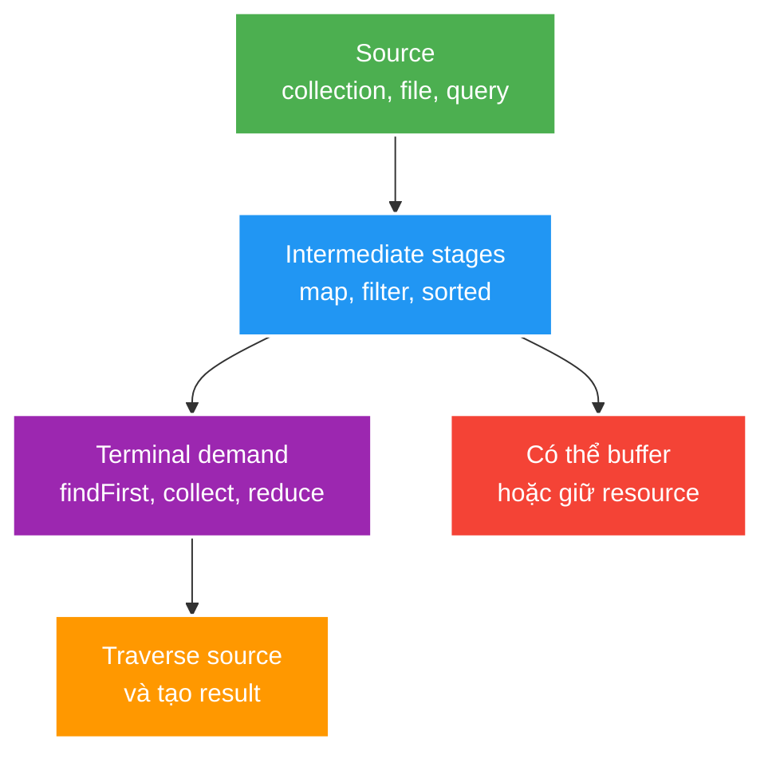

# Stream API, Functional Programming and Optional

> Type: `CORE`<br>
> Domain: `java`<br>
> Target depth: `D3 — thiết kế pipeline đúng semantics, phát hiện side effect/N+1/materialization và đo trước khi parallelize`<br>
> Teaching readiness: `TEACHABLE_DRAFT`<br>
> Status: `DRAFT`<br>
> Evidence status: `NOT RUN`<br>
> Prerequisites: [Collections and complexity](collections-data-structures-and-complexity.md)<br>
> Related cases: [`FEED-UC-01`](../../../../use-case-catalog.md#31-foundation-và-senior-cases), [`ANALYTICS-UC-01`](../../../../use-case-catalog.md#analytics-uc-01)<br>
> Owner: `Project learner; Codex assists`<br>
> Updated: `2026-07-26`

Source canonical cho [Stream/Optional question bank](../../question-bank/stream-api-functional-programming-and-optional.md). Pipeline đẹp về cú pháp không phải evidence về performance hoặc correctness.

## 0. Cách học file này

Hãy đọc một pipeline như một execution plan, không như chuỗi method “đẹp”. Luôn tìm source, terminal operation, dữ liệu phải buffer, side effect và resource owner. Sau đó viết lại cùng logic bằng loop; nếu không giải thích được hai phiên bản có semantics giống nhau ở đâu thì chưa nên tối ưu hoặc parallelize.

## 1. Learning objectives

1. Giải thích functional interface, lazy pipeline, encounter order, stateful/stateless operation và collector contract.
2. Dùng `Optional` để mô tả absence tại return boundary, không biến nó thành null wrapper ở mọi field/parameter.
3. Quyết định loop, sequential stream, parallel stream hoặc database operation dựa trên workload và side-effect boundary.

## 2. Mental model do người dạy cung cấp

Stream là một **bản mô tả đường ống xử lý**, chưa phải kết quả. Source cung cấp phần tử; intermediate operation ghép thêm stage; terminal operation mới kéo dữ liệu chạy qua pipeline. Stateless stage như `map`/`filter` thường xử lý từng phần tử, còn stateful stage như `sorted`/`distinct` phải nhớ dữ liệu. Vì thế cùng cú pháp fluent nhưng memory và khả năng short-circuit rất khác nhau.



## 3. Cơ chế hoạt động

Stream không phải collection; nó là mô tả một computation trên source, thường chỉ chạy khi terminal operation yêu cầu. Intermediate operations có thể được fuse, short-circuit hoặc reorder trong giới hạn semantic contract. Stream thường single-use.

Behavioral parameters nên non-interfering và stateless để pipeline đúng khi implementation thay đổi execution strategy. Stateful operations như `sorted`/`distinct` có thể buffer dữ liệu; `limit`, `findFirst` và encounter order ảnh hưởng khả năng short-circuit/parallelize.

Collector gồm supplier, accumulator, combiner và finisher cùng characteristics. Collector dùng song song chỉ đúng nếu identity/associativity và concurrency/ordering contract phù hợp.

`Optional<T>` là value-based container cho present/absent return. `map` giữ một layer; `flatMap` dùng khi mapper đã trả `Optional`. `orElse` evaluate argument eagerly, còn `orElseGet` lazy. Optional không thay validation, error semantics hoặc collection rỗng.

### 3.1. Worked example — laziness và short-circuit

```java
Optional<StreamSummary> firstLive = streams.stream()
        .filter(StreamSummary::isLive)
        .map(this::enrichInMemory)
        .findFirst();
```

Pipeline có thể dừng sau phần tử live đầu tiên. Nhưng nếu đặt `.sorted(...)` trước `findFirst`, implementation thường phải thu thập và sắp xếp source trước khi biết “đầu tiên”. Lazy không đồng nghĩa memory O(1), và short-circuit phía sau không xóa cost của stateful stage phía trước.

### 3.2. Worked example — `orElse` và `orElseGet`

```java
Session session = cached.orElse(loadFromDatabase());
Session session = cached.orElseGet(this::loadFromDatabase);
```

Java evaluate argument trước khi gọi method, nên dòng đầu vẫn chạy fallback dù `cached` có value. Đây là semantic ngôn ngữ chứ không phải tối ưu nhỏ; fallback có side effect có thể tạo behavior sai.

### 3.3. Counterexample — pipeline che N+1

`viewerIds.stream().map(repository::findById).toList()` nhìn gọn nhưng thực hiện một query cho mỗi ID rồi materialize toàn bộ kết quả. Đổi sang parallel stream còn có thể dồn tải lên connection pool. Giải pháp thường là query set-based (`WHERE id IN ...`) theo batch có bound, không phải thêm thread.

## 4. Invariant và boundary

1. Pipeline không mutate source/shared state ngoài explicit, reviewed boundary.
2. Resource-backed stream phải được close trong owner scope; không trả lazy stream vượt transaction/resource lifetime.
3. Absence, failure và empty collection là ba semantics khác nhau.
4. Parallelism chỉ được chọn khi function associative/non-interfering, data đủ lớn và executor/downstream không bị oversubscribe.

## 5. Thuật ngữ và distinction

| Thuật ngữ | Định nghĩa | Dễ nhầm | Phân biệt |
| --- | --- | --- | --- |
| Lazy | Chưa traverse cho tới terminal demand | Cached | Mỗi terminal operation trên stream mới/nguồn có thể chạy lại |
| Encounter order | Order do source/pipeline định nghĩa | Sorted order | Ordered không nhất thiết sorted |
| Short-circuit | Có thể kết thúc không đọc hết source | Lazy | Không phải mọi lazy operation short-circuit |
| Non-interference | Không sửa source trong lúc pipeline chạy | Thread-safe | Sequential pipeline vẫn có thể bị interference |
| Optional absence | Không có value bình thường | Exceptional failure | Không nuốt lỗi thành empty tùy tiện |

## 6. Misconceptions

| Misconception | Vì sao sai | Counterexample |
| --- | --- | --- |
| Stream luôn nhanh hơn loop | Có abstraction/allocation và cùng algorithmic cost | Hot small loop có thể nhanh, rõ hơn |
| `parallelStream()` tự tăng throughput | Dùng common pool, split/merge overhead và shared bottleneck | Blocking DB call/N+1 làm tệ hơn |
| Stream không có side effect | `peek`, mapper hoặc collector có thể mutate | Shared list/counter gây race |
| Optional nên dùng cho mọi field/parameter | Framework/serialization/entity semantics xấu đi | Return boundary thường phù hợp hơn |
| `orElse` lazy | Argument được evaluate trước call | Expensive fallback vẫn chạy khi value present |

## 7. Failure modes kinh điển

Đọc failure theo chuỗi nguyên nhân: source lớn + terminal `toList` → mọi phần tử sống cùng lúc → allocation/GC tăng; mapper gọi I/O → latency nhân theo số phần tử; shared accumulator + parallel execution → update không atomic hoặc thứ tự không xác định. Stream không tạo ra các lỗi này, nhưng fluent syntax có thể làm boundary I/O/state khó nhìn thấy.

| Failure | Trigger | Symptom | Root mechanism |
| --- | --- | --- | --- |
| Hidden N+1 | Mapper gọi repository/lazy relation | Query count/latency tăng | Pipeline che I/O per element |
| Unbounded collect | `.toList()` trên source lớn | Heap/GC spike | Materialize toàn bộ result |
| Parallel side effect | Shared mutable accumulator | Missing/duplicate result | Non-associative/non-thread-safe behavior |
| Common-pool starvation | Blocking I/O trong parallel/CF default pool | Unrelated task latency | Shared finite pool bị block |
| Resource leak | Files/JPA-backed stream không close | FD/connection leak | Lazy resource owner không rõ |

## 8. Solution patterns

| Pattern | Bảo vệ | Giới hạn | Khi dùng |
| --- | --- | --- | --- |
| Pure map/filter/reduce | Composability/correctness | Không phù hợp mọi control flow | In-memory transformation bounded |
| Domain collector | Aggregate invariant rõ | Phải chứng minh associativity | Group/aggregate reusable |
| Explicit loop | Control flow/resource/error rõ | Verbose hơn | Complex branching/hot path |
| Set-based DB query | Tránh N+1/materialization | SQL/query ownership | Data lớn nằm ở database |
| Optional at lookup return | Absence explicit | Không mô tả failure detail | Repository/cache lookup |

## 9. Trade-off matrix

| Option | Correctness | Complexity | Performance | Operability | Evolution |
| --- | --- | --- | --- | --- | --- |
| Loop | Explicit state/order | Dễ dài | Predictable, dễ benchmark | Stack trace rõ | Dễ thêm branching |
| Sequential stream | Declarative composition | Vừa | Tốt cho bounded transformations | Pipeline có thể che I/O | Dễ reuse function |
| Parallel stream | Cần strong algebraic assumptions | Cao | Chỉ tốt khi split/CPU/data phù hợp | Common-pool/debug khó | Context propagation khó |
| Push-down DB/broker | Cross-layer contract | Cao hơn | Giảm transfer/materialization | Có query/lag metric | Phụ thuộc capability backend |

## 10. Deep-dive

- [Laziness, collectors, parallelism and resource lifecycle](../deep-dives/stream-laziness-collectors-parallelism-and-resources.md).
- Async composition thuộc [Executors and CompletableFuture](executors-completablefuture-and-concurrency-control.md), không đồng nhất với Stream API.

## 11. Liên hệ learning case

| Case | Áp dụng | Detail giữ ở case |
| --- | --- | --- |
| `FEED-UC-01` | Mapping/bounded materialization/N+1 | Query and pagination evidence |
| `ANALYTICS-UC-01` | Associative aggregation và replay-safe projection | Event/storage topology |
| `NOTIFY-UC-01` | Batch/filter/preference processing | Fan-out/broker workload |

## 12. Interview answer outline

**30 giây:** “Stream là lazy computation description; terminal operation mới traverse. Tôi phân biệt stateless/stateful, short-circuit và encounter order. Tôi tránh side effect/N+1/unbounded collect, dùng Optional chủ yếu ở return boundary và chỉ parallelize sau benchmark với algebraic contract đúng.”

**Mở rộng:** minh họa `sorted().findFirst()`, `orElse` eager và lý do push computation xuống database khi dữ liệu thuộc DB.

## 13. Tóm tắt và learner write-back

- Fluent không đồng nghĩa nhanh hoặc pure.
- Lazy không đồng nghĩa không buffer; resource-backed stream vẫn cần owner đóng.
- Absence, empty và failure là ba contract khác nhau.
- Parallelism cần workload CPU-bound, split tốt, operation associative/non-interfering và pool phù hợp.

`LEARNER TODO — viết lại mental model bằng 5–8 câu và phân tích một pipeline thật trong project.`

## 14. Guided self-check

1. **Question:** Vì sao intermediate operation lazy nhưng `sorted` vẫn có thể cần buffer lớn?<br>**Đọc lại nếu bí:** mục 2 và 3.1.<br>**Rubric:** phân biệt deferred execution với stateful buffering và vị trí short-circuit.<br>**My answer:** `LEARNER TODO`
2. **Question:** Khi nào loop tốt hơn stream dù stream ngắn hơn?<br>**Đọc lại nếu bí:** mục 7–9.<br>**Rubric:** nêu complex control flow, resource/error ownership, hot path/debuggability; không chỉ nói “performance”.<br>**My answer:** `LEARNER TODO`
3. **Question:** Điều kiện nào phải đạt trước khi dùng parallel stream trong backend request path?<br>**Đọc lại nếu bí:** mục 4, 6 và deep-dive.<br>**Rubric:** workload đủ lớn/CPU-bound, associativity, no shared side effect, pool/downstream capacity và benchmark.<br>**My answer:** `LEARNER TODO`

## 15. Official references

- [Java SE 21 Stream package](https://docs.oracle.com/en/java/javase/21/docs/api/java.base/java/util/stream/package-summary.html)
- [Java SE 21 `Stream`](https://docs.oracle.com/en/java/javase/21/docs/api/java.base/java/util/stream/Stream.html)
- [Java SE 21 `Collector`](https://docs.oracle.com/en/java/javase/21/docs/api/java.base/java/util/stream/Collector.html)
- [Java SE 21 `Optional`](https://docs.oracle.com/en/java/javase/21/docs/api/java.base/java/util/Optional.html)

## 16. Teach-back checklist

- [ ] Tôi giải thích lazy/fusion/short-circuit mà không gọi Stream là collection.
- [ ] Tôi nhận diện được N+1 và unbounded collect trong pipeline.
- [ ] Tôi phân biệt absence, empty và failure.
- [ ] Tôi bảo vệ decision loop/sequential/parallel/push-down bằng workload.
- [ ] Evidence benchmark/query count vẫn `NOT RUN`.
