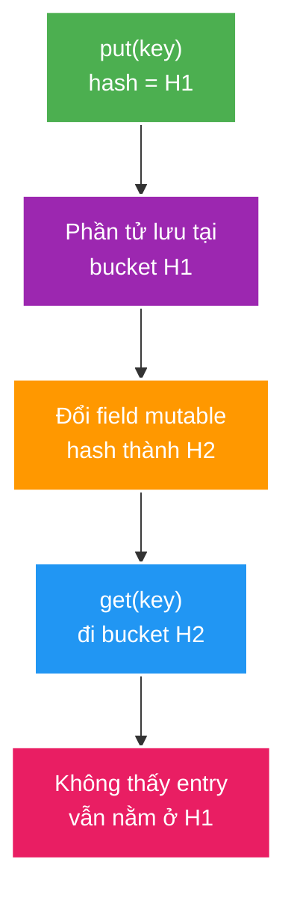
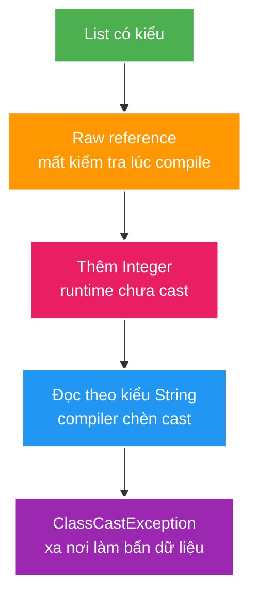

# Equality, Erasure, Variance and Mutable Keys

> Type: `DEEP_DIVE`<br>
> Domain: `java`<br>
> Target depth: `D3 — tái hiện contract break/heap pollution và bảo vệ API/entity/value-object boundary`<br>
> Teaching readiness: `TEACHABLE_DRAFT`<br>
> Status: `DRAFT`<br>
> Evidence status: `NOT RUN`<br>
> Prerequisites: [Language, Object Semantics and Generics](../core/language-object-semantics-and-generics.md)<br>
> Related cases: [`GIFT-UC-01`](../../../../use-case-catalog.md#gift-uc-01), [`VIEWCOUNT-UC-01`](../../../../use-case-catalog.md#31-foundation-và-senior-cases)<br>
> Owner: `Project learner; Codex assists`<br>
> Updated: `2026-07-26`

Deep-dive này chỉ đào internals/pathological cases; foundation và full equality/generics vocabulary thuộc core note.

## 0. Cách dùng và câu hỏi trung tâm

Deep-dive trả lời ba câu mà core chưa đi hết: tại sao hash key mutation phá lookup structure; equality của inheritance/JPA proxy khó hơn value object; và vì sao erasure làm lỗi generic xuất hiện xa unchecked source. Đọc core trước, sau đó đi theo causal diagrams và experiment plan ở file này.

## 1. Learning objectives

1. Phân tích equality khi inheritance, proxy, generated ID và mutable state giao nhau.
2. Giải thích wildcard capture/erasure/bridge method và failure xuất hiện muộn do unchecked boundary.
3. Thiết kế reproducer chứng minh mutable hash key hoặc heap pollution thay vì chỉ mô tả.

## 2. Mental model cốt lõi — phần Agent dạy

Hash collection không “tìm toàn bộ map”. Nó tính hash hiện tại, chọn bucket, rồi mới so equality trong bucket đó. Mutation làm object và lookup disagree về địa chỉ bucket.



Với generics, raw/unchecked boundary là nơi hàng rào bị thủng; compiler-inserted cast ở typed read là nơi ta nhìn thấy hậu quả.



## 3. Internal mechanism

Hash collection chọn bucket từ hash tại operation time rồi dùng equality trong bucket. Nếu field tham gia hash đổi sau insertion, object vật lý vẫn ở bucket cũ; lookup bằng hash mới có thể không chạm tới nó. Đây là structural corruption ở mức collection usage, không phải `HashMap` mất dữ liệu ngẫu nhiên.

Equality qua inheritance dễ phá symmetry: base class chấp nhận mọi subtype theo base fields trong khi subtype thêm field và chỉ chấp nhận subtype. `getClass()` tránh một số symmetry issue nhưng có thể xung đột persistence proxy/subclass. Entity equality cần policy theo lifecycle: transient object chưa có generated ID, managed/proxy object và detached instance không thể dùng template máy móc.

Erasure biến `List<String>` và `List<Integer>` thành cùng raw runtime class; compiler chèn cast tại read site và bridge method để giữ polymorphism sau erasure. Heap pollution thường không fail tại raw `add`, mà fail ở read/cast xa nguồn. Generic varargs kết hợp reified array với erased component type, nên cần tránh write/escape và chỉ dùng `@SafeVarargs` khi implementation thực sự safe.

Wildcard capture cho phép compiler đặt tên tạm cho unknown type; helper generic method có thể thao tác an toàn mà public API vẫn dùng wildcard. Nó không biến producer thành mutable consumer.

### Worked example — heap pollution tối thiểu

```java
List<String> names = new ArrayList<>();
List raw = names;          // unchecked boundary
raw.add(42);               // runtime list accepts Object
String first = names.get(0); // compiler-inserted cast fails here
```

Fix không phải catch `ClassCastException` ở read site. Fix là cô lập/loại raw type hoặc validate/adapt value ngay tại legacy/deserialization boundary.

### Equality inheritance pathology

Nếu base `Point(x,y)` coi mọi subtype có cùng x/y là equal, còn `ColoredPoint` yêu cầu thêm color, ta có thể có `base.equals(colored) == true` nhưng chiều ngược lại false. Dùng `getClass()` tránh symmetry issue bằng cách chỉ equal cùng runtime class, nhưng JPA proxy subclass có thể làm cùng database identity trở nên unequal. Bởi vậy value type thường final/record; entity cần policy gắn với persistence lifecycle và actual proxy behavior.

## 4. Pathological/cross-layer cases

Ba case quan trọng cần đọc như causal chain, không chỉ như tên lỗi:

- **Generated ID:** hai transient entities đều `id=null`; equality chỉ dựa ID có thể coi chúng equal. Sau persist, ID/hash đổi trong khi entity đang ở `HashSet` lại tạo mutable-key problem.
- **Generic varargs:** array reified chứa erased generic elements; nếu method write/escape array không an toàn, caller có thể quan sát wrong parameterized type. `@SafeVarargs` là promise của implementer, không phải suppression vô điều kiện.
- **Deserialization:** JSON/raw map tạo object graph không qua typed constructor; unchecked cast đưa sai type sâu vào core và failure xảy ra ở consumer.

| Case | Causal chain | Observable consequence |
| --- | --- | --- |
| Lombok `@Data` entity | Generated equality/toString dùng mutable fields/relations | Hash membership đổi, recursion, lazy query |
| Generated ID equality | Two transient entities có `id=null` | Distinct objects bị equal hoặc hash thay sau persist |
| Proxy equality | `getClass()` strict với subclass proxy | Same DB row nhưng equality false |
| Raw deserialization | Decoder/raw map đưa wrong type | `ClassCastException` tại consumer |
| Generic varargs escape | Caller/implementation write array slot sai | Heap pollution không local |

## 5. Failure experiment implication

1. Test mutable key: insert key, mutate equality field, gọi `contains/remove`, ghi bucket-relevant symptom.
2. Test inheritance symmetry theo cả `a.equals(b)` và `b.equals(a)`, thêm transitivity set.
3. Test raw list pollution: isolate unchecked line, observe failure tại typed read.
4. Với entity/proxy, chỉ claim sau khi chạy persistence test trên actual mapping; hiện `NOT RUN`.

Một reproducer tốt giữ một variable thay đổi mỗi lần. Mutable-key test không cần Spring; entity/proxy equality phải dùng actual persistence mapping vì mock subclass không chứng minh Hibernate/Spring Data behavior.

## 6. Design choices

| Choice | Khi phù hợp | Failure cần tránh |
| --- | --- | --- |
| Immutable business key | Key có natural stable identity | Key mutation/collision ambiguity |
| ID equality sau persistence | Aggregate có DB identity | Transient `null` semantics và hash mutation |
| No entity equality override | Reference identity đủ trong unit of work | Cross-session/detached comparison expectation |
| Composition/sealed hierarchy | Variant set/behavior rõ | Fragile equality across open inheritance |
| Checked adapter at raw boundary | Legacy/serialization interop | Unchecked value lan sâu vào core |

## 7. Interview discriminator

- Senior answer không dừng ở “override cả equals/hashCode”; phải hỏi field stability, lifecycle và collection membership.
- Architect answer phải tách value semantics, entity identity, persistence proxy và serialized compatibility.
- Expert answer phải chỉ ra nơi failure xảy ra khác nơi contract bị phá đối với erasure/heap pollution.

## 8. Liên hệ case

| Case | Deep implication | Evidence chưa có |
| --- | --- | --- |
| `GIFT-UC-01` | Money canonical scale/equality | Value-object tests |
| `VIEWCOUNT-UC-01` | Session/viewer identity used for dedup | Concurrent membership workload |
| `SESSION-UC-01` | Cache DTO typed boundary | Serialization compatibility test |

## 9. Góc nhìn phỏng vấn và tóm tắt

Senior answer phải kể mutable-key hoặc heap-pollution causal chain. Architect answer tách value semantics, persistence identity và serialization boundary. Expert answer chỉ ra failure site khác contract-break site và nêu evidence cần thiết trước khi chọn equality policy.

Tóm tắt: hash lookup phụ thuộc hash ổn định; open inheritance làm equality contract khó giữ; generated ID có transient/persisted phases; erasure giữ compile-time types nhưng runtime raw class chung; unchecked boundary phải được cô lập; wildcard capture là compiler technique giữ operation type-safe trên unknown type.

## 10. Bài tập diễn đạt lại — phần của tôi

Vẽ hoặc mô tả hai flow: bucket H1 -> mutation H2 -> lookup miss và typed list -> raw write -> inserted cast failure. Sau đó chọn equality policy cho immutable `Money` và generated-ID entity, kèm test cần chạy.

> **Bài viết của tôi — `LEARNER TODO`**

## 11. Self-check có hướng dẫn

1. **Question:** Vì sao mutable key “mất” khỏi map dù entry vẫn tồn tại?<br>**Đọc lại nếu bí:** mục 2–3.<br>**Một câu trả lời tốt phải có:** hash-at-operation-time, bucket H1/H2 và no automatic reindex.<br>**My answer:** `LEARNER TODO`
2. **Question:** Policy equality nào phù hợp cho value object và generated-ID entity, tại sao khác nhau?<br>**Đọc lại nếu bí:** mục 3–4.<br>**Một câu trả lời tốt phải có:** immutable structural value, transient ID, proxy/lifecycle và test boundary.<br>**My answer:** `LEARNER TODO`
3. **Question:** Erasure/bridge/cast khiến heap-pollution failure xuất hiện ở đâu?<br>**Đọc lại nếu bí:** mục 2–3.<br>**Một câu trả lời tốt phải có:** unchecked write source, erased runtime container, typed-read cast failure.<br>**My answer:** `LEARNER TODO`

## 12. Official references

- [JLS 4.6 — Type Erasure](https://docs.oracle.com/javase/specs/jls/se21/html/jls-4.html#jls-4.6)
- [JLS 4.10 — Subtyping](https://docs.oracle.com/javase/specs/jls/se21/html/jls-4.html#jls-4.10)
- [JLS 5.1.10 — Capture Conversion](https://docs.oracle.com/javase/specs/jls/se21/html/jls-5.html#jls-5.1.10)
- [Java SE 21 `Object`](https://docs.oracle.com/en/java/javase/21/docs/api/java.base/java/lang/Object.html)

## 13. Teach-back checklist

- [ ] Tôi tái hiện được mutable-key và heap-pollution failure.
- [ ] Tôi bảo vệ equality policy theo lifecycle.
- [ ] Tôi giải thích variance/capture từ allowed operations.
- [ ] Tôi không gắn `@SafeVarargs` khi chưa chứng minh implementation safe.
- [ ] Evidence vẫn `NOT RUN`.
