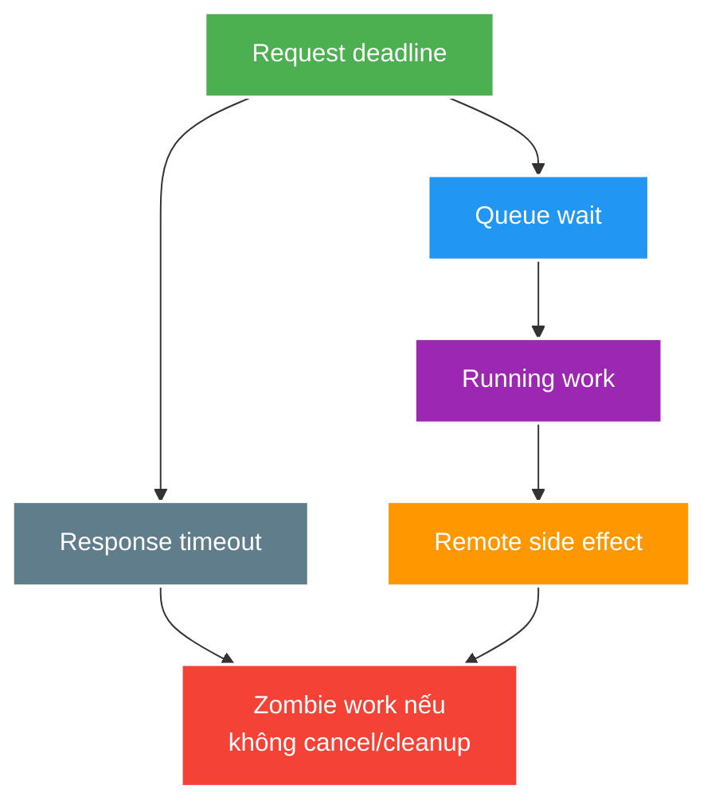

# Executor Saturation, Cancellation, Context and Backpressure

> Type: `DEEP_DIVE` 
> Domain: `java` 
> Target depth: `D3 — fault/load test saturation, cancellation leak và context propagation trên async path` 
> Teaching readiness: `TEACHABLE_DRAFT` 
> Status: `DRAFT` 
> Evidence status: `NOT RUN` 
> Prerequisites: [Executors, CompletableFuture and Concurrency Control](../core/executors-completablefuture-and-concurrency-control.md) 
> Related cases: [`RECONNECT-UC-01`](../../../../use-case-catalog.md#reconnect-uc-01), [`LIVE-UC-01`](../../../../use-case-catalog.md#live-uc-01) 
> Owner: `Project learner; Codex assists` 
> Updated: `2026-07-26`

## 0. Cách học file này

Đặt một timeline cho request: queue wait, run, remote wait, response deadline và cleanup. Tô phần work còn sống sau caller; đó là cancellation leak. Sau đó dùng capacity thật của DB/remote làm admission bound và đo recovery sau burst.

## 1. Learning objectives

1. Lập concurrency/queue/deadline budget từ arrival rate, service time và downstream limits.
2. Phân tích cancellation/deadline khi work đã tạo side effect hoặc API không interruptible.
3. Bảo vệ trace/security/MDC/transaction context qua async boundary.

## 2. Mental model do người dạy cung cấp

Concurrency là số work đang nợ hệ thống; queue là phần chưa bắt đầu, in-flight là phần đang giữ resource. Deadline thuộc toàn request, timeout từng hop chỉ tiêu một phần ngân sách. Caller ngừng chờ không tự hủy queued/running/remote work. Context cũng là dữ liệu phải capture tối thiểu, propagate và clear tại boundary.

## 3. Saturation mechanics

Theo Little's Law ở steady state phù hợp, concurrency xấp xỉ throughput nhân latency. Nếu service time tăng hoặc downstream chậm, in-flight tăng; queue chỉ trì hoãn rejection và cộng queue wait vào deadline. Stable design cần admission theo capacity thật, không theo số task caller muốn submit.

Platform-thread pool gồm worker + queue + rejection. Sizing CPU-bound khác blocking. Virtual-thread per task bỏ worker scarcity cho thread object, nhưng admission vẫn phải bound connection, request memory, remote QPS và database transaction. Reactive pipeline cũng không cứu downstream nếu demand/prefetch/buffer không bounded.

Bulkhead chia capacity/blast radius. Quá nhiều bulkhead nhỏ có thể underutilize; một global pool làm workload chậm phá workload khác. Metric cần active/in-flight, queue depth/age, reject, task time, downstream wait và deadline remaining.

## 4. Cancellation/deadline mechanics

Ví dụ request có budget 500 ms, đã mất 120 ms queue/validation thì child không nên nhận timeout 500 ms mới. Nó nhận remaining budget trừ cleanup margin. Nếu timeout sau remote commit nhưng trước response, outcome là ambiguous: API cần idempotency key/status query/reconciliation, không retry mù vì original có thể đã thành công.

Timeout ở caller có thể chỉ dừng chờ. Work đã dequeue/running hoặc remote request có thể tiếp tục và commit side effect. Interruption cooperative: code/library phải check/propagate và restore interrupt status khi không xử lý. Swallow `InterruptedException` phá shutdown/cancellation protocol.

Một deadline end-to-end tốt hơn mỗi hop tự dùng timeout đầy đủ; child nhận remaining budget. Hedging/retry tạo duplicate work nên cần idempotency/cancellation và retry budget. Cancellation sau “point of no return” cần query/reconciliation thay vì giả định rollback.

`CompletableFuture` graph có thể complete exceptionally mà underlying task vẫn chạy. `allOf` failure/timeout policy phải quyết định cancel siblings, collect partial result hay wait cleanup.

## 5. Context mechanics

Một task decorator thường capture trace ID/user ID cần thiết trước submit, set khi chạy và clear trong `finally`. Copy cả authentication token/large request object vào long-lived task vừa tạo security risk vừa giữ memory. Transaction context thread-bound không nên được “copy”; async DB work cần transaction boundary mới rõ ràng.

Thread-local MDC/security/request transaction context không tự theo lambda chạy thread khác. Wrapper/decorator/framework instrumentation cần capture immutable minimum context và clear sau execution để tránh leak/cross-request contamination. Không copy secret/token đầy đủ vào async diagnostic context.

Database transaction thường thread-bound; chạy repository work trong arbitrary async task không “tham gia transaction caller” theo assumption. Boundary phải explicit.

## 6. Failure modes

| Failure | Trigger | Symptom | Root mechanism |
| --- | --- | --- | --- |
| Queue debt | Sustained overload | p99 rises long after spike | Old tasks wait |
| Zombie work | Caller timeout, task continues | Resource/duplicate side effect | Cancellation not propagated |
| Retry amplification | Timeout -> retries while original runs | Arrival multiplies | No budget/idempotency |
| Common-pool interference | Blocking/default async stages | Unrelated CF/parallel stream slow | Shared pool saturation |
| Context bleed | Thread-local not cleared | Wrong trace/user in logs | Pooled thread reuse |
| Shutdown loss/hang | No ownership/drain deadline | Deploy stalls or drops tasks | Executor lifecycle undefined |

## 7. Experiment implication

1. Stub downstream latency/error; increase arrival until first saturation, record queue age/reject/p99/recovery.
2. Timeout caller, then verify whether downstream work/side effect continues.
3. Compare platform bounded pool, virtual thread + semaphore and alternative async model under same downstream permits.
4. Verify trace/security context present and cleared; inject cancellation/shutdown.
5. Evidence remains `NOT RUN`; expected results are hypotheses only.

## 8. Trade-off matrix

| Option | Capacity control | Cancellation | Context/operability | Complexity |
| --- | --- | --- | --- | --- |
| Unbounded async | None | Weak | Hidden | Low until incident |
| Bounded pool/queue | Worker + queue | Interrupt/cooperative | Familiar metrics | Medium |
| Virtual threads + semaphore | Resource permits explicit | Cooperative | Thread dumps many but readable | Medium |
| Reactive end-to-end | Demand/backpressure operators | Subscription cancellation | Needs instrumentation discipline | High |

## 9. Liên hệ case

| Case | Deep implication | Evidence chưa có |
| --- | --- | --- |
| `RECONNECT-UC-01` | Admission/deadline/retry amplification | 30k reconnect lab |
| `LIVE-UC-01` | Concurrency/headroom/downstream budget | Capacity workload |
| `DEPLOY-UC-01` | Drain/shutdown/cancellation | Rolling-deploy rehearsal |

## 10. Interview answer outline

Lập budget bằng capacity/Little's Law có điều kiện, nêu queue debt và recovery. Phân biệt timeout, interruption, cancellation và ambiguous side effect. So platform pool, virtual thread + semaphore, reactive bằng cùng downstream permits và metrics; trình bày context capture/clear và shutdown/drain.

## 11. Tóm tắt và learner write-back

- Queue age thường cảnh báo user latency tốt hơn depth đơn lẻ.
- Deadline end-to-end tránh mỗi hop dùng lại toàn budget.
- Timeout có thể để lại zombie work và ambiguous outcome.
- Context phải tối thiểu, explicit và được clear.
- So concurrency model dưới cùng resource limit mới công bằng.

`LEARNER TODO — lập timeline và saturation budget cho RECONNECT-UC-01.`

## 12. Guided self-check

1. **Question:** Queue tăng capacity hay chỉ đổi overload? **Đọc lại nếu bí:** mục 2–3, 6. **Rubric:** service rate không đổi, queue wait/age/memory/recovery debt. **My answer:** `LEARNER TODO`
2. **Question:** Timeout sau side effect xử lý ra sao? **Đọc lại nếu bí:** mục 4 và 6. **Rubric:** ambiguous outcome, idempotency/status query/reconciliation, không retry mù. **My answer:** `LEARNER TODO`
3. **Question:** So các concurrency model bằng metric nào? **Đọc lại nếu bí:** mục 3, 7–8. **Rubric:** same downstream permits, throughput/p99/in-flight/queue age/reject/CPU/memory/recovery. **My answer:** `LEARNER TODO`

## 13. Official references

- [Java SE 21 `ThreadPoolExecutor`](https://docs.oracle.com/en/java/javase/21/docs/api/java.base/java/util/concurrent/ThreadPoolExecutor.html)
- [Java SE 21 `CompletableFuture`](https://docs.oracle.com/en/java/javase/21/docs/api/java.base/java/util/concurrent/CompletableFuture.html)
- [Java SE 21 `Future`](https://docs.oracle.com/en/java/javase/21/docs/api/java.base/java/util/concurrent/Future.html)
- [JEP 444 — Virtual Threads](https://openjdk.org/jeps/444)

## 14. Teach-back checklist

- [ ] Tôi lập concurrency/queue/deadline budget.
- [ ] Tôi không đồng nhất response timeout với work cancellation.
- [ ] Tôi propagate/clear minimum safe context.
- [ ] Tôi thiết kế shutdown/drain/retry/idempotency cùng nhau.
- [ ] Saturation/fault evidence vẫn `NOT RUN`.
