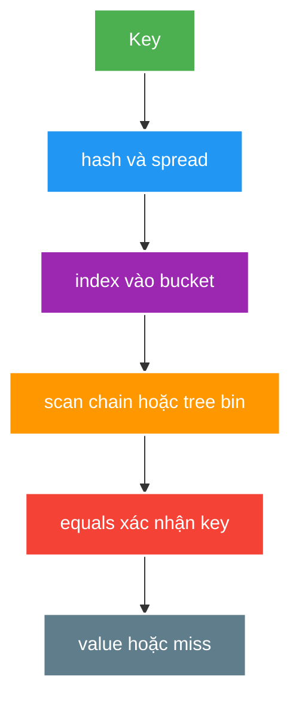
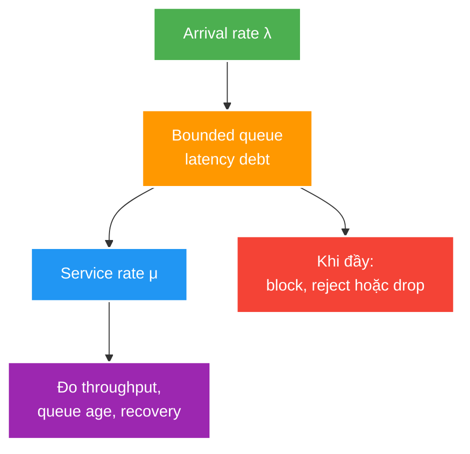

# Hash Tables, Concurrent Collections and Bounded Queues

> Type: `DEEP_DIVE`<br>
> Domain: `java`<br>
> Target depth: `D3 — giải thích collision/compound race/queue collapse và đo trên skewed concurrent workload`<br>
> Teaching readiness: `TEACHABLE_DRAFT`<br>
> Status: `DRAFT`<br>
> Evidence status: `NOT RUN`<br>
> Prerequisites: [Collections, Data Structures and Complexity](../core/collections-data-structures-and-complexity.md), [JMM](../core/jmm-synchronization-and-thread-safety.md)<br>
> Related cases: [`CACHE-UC-01`](../../../../use-case-catalog.md#31-foundation-và-senior-cases), [`CHAT-UC-01`](../../../../use-case-catalog.md#chat-uc-01)<br>
> Owner: `Project learner; Codex assists`<br>
> Updated: `2026-07-26`

## 0. Cách học file này

File này đào sâu ba nơi abstraction dễ rò rỉ: collision trong hash table, atomicity trong concurrent collection và overload trong queue. Đừng học threshold nội bộ như API contract. Hãy theo đường đi của một operation, xác định state nào được bảo vệ, rồi chỉ ra state nào vẫn nằm ngoài boundary đó.

## 1. Learning objectives

1. Giải thích hash spread, resize, collision/tree-bin behavior mà không biến implementation detail thành API guarantee.
2. Phân biệt thread-safe single operation với atomic compound invariant.
3. Thiết kế bounded queue có overload policy và metric queue age/depth.

## 2. Mental model do người dạy cung cấp

Hash table là một routing table trong memory: hash không tìm trực tiếp object mà chỉ thu hẹp vùng tìm kiếm xuống một bin, sau đó equality mới xác nhận key. Concurrent collection thêm coordination quanh các state transition, nhưng coordination có phạm vi cụ thể. Queue là nơi lưu “nợ xử lý”; nếu tốc độ đến lớn hơn tốc độ phục vụ đủ lâu, nợ chỉ có thể tăng, bị từ chối hoặc được shed.





## 3. Internal mechanism

Hash-table capacity/load factor kiểm soát trade-off memory với collision/resize frequency. Resize là rare but expensive operation nên append/put cost thường được nói theo amortized model. Modern `HashMap` có thể chuyển collision chain dài thành tree bin khi đủ điều kiện; threshold/capacity là implementation detail, không phải lý do chấp nhận hash key kém hoặc adversarial input.

`ConcurrentHashMap` tổ chức concurrent access không bằng một global lock cho mọi operation. Weakly consistent iteration không phải immutable snapshot. Atomic methods như `compute`, `merge`, `putIfAbsent` giúp giữ một map-key transition, nhưng mapping function phải ngắn, không recursive/unbounded I/O và không tự động bảo vệ invariant ở database/map khác.

Blocking queue liên kết producer/consumer bằng capacity và wait/reject semantics. Unbounded queue khiến executor nhìn như không reject nhưng chuyển overload thành queue wait, memory retention và stale tasks. Queue depth một mình chưa đủ; queue age, arrival/service rate và oldest item age phản ánh latency debt.

Copy-on-write phù hợp read-mostly/small collection; mỗi write copy array nên catastrophic nếu write frequent/large. Concurrent sorted/skip-list structures đổi memory/constant/ordering để có range/concurrent behavior.

### 3.1. Worked example — check-then-act vẫn race

Đoạn đầu sai nếu nhiều thread cùng chạy: từng call thread-safe nhưng khoảng trống giữa chúng không được bảo vệ.

```java
if (!viewers.containsKey(viewerId)) {
    viewers.put(viewerId, new ViewerState());
}

viewers.computeIfAbsent(viewerId, ignored -> new ViewerState());
```

`computeIfAbsent` làm transition cho key đó thành một operation của map. Tuy nhiên nếu mapping function gửi message hoặc insert database, atomicity của map không rollback external side effect. Loader cũng phải ngắn: một call mạng chậm bên trong có thể giữ contention và kéo request khác cùng key chờ theo.

### 3.2. Worked example — vì sao queue “không reject” vẫn nguy hiểm

Một consumer xử lý 1.000 message/s nhưng burst kéo dài đưa vào 1.500 message/s. Mỗi giây queue nợ thêm 500 message. Sau 60 giây đã có 30.000 item; item mới phải chờ ít nhất hàng chục giây dù CPU có vẻ chưa chết. Unbounded queue biến overload rõ ràng thành stale work, retention và timeout muộn. Bounded queue buộc product chọn semantics khi capacity hết.

## 4. Edge/pathological cases

Với hot key, throughput tổng thể có thể vẫn cao nhưng p99 của đúng key quan trọng tăng mạnh: hash distribution đã biến concurrency thành serialization cục bộ. Với slow `computeIfAbsent`, cache-miss protection có thể trở thành convoy. Với unbounded queue, collapse thường xuất hiện sau burst nên người vận hành dễ đổ lỗi cho GC hoặc downstream, trong khi nguyên nhân gốc là arrival vượt service mà không có overload contract.

| Case | Mechanism | Symptom |
| --- | --- | --- |
| Hot key | Nhiều operation cùng key/bin/lock | Contention dù map overall lớn |
| Adversarial hash | Collision tập trung | CPU latency spike |
| `computeIfAbsent` slow loader | Mapping function block | Requests cùng key chờ/loader amplification |
| Weak iteration misuse | Treat iterator as point-in-time snapshot | Reconciliation/count sai expectation |
| Unbounded queue | Sustained arrival > service | OOM/timeout after delayed collapse |
| Drop without semantics | Queue full and silent discard | Durable/user action mất |

## 5. Cross-layer interaction

- Cache single-flight chỉ gom load trong một process/key; cluster vẫn có multiple loaders nếu không có broader strategy.
- WebSocket outbound queue cần per-connection/per-room budget; one global queue làm hot room ảnh hưởng room khác.
- Database uniqueness/conditional update vẫn là owner cho durable invariant; concurrent map chỉ có process scope.
- Retry đưa task trở lại arrival stream và có thể phá queue recovery nếu không có budget/jitter.

## 6. Experiment implication

1. So sánh uniform với skewed key distribution; đo throughput, p99 và contention.
2. Chạy compound `get/check/put` đối đầu `compute/merge` bằng barrier/repeated test.
3. Saturate bounded queue; ghi accepted/rejected, queue age, memory và recovery time.
4. Không ghi result mẫu; raw evidence hiện `NOT RUN`.

Khi chạy thật, giữ payload và thread count cố định rồi chỉ đổi một biến. Skewed workload nên có một tỷ lệ hot key rõ ràng, ví dụ 80% request dồn vào 1% key. Với queue, không chỉ chụp depth ở đỉnh; đo oldest-item age và thời gian quay về steady state sau khi ngừng producer. Evidence tốt phải giúp bác bỏ hoặc xác nhận mental model, không chỉ cho ra một con số throughput đẹp.

## 7. Trade-off matrix

| Option | Correctness | Throughput | Memory/latency | Operability |
| --- | --- | --- | --- | --- |
| Plain HashMap + confinement | Rất rõ nếu single owner | Cao | Thấp | Ownership phải chắc |
| ConcurrentHashMap | Per-key ops tốt | Cao khi keys phân tán | Overhead metadata | Need contention/key metrics |
| Coarse lock map | Compound invariant dễ | Thấp khi hot | Queue at lock | Thread dump rõ |
| Unbounded queue | Không reject ngay | Burst tốt ngắn hạn | Collapse không bound | Khó recovery |
| Bounded queue | Explicit overload | Stable | Reject/drop/block policy | Metric/actionable |

## 8. Liên hệ case

| Case | Deep implication | Evidence chưa có |
| --- | --- | --- |
| `CACHE-UC-01` | Hot key/single-flight/bounded fallback | Redis-down workload |
| `CHAT-UC-01` | Slow-consumer queue/drop policy | WS load test |
| `VIEWCOUNT-UC-01` | Per-viewer dedup/atomic counter | Concurrent joins/leaves |

## 9. Interview answer outline

Một câu trả lời senior nên đi theo boundary: “HashMap route bằng hash rồi xác nhận bằng equality; expected O(1) phụ thuộc distribution và stable key. `ConcurrentHashMap` bảo vệ operation/per-key transition, không bảo vệ transaction qua DB hay nhiều resource. Queue cần capacity và overflow semantics vì sustained λ > μ luôn tạo latency debt.” Sau đó đưa một failure thực tế và metric dùng để phát hiện.

## 10. Tóm tắt cô đọng

- Hash chỉ chọn vùng tìm kiếm; equality mới xác nhận key.
- Implementation có thể giảm hậu quả collision nhưng không sửa bad key contract.
- Atomic map method có boundary hẹp, external side effect vẫn cần thiết kế riêng.
- Queue depth là lượng nợ; queue age cho biết nợ đã biến thành latency bao lâu.
- Capacity và overflow policy là business/reliability decision.

## 11. Learner write-back

`LEARNER TODO — vẽ lại đường đi key -> bin -> equality; mô tả một compound invariant và một queue overload policy trong project bằng 6–10 câu.`

## 12. Guided self-check

1. **Question:** Vì sao tree bin không biến bad/adversarial hash thành non-issue?<br>**Đọc lại nếu bí:** mục 2–4.<br>**Rubric:** nói được collision vẫn tiêu CPU/memory, hot/adversarial input và implementation detail không phải contract.<br>**My answer:** `LEARNER TODO`
2. **Question:** `compute` bảo vệ được invariant nào và không bảo vệ được boundary nào?<br>**Đọc lại nếu bí:** mục 3.1 và 5.<br>**Rubric:** nêu per-key transition, mapping function constraint, DB/external side effect ngoài atomic boundary.<br>**My answer:** `LEARNER TODO`
3. **Question:** Queue depth và queue age kể hai câu chuyện overload khác nhau thế nào?<br>**Đọc lại nếu bí:** mục 2, 3.2 và 6.<br>**Rubric:** depth là backlog size; age là latency debt/staleness; cần arrival/service và recovery metric.<br>**My answer:** `LEARNER TODO`

## 13. Official references

- [Java SE 21 `HashMap`](https://docs.oracle.com/en/java/javase/21/docs/api/java.base/java/util/HashMap.html)
- [Java SE 21 `ConcurrentHashMap`](https://docs.oracle.com/en/java/javase/21/docs/api/java.base/java/util/concurrent/ConcurrentHashMap.html)
- [Java SE 21 `BlockingQueue`](https://docs.oracle.com/en/java/javase/21/docs/api/java.base/java/util/concurrent/BlockingQueue.html)
- [Java SE 21 `CopyOnWriteArrayList`](https://docs.oracle.com/en/java/javase/21/docs/api/java.base/java/util/concurrent/CopyOnWriteArrayList.html)

## 14. Teach-back checklist

- [ ] Tôi phân biệt API contract và current implementation detail.
- [ ] Tôi nhận diện per-key contention/compound race.
- [ ] Tôi thiết kế queue capacity và overflow semantics.
- [ ] Tôi nối process-local collection tới durable/distributed boundary.
- [ ] Load evidence vẫn `NOT RUN`.
