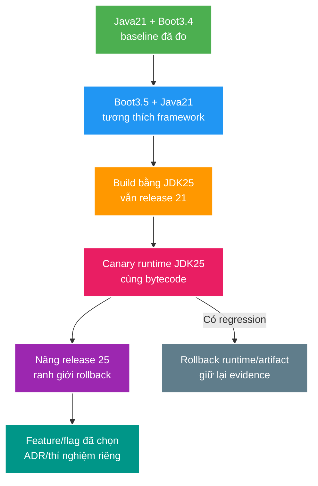

# Deep-dive: Java 21 → Java 25 LTS Compatibility và Rollout

> Type: `DEEP_DIVE` 
> Domain: `java` 
> Target depth: `D4 — chẩn đoán regression ở framework/bytecode/agent/runtime và dẫn dắt rollout LTS an toàn` 
> Teaching readiness: `TEACHABLE_DRAFT` 
> Status: `DRAFT` 
> Evidence status: `NOT RUN` 
> Version snapshot: `2026-07-26` 
> Prerequisites: [JDK migration core](../core/jdk-platform-migration-strategy.md) 
> Related cases: `JDK-02`; [question bank](../../question-bank/jdk25-spring-boot-migration-decision.md) 
> Owner: `Project learner; Codex teaches, learner writes back` 
> Updated: `2026-07-26`

## 1. Staged dependency graph

Kế hoạch an toàn tách ba biến độc lập: phiên bản framework, JDK dùng để chạy và mức bytecode/source của ứng dụng. Một lộ trình giả định, chưa được thực thi, là: Java 21/Boot 3.4 → nâng Boot phù hợp nhưng vẫn chạy Java 21 → dùng JDK 25 để chạy artifact vẫn compile target 21 → canary JDK 25 → chỉ nâng `--release 25` sau khi cửa sổ rollback đã đóng → cuối cùng mới dùng feature ổn định đã chọn. Mỗi cạnh chuyển đổi phải có test và đường rollback riêng; nếu thay cả ba biến một lúc, regression sẽ rất khó khoanh vùng.

Phiên bản Spring Boot chính xác phải được kiểm tra lại khi case active. Chỉ nâng sang major Boot 4 nếu yêu cầu thực tế biện minh cho chi phí tương thích; không gộp major framework upgrade vào cùng một bước đổi runtime chỉ vì “tiện”.

## 2. Build/tooling failures

Nhóm lỗi build thường gồm: compiler target mới nhưng plugin cũ chưa hỗ trợ; Surefire/JUnit không khám phá test; JaCoCo, Byte Buddy hoặc Mockito chưa đọc được classfile mới; Lombok annotation processor bị giới hạn module access; Maven toolchain/enforcer chọn nhầm JDK; IDE và Maven daemon dùng runtime khác terminal. Chẩn đoán bắt đầu từ `mvnw -version`, effective POM, dependency tree, JDK của process compile/test fork và phiên bản plugin. Hãy nâng thành phần nhỏ nhất tạo tương thích, không tắt agent hoặc bỏ test để làm build xanh giả tạo.

Classfile release 25 không thể chạy trên Java 21 và sẽ ném `UnsupportedClassVersionError`. Ngay cả khi ứng dụng target 21, một dependency bắc cầu được compile ở release 25 vẫn làm runtime cũ hỏng; vì vậy pipeline cần kiểm tra bytecode của dependency. `Multi-release JAR` có thể chọn implementation khác theo runtime, còn shading có thể làm mất service descriptor hoặc resource; các đường này cần test riêng thay vì chỉ compile source chính.

## 3. Runtime/framework failures

Spring proxy, reflection, serializer và Hibernate bytecode enhancement đều dựa vào hành vi bytecode/reflection cụ thể. Cần khởi động mọi profile quan trọng và đi qua các code path lười như scheduled job, listener, security và WebSocket. Hãy tìm việc dùng API nội bộ `sun.*`, agent cũ hoặc reflective access bị siết chặt. `jdeps` hỗ trợ tìm phụ thuộc nhưng không bao phủ mọi đường chạy. Thư viện native/JNI còn phụ thuộc kiến trúc CPU và ABI của JDK nên cần đúng image triển khai để kiểm chứng.

TLS, certificate provider, thuật toán mặc định, locale và timezone có thể thay đổi hành vi tích hợp bên ngoài. Cần golden fixture cho JSON/cache/session/event và vector mật mã/webhook trước-sau migration. Không dùng Java native serialization cho dữ liệu bền vững hoặc cache lâu dài. Driver database và connection pool phải được pin phiên bản vì chúng nằm trên đường runtime thật.

## 4. Virtual-thread delta

Trên Java 21, virtual thread đang ở trong monitor `synchronized` rồi gọi blocking I/O có thể giữ chặt carrier thread, gọi là `pinning`. Từ JDK 24, JEP 491 cho phép unmount trong phần lớn trường hợp monitor, nên `jdk.tracePinnedThreads` không còn là công cụ trung tâm như trước và JFR được dùng cho các tình huống native còn lại. Vì vậy reproducer pinning trên Java 21 có thể tự cải thiện khi chạy JDK 25 dù code không đổi; vẫn phải test native call, class initialization và contention thật.

Không còn pinning không có nghĩa concurrency vô hạn. Database pool, HTTP connection, broker channel, CPU, memory và dữ liệu `ThreadLocal` vẫn hữu hạn. Không nên tạo pool virtual thread để giả làm giới hạn tải; hãy dùng semaphore hoặc bulkhead gắn với tài nguyên thật. Theo dõi JFR về thread, CPU, lock và p99. Structured Concurrency trên JDK 25 vẫn là preview tại snapshot tài liệu, nên không đưa vào lõi production nếu chưa có chính sách preview rõ ràng.

## 5. JVM behavior/performance

Default của GC, JIT và container ergonomics có thể đổi giữa hai LTS. So sánh ban đầu phải dùng cùng workload, phần cứng và flag; chỉ bỏ flag cũ sau khi hiểu tác dụng. Đo thời gian khởi động, throughput/p99, CPU, RSS, heap/native memory, GC pause, allocation, JIT/code cache, thread/pool và error. JFR giúp nối regression latency với code path và runtime event thay vì đoán bằng một JVM flag.

Compact Object Headers có thể giảm footprint nhưng phải là thí nghiệm riêng, không phải giả định mặc định; agent và profiler cũng cần tương thích. AOT hoặc đổi GC là biến khác. Mỗi thí nghiệm chỉ thay một biến để còn biết thay đổi nào tạo kết quả.

Regression hiệu năng có thể đến từ warmup, JIT profile, dữ liệu hoặc nhiễu môi trường. Cần lặp lại, biểu diễn độ tin cậy và so sánh profile. Không rollback bản vá bảo mật chỉ vì một microbenchmark chậm hơn khi chưa đánh giá SLO nghiệp vụ và workload đại diện.

## 6. Mixed-fleet protocol

Về ý định, đổi JDK không nên đổi ngữ nghĩa API/cache/event/token, nhưng serializer, reflection và default runtime có thể gây drift. Canary phải kiểm tra đọc/ghi hai chiều cũ-mới cho session/JWT/auth, Redis DTO, RabbitMQ event, Flyway, timestamp và decimal trong database. Chạy cùng artifact target 21 trên cả hai runtime giúp cô lập biến JDK. Telemetry cần gắn nhãn JDK, Boot và build để so sánh.

Rollout phải tính drain, capacity dự phòng và rollback. Nếu đã deploy artifact bytecode release 25, pod JDK cũ không thể khởi động nó; cần giữ cả artifact và runtime trước đó để rollback theo cặp. Tính tương thích của database migration là bài toán độc lập, không được mặc định an toàn chỉ vì runtime rollback được.

## 7. Incident playbook

Khi canary có lỗi, dừng rollout và so sánh theo JDK/Boot/artifact/profile. Phân loại lỗi build/classfile, startup/reflection, hợp đồng chức năng, TLS/tích hợp ngoài hoặc hiệu năng/tài nguyên. Giữ lại JFR, log, config và dependency tree. Rollback về cặp tương thích gần nhất; không thêm `--add-opens` rộng như cách sửa vĩnh viễn. Sau đó tạo reproducer tối thiểu, xác định phiên bản thư viện gây lỗi và theo dõi upstream fix.

Nếu chỉ regression dưới tải, trước tiên bảo vệ SLO và capacity rồi so sánh pool, GC, JIT và thread. Nếu serializer đã ghi dữ liệu sai, phải dừng writer và đối soát trước khi rollback runtime; rollback code không tự sửa dữ liệu đã hỏng. Cuối cùng cập nhật ma trận tương thích, ADR và test để biến incident thành gate tái sử dụng.

## 8. Evidence matrix

Quy trình kiểm chứng gồm clean compile/test, kiểm tra dependency/plugin/bytecode, khởi động mọi profile, integration test, JFR/load, container và diễn tập canary/rollback. Mỗi kết quả phải ghi Java/Boot/OS/vendor/kiến trúc/flags/artifact digest. Raw result vẫn `NOT RUN`; cursor roadmap vẫn ở JDK-01 core.

### Hai pathology cần dùng để tự kiểm tra quyết định

**Build xanh nhưng production không khởi động:** CI compile bằng JDK 25 và test dùng mock, nhưng image production vẫn có JRE 21. Một dependency mới mang classfile 25 chỉ được load ở scheduled listener sau khi app đã báo healthy. Triệu chứng là `UnsupportedClassVersionError` xuất hiện muộn; evidence gồm digest image, `java -version` trong container, classfile của dependency và stack trace class loader. Mitigation là kiểm bytecode dependency trong CI, smoke mọi profile/code path và rollout cùng cặp artifact-runtime đã pin.

**Canary latency tăng nhưng không phải GC:** sau đổi JDK, p99 tăng trong khi GC pause thấp. JFR cho thấy HTTP connection pool wait tăng vì default hoặc library version đi kèm thay đổi. Nếu chỉ tăng heap, triệu chứng không cải thiện. Evidence phải nối trace request, pool wait, CPU/JIT/GC và config diff; mitigation sửa đúng pool/config hoặc library, sau đó chạy lại cùng workload. Đây là lý do deep-dive migration không được rút gọn thành “nâng version rồi chạy test”.

### 8.1. Pathology A — build xanh nhưng production Java 21 không load được class

CI chạy Maven bằng JDK 25 và một annotation processor/plugin sinh classfile 25 dù application source được cấu hình `--release 21`. Unit tests cũng chạy trên JDK 25 nên pass. Production vẫn Java 21, khi lazy path chạm generated class mới ném `UnsupportedClassVersionError`. Trường hợp khác là transitive library/multi-release JAR đưa entry không tương thích; compiler của source chính không kiểm hết artifact runtime.

Diagnostic bắt đầu từ provenance: `mvnw -version`, compiler/test fork runtime, toolchain/effective POM, plugin/processor versions và classfile scan của final artifact/dependencies. Compatibility gate phải chạy artifact target trên Java 21 thật, không chỉ compile. Mitigation là pin/fix generator/plugin hoặc target, không copy một JDK 25 runtime vào production mà bỏ qua rollout evidence.

### 8.2. Pathology B — agent/mock framework không hiểu classfile mới

Ứng dụng start nhưng tests hoặc canary fail khi JaCoCo, Byte Buddy, Mockito, APM/security agent instrument class compiled/runtime JDK mới. Stack trace có “unsupported class file major version” hoặc transformation error; tắt agent làm lỗi biến mất nhưng cũng xóa coverage/observability/security control. Đây là ecosystem compatibility, không phải JDK bug mặc định.

Inventory mọi tool chạy *trong* JVM: test engine, coverage, mocking, ORM enhancement, APM/profiler, container agent. Nâng component nhỏ nhất tới release official hỗ trợ, chạy negative/security paths và giữ agent trong canary. Nếu buộc tạm disable, phải có risk owner/timebox và replacement evidence; không gọi đó là complete migration.

### 8.3. Pathology C — Java 25 giảm pinning nhưng database vẫn sập

Load test Java 21 cho thấy nhiều virtual threads pinned quanh `synchronized`; Java 25/JEP 491 giảm phần monitor pinning nên thread throughput tăng. Cùng lúc application mở nhiều blocking DB calls hơn, pool saturate và PostgreSQL latency tăng. Team kết luận “virtual threads regression” hoặc tăng pool, làm owner quá tải hơn.

So sánh phải tách carrier pinning, monitor contention, DB/HTTP pool pending, dependency capacity và end-to-end p99. Virtual threads thay cost của waiting thread, không thay admission. Dùng semaphore/bulkhead theo resource; JFR event/version khác nhau giữa 21 và 25 nên procedure phải ghi runtime/JEP delta, không dựa một flag đã mất ý nghĩa.

### 8.4. Pathology D — runtime rollback thành công nhưng data/protocol đã drift

Canary JDK/Boot mới serialize Redis DTO hoặc Rabbit event khác do library/default/reflection change. Old pods đọc lỗi hoặc hiểu default sai. Rollback runtime không xóa messages/cache values đã ghi. Nếu migration cũng nâng Flyway/schema hoặc release-25 bytecode, old artifact có thể không start. Đây là lý do mỗi edge trong staged graph phải có compatibility contract và rollback boundary riêng.

Mixed-fleet tests phải chạy old-write/new-read và new-write/old-read cho API, session/JWT, cache DTO, events, timestamps/money và database schema. Nếu data corruption xảy ra, freeze writers và reconcile trước rollback mù.

## 8.5. Activation matrix và decision gate

Khi `JDK-02` thực sự active, matrix tối thiểu gồm:

1. Java 21 + current Boot baseline đo được;
2. Java 21 + supported Boot/BOM candidate;
3. build JDK 25 + `--release 21`, test artifact trên runtime 21 và 25;
4. runtime 25 canary với same artifact, profiles/integrations/JFR/load/fault;
5. release 25 artifact với explicit rollback artifact/runtime;
6. từng feature/flag mới là experiment riêng.

Mỗi cell pin vendor/patch, OS/arch/container, Maven plugins/agents/drivers và artifact digest. Gate gồm functional/contracts/security, startup, resource/performance, mixed fleet, drain/rollback và incident observability. Official support line phải re-check tại activation; snapshot trong file không phải future guarantee.

## 8.6. Interview reasoning

Senior phân biệt build JDK, `--release`, test runtime và production runtime; kể một plugin/classfile regression. Architect bảo vệ staged rollout, support horizon, fleet/protocol compatibility và rollback cost. Expert phân tích JEP 491 delta, agent/bytecode boundary, mixed data writers và evidence limitations thay vì nói “LTS nên an toàn”.

## 9. Learner write-back và self-check

> **Bài viết của tôi — `LEARNER TODO`:** explain staged graph and diagnose one classfile and one virtual-thread regression.

1. **Question:** Vì sao build bằng JDK 25 với `--release 21` vẫn cần chạy artifact trên Java 21 thật? 
   **Đọc lại nếu bí:** mục 2 và 8.1. 
   **Một câu trả lời tốt phải có:** source/API/classfile contract, plugin/processor/transitive artifact gap, runtime gate và provenance evidence. 
   **My answer:** `LEARNER TODO`
2. **Question:** JEP 491 thay đổi quyết định virtual-thread migration như thế nào nhưng không bỏ những bottleneck nào? 
   **Đọc lại nếu bí:** mục 4 và 8.3. 
   **Một câu trả lời tốt phải có:** Java 21 versus 24+ monitor pinning, remaining native/contention cases, DB/HTTP admission và comparative JFR/load evidence. 
   **My answer:** `LEARNER TODO`
3. **Question:** Thiết kế rollback khi new runtime/library đã ghi cache/event/schema như thế nào? 
   **Đọc lại nếu bí:** mục 6–7 và 8.4–8.5. 
   **Một câu trả lời tốt phải có:** old/new read-write matrix, bytecode/schema boundaries, freeze/reconcile case, staged artifact/runtime rollback và exact-version recheck. 
   **My answer:** `LEARNER TODO`

## 10. References

- [JEP 491](https://openjdk.org/jeps/491)
- [JEP 506 — Scoped Values](https://openjdk.org/jeps/506)
- [JEP 505 — Structured Concurrency](https://openjdk.org/jeps/505)
- [JEP 519 — Compact Object Headers](https://openjdk.org/jeps/519)

- [ ] Evidence remains `NOT RUN`.
