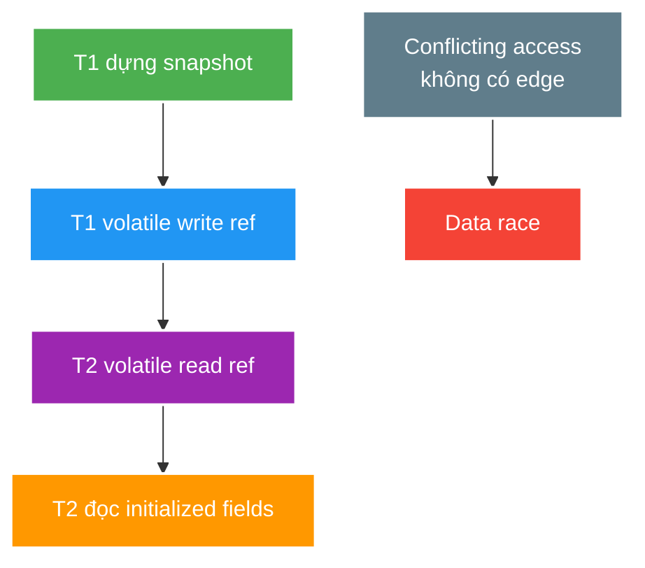

# JMM Happens-before, Publication and Locking

> Type: `DEEP_DIVE` 
> Domain: `java` 
> Target depth: `D3 — chứng minh race bằng happens-before graph, stress test và lock/progress evidence` 
> Teaching readiness: `TEACHABLE_DRAFT` 
> Status: `DRAFT` 
> Evidence status: `NOT RUN` 
> Prerequisites: [JMM, Synchronization and Thread Safety](../core/jmm-synchronization-and-thread-safety.md) 
> Related cases: [`STREAM-UC-01`](../../../../use-case-catalog.md#31-foundation-và-senior-cases), [`GIFT-UC-01`](../../../../use-case-catalog.md#gift-uc-01) 
> Owner: `Project learner; Codex assists` 
> Updated: `2026-07-26`

## 0. Cách học file này

Viết graph actions/edges bằng giấy trước khi nhìn primitive. Một synchronization choice chỉ đúng khi vừa chứng minh safety vừa kiểm tra progress dưới contention. Reproducer dùng barrier/latch để điều khiển cửa sổ race, không dùng `sleep` làm bằng chứng chính.

## 1. Learning objectives

1. Dựng happens-before proof cho publication, handoff và state transition.
2. Phân tích lock/CAS failure gồm contention, deadlock, starvation và retry amplification.
3. Thiết kế concurrency reproducer kiểm soát interleaving thay vì dựa vào sleep.

## 2. Mental model do người dạy cung cấp

Happens-before graph gồm node là actions và edge là program order hoặc synchronization rule. Nếu write nối được tới read bằng chuỗi edge, effects được đảm bảo visible; nếu hai conflicting access không ordered, có data race. Lock/CAS là cách tạo state transition, nhưng mỗi cách đổi contention, retry và liveness cost.

## 3. Happens-before reasoning

Happens-before không khẳng định physical CPU chạy action A “trước thời gian” B; nó là ordering relation trong memory model đảm bảo effects của A visible/ordered với B. Nếu conflicting accesses không ordered, execution có data race và observed values có thể khác intuition sequential.

Monitor unlock happens-before later lock cùng monitor; volatile write happens-before later read thấy ordering qua cùng volatile variable; actions trước `Thread.start` visible cho started thread; thread actions happen-before successful `join` return. Transitivity nối data preparation với publication edge.

Final-field semantics hỗ trợ initialized state khi construction đúng và object không escape; nó không đóng băng referenced mutable graph và không sửa constructor publication sai.

Double-checked locking cần volatile publication để không quan sát reference trước fully initialized effects. Initialization-on-demand holder/static initialization thường đơn giản hơn khi lifecycle phù hợp.

## 4. Locking/CAS internals

Intrinsic/explicit lock tạo mutual exclusion nhưng scope/order quyết định liveness. Lock convoy/long critical section làm p99 tăng dù data đúng. `ReentrantLock` thêm interruptible/timed acquisition/fair option/conditions, nhưng fair lock có throughput cost và không tự ngăn logic deadlock.

CAS đọc state, thử replace nếu unchanged và retry khi conflict. Under contention, failed retry tiêu CPU; multi-field invariant cần immutable state aggregate/version or other ownership. ABA nghĩa value trở lại representation cũ trong khi state history đổi; version/stamp/higher-level design có thể cần.

`LongAdder` giảm contention cho statistical counter bằng cells nhưng `sum()` không phải atomic snapshot cho money/strict invariant.

### Worked example — DCL và publication

Double-checked locking chỉ hợp lệ khi instance reference là `volatile`: construction actions program-order trước volatile write, volatile write happens-before read thấy reference, rồi transitivity đưa initialized state tới consumer. Initialization-on-demand holder thường dễ chứng minh hơn vì class initialization đã có synchronization semantics.

### Counterexample — tối ưu counter sai invariant

`LongAdder` hợp với metrics/view count approximate vì update phân tán. Dùng nó cho wallet balance rồi đọc `sum()` để quyết định chi tiêu là sai: snapshot không atomic với concurrent updates và invariant còn liên quan ledger/database. “Nhanh hơn” không bù được boundary sai.

## 5. Pathological cases

| Case | Causal chain | Symptom |
| --- | --- | --- |
| Unsafe DCL | Non-volatile publication/reordering | Rare partially initialized observation |
| Lock-order inversion | T1 A->B, T2 B->A | Deadlock |
| Lock + remote call | Critical section waits unbounded I/O | Convoy/pool exhaustion |
| CAS storm | Many writers same state | CPU high, poor progress |
| `LongAdder` as ledger | Non-atomic aggregate read | Business invariant violated |
| Sleep-based test | Scheduler happens to serialize | Flaky/false confidence |

## 6. Reproducer design

1. Use latch/barrier/phaser to align reads/writes and loop many iterations.
2. Separate invariant checker from worker; record seed/interleaving summary when possible.
3. For deadlock, acquire locks in controlled opposite order and assert via thread dump/deadlock detector with timeout.
4. For DB/multi-node race, Java barrier only starts requests; durable invariant evidence must come from DB result/constraint.
5. Do not claim “race fixed” from one green run; define repeat/stress bound. Evidence is `NOT RUN`.

## 7. Cross-layer interaction

- Spring singleton beans are shared; request-local assumption must be explicit.
- `@Transactional` coordinates database state, not arbitrary Java shared memory before/after callback.
- Redis/database/message broker each add their own consistency/atomicity boundary.
- Virtual threads change thread cost, not JMM rules or lock contention.

## 8. Trade-off matrix

| Option | Proof simplicity | Contention | Liveness risk | Scope |
| --- | --- | --- | --- | --- |
| Confinement/immutability | Highest | Low | Low | Handoff required |
| Coarse lock | High | High | Convoy/deadlock if nested | One JVM |
| Fine lock | Lower | Lower potential | Higher ordering complexity | One JVM |
| CAS/atomic state | Medium for small state | Retry under hot key | Starvation/ABA | One JVM |
| DB conditional update | Durable proof | DB lock/conflict | Transaction wait/deadlock | Multi-node |

## 9. Liên hệ case

| Case | Deep implication | Evidence chưa có |
| --- | --- | --- |
| `STREAM-UC-01` | Transition linearization/DB boundary | Race test |
| `GIFT-UC-01` | Lost update/multi-field money invariant | Concurrent ledger test |
| `VIEWCOUNT-UC-01` | LongAdder/exact-vs-approximate | Load/reconciliation |

## 10. Interview answer outline

Dựng HB chain cụ thể, nói safety lẫn liveness, rồi so lock/CAS/confinement theo invariant. Nêu controlled reproducer và boundary: Java lock dừng ở một JVM, durable multi-node invariant cần database conditional update/constraint hoặc partitioned owner.

## 11. Tóm tắt và learner write-back

- HB là relation đảm bảo visibility, không phải timestamp.
- Final-field rule cần construction/publication đúng.
- Lock đúng data vẫn có thể fail progress.
- CAS contention tạo retry amplification; primitive phải fit invariant.
- Repeated stress tăng confidence, không tạo mathematical proof.

`LEARNER TODO — vẽ HB proof và một liveness failure cho STREAM-UC-01.`

## 12. Guided self-check

1. **Question:** Dựng HB chain publish immutable snapshot. **Đọc lại nếu bí:** mục 2–3 và DCL example. **Rubric:** construction/program order → sync edge → consumer read, transitivity. **My answer:** `LEARNER TODO`
2. **Question:** Vì sao volatile không sửa compound invariant? **Đọc lại nếu bí:** mục 3–4. **Rubric:** visibility/order per variable vs multi-step/multi-field atomicity. **My answer:** `LEARNER TODO`
3. **Question:** Reproducer và boundary nào? **Đọc lại nếu bí:** mục 6–8. **Rubric:** barrier/latch/repeat + Java lock chỉ một JVM, durable owner ngoài process. **My answer:** `LEARNER TODO`

## 13. Official references

- [JLS 17.4 — Memory Model](https://docs.oracle.com/javase/specs/jls/se21/html/jls-17.html#jls-17.4)
- [JLS 17.5 — Final Field Semantics](https://docs.oracle.com/javase/specs/jls/se21/html/jls-17.html#jls-17.5)
- [Java SE 21 `ReentrantLock`](https://docs.oracle.com/en/java/javase/21/docs/api/java.base/java/util/concurrent/locks/ReentrantLock.html)
- [Java SE 21 atomic package](https://docs.oracle.com/en/java/javase/21/docs/api/java.base/java/util/concurrent/atomic/package-summary.html)

## 14. Teach-back checklist

- [ ] Tôi chứng minh bằng edge, không bằng log/wall-clock intuition.
- [ ] Tôi phân biệt data safety và liveness/progress.
- [ ] Tôi thiết kế controlled interleaving không dùng sleep làm chính.
- [ ] Tôi chỉ ra JVM versus durable/distributed boundary.
- [ ] Concurrency evidence vẫn `NOT RUN`.
