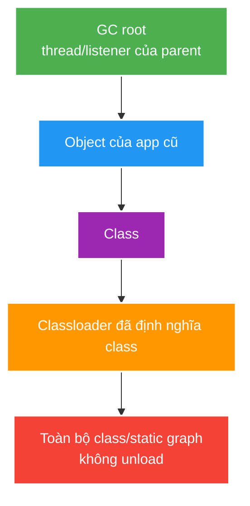

# JVM Class Loading, Memory and Classloader Leaks

> Type: `DEEP_DIVE` 
> Domain: `java` 
> Target depth: `D3 — đọc class-loading/memory evidence và tái hiện retention qua loader/thread-local/listener` 
> Teaching readiness: `TEACHABLE_DRAFT` 
> Status: `DRAFT` 
> Evidence status: `NOT RUN` 
> Prerequisites: [JVM Class Loading, Bytecode and Memory](../core/jvm-class-loading-bytecode-and-memory.md) 
> Related cases: [`JVM-UC-01`](../../../../use-case-catalog.md#31-foundation-và-senior-cases), [`DEPLOY-UC-01`](../../../../use-case-catalog.md#31-foundation-và-senior-cases) 
> Owner: `Project learner; Codex assists` 
> Updated: `2026-07-26`

## 0. Cách học file này

Tách ba graph: delegation/class identity, object retention và process memory budget. Một classloader leak chỉ được chứng minh khi tìm thấy GC-root path giữ defining loader cũ; metaspace tăng một lần do warm-up chưa đủ kết luận.

## 1. Learning objectives

1. Phân biệt loading/linking/initialization trigger và lỗi tương ứng.
2. Theo retention path từ GC root tới classloader/object graph.
3. Lập process memory budget gồm heap và non-heap/native regions.

## 2. Mental model do người dạy cung cấp

Mỗi defining loader tạo một namespace type. Loader giữ các `Class`; class giữ static state; object/thread/listener từ loader sống lâu hơn dự kiến có thể nối graph về loader và ngăn unload toàn bộ deployment. Vì vậy leak vài reference có thể giữ rất nhiều metadata và object.

## 3. Internal mechanism

Verification kiểm bytecode structural/type safety; preparation tạo static fields/default values; resolution chuyển symbolic reference khi JVM chọn resolve; initialization chạy class initialization method với synchronization semantics. Failure có thể được wrap/cache theo lifecycle, nên lần dùng sau không nhất thiết chạy lại initializer như lần đầu.

Parent delegation thường hỏi parent trước, bảo vệ platform type identity. Child-first/plugin model cho isolation/versioning nhưng tăng duplicate type/cast/resource leak risk. Class unloading cần defining loader và tất cả class/object liên quan không còn reachable.

Static field thuộc `Class`, và `Class` thuộc loader. Thread context classloader, thread-local value/key, registered driver/listener, scheduler thread hoặc global cache từ parent loader có thể giữ child loader sau redeploy.

Process RSS bao gồm heap committed/resident portions, metaspace/class space, JIT code cache, thread stacks, direct/native allocations và shared libraries. Container limit quá sát `-Xmx` có thể OOMKill mà JVM không kịp ném heap OOME/dump.

### Worked example — redeploy leak

Application cũ đăng ký listener vào singleton thuộc parent loader rồi không unregister. Listener instance mang class của child loader; parent singleton là GC root sống qua redeploy. Sau mỗi lần deploy, loader cũ cùng static caches/classes vẫn reachable, class count và metaspace used-after-GC tăng theo bậc. Fix là lifecycle cleanup/unregister và shutdown thread/executor, sau đó lặp cùng chu kỳ để chứng minh plateau.

## 4. Pathological cases

| Case | Retention/failure chain | Signal |
| --- | --- | --- |
| Static collection | Root class -> static map -> domain graph | Heap live set grows |
| ThreadLocal leak | Pool thread survives request/app lifecycle | Per-thread stale values |
| Redeploy loader | Parent thread/listener -> child class/object | Metaspace/classes increase each deploy |
| Direct buffer/native | Off-heap allocation not budgeted | RSS/OOMKill, heap normal |
| Too many threads | Stack/native scheduler overhead | Native OOM/context switching |
| Initialization cycle/failure | Static initializer dependency/exception | `ExceptionInInitializerError`, unusable class |

## 5. Diagnostic sequence

1. Cố định commit, JDK, giới hạn container, workload và cửa sổ đo.
2. So sánh heap còn sống sau GC, allocation rate, số class/metaspace, số thread, direct/native memory và RSS.
3. Dùng dominator/retained path trong heap dump cho heap retention; thread dump để tìm thread hoặc owner của `ThreadLocal`; dùng NMT/native tool nếu đã bật để điều tra vùng ngoài heap.
4. Kiểm chứng giả thuyết bằng cách loại owner hoặc giới hạn lifecycle, rồi chạy lại đúng workload.
5. Không tăng heap như final fix nếu retained graph vẫn tăng.

## 6. Cross-layer interaction

- Spring devtools, reload và classloader của container làm lộ vấn đề type identity/lifecycle; phải đo trên runtime project dùng thật, không suy diễn.
- Executor, scheduler và application listener phải shutdown hoặc unregister khi context đóng.
- JDBC driver, logging cache và serialization cache có thể giữ tham chiếu bắc cầu qua hai đời classloader.
- Metric memory của Kubernetes/container phải được đối chiếu với heap và native memory của JVM.

## 7. Experiment implication

1. Lặp việc load/unload một classloader cô lập có static/listener/thread cố tình bị giữ, rồi ghi số class và metaspace.
2. Cấp phát direct buffer hoặc tạo thread dưới một ngân sách container/process đã biết.
3. Thu heap dump, thread dump và JFR trước/sau cleanup. Evidence hiện vẫn `NOT RUN`.

## 8. Trade-off matrix

| Option | Isolation | Memory/lifecycle risk | Operability | Use case |
| --- | --- | --- | --- | --- |
| Single app loader | Simple | Low loader complexity | Easy | Monolith service |
| Plugin/child loader | Version isolation | Leak/type-identity risk | Harder | True plugin boundary |
| Larger Xmx | Heap headroom | Starves native/container budget | Simple until OOMKill | Only after live-set evidence |
| Explicit lifecycle/bounds | Correct recovery | Engineering cost | Strong | Long-running service |

## 9. Interview answer outline

Giải thích identity `(name, defining loader)`, đường root→object→Class→loader và điều kiện unload. Phân biệt heap/metaspace/direct/thread/RSS, rồi đưa diagnostic sequence và before/after redeploy evidence.

## 10. Tóm tắt và learner write-back

- Cùng binary name nhưng khác defining loader là type khác.
- Unload cần toàn bộ loader graph unreachable.
- ThreadLocal/listener/thread/global cache thường bắc cầu qua lifecycle.

### Hai pathology và cách phân biệt vùng nhớ

**Heap ổn nhưng pod vẫn bị OOMKill:** Xmx được đặt 512 MB trong container 768 MB, ứng dụng còn dùng direct buffer, metaspace, code cache và stack của hàng nghìn thread. Heap dashboard chỉ khoảng 350 MB nên đội vận hành tăng Xmx lên 650 MB; native headroom càng ít và pod chết sớm hơn. Evidence cần RSS/cgroup limit, NMT nếu bật, thread count, direct buffer pool và heap used-after-GC. Mitigation là lập ngân sách toàn process, giới hạn buffer/thread và chỉ chỉnh Xmx sau khi biết thành phần nào chiếm memory.

**Metaspace tăng sau mỗi lần reload:** parent-owned scheduler giữ callback được tạo bởi child classloader. Dù application context cũ đóng, đường tham chiếu `parent thread -> task/listener -> class -> child loader` giữ toàn bộ class của lần deploy. Full GC không giải phóng metaspace. Evidence là số loaded class tăng theo mỗi chu kỳ, heap dump cho retained path tới classloader và thread dump chỉ scheduler còn sống. Mitigation là unregister listener, cancel task, shutdown executor và kiểm tra class count trở về baseline sau cùng workload.
- Container budget phải chừa headroom ngoài Xmx.

`LEARNER TODO — vẽ một retained path và memory budget giả định 1 GiB.`

## 11. Guided self-check

1. **Question:** Cùng binary name nhưng cast fail vì sao? **Đọc lại nếu bí:** mục 2–3. **Rubric:** defining loader là phần của identity. **My answer:** `LEARNER TODO`
2. **Question:** Old loader bị giữ bởi root path nào? **Đọc lại nếu bí:** diagram, example và mục 4. **Rubric:** static/thread/thread-local/listener/cache bridge và retained path. **My answer:** `LEARNER TODO`
3. **Question:** Budget 1 GiB/Xmx 768 MiB còn gì? **Đọc lại nếu bí:** mục 3, 5 và 8. **Rubric:** metaspace/code cache/stacks/direct/native/RSS/headroom. **My answer:** `LEARNER TODO`

## 12. Official references

- [JVMS 5 — Loading, Linking, and Initializing](https://docs.oracle.com/javase/specs/jvms/se21/html/jvms-5.html)
- [JLS 12 — Execution](https://docs.oracle.com/javase/specs/jls/se21/html/jls-12.html)
- [Java SE 21 `ClassLoader`](https://docs.oracle.com/en/java/javase/21/docs/api/java.base/java/lang/ClassLoader.html)
- [Java SE 21 Troubleshooting Guide](https://docs.oracle.com/en/java/javase/21/troubleshoot/)

## 13. Teach-back checklist

- [ ] Tôi giải thích loader identity và lifecycle.
- [ ] Tôi phân biệt heap/metaspace/direct/thread/process memory.
- [ ] Tôi đi từ symptom tới retained path, không tuning mù.
- [ ] Tôi nêu cleanup/shutdown boundary khi deploy.
- [ ] Evidence vẫn `NOT RUN`.
