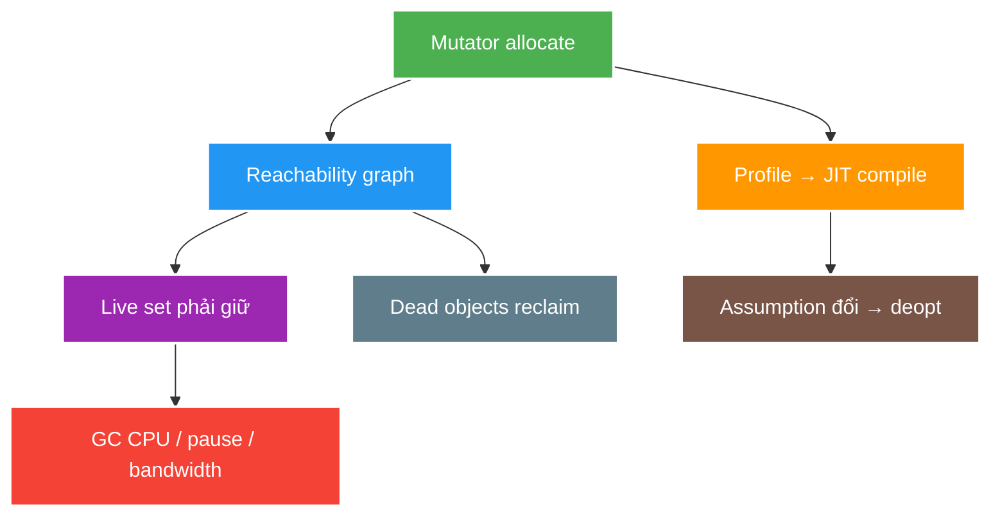

# JVM GC, JIT, Safepoints and Diagnostics

> Type: `DEEP_DIVE` 
> Domain: `java` 
> Target depth: `D3 — phân tích JFR/GC log/profile theo causal chain và bảo vệ tuning bằng before/after evidence` 
> Teaching readiness: `TEACHABLE_DRAFT` 
> Status: `DRAFT` 
> Evidence status: `NOT RUN` 
> Prerequisites: [JVM Class Loading, Bytecode and Memory](../core/jvm-class-loading-bytecode-and-memory.md) 
> Related cases: [`JVM-UC-01`](../../../../use-case-catalog.md#31-foundation-và-senior-cases), [`LIVE-UC-01`](../../../../use-case-catalog.md#live-uc-01) 
> Owner: `Project learner; Codex assists` 
> Updated: `2026-07-26`

Source canonical cho [JVM diagnostics question bank](../../question-bank/jvm-gc-jit-safepoints-and-diagnostics.md). Collector/version flags là HotSpot 21 boundary, không phải Java language guarantee.

## 0. Cách học file này

Bắt đầu từ causal question: ứng dụng allocate nhanh, giữ live set lớn, tắc lock/I/O hay tiêu CPU? Sau đó chọn một artifact trả lời đúng câu hỏi và so cùng workload trước/sau. Collector name không phải diagnosis.

## 1. Learning objectives

1. Phân biệt allocation rate, live set, promotion/fragmentation và pause/throughput goals.
2. Giải thích interpreter/JIT profiling, compilation, inlining và deoptimization/warm-up effect.
3. Chọn JFR, GC log, CPU profile, heap/thread dump theo symptom và kiểm chứng fix.

## 2. Mental model do người dạy cung cấp

Application threads (mutators) allocate và thay đổi graph; GC dùng CPU/bandwidth để tìm/giữ live objects và reclaim phần còn lại, đôi lúc cần coordination pause. Song song, interpreter thu type/profile rồi JIT compile hot path; assumption đổi có thể deoptimize. Latency quan sát được là tổng application work, GC/JIT/VM coordination và OS/resource contention.

## 3. GC internals

GC roots tạo reachability graph. Generational hypothesis tối ưu cho nhiều object chết trẻ; allocation thường rất rẻ trên thread-local allocation buffer, nhưng tổng allocation rate vẫn tiêu GC CPU/bandwidth. Live set và reference graph quyết định work phải giữ/move/mark, không chỉ heap capacity.

G1 chia heap thành regions, kết hợp young-only và mixed collections để hướng pause goal; concurrent phases vẫn dùng CPU cùng application. Humongous allocation/fragmentation hoặc concurrent cycle không theo kịp có thể dẫn tới Full GC. ZGC ưu tiên low pause với concurrent work/overhead khác; collector selection phải dựa SLO, heap, CPU và operation maturity.

Safepoint là trạng thái coordination nơi JVM có thể thực hiện một số global VM operation; stop-the-world pause không đồng nhất với “GC pause” duy nhất. Time-to-safepoint, class redefinition/deoptimization hoặc VM operation khác cũng cần correlation.

## 4. JIT internals

HotSpot tiered execution dùng interpreter/profile và compilation tiers. JIT có thể inline, eliminate allocation/lock và specialize theo observed types. Khi assumption invalid, deoptimization chuyển execution về less optimized form. Benchmark thiếu warm-up/fork dễ đo compilation/class loading/dead-code elimination thay vì business operation.

Code cache/compiler activity, uncommon trap và changing type profile có thể tạo latency/CPU pattern. “Method nhanh trong microbenchmark” không chứng minh request path nhanh hơn nếu database/network/allocation dominates.

## 5. Diagnostic decision table

Ví dụ: p99 tăng cùng allocation rate nhưng used-after-GC phẳng cho thấy object chết nhanh; heap dump không phải artifact đầu tiên tốt nhất, JFR allocation profile giúp tìm call site tạo DTO/String/buffer. Nếu used-after-GC tăng theo thời gian, dominator/retained path mới kiểm tra leak hypothesis. Hai symptom đều có GC nhiều nhưng root cause khác.

| Symptom | Evidence đầu tiên | Không kết luận vội |
| --- | --- | --- |
| CPU cao | JFR/CPU profile + thread states | GC chỉ vì thấy GC event |
| p99 pause | JFR latency/GC/safepoint + OS steal | Tăng heap ngay |
| Heap tăng | Used-after-GC/live set + heap dump | Allocation rate = leak |
| GC frequent | Allocation events/GC log/live set | Đổi collector trước giảm allocation |
| No progress | Thread dump/locks/pools/I/O | CPU thấp nghĩa hệ thống khỏe |
| Container OOMKill | RSS/cgroup + heap/native/thread budget | Heap OOME |

## 6. Failure modes

| Failure | Trigger | Symptom | Mechanism |
| --- | --- | --- | --- |
| Allocation storm | Temporary DTO/string/buffer | GC CPU/p99 | High allocation bandwidth |
| Retention leak | Cache/listener/session unbounded | Used-after-GC climbs | Live graph grows |
| Humongous pressure | Large arrays/buffers | Fragmentation/Full GC | Region allocation constraint |
| Warm-up latency | Cold deployment | Early p99/CPU | Compilation/class loading |
| Oversized heap | Long scan/live set/container pressure | Rare but long recovery/OOMKill | More memory not free |
| Tuning by flags | No workload/hypothesis | Regression elsewhere | Trade-off moved blindly |

## 7. Experiment implication

1. Fix workload/version/CPU/RAM, record warm-up and steady state separately.
2. Capture JFR with allocation, GC pause, thread/lock and CPU events; use GC log only for question it answers.
3. Change one variable; compare throughput/p50/p99/allocation/live-set/CPU/recovery.
4. Preserve raw recording/log path; no numbers generated in docs. Current evidence `NOT RUN`.

## 8. Trade-off matrix

| Option | Pause | Throughput/CPU | Memory | Operability |
| --- | --- | --- | --- | --- |
| G1 defaults | Balanced target | Good general purpose | Region overhead | Mature/default guidance |
| ZGC | Very low pause goal | Concurrent CPU overhead | Headroom needed | Validate platform/workload |
| Larger heap | Less frequent GC | May increase footprint/recovery | Higher | Masks retention risk |
| Reduce allocation/live set | Often improves both | Engineering cost | Lower | Root-cause durable |

## 9. Liên hệ case

| Case | Deep implication | Evidence chưa có |
| --- | --- | --- |
| `JVM-UC-01` | Allocation/GC/JIT diagnostic | JFR/workload |
| `LIVE-UC-01` | Thread/heap/headroom capacity | 100k simulation |
| `CHAT-UC-01` | Buffer/slow-consumer retention | Load/queue evidence |

## 10. Interview answer outline

Phân biệt allocation rate, live set và capacity; giải thích safepoint rộng hơn GC; nêu JIT warm-up/deopt. Sau đó map symptom→artifact→hypothesis→một thay đổi→before/after metrics. Không hứa collector nào “tốt nhất” ngoài workload/SLO.

## 11. Tóm tắt và learner write-back

- GC cost theo allocation và live graph, không chỉ Xmx.
- Safepoint/stop-the-world có thể đến từ VM operation khác GC.
- Cold/warm JIT state làm benchmark sai nếu không kiểm soát.
- Tuning hợp lệ cần raw evidence và cùng workload.

`LEARNER TODO — lập decision tree cho CPU cao, p99 pause và heap tăng.`

## 12. Guided self-check

1. **Question:** Allocation pressure và leak khác evidence nào? **Đọc lại nếu bí:** mục 2–6. **Rubric:** allocation rate/used-after-GC/dominator distinction. **My answer:** `LEARNER TODO`
2. **Question:** Vì sao safepoint không đồng nghĩa GC pause? **Đọc lại nếu bí:** mục 3. **Rubric:** JVM coordination cho nhiều VM operations và time-to-safepoint. **My answer:** `LEARNER TODO`
3. **Question:** Tuning cần evidence nào? **Đọc lại nếu bí:** mục 5, 7–8. **Rubric:** fixed workload, throughput/p99/CPU/allocation/live-set/recovery, one variable. **My answer:** `LEARNER TODO`

## 13. Official references

- [Java 21 GC Tuning Guide](https://docs.oracle.com/en/java/javase/21/gctuning/)
- [G1 GC Tuning](https://docs.oracle.com/en/java/javase/21/gctuning/garbage-first-garbage-collector-tuning.html)
- [ZGC](https://docs.oracle.com/en/java/javase/21/gctuning/z-garbage-collector.html)
- [Troubleshoot performance with JFR](https://docs.oracle.com/en/java/javase/21/troubleshoot/troubleshoot-performance-issues-using-jfr.html)

## 14. Teach-back checklist

- [ ] Tôi phân biệt allocation/live set/heap capacity.
- [ ] Tôi giải thích JIT warm-up/deoptimization effect.
- [ ] Tôi chọn evidence theo symptom.
- [ ] Tôi không tuning khi chưa có workload/baseline.
- [ ] Raw JFR/GC evidence vẫn `NOT RUN`.
