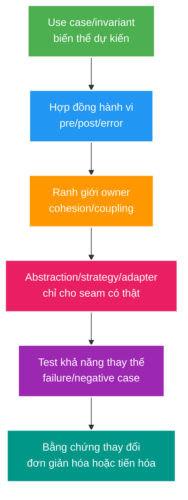

# Deep-dive: OOD Substitutability, Boundaries và Pattern Overengineering

> Type: `DEEP_DIVE` 
> Domain: `java` 
> Target depth: `D4 — diagnose design coupling/LSP failures and evolve boundaries without pattern cargo cult` 
> Teaching readiness: `TEACHABLE_DRAFT` 
> Status: `DRAFT` 
> Evidence status: `NOT RUN` 
> Prerequisites: [OOD/SOLID core](../core/object-oriented-design-solid-and-patterns.md) 
> Related cases: `JAVA-02`; [question bank](../../question-bank/object-oriented-design-solid-and-patterns.md) 
> Owner: `Project learner; Codex teaches, learner writes back` 
> Updated: `2026-07-26`

## 1. Design is change/failure containment

OOD tốt đặt tên và owner cho invariant, giữ thay đổi phổ biến trong một phạm vi nhỏ và làm cách dùng sai khó xảy ra. SOLID là các lăng kính để suy luận, không phải thước đo số lượng class. Hãy bắt đầu từ use case, hành vi và hợp đồng; chỉ đưa abstraction vào khi biến thể, tần suất thay đổi hoặc failure thực tế biện minh cho nó.

## 2. LSP as behavioral contract

Theo Liskov Substitution Principle, subtype hoặc implementation phải dùng được ở mọi nơi abstraction được mong đợi. Nó không được siết precondition, làm yếu postcondition/invariant hoặc phá ngữ nghĩa error, side effect và performance mà client đang dựa vào. Một implementation ném `UnsupportedOperationException` cho method bắt buộc thường cho thấy interface giả. Ví dụ payment provider hữu ích hơn bài Rectangle/Square: nếu provider có thể đã ghi tiền rồi mới timeout, hợp đồng cần idempotency và API tra status; chữ ký `pay(): boolean` không đủ để thay thế an toàn.

Contract test phải chạy cùng bộ hành vi trên mọi implementation. Hợp đồng cần ghi rõ `null`, exception, ordering, thread safety, transaction, cancellation và owner. Interface Segregation giúp client không phụ thuộc operation nó không dùng; nên tách command, query hoặc capability khi ngữ nghĩa khác nhau thay vì tạo interface lớn với method tùy chọn.

Inheritance chia sẻ implementation nhưng cũng ghép chặt lifecycle và state. Composition ủy quyền tường minh nên thường dễ thay đổi hơn. Inheritance phù hợp khi thật sự có quan hệ “is-a” với hợp đồng ổn định hoặc framework hook; value object thường nên final/record. Không tạo một interface cho mỗi class nếu không có biến thể, test seam hoặc owner rõ ràng.

## 3. SOLID trade-offs

SRP nghĩa là một lý do hoặc một owner thay đổi ở đúng cấp độ, không phải mỗi class chỉ có một method. Tách controller/service/repository vẫn có thể tạo god service. Extension point của OCP có chi phí; code đơn giản nên được sửa trực tiếp cho tới khi xuất hiện biến thể thật. DIP hướng dependency vào abstraction nghiệp vụ ổn định, không phải bọc mọi thư viện bằng interface. Adapter phù hợp ở ranh giới bên ngoài hay biến động; ISP tách capability theo nhu cầu client.

Tách quá mức làm luồng điều hướng, transaction và error khó lần theo; tách quá ít làm mọi thứ phụ thuộc nhau. Hãy đánh giá bằng diff của một thay đổi thật, số test bị ảnh hưởng và failure có bị cô lập hay không. Cohesion nên cao quanh invariant/use case, còn coupling cần có hướng rõ ràng.

## 4. Patterns by problem

`Strategy` biểu diễn các policy có thể thay thế với cùng hợp đồng hành vi, ví dụ tính rate/fee; dùng khi biến thể là thật thay vì một khối `if` lớn. `Factory` tập trung construction/lifecycle, không trở thành nơi chứa mọi nghiệp vụ. `Adapter` dịch API, model và failure bên ngoài. `Decorator` thêm cross-cutting concern nhưng phải định nghĩa thứ tự, xử lý trùng và transaction. `Template Method` dựa inheritance dễ giòn; pipeline composition thường tường minh hơn. `State pattern` hữu ích khi transition cần được cho phép rõ; enum/switch có thể đủ cho state machine nhỏ. `Observer/event` giảm coupling trực tiếp nhưng thêm bài toán ordering, transaction, error và side effect bị ẩn.

Các pathology phổ biến gồm singleton mutable gây race và khó test; service locator che dependency; abstract factory sinh quá nhiều lớp; repository rò entity/query cho mọi thứ; dùng event cho luồng bắt buộc trả kết quả đồng bộ; builder cho object quá đơn giản; hoặc nhiều wrapper “clean architecture” nhưng không sở hữu hành vi nào.

## 5. Boundary example

Mỗi webhook provider có chữ ký, payload và retry khác nhau. Tạo adapter dịch wire format thành `StreamLifecycleCommand` đã được xác thực; mỗi adapter tự kiểm protocol của provider, còn application service bảo vệ state và idempotency. Không tạo một `WebhookProvider` lớn với method optional hoặc unsupported. Contract test kiểm postcondition chung và vector riêng từng provider. Secret/auth ở adapter; domain không biết HTTP header.

Với payment ngoài cho gift, port phải định nghĩa idempotency key, trạng thái không chắc chắn sau timeout, API tra status và refund; `pay(): boolean` là quá nghèo. Khả năng thay thế implementation đòi hỏi cùng ngữ nghĩa operation, không chỉ cùng method signature.

## 6. Refactor safely

Khi refactor, trước tiên dùng characterization/contract test, xác định seam và owner, thêm facade/adapter, di chuyển từng hành vi, giữ API, so sánh rồi mới xóa đường cũ. Tránh abstraction cho tương lai tưởng tượng. Ghi complexity budget và ngày xem lại quyết định. Static architecture test chỉ kiểm hướng dependency, không chứng minh thiết kế đúng nghiệp vụ.

### Hai failure để kiểm tra abstraction có thật hay không

**Implementation “thay thế được” nhưng phá timeout semantics:** provider A trả lỗi trước khi ghi, provider B có thể ghi thành công rồi mất response. Nếu cùng implement `pay(): boolean`, caller sẽ retry giống nhau và provider B có thể double charge. Triệu chứng là ledger và provider lệch dù compile/contract kiểu dữ liệu đều pass. Evidence cần timeline request, idempotency key, provider status lookup và reconciliation. Mitigation là nâng hợp đồng port từ boolean thành operation có identity và outcome `SUCCEEDED/FAILED/UNKNOWN`.

**Decorator đổi thứ tự làm transaction sai:** retry decorator bọc ngoài transaction tạo transaction mới cho mỗi attempt; nếu transaction bọc ngoài retry, một attempt làm transaction rollback-only có thể khiến attempt sau “thành công” nhưng commit cuối vẫn thất bại. Triệu chứng phụ thuộc advice order. Test phải đếm attempt, transaction identity và commit. Mitigation là đặt thứ tự theo semantics đã chọn, viết contract test cho decorator chain và giữ side effect idempotent.

### 6.1. Pathology A — cùng interface nhưng implementation siết precondition

`GiftPaymentPort.charge` contract chấp nhận mọi positive amount trong currency support. Provider B implementation âm thầm yêu cầu amount tối thiểu cao hơn hoặc ném unchecked exception khác; caller dùng qua port không có branch xử lý. Signature compile nhưng substitutability hỏng vì implementation tăng precondition và đổi failure semantics.

Contract phải nói allowed input, outcome states, timeout/unknown outcome, idempotency, exception mapping và side effects. Provider-specific restriction được normalize thành explicit domain outcome/capability hoặc caller phải chọn provider trước boundary. Parameterized contract tests chạy trên mọi adapter, gồm boundary amounts, duplicate key, timeout-after-commit và cancellation. Mock chỉ trả boolean không đủ kiểm semantics.

### 6.2. Pathology B — Decorator order đổi transaction và duplicate behavior

Service được bọc retry, transaction, metrics và idempotency decorators/proxies. Nếu retry ở ngoài transaction, mỗi attempt có transaction mới; nếu ở trong cùng transaction đã rollback-only, retries vô nghĩa. Nếu idempotency record ghi sau retry hoặc metrics decorator đếm attempts như business operations, dashboard/behavior sai. Hai classes đều “đúng pattern” nhưng composition order là phần của contract.

Diagnostic vẽ call order thực, log bounded attempt/transaction IDs và test failure ở từng boundary. Spring proxy/self-invocation có thể làm annotation không chạy. Pattern không xóa framework mechanics; order/ownership phải explicit và test bằng effect, không chỉ verify method call.

### 6.3. Pathology C — event hóa một required synchronous decision

Để “decouple”, code publish `CheckWalletEvent` rồi tiếp tục tạo gift trước khi listener trả lời. Business invariant cần sufficient balance ngay trong command, nhưng Observer/event semantics là asynchronous/hidden failure. Hoặc listener chạy synchronously nhưng transaction/error ordering không rõ, tạo coupling còn khó thấy hơn direct call.

Event phù hợp notification/fact sau state transition khi consumers độc lập và eventual effect chấp nhận. Required decision nằm trong application/domain boundary hoặc explicit port có response. Outbox giải quyết durable after-commit notification, không biến precondition thành eventual.

### 6.4. Pathology D — interface-per-class làm change lan rộng hơn

Mỗi service có interface chỉ với một implementation, DTO/mapper/facade pass-through nhiều tầng. Một field/exception đổi phải sửa hàng loạt types nhưng không tạo variation hay stable ownership; debugging stack sâu và transaction boundary mờ. DIP không yêu cầu mọi concrete class có interface. Abstraction có giá trị khi nó bảo vệ stable policy khỏi volatile detail, tách owner/deploy boundary hoặc tạo real alternative/test seam.

Evidence của overengineering là change diffusion, navigation/test setup cost và abstractions không có behavioral contract. Refactor có thể inline/remove seam an toàn; simplicity cũng là design outcome.

## 6.5. Design review procedure

1. Viết use case/invariant và likely change/failure trước class diagram.
2. Với mỗi abstraction, ghi clients, implementations và behavioral contract—including errors, side effects, ordering, thread/transaction semantics.
3. Kiểm substitutability bằng contract tests và negative/fault cases.
4. Vẽ dependency direction/owner; tìm cycle, hidden service locator/event side effect và data leakage.
5. So ít nhất hai options: simple conditional/composition hiện tại versus extensible pattern; tính complexity budget và rollback.
6. Dùng characterization tests, move one behavior, compare effects rồi xóa old path. Evidence `NOT RUN` cho project case.

Cross-layer boundary gồm Spring proxy lifecycle, JPA transaction/entity semantics, serialization/API contracts và broker eventual delivery. Một design “sạch” trong Java types nhưng làm transaction/network failure vô hình vẫn không đạt Senior quality.

## 6.6. Interview outline

Senior giải thích SOLID bằng một change/failure cụ thể và trade-off, không đọc acronym. Architect nói ownership/module boundaries, contract evolution và operational consequences. Expert phân tích behavioral subtyping dưới timeout/concurrency/transaction, composition order và khi nên xóa abstraction.

## 7. Learner write-back và self-check

> **Bài viết của tôi — `LEARNER TODO`:** evaluate one project abstraction for behavioral substitution and pattern cost.

1. **Question:** Một payment adapter có cùng method signature vẫn có thể vi phạm LSP như thế nào? 
   **Đọc lại nếu bí:** mục 2 và 6.1. 
   **Một câu trả lời tốt phải có:** pre/postcondition, error/unknown outcome/idempotency semantics, capability option và shared contract tests. 
   **My answer:** `LEARNER TODO`
2. **Question:** Vì sao order của retry/transaction/idempotency decorators là một phần của correctness? 
   **Đọc lại nếu bí:** mục 4 và 6.2. 
   **Một câu trả lời tốt phải có:** concrete call order, transaction-per-attempt/rollback-only, business versus attempt metrics và Spring proxy evidence. 
   **My answer:** `LEARNER TODO`
3. **Question:** Khi nào event/pattern/interface làm design tệ hơn code trực tiếp? 
   **Đọc lại nếu bí:** mục 3–6 và 6.3–6.5. 
   **Một câu trả lời tốt phải có:** required synchronous invariant, real variation/owner, hidden failure/change diffusion, simpler alternative và test/rollback. 
   **My answer:** `LEARNER TODO`

## 8. References

- [Oracle Java Tutorials — Interfaces and Inheritance](https://docs.oracle.com/javase/tutorial/java/IandI/index.html)
- [Spring Framework — Core Technologies](https://docs.spring.io/spring-framework/reference/core.html)

- [ ] Evidence remains `NOT RUN`.
