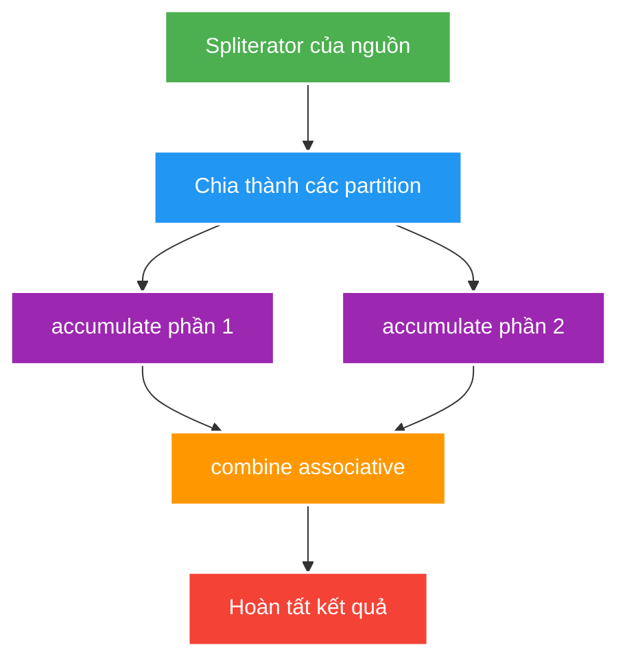

# Stream Laziness, Collectors, Parallelism and Resources

> Type: `DEEP_DIVE`<br>
> Domain: `java`<br>
> Target depth: `D3 — chẩn đoán pipeline allocation/N+1/ordering và benchmark parallel decision đúng cách`<br>
> Teaching readiness: `TEACHABLE_DRAFT`<br>
> Status: `DRAFT`<br>
> Evidence status: `NOT RUN`<br>
> Prerequisites: [Stream API core](../core/stream-api-functional-programming-and-optional.md)<br>
> Related cases: [`FEED-UC-01`](../../../../use-case-catalog.md#31-foundation-và-senior-cases), [`ANALYTICS-UC-01`](../../../../use-case-catalog.md#analytics-uc-01)<br>
> Owner: `Project learner; Codex assists`<br>
> Updated: `2026-07-26`

## 0. Cách học file này

Theo dõi một phần tử qua pipeline trước, rồi mới hỏi pipeline cần giữ state toàn cục nào. Với collector, kiểm tra kết quả khi chia input thành hai phần rồi combine có giống xử lý tuần tự không. Với resource và parallelism, xác định rõ owner/pool thay vì dựa vào default.

## 1. Learning objectives

1. Reason về stage fusion, short-circuit, stateful operations và spliterator characteristics.
2. Chứng minh collector associativity/identity/ordering trước parallel execution.
3. Giữ resource/transaction/context lifetime không bị lazy pipeline vượt qua.

## 2. Mental model do người dạy cung cấp

Terminal operation tạo demand kéo phần tử từ source qua chuỗi stage. Implementation có thể fuse stage stateless để một phần tử đi hết pipeline trước khi lấy phần tử kế tiếp. Stateful operation phá tính streaming vì cần nhìn nhiều hoặc toàn bộ input. Parallel pipeline chia source, tích lũy từng phần rồi combine; phép combine phải giữ cùng meaning bất kể cách chia nhóm.



## 3. Internal mechanism

Pipeline thường traverse element qua fused stages thay vì tạo collection cho mỗi `map/filter`, nhưng stateful operation như `sorted`, `distinct` hoặc ordered parallel coordination có thể cần buffer/barrier. `findFirst` giữ encounter order nên có thể đắt hơn `findAny` trong parallel context.

Spliterator mô tả traversal/splitting và characteristics như `ORDERED`, `SIZED`, `SUBSIZED`, `DISTINCT`, `SORTED`, `CONCURRENT`, `IMMUTABLE`. Parallel efficiency phụ thuộc khả năng split cân bằng, computation per element và combine cost; chỉ đổi `.stream()` thành `.parallelStream()` không thay data-source capability.

Reduction song song cần associative accumulator/combiner và identity đúng. Floating-point addition không thật sự associative do rounding; mutable reduce sai có thể reuse cùng identity hoặc violate combiner contract. Collector `CONCURRENT` không có nghĩa mọi downstream object/thread side effect an toàn.

Resource-backed streams như file lines hoặc persistence/query stream mang close/lifecycle obligation. Lazy stream trả khỏi transaction có thể evaluate sau khi session/connection đóng hoặc giữ resource lâu hơn caller nghĩ.

### Worked example — collector đúng và sai

Tính tổng bằng identity `0`, accumulator `+`, combiner `+` là associative. Ngược lại, lấy “trung bình của các trung bình” mà không mang theo count là sai khi partition có kích thước khác nhau. Collector đúng phải tích lũy `(sum, count)` rồi combine cả hai. Pipeline tuần tự cho kết quả đúng chưa chứng minh collector song song đúng.

### Worked example — resource lifecycle

```java
try (Stream<String> lines = Files.lines(path)) {
    return lines.filter(this::isValid).limit(100).toList();
}
```

Scope lexical nói rõ ai đóng file kể cả khi mapper ném exception. Trả stream ra ngoài chuyển trách nhiệm đóng cho caller; với JPA stream còn có thể kéo cursor/connection vượt transaction.

## 4. Pathological cases

Các failure có cùng mẫu: abstraction làm chi phí bị ẩn. `distinct` giữ set đã thấy; `sorted` giữ dữ liệu; ordered parallel pipeline phối hợp để giữ encounter order; blocking mapper chiếm common-pool worker; resource-backed source giữ handle đến khi đóng. Muốn debug, mở pipeline thành từng stage và ghi state/resource của stage đó.

| Case | Causal chain | Symptom |
| --- | --- | --- |
| Parallel small list | Split/schedule/combine > useful work | Slower/variable latency |
| Blocking mapper | Common-pool worker waits I/O | Starvation/interference |
| Ordered parallel limit | Coordination preserves prefix | Low scaling/high buffer |
| Stateful side effect | Execution order/thread varies | Duplicate/missing state |
| Lazy ORM stream | Transaction closes before terminal op | Lazy/connection failure |
| Infinite source + non-short-circuit | Terminal needs all elements | Never completes/memory growth |

## 5. Cross-layer interaction

- Stream có thể che lời gọi repository/network trong mapper; phải dùng query count hoặc trace để phát hiện N+1.
- `.toList()` returns unmodifiable list in modern JDK contract; mutability expectation must be explicit.
- Parallel stream dùng common pool và có thể tranh worker với `CompletableFuture` chạy async mặc định.
- Backpressure của Reactor/Reactive Streams là mô hình khác; Java Stream duyệt theo kiểu pull và thường hữu hạn, đồng bộ.

## 6. Experiment implication

1. Dùng JMH so loop, sequential stream và parallel stream ở nhiều kích thước dữ liệu/chi phí CPU; tách I/O khỏi benchmark.
2. Count DB calls/allocation/materialized size for project mapping pipeline.
3. Test collector ở chế độ sequential và parallel với partition/thứ tự được xáo trộn.
4. Verify resource close on success/failure/short-circuit. Evidence remains `NOT RUN`.

## 7. Trade-off matrix

| Option | Semantic risk | Performance | Resource/control | Debuggability |
| --- | --- | --- | --- | --- |
| Loop | Low/explicit | Often predictable | Full control | High |
| Sequential stream | Low if pure | Good bounded mapping | Lazy/resource caveat | Medium |
| Parallel stream | High if state/order/I/O | Workload-dependent | Common pool unless custom mechanism | Lower |
| DB/set operation | Cross-layer semantics | Best for large resident data | DB transaction/resource | Query-plan tools |

## 8. Liên hệ case

| Case | Deep implication | Evidence chưa có |
| --- | --- | --- |
| `FEED-UC-01` | N+1/materialization/order | Query-count and plan |
| `ANALYTICS-UC-01` | Associative projection/replay | Event workload |
| `NOTIFY-UC-01` | Batch/filter without shared side effect | Fan-out load |

### 8.1. Pathology — stream giữ JDBC resource lâu hơn transaction

Repository trả về một `Stream<Entity>` đọc lười từ result set. Service trả stream ra controller hoặc giữ để xử lý sau, nhưng transaction đã kết thúc khi method return. Terminal operation chạy muộn sẽ gặp connection/result set đã đóng; trường hợp khác còn giữ connection suốt lúc client xử lý chậm. Triệu chứng có thể là lỗi lazy initialization, pool pending tăng hoặc connection leak warning chứ không nằm ngay ở dòng tạo stream.

Cách chứng minh là ghi thời điểm mở/đóng transaction và connection, đặt terminal operation cả bên trong lẫn ngoài boundary rồi kiểm pool metric. Mitigation là materialize một tập có bound trong transaction, xử lý stream trong callback sở hữu resource, hoặc dùng `try-with-resources`. Không trả lazy ORM stream qua ranh giới layer khi owner đóng resource không còn rõ.

### 8.2. Pathology — collector đúng ở sequential nhưng sai khi parallel

Một collector dùng container mutable chung, `combiner` trả nhầm một phía hoặc khai báo `CONCURRENT` dù accumulator không thread-safe. Sequential luôn xanh vì chỉ có một container; parallel chia dữ liệu thành nhiều partition, combine theo cây và có thể đổi thứ tự, làm mất hoặc lặp phần tử. Thêm `synchronized` vào accumulator có thể tránh race nhưng không sửa identity/associativity sai và thường làm mất lợi ích parallel.

Test phải chạy nhiều partition/thứ tự, so với kết quả tham chiếu và kiểm các luật: supplier tạo identity rỗng; accumulator thêm một phần tử; combiner kết hợp hai partial result không làm mất dữ liệu; finisher giữ đúng contract. Với collector phụ thuộc encounter order, không khai báo `UNORDERED`. Evidence chỉ có giá trị trên đúng JDK, kích thước và spliterator; hiện vẫn `NOT RUN`.

### 8.3. Pathology — parallel stream làm nghẽn common pool

Mapper tưởng là CPU-bound nhưng bên trong gọi repository/HTTP. Worker của common `ForkJoinPool` bị block; các parallel stream và `CompletableFuture` mặc định khác trong process cùng thiếu worker. p99 tăng ở endpoint không liên quan, trong khi CPU chưa đầy. Thread dump cho thấy common-pool worker chờ I/O; trace/query count làm lộ lời gọi ẩn. Mitigation là đưa I/O ra khỏi stream, batch ở database, dùng executor thuộc sở hữu rõ hoặc giữ sequential flow. Tăng parallelism toàn cục có thể khuếch đại tải xuống database.

### 8.4. Quy trình đo để không kết luận “parallel nhanh hơn” sai

Benchmark phải tách dữ liệu in-memory và I/O, warm-up JIT, dùng JMH thay vì `System.nanoTime` một lần, thử nhiều kích thước và chi phí mỗi phần tử. Ghi CPU core/container quota, JDK, collector, ordering và allocation. So loop, sequential và parallel bằng cùng kết quả đúng trước khi so throughput. Với workload server, còn phải đo ảnh hưởng lên common pool và request p99 khác, không chỉ thời gian một tác vụ cô lập.

## 9. Dàn ý trả lời phỏng vấn

Trả lời từ execution model: terminal demand kéo source; stateless stages có thể fuse, stateful stages buffer; parallel execution cần splittable source và associative collector; common pool không phù hợp mặc định cho blocking request work; resource-backed stream phải đóng trong owner scope. Kèm counterexample average-of-averages hoặc JPA stream vượt transaction.

## 10. Tóm tắt và phần người học viết lại

- Collector contract là algebraic correctness, không chỉ thread safety.
- `parallel()` đổi execution strategy, không sửa algorithm hay I/O boundary.
- Encounter order có correctness cost và coordination cost.
- Lazy resource phải có lifetime ngắn, explicit và test được.

`LEARNER TODO — giải thích một collector bằng supplier/accumulator/combiner/finisher và chỉ ra resource owner.`

## 11. Guided self-check

1. **Question:** Operation nào phá streaming/fusion và vì sao?<br>**Đọc lại nếu bí:** mục 2–4.<br>**Rubric:** stateful stage, buffering/barrier, order và short-circuit placement.<br>**My answer:** `LEARNER TODO`
2. **Question:** Collector nào hợp lệ sequential nhưng sai parallel?<br>**Đọc lại nếu bí:** worked example.<br>**Rubric:** identity/associativity/combiner và partition khác kích thước.<br>**My answer:** `LEARNER TODO`
3. **Question:** Resource/transaction lifetime thuộc layer nào?<br>**Đọc lại nếu bí:** resource example và mục 5.<br>**Rubric:** lexical owner, try-with-resources, terminal execution trước khi transaction đóng.<br>**My answer:** `LEARNER TODO`

## 12. Official references

- [Java SE 21 Stream package](https://docs.oracle.com/en/java/javase/21/docs/api/java.base/java/util/stream/package-summary.html)
- [Java SE 21 `Spliterator`](https://docs.oracle.com/en/java/javase/21/docs/api/java.base/java/util/Spliterator.html)
- [Java SE 21 `Collector`](https://docs.oracle.com/en/java/javase/21/docs/api/java.base/java/util/stream/Collector.html)

## 13. Teach-back checklist

- [ ] Tôi giải thích stateful barrier/short-circuit/order.
- [ ] Tôi chứng minh collector algebra thay vì nói “thread-safe”.
- [ ] Tôi nhận diện common-pool và resource-lifetime boundary.
- [ ] Tôi chỉ parallelize sau workload/JMH evidence.
- [ ] Evidence vẫn `NOT RUN`.
