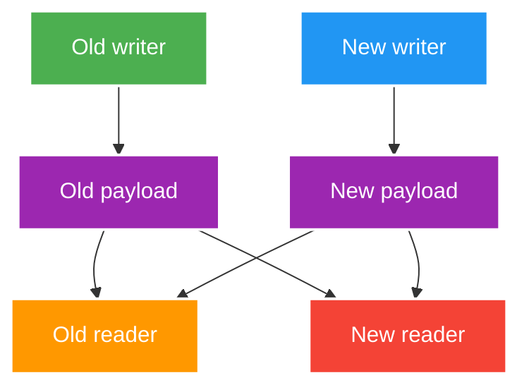

# Time, Money and Serialization Compatibility

> Type: `DEEP_DIVE` 
> Domain: `java` 
> Target depth: `D3 — tái hiện DST/rounding/mixed-version failure và thiết kế migration/reconciliation` 
> Teaching readiness: `TEACHABLE_DRAFT` 
> Status: `DRAFT` 
> Evidence status: `NOT RUN` 
> Prerequisites: [Exceptions, Time, Money and Serialization](../core/exceptions-time-money-and-serialization-boundaries.md) 
> Related cases: [`GIFT-UC-01`](../../../../use-case-catalog.md#gift-uc-01), [`PAYOUT-UC-01`](../../../../use-case-catalog.md#31-foundation-và-senior-cases) 
> Owner: `Project learner; Codex assists` 
> Updated: `2026-07-26`

## 0. Cách học file này

Dùng ba phép thử: chuyển đổi qua DST, chia một số tiền không chia hết, và cho old/new reader đọc chéo payload. Nếu design không nêu policy ở các điểm mơ hồ này, code happy path chưa có nghĩa contract an toàn.

## 1. Learning objectives

1. Phân tích DST gap/overlap, clock drift và expiry boundary theo timeline.
2. Thiết kế Money canonicalization/rounding/allocation giữ ledger invariant.
3. Xây compatibility matrix cho old/new reader/writer và replayed cache/event payload.

## 2. Mental model do người dạy cung cấp

`Instant` là điểm duy nhất trên timeline; local date-time là nhãn con người nhìn thấy và cần zone rules để ánh xạ. Money là quantity trong một currency với arithmetic policy. Payload version là lời hứa giữa writer và reader có thể không deploy cùng lúc. Cả ba đều cần giữ meaning khi representation đi qua boundary.

## 3. Time internals và failure

Zone rules ánh xạ local time sang zero/one/two valid offsets: DST gap có local time không tồn tại, overlap có hai instant ứng viên. Lưu `LocalDateTime` mà thiếu zone/offset làm mất thông tin. TTL/timeout nên dựa duration/monotonic source khi đo elapsed time; wall clock có thể jump. Business schedule cần explicit zone/rule và policy khi gap/overlap.

Distributed systems không có “now” tuyệt đối đồng nhất. Timestamp không thay causal ordering/sequence/fencing. Token expiry cần bounded skew policy nhưng không mở window tùy tiện.

Ví dụ, `2026-11-01 01:30` ở zone có DST overlap có thể ánh xạ thành hai instant. Policy scheduling phải chọn offset sớm/muộn hoặc từ chối ambiguity; tự động đoán khiến job có thể chạy hai lần. Đo timeout nên dùng duration/monotonic source vì wall clock có thể bị NTP điều chỉnh.

## 4. Money internals và failure

`BigDecimal` construction từ binary `double` có thể mang decimal representation bất ngờ; prefer decimal string/value factory phù hợp. Division/allocation có remainder nên domain phải chọn rounding và nơi hạch toán phần dư. `stripTrailingZeros` có thể đổi scale (kể cả negative scale), vì vậy canonicalization cần contract, không gọi tùy tiện trước persistence/serialization.

Ledger nên lưu immutable entries/adjustments; current balance là derived/projection hoặc atomic durable state có reconciliation. Refund/chargeback không xóa lịch sử cũ mà ghi compensating entry theo policy.

## 5. Serialization compatibility matrix

Ma trận phải được chạy bằng serializer/config thật. “JSON thường bỏ qua field lạ” không đủ vì application có thể bật strict mode, đổi enum/type, ký canonical bytes hoặc dùng cache key version cũ. Rolling deploy còn cần đường rollback: old app phải chịu được dữ liệu node mới vừa ghi, hoặc key/topic/version phải tách.

| Writer -> Reader | Risk | Required policy |
| --- | --- | --- |
| Old -> New | Missing new fields | Default/migration/validation |
| New -> Old | Unknown field/enum/type | Tolerant reader or rollout order |
| Replay old event -> New | Historic semantics | Upcaster/versioned handler |
| New cache -> Old app | Rolling rollback decode | Versioned key/DTO compatibility |
| Signed payload change | Canonical bytes differ | Explicit signature version |

## 6. Pathological cases

| Case | Symptom | Root mechanism |
| --- | --- | --- |
| DST scheduled start | Job runs twice/never | Ambiguous/nonexistent local time |
| Clock rollback | TTL/session appears valid longer | Wall clock non-monotonic |
| Divide amount | Sum of shares != original | Rounding remainder ignored |
| Scale mismatch | Equality/dedup/cache key differs | Representation not canonical |
| Enum addition | Old consumer crashes | Unknown variant not handled |
| Cache DTO rollout | Redis fallback storm | Mixed app versions cannot decode |

## 7. Experiment implication

1. Inject fixed/mutable `Clock`; test before/at/after expiry and DST gap/overlap zone.
2. Property test Money allocation: sum(parts) equals original, no forbidden scale/currency mix.
3. Golden payload compatibility: old/new reader/writer plus rollback and replay.
4. Evidence remains `NOT RUN`; sample payload is not proof until actual serializer/config is used.

## 8. Trade-off matrix

| Option | Correctness | Complexity | Operability | Evolution |
| --- | --- | --- | --- | --- |
| Local time everywhere | Ambiguous | Thấp | Incident khó correlate | Zone migration khó |
| Instant + zone at boundary | Timeline rõ | Vừa | Audit tốt | Presentation flexible |
| Raw BigDecimal | Rule phân tán | Thấp | Reconciliation khó | Scale drift |
| Money value object | Invariant tập trung | Vừa | Audit rõ | Controlled change |
| In-place DTO change | Mixed-version risk | Thấp | Rollback khó | Fast but fragile |
| Versioned DTO/key/event | Compatibility explicit | Cao hơn | Replay/rollback rõ | Durable |

## 9. Liên hệ case

| Case | Deep implication | Evidence chưa có |
| --- | --- | --- |
| `GIFT-UC-01` | Money allocation/rounding/outcome | Ledger tests |
| `PAYOUT-UC-01` | Adjustment/reconciliation | Settlement dataset |
| `SESSION-UC-01` | Expiry/skew/cache DTO | Clock/serializer tests |

## 10. Interview answer outline

Nêu canonical model, ambiguity và test: instant/zone/DST + injected Clock; amount/currency/rounding + conservation property; old/new writer-reader + replay/rollback fixture. Senior answer phải chỉ ra policy owner, không nói “dùng thư viện là xong”.

## 11. Tóm tắt và learner write-back

- Wall-clock label không tự xác định một instant.
- Timestamp không thay causal ordering trong distributed system.
- Money allocation phải bảo toàn tổng và audit remainder.
- Compatibility là ma trận hai chiều qua rolling deploy, replay và rollback.

`LEARNER TODO — viết policy cho một lịch livestream, một phép chia gift và một thay đổi DTO.`

## 12. Guided self-check

1. **Question:** DST gap/overlap ảnh hưởng scheduled livestream thế nào? **Đọc lại nếu bí:** mục 2–3. **Rubric:** zero/two valid offsets, explicit policy, zone owner và deterministic test. **My answer:** `LEARNER TODO`
2. **Question:** Chia Money có remainder thì giữ invariant ra sao? **Đọc lại nếu bí:** mục 4. **Rubric:** minor unit, deterministic allocation, sum(parts)=original và audit. **My answer:** `LEARNER TODO`
3. **Question:** Compatibility matrix nào cần pass? **Đọc lại nếu bí:** mục 2, 5 và 7. **Rubric:** old→new, new→old, replay, rollback và actual serializer fixtures. **My answer:** `LEARNER TODO`

## 13. Official references

- [Java SE 21 Date and Time API](https://docs.oracle.com/en/java/javase/21/docs/api/java.base/java/time/package-summary.html)
- [Java SE 21 `ZoneRules`](https://docs.oracle.com/en/java/javase/21/docs/api/java.base/java/time/zone/ZoneRules.html)
- [Java SE 21 `BigDecimal`](https://docs.oracle.com/en/java/javase/21/docs/api/java.base/java/math/BigDecimal.html)
- [Java Object Serialization Specification](https://docs.oracle.com/en/java/javase/21/docs/specs/serialization/)

## 14. Teach-back checklist

- [ ] Tôi phân biệt elapsed duration với wall-clock timestamp.
- [ ] Tôi test DST/clock skew bằng injected Clock.
- [ ] Tôi bảo vệ Money sum/currency/scale invariant.
- [ ] Tôi lập old/new reader/writer matrix trước rollout.
- [ ] Evidence vẫn `NOT RUN`.
