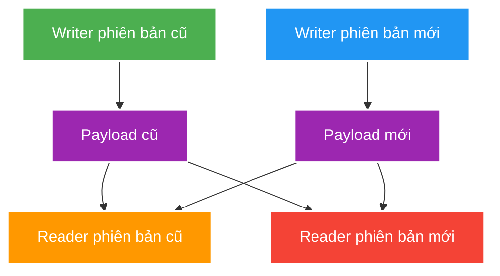

# Time, Money and Serialization Compatibility

> Type: `DEEP_DIVE` 
> Domain: `java` 
> Target depth: `D3 — tái hiện DST/rounding/mixed-version failure và thiết kế migration/reconciliation` 
> Teaching readiness: `TEACHABLE_DRAFT` 
> Status: `DRAFT` 
> Evidence status: `NOT RUN` 
> Prerequisites: [Exceptions, Time, Money and Serialization](../core/exceptions-time-money-and-serialization-boundaries.md) 
> Related cases: [`GIFT-UC-01`](../../../../use-case-catalog.md#gift-uc-01), [`PAYOUT-UC-01`](../../../../use-case-catalog.md#31-foundation-và-senior-cases) 
> Owner: `Project learner; Codex assists` 
> Updated: `2026-07-26`

## 0. Cách học file này

Dùng ba phép thử: chuyển đổi qua DST, chia một số tiền không chia hết, và cho old/new reader đọc chéo payload. Nếu design không nêu policy ở các điểm mơ hồ này, code happy path chưa có nghĩa contract an toàn.

## 1. Learning objectives

1. Phân tích DST gap/overlap, clock drift và expiry boundary theo timeline.
2. Thiết kế Money canonicalization/rounding/allocation giữ ledger invariant.
3. Xây compatibility matrix cho old/new reader/writer và replayed cache/event payload.

## 2. Mental model do người dạy cung cấp

`Instant` là điểm duy nhất trên timeline; local date-time là nhãn con người nhìn thấy và cần zone rules để ánh xạ. Money là quantity trong một currency với arithmetic policy. Payload version là lời hứa giữa writer và reader có thể không deploy cùng lúc. Cả ba đều cần giữ meaning khi representation đi qua boundary.

## 3. Time internals và failure

Zone rules ánh xạ local time sang zero/one/two valid offsets: DST gap có local time không tồn tại, overlap có hai instant ứng viên. Lưu `LocalDateTime` mà thiếu zone/offset làm mất thông tin. TTL/timeout nên dựa duration/monotonic source khi đo elapsed time; wall clock có thể jump. Business schedule cần explicit zone/rule và policy khi gap/overlap.

Distributed systems không có “now” tuyệt đối đồng nhất. Timestamp không thay causal ordering/sequence/fencing. Token expiry cần bounded skew policy nhưng không mở window tùy tiện.

Ví dụ, `2026-11-01 01:30` ở zone có DST overlap có thể ánh xạ thành hai instant. Policy scheduling phải chọn offset sớm/muộn hoặc từ chối ambiguity; tự động đoán khiến job có thể chạy hai lần. Đo timeout nên dùng duration/monotonic source vì wall clock có thể bị NTP điều chỉnh.

## 4. Money internals và failure

`BigDecimal` construction từ binary `double` có thể mang decimal representation bất ngờ; prefer decimal string/value factory phù hợp. Division/allocation có remainder nên domain phải chọn rounding và nơi hạch toán phần dư. `stripTrailingZeros` có thể đổi scale (kể cả negative scale), vì vậy canonicalization cần contract, không gọi tùy tiện trước persistence/serialization.

Ledger nên lưu immutable entries/adjustments; current balance là derived/projection hoặc atomic durable state có reconciliation. Refund/chargeback không xóa lịch sử cũ mà ghi compensating entry theo policy.

## 5. Serialization compatibility matrix

Ma trận phải được chạy bằng serializer/config thật. “JSON thường bỏ qua field lạ” không đủ vì application có thể bật strict mode, đổi enum/type, ký canonical bytes hoặc dùng cache key version cũ. Rolling deploy còn cần đường rollback: old app phải chịu được dữ liệu node mới vừa ghi, hoặc key/topic/version phải tách.

| Writer -> Reader | Risk | Required policy |
| --- | --- | --- |
| Old -> New | Missing new fields | Default/migration/validation |
| New -> Old | Unknown field/enum/type | Tolerant reader or rollout order |
| Replay old event -> New | Historic semantics | Upcaster/versioned handler |
| New cache -> Old app | Rolling rollback decode | Versioned key/DTO compatibility |
| Signed payload change | Canonical bytes differ | Explicit signature version |

## 6. Pathological cases

| Case | Symptom | Root mechanism |
| --- | --- | --- |
| DST scheduled start | Job runs twice/never | Ambiguous/nonexistent local time |
| Clock rollback | TTL/session appears valid longer | Wall clock non-monotonic |
| Divide amount | Sum of shares != original | Rounding remainder ignored |
| Scale mismatch | Equality/dedup/cache key differs | Representation not canonical |
| Enum addition | Old consumer crashes | Unknown variant not handled |
| Cache DTO rollout | Redis fallback storm | Mixed app versions cannot decode |

## 7. Experiment implication

1. Inject `Clock` cố định hoặc điều khiển được; test trước, đúng và sau thời điểm hết hạn, cùng DST gap/overlap của timezone cụ thể.
2. Property test Money allocation: sum(parts) equals original, no forbidden scale/currency mix.
3. Golden payload compatibility: old/new reader/writer plus rollback and replay.
4. Evidence vẫn `NOT RUN`; payload mẫu không phải bằng chứng cho tới khi chạy đúng serializer và config thực tế.

## 8. Trade-off matrix

| Option | Correctness | Complexity | Operability | Evolution |
| --- | --- | --- | --- | --- |
| Local time everywhere | Ambiguous | Thấp | Incident khó correlate | Zone migration khó |
| Instant + zone at boundary | Timeline rõ | Vừa | Audit tốt | Presentation flexible |
| Raw BigDecimal | Rule phân tán | Thấp | Reconciliation khó | Scale drift |
| Money value object | Invariant tập trung | Vừa | Audit rõ | Controlled change |
| In-place DTO change | Mixed-version risk | Thấp | Rollback khó | Fast but fragile |
| Versioned DTO/key/event | Compatibility explicit | Cao hơn | Replay/rollback rõ | Durable |

## 9. Liên hệ case

| Case | Deep implication | Evidence chưa có |
| --- | --- | --- |
| `GIFT-UC-01` | Money allocation/rounding/outcome | Ledger tests |
| `PAYOUT-UC-01` | Adjustment/reconciliation | Settlement dataset |
| `SESSION-UC-01` | Expiry/skew/cache DTO | Clock/serializer tests |

### 9.1. Pathology — lịch 02:30 rơi vào DST gap hoặc overlap

Một lịch được lưu là “02:30 theo múi giờ của streamer”. Ngày chuyển DST có thể không tồn tại 02:30, hoặc local time xuất hiện hai lần khi đồng hồ lùi. Nếu code đổi `LocalDateTime` sang instant bằng timezone mặc định của máy, hai pod ở zone khác nhau còn tạo kết quả khác. Triệu chứng là job không chạy, chạy hai lần hoặc audit hiển thị sai dù timestamp database hợp lệ.

Thiết kế phải giữ ý định lịch dưới dạng local date/time + `ZoneId` và quy tắc giải quyết gap/overlap: dời tới thời điểm hợp lệ kế tiếp, chọn offset sớm/muộn hoặc yêu cầu người dùng xác nhận. Event đã xảy ra lưu `Instant`; cách hiển thị mới dùng zone. Test dùng zone có transition thật và `Clock` cố định, không đổi timezone toàn JVM. Evidence phải pin tzdata/JDK vì rule timezone có thể được cập nhật.

### 9.2. Pathology — chia tiền làm mất hoặc tạo thêm đơn vị nhỏ nhất

Gift 100 đơn vị nhỏ nhất chia cho ba bên không thể mỗi bên nhận chính xác 33,333... Nếu mỗi service tự round độc lập, tổng có thể thành 99 hoặc 102 tùy scale/mode. Dùng `double` còn thêm sai số nhị phân. Invariant đúng là tổng các phần sau phân bổ bằng amount gốc, cùng currency/scale; phần dư phải có owner theo policy, ví dụ cộng lần lượt cho các phần có remainder lớn nhất.

`Money` value object nên chuẩn hóa currency, scale và rounding boundary, không gọi `setScale` rải rác. Property test sinh nhiều amount/tỷ lệ và assert tổng được bảo toàn, không có phần âm và kết quả ổn định. Serialization nên dùng decimal string hoặc minor units kèm currency, không gửi floating point rồi hy vọng consumer round giống nhau.

### 9.3. Pathology — rolling deploy làm cache DTO không đọc được

Pod mới ghi DTO có enum/field mới vào cùng Redis key; pod cũ đọc bằng mapper nghiêm ngặt và fail. Cache miss storm chuyển tải xuống database, retry làm incident nặng hơn. Rollback code không giúp nếu dữ liệu cache mới vẫn còn. Evidence cần ma trận writer cũ/mới × reader cũ/mới trên đúng serializer config, key version và payload đã lưu; thêm metric decode failure/fallback.

Mitigation có thể là tolerant reader cho thay đổi additive, versioned cache key/DTO, rollout reader-before-writer, TTL có tính toán và đường xóa/rebuild có kiểm soát. Với event có retention/replay, cửa sổ tương thích dài hơn rollout vì consumer mới còn phải đọc dữ liệu lịch sử. Signed payload cần version canonicalization; đổi format byte có thể làm chữ ký sai dù JSON mang cùng ý nghĩa.

### 9.4. Phân biệt clock đo thời điểm và clock đo duration

Wall clock có thể nhảy do NTP hoặc quản trị viên đổi giờ; dùng nó để đo elapsed timeout có thể cho duration âm hoặc dài bất thường. Deadline nghiệp vụ cần `Instant` từ `Clock` có thể inject để test; đo thời lượng trong một process nên dùng nguồn monotonic như `System.nanoTime`. Không lưu `nanoTime` ra database vì mốc chỉ có ý nghĩa trong process hiện tại. Khi debug session expiry, ghi clock source, skew giả định và boundary trước/đúng/sau expiry thay vì sleep.

## 10. Dàn ý trả lời phỏng vấn

Nêu canonical model, ambiguity và test: instant/zone/DST + injected Clock; amount/currency/rounding + conservation property; old/new writer-reader + replay/rollback fixture. Senior answer phải chỉ ra policy owner, không nói “dùng thư viện là xong”.

## 11. Tóm tắt và phần người học viết lại

- Wall-clock label không tự xác định một instant.
- Timestamp không thay causal ordering trong distributed system.
- Money allocation phải bảo toàn tổng và audit remainder.
- Compatibility là ma trận hai chiều qua rolling deploy, replay và rollback.

`LEARNER TODO — viết policy cho một lịch livestream, một phép chia gift và một thay đổi DTO.`

## 12. Guided self-check

1. **Question:** DST gap/overlap ảnh hưởng scheduled livestream thế nào? **Đọc lại nếu bí:** mục 2–3. **Rubric:** zero/two valid offsets, explicit policy, zone owner và deterministic test. **My answer:** `LEARNER TODO`
2. **Question:** Chia Money có remainder thì giữ invariant ra sao? **Đọc lại nếu bí:** mục 4. **Rubric:** minor unit, deterministic allocation, sum(parts)=original và audit. **My answer:** `LEARNER TODO`
3. **Question:** Compatibility matrix nào cần pass? **Đọc lại nếu bí:** mục 2, 5 và 7. **Rubric:** old→new, new→old, replay, rollback và actual serializer fixtures. **My answer:** `LEARNER TODO`

## 13. Official references

- [Java SE 21 Date and Time API](https://docs.oracle.com/en/java/javase/21/docs/api/java.base/java/time/package-summary.html)
- [Java SE 21 `ZoneRules`](https://docs.oracle.com/en/java/javase/21/docs/api/java.base/java/time/zone/ZoneRules.html)
- [Java SE 21 `BigDecimal`](https://docs.oracle.com/en/java/javase/21/docs/api/java.base/java/math/BigDecimal.html)
- [Java Object Serialization Specification](https://docs.oracle.com/en/java/javase/21/docs/specs/serialization/)

## 14. Teach-back checklist

- [ ] Tôi phân biệt elapsed duration với wall-clock timestamp.
- [ ] Tôi test DST/clock skew bằng injected Clock.
- [ ] Tôi bảo vệ Money sum/currency/scale invariant.
- [ ] Tôi lập old/new reader/writer matrix trước rollout.
- [ ] Evidence vẫn `NOT RUN`.
