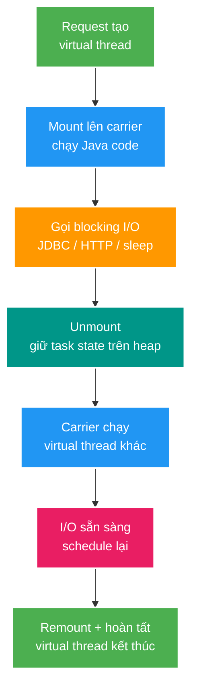
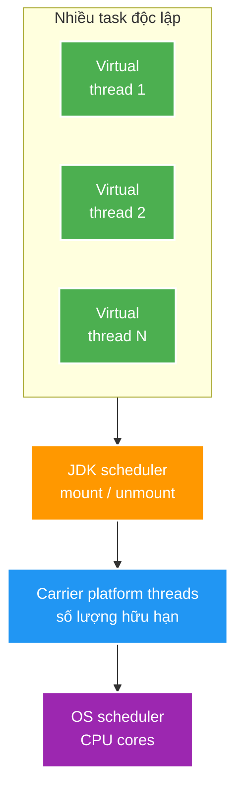
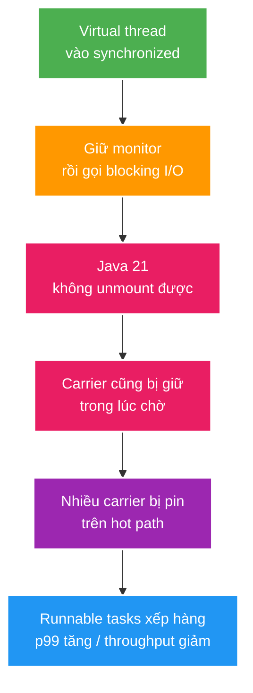
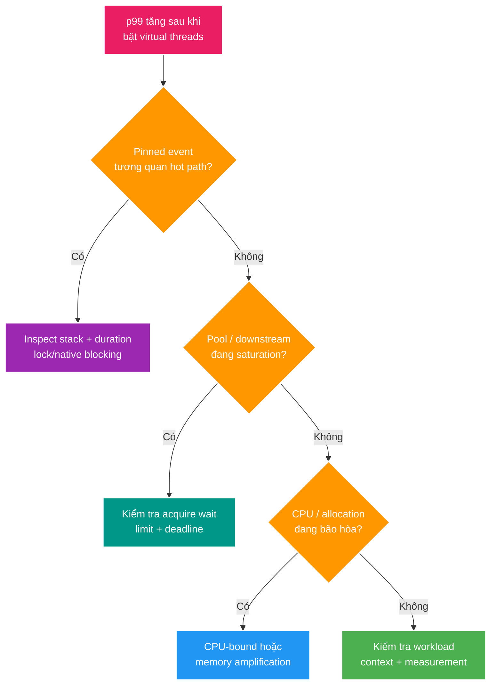

# Virtual threads, pinning và downstream backpressure

> Type: `DEEP_DIVE`<br>
> Domain: `java`<br>
> Target depth: `D3 sau reproducer/JFR evidence`<br>
> Teaching readiness: `TEACHABLE_DRAFT`<br>
> Status: `DRAFT`<br>
> Evidence status: `NOT RUN`<br>
> Prerequisites: [Java 21 platform baseline](../core/java21-platform-baseline.md)<br>
> Related cases: [JDK-01](../../../../cases/jdk-01-java21-platform-baseline.md)<br>
> Owner: `Project learner; Codex prepares canonical draft`<br>
> Updated: `2026-07-26`

Deep-dive này chỉ chứa phần tăng thêm so với core theory: scheduler, mount/unmount, pinning theo JDK version, resource limiting, Spring Boot lifecycle và diagnostic. Nó không lặp lại migration checklist Java 17 -> 21.

## 0. Cách dùng tài liệu này

Chỉ đọc sau khi đã hiểu [Java 21 platform baseline](../core/java21-platform-baseline.md), đặc biệt distinction giữa migration baseline và virtual-thread experiment. Tài liệu này dành cho developer đã dùng `Thread`, executor và blocking I/O nhưng chưa biết JDK schedule virtual thread như thế nào.

Đọc mục 2–3 để tạo hình dung, mục 4–10 để hiểu giới hạn và diagnostic, rồi mới làm learner write-back/self-check. Thời gian đọc dự kiến 60–90 phút. Không cần nhớ tên mọi JFR event ở lần đầu; cần hiểu signal nào chứng minh pinning, downstream saturation hoặc CPU saturation.

## 1. Learning objectives

Sau topic này, tôi có thể:

1. Giải thích causal chain từ request blocking tới virtual thread unmount/mount trên carrier.
2. Phân biệt concurrency, parallelism, throughput và resource capacity trong virtual-thread workload.
3. Nhận diện pinning thực sự nguy hiểm trên Java 21 và kiểm chứng bằng JFR/trace.
4. Thiết kế concurrency limit/backpressure mà không pool virtual threads.
5. So sánh Spring MVC platform threads, MVC virtual threads và WebFlux theo workload/operations.
6. Giải thích vì sao kết luận về pinning phải ghi rõ JDK version.

## 2. Mental model cốt lõi — phần Agent dạy

Platform thread có thể hình dung như một “nhân viên OS đắt tiền”. Trong mô hình thread-per-request truyền thống, mỗi request giữ một nhân viên đó cả khi chỉ đang chờ database hoặc network. Virtual thread tách **identity/lifecycle của task** khỏi **platform thread đang cung cấp CPU**.

JDK tạo nhiều virtual threads nhưng chỉ mount những virtual thread đang cần chạy Java code lên một số carrier platform threads. Khi một virtual thread đi vào blocking operation được JDK hỗ trợ, nó có thể unmount; carrier được dùng cho task khác. Khi I/O sẵn sàng, virtual thread được đưa lại vào scheduler và có thể remount lên carrier khác.



Điểm quan trọng nhất: virtual thread làm **việc chờ rẻ hơn**, không làm CPU, database connection hay downstream quota nhiều hơn. Nếu 10.000 requests cùng chờ Hikari pool 10 connections, virtual threads giúp JVM không cần 10.000 OS threads; database vẫn chỉ phục vụ tối đa theo connection/capacity thực tế.

> **Câu cần nhớ:** Virtual thread mở rộng số task có thể chờ hiệu quả; capacity control vẫn phải đặt ở resource hữu hạn mà các task đang chờ.

## 3. Cơ chế hoạt động

### 3.1. Virtual thread vẫn là `java.lang.Thread`

Virtual thread giữ thread identity, stack trace, exception handling và `ThreadLocal` compatibility của Java thread model. Điểm khác nằm ở scheduling/cost:



- Platform thread thường chiếm một OS thread trong suốt lifetime.
- Virtual thread được JDK scheduler mount lên một carrier platform thread khi cần chạy Java code.
- Khi gặp blocking operation được JDK hỗ trợ, virtual thread có thể unmount; continuation/state của nó được giữ trong heap, carrier rảnh để chạy virtual thread khác.
- Khi operation sẵn sàng, virtual thread được schedule và có thể remount lên carrier khác.

Virtual thread làm thread-per-task rẻ và observable hơn callback pipeline. Nó không biến blocking API thành non-blocking contract ở tầng business; runtime chỉ quản lý waiting hiệu quả hơn.

### 3.2. Concurrency không phải parallelism

| Đại lượng | Ý nghĩa trong lab |
| --- | --- |
| Concurrency | Số task/request đang in-flight, kể cả đang chờ I/O |
| Parallelism | Số task thực sự chạy CPU cùng lúc, bị giới hạn bởi core/carrier |
| Throughput | Số request hoàn tất trên đơn vị thời gian |
| Latency | Thời gian một request từ đầu đến cuối; cần nhìn distribution p50/p95/p99 |
| Capacity | Giới hạn của CPU, DB connections, downstream quota, memory, sockets/FD |

Virtual threads chủ yếu giảm chi phí giữ nhiều task **đang chờ**. Nếu mỗi request dành phần lớn thời gian chạy CPU, tăng số virtual threads chỉ tạo thêm queue/competition. Nếu mọi request chờ một Hikari pool 10 connections, 10 connections vẫn là bottleneck; virtual threads chỉ làm số waiter rẻ hơn, không làm database xử lý nhanh hơn.

Theo Little's Law ở steady state, `concurrency ≈ throughput × latency`. Virtual threads cho phép concurrency lớn hơn mà không cần cùng số OS threads, nhưng throughput chỉ tăng đến bottleneck tiếp theo.

### 3.3. Không pool virtual threads

Pool dùng để tái sử dụng resource đắt, còn virtual thread được thiết kế để tạo mới cho từng task. `Executors.newVirtualThreadPerTaskExecutor()` tạo một virtual thread cho mỗi submitted task; nó không phải fixed pool vô hạn “được tuning”.

Nếu mục tiêu là giới hạn 20 call đồng thời tới một dependency, giới hạn **dependency access** bằng `Semaphore`, rate limiter, bulkhead hoặc admission control. Pool virtual thread size 20 trộn hai concern:

- execution mechanism: task chạy ở virtual thread;
- resource policy: chỉ bao nhiêu task được phép chạm downstream.

Tách hai concern giúp đổi execution model mà không làm mất capacity invariant.

### 3.4. Pinning trên Java 21

Trong Java 21, virtual thread không thể unmount khỏi carrier khi blocking trong hai nhóm boundary chính:

1. đang thực thi bên trong `synchronized` method/block;
2. đang thực thi native method hoặc foreign function.

Pinning ngắn hoặc hiếm không tự là defect. Failure xảy ra khi pinning **thường xuyên + đủ lâu + nằm trên hot path**, làm carrier bị giữ trong lúc chờ I/O. Khi nhiều carrier cùng bị pin, runnable virtual threads phải chờ; throughput/latency có thể xấu đi dù số virtual threads lớn.



JDK 21 cung cấp:

- JFR event `jdk.VirtualThreadPinned` (mặc định threshold 20 ms theo JEP 444);
- `-Djdk.tracePinnedThreads=full|short` để in stack liên quan;
- JFR events `jdk.VirtualThreadStart`, `jdk.VirtualThreadEnd`, `jdk.VirtualThreadSubmitFailed` với default khác nhau;
- thread dump mới qua `jcmd`, phù hợp số lượng virtual threads lớn hơn flat `jstack` output.

Không thay mọi `synchronized` bằng `ReentrantLock` theo cơ học. Chỉ thay khi evidence cho thấy monitor đang bao quanh blocking hot path và pinning gây saturation. Lock scope ngắn chỉ bảo vệ in-memory state có thể hoàn toàn phù hợp.

### 3.5. Boundary thay đổi từ JDK 24

JEP 491 được delivered trong JDK 24, thay đổi JVM để virtual threads có thể unmount trong phần lớn trường hợp liên quan `synchronized`/monitor. Vì vậy câu “`synchronized` luôn pin virtual thread” chỉ đúng khi gắn với Java 21-era implementation.

Sau JDK 24:

- monitor acquisition/holding/waiting không còn tạo cùng pinning limitation;
- `jdk.tracePinnedThreads` không còn cần cho monitor case;
- native/foreign-function boundary vẫn cần được xem xét;
- contention, long critical section và blocking while holding a lock vẫn có thể là design/performance smell dù không còn pin carrier.

JDK-01 target Java 21 nên lab phải dùng Java 21 semantics. JDK-02 khi đánh giá JDK 25 phải chạy lại diagnostic assumption thay vì copy conclusion.

### 3.6. Worked example 1 — 10.000 task chủ yếu chờ

Ví dụ dưới đây tạo một virtual thread mới cho mỗi task. `Thread.sleep` đại diện cho thời gian chờ I/O; nó không tiêu tốn CPU trong phần lớn lifetime của task.

```java
try (var executor = Executors.newVirtualThreadPerTaskExecutor()) {
    var futures = IntStream.range(0, 10_000)
        .mapToObj(i -> executor.submit(() -> {
            Thread.sleep(Duration.ofSeconds(1));
            return i;
        }))
        .toList();

    for (var future : futures) {
        future.get();
    }
}
```

Điều cần quan sát không phải “10.000 task chạy CPU cùng lúc”. Chỉ một số virtual threads mount trên carriers để chạy code; phần lớn đang unmounted trong lúc sleep. Đây là workload virtual threads có thể hỗ trợ tốt: nhiều task độc lập và phần lớn thời gian là chờ.

Nếu thay `sleep` bằng tính hash nặng CPU, số task lớn không tạo thêm core. Scheduler chỉ chia cùng CPU cho nhiều runnable tasks; throughput có thể không tăng và latency có thể xấu đi.

### 3.7. Worked example 2 — database chỉ có 10 connections

Giả sử service nhận 2.000 request, mỗi request dùng một virtual thread và phải lấy connection từ Hikari pool size 10. Tối đa khoảng 10 request có thể dùng connection cùng lúc; phần còn lại chờ pool. Virtual threads làm waiter nhẹ hơn platform threads, nhưng không tăng database throughput.

Nếu ta không giới hạn admission/deadline, queue waiter có thể tăng tới hàng nghìn. Client timeout nhưng task vẫn chờ sẽ tạo zombie work. Correct design cần pool-acquire timeout, request deadline, cancellation và có thể concurrency limiter ở trước database boundary.

### 3.8. Phản ví dụ — dùng fixed virtual-thread pool để “bảo vệ DB”

Fixed pool 10 virtual threads tình cờ giới hạn toàn bộ task ở 10, nhưng nó trộn execution policy với database capacity. Một task chỉ làm cache/CPU nhẹ cũng bị chặn theo DB limit. Khi flow có hai downstream với capacity khác nhau, một pool size không còn diễn đạt đúng invariant. Dùng virtual-thread-per-task cho execution và semaphore/bulkhead riêng tại từng downstream boundary làm policy rõ hơn.

## 4. Invariant và boundary

1. Virtual thread không làm tăng CPU cores, database connections, broker partitions, socket/FD quota hoặc downstream rate limit.
2. Mỗi request/task có thể có một virtual thread; capacity control phải đặt tại resource boundary.
3. Cancellation, timeout và ownership của task vẫn phải rõ; rẻ không có nghĩa được tạo vô hạn không policy.
4. Performance claim phải ghi JDK version, workload mix, concurrency, warm-up, downstream capacity và JFR result.
5. Pinning là runtime mechanism; contention/backpressure là system behavior. Hết pinning không đồng nghĩa hết saturation.
6. Global Spring Boot flag chỉ là cách chọn executor; nó không audit mọi library, scheduler hoặc ThreadLocal use.

## 5. Thuật ngữ và distinction

| Thuật ngữ | Định nghĩa ngắn | Dễ nhầm với | Điểm phân biệt |
| --- | --- | --- | --- |
| Virtual thread | Lightweight `Thread` do JDK schedule | Async callback/future | Vẫn dùng sequential thread-per-task style |
| Carrier | Platform thread đang chạy virtual thread | Virtual thread | Carrier là execution resource hữu hạn, identity task nằm ở virtual thread |
| Mount/unmount | Gắn/tách virtual thread khỏi carrier | Start/terminate | Virtual thread vẫn sống khi unmounted |
| Parking | Chờ theo primitive hỗ trợ, có thể giải phóng carrier | Pinning | Parking bình thường không nhất thiết giữ carrier |
| Pinning | Virtual thread không thể unmount khi block | Lock contention | Pinning giữ carrier; contention là cạnh tranh resource/lock |
| Backpressure | Cơ chế làm producer chậm/reject khi consumer/resource bão hòa | Thread pool | Là policy capacity, không phải execution primitive |
| ThreadLocal | State gắn với thread identity | Object pool | Hợp lệ trên virtual thread nhưng multiplicity làm tăng memory risk |

## 6. Misconceptions

| Misconception | Vì sao sai | Counterexample/evidence |
| --- | --- | --- |
| “Virtual thread nhanh hơn platform thread” | Mục tiêu là scale concurrency chờ I/O, không giảm CPU time của task | CPU-bound benchmark có thể không tăng throughput |
| “Cứ thay executor là xong” | Downstream pool, timeout, ThreadLocal, pinning và lifecycle vẫn còn | Hikari pool bão hòa giữ throughput phẳng |
| “Cần fixed pool virtual threads để bảo vệ DB” | Pool execution không diễn đạt đúng DB capacity policy | Dùng semaphore/bulkhead quanh DB/downstream boundary |
| “Mọi `synchronized` đều phải xóa” | Trên Java 21 chỉ frequent long-lived blocking pinning mới đáng sửa; JDK 24 thay đổi monitor semantics | JFR + stack + duration quyết định |
| “Reactive đã lỗi thời” | Reactive vẫn có streaming/backpressure/composition ecosystem riêng | High fan-out stream hoặc end-to-end non-blocking stack có trade-off khác |
| “Nhiều thread rẻ nên concurrency vô hạn” | Task state, queue, socket, response buffer và downstream vẫn tốn resource | Reconnect storm có thể gây memory/FD/DB saturation |
| “ThreadLocal tương thích nên dùng thoải mái” | Hàng trăm nghìn virtual threads nhân memory/cost của value | Large per-thread buffers tạo memory pressure |

## 7. Failure modes kinh điển

### Failure story 1 — carrier starvation do pinning trên Java 21

Một synchronized block bảo vệ state nhỏ nhưng vô tình bao luôn HTTP call chậm. Mỗi virtual thread vào block rồi chờ network mà không unmount được trên Java 21. Khi nhiều request cùng đi qua hot path, carriers lần lượt bị giữ. CPU có thể chưa 100% nhưng runnable virtual threads vẫn xếp hàng. Evidence cần ghép `jdk.VirtualThreadPinned` stack/duration với latency và carrier/runnable behavior; chỉ thấy `synchronized` trong source chưa đủ kết luận.

Mitigation là thu nhỏ critical section hoặc đổi synchronization primitive khi evidence xác nhận hot pinning. Tăng scheduler parallelism có thể trì hoãn symptom nhưng không sửa remote call nằm trong lock và có thể tăng pressure ở bottleneck khác.

### Failure story 2 — bottleneck chuyển sang connection pool

Sau khi bật virtual threads, service nhận được nhiều requests in-flight hơn. Database pool không đổi. Pool-acquire wait và timeout tăng, throughput database gần như phẳng, p99 request tăng. Đây không phải pinning: virtual threads có thể unmount đúng trong lúc chờ pool nhưng business vẫn không hoàn tất vì connection là resource hữu hạn. Evidence phân biệt gồm pinned-event vắng/không tương quan, pool pending/in-use saturation và DB throughput/latency.

Bảng dưới cô đọng các failure sau khi đã hiểu hai story chính:

| Failure | Trigger | Observable symptom | Root mechanism |
| --- | --- | --- | --- |
| Carrier starvation Java 21 | Blocking I/O trong hot `synchronized`/native path | p99 tăng, pinned events, CPU có thể chưa đầy | Carrier bị giữ khi virtual thread không unmount |
| Downstream pool saturation | Concurrency request lớn hơn DB/HTTP pool capacity | Wait time/pool timeout tăng, throughput phẳng | Bottleneck chuyển từ thread sang connection/resource pool |
| CPU oversubscription | CPU-heavy task chạy với concurrency rất lớn | CPU 100%, context/scheduling overhead, latency tăng | Virtual threads không tăng parallel compute capacity |
| Memory amplification | Large `ThreadLocal`, stack/task state hoặc unbounded queue | Heap/allocation/GC pressure | Cheap thread không phải zero-cost task |
| Missing backpressure | Accept mọi request/task khi downstream chậm | Queue/waiter tăng, timeout storm | Không có admission/resource policy |
| Broken lifecycle | Chỉ còn virtual daemon threads | JVM có thể exit; scheduled work không giữ process sống | Virtual threads luôn daemon |
| Cancellation leak | Timeout HTTP nhưng task/downstream call tiếp tục | Wasted work, pool/resource giữ lâu | Cancellation/structured ownership không được propagate |
| Misleading benchmark | So khác workload/warm-up/pool size | Claim thắng nhưng không tái lập | Nhiều independent variables/confounders |

## 8. Solution patterns

Các pattern bảo vệ những boundary khác nhau. Virtual-thread-per-task giảm chi phí execution/wait; semaphore hoặc bulkhead bảo vệ downstream capacity; deadline/cancellation bảo vệ time/resource budget; JFR giúp phân biệt pinning với saturation; load shedding bảo vệ hệ thống khi arrival rate vượt sustainable capacity. Không pattern nào thay thế tất cả phần còn lại.

| Pattern | Bảo vệ điều gì | Giới hạn | Khi nên dùng |
| --- | --- | --- | --- |
| Virtual-thread-per-task | Code blocking dễ đọc với nhiều I/O wait | Không tự có backpressure | Request/task blocking I/O độc lập |
| Semaphore/bulkhead quanh downstream | Capacity/quota hữu hạn | Cần timeout/rejection policy | DB/API chỉ chịu N concurrent calls |
| Deadline + cancellation propagation | Không giữ work vô ích | Library phải hỗ trợ interruption/cancel | Fan-out hoặc request timeout |
| JFR + workload matrix | Causal evidence về pinning/wait/saturation | Cần controlled environment | Trước enable global mode |
| Targeted lock refactor | Giải quyết Java 21 hot pinning | Có complexity/error risk | JFR chứng minh monitor bao quanh blocking I/O |
| Bounded admission/load shedding | Giữ hệ thống ổn định dưới overload | Có rejected/degraded requests | Concurrency có thể vượt safe capacity |
| Platform-thread fallback | Rollback đơn giản | Giữ thread scarcity cũ | Library/tooling/lifecycle chưa phù hợp |

## 9. Trade-off matrix

Ba execution model đều có chỗ dùng. Platform-thread MVC đơn giản và quen nhưng thread pool trở thành giới hạn concurrency. MVC + virtual threads giữ synchronous code, phù hợp blocking I/O nhưng cần explicit admission/resource limits. WebFlux có end-to-end non-blocking composition và backpressure tốt trong ecosystem phù hợp, đổi lại programming/debug/context model phức tạp hơn. Chọn theo workload và team/operations, không theo khẩu hiệu.

| Option | Correctness | Complexity | Performance | Security/operability | Cost/evolution |
| --- | --- | --- | --- | --- | --- |
| Spring MVC + platform pool | Mô hình quen thuộc, implicit queue/pool limit | Thấp | Tốt ở concurrency vừa; OS thread scarcity khi I/O wait lớn | Tooling chín, thread dumps quen thuộc | Dễ vận hành nhưng scaling thread-per-request hữu hạn |
| Spring MVC + virtual threads | Giữ sequential code và thread identity | Vừa; phải audit resource/lifecycle | Có thể tăng I/O concurrency; CPU/downstream vẫn giới hạn | JFR/thread dump mới, cần explicit admission | Migration nhỏ hơn reactive nếu stack blocking |
| WebFlux/Reactor | Backpressure/composition non-blocking end-to-end | Cao hơn, context/debug/model khác | Tốt khi ecosystem/workload thực sự non-blocking/streaming | Cần reactive observability và tránh blocking leakage | Hợp với streaming/fan-out; migration cost lớn |

Không có winner chung. Chọn theo workload, ecosystem, team mental model, failure recovery và evidence.

## 10. Deep-dive: internals và cross-layer interaction

### 10.1. Scheduler và carrier

JDK 21 dùng một work-stealing `ForkJoinPool` riêng để schedule virtual threads; default parallelism liên hệ số processor khả dụng. Tăng scheduler parallelism không phải fix mặc định cho pinning hoặc CPU saturation: nó có thể che triệu chứng trong một load range nhưng không sửa resource boundary.

### 10.2. Spring Boot mode

Spring Boot 3.4 có `spring.threads.virtual.enabled=true`. Khi bật, các property pool truyền thống có thể không còn tác dụng ở các auto-configured executor tương ứng. Virtual threads là daemon; nếu application dựa vào scheduled thread để giữ JVM sống, cần kiểm chứng lifecycle và có thể cần `spring.main.keep-alive=true`.

Global flag không chứng minh:

- mọi executor custom đã chuyển;
- mọi blocking library unmount tốt trên Java 21;
- Hikari/Redis/RabbitMQ pool/quota được sizing đúng;
- request admission, timeout và cancellation đã an toàn.

### 10.3. ThreadLocal và observability

Virtual threads hỗ trợ `ThreadLocal`, giúp Spring Security/log correlation và library cũ tương thích hơn. Nhưng mỗi task có thread identity riêng; value lớn hoặc resource caching theo thread có thể nhân memory. Context propagation phải được test qua executor/task boundary thay vì giả định.

JFR plan tối thiểu:

1. record cùng workload trên platform và virtual mode;
2. giữ connection pool, dataset, CPU limit, warm-up và duration cố định;
3. quan sát throughput, p50/p95/p99, error, pool wait/saturation, CPU, allocation/GC;
4. trên Java 21, inspect `jdk.VirtualThreadPinned` và stack;
5. không kết luận từ thread count đơn lẻ.

### 10.4. Experiment implication

Một blocking-I/O path chỉ trở thành workload đại diện khi dataset, response behavior và downstream capacity tái lập được. Không bật global mode trước khi:

- Java 21 compile/test/startup baseline tồn tại;
- dataset và response behavior ổn định;
- concurrency lớn hơn platform pool nhưng DB pool vẫn được quan sát;
- scheduler/lifecycle và JVM keep-alive được kiểm tra;
- rollback về platform threads là một config change đã test.

Endpoint, POM, pool size và command cụ thể phải nằm trong learning case/experiment, không nằm trong deep-dive reusable này.

### 10.5. Diagnostic walkthrough — phân biệt ba bottleneck

Khi bật virtual threads mà p99 xấu đi, không bắt đầu bằng việc “tăng số carrier”. Đi theo thứ tự:



Decision tree này không tự chẩn đoán. Nó giúp chọn evidence tiếp theo: JFR stack cho pinning, pool metrics cho resource saturation, CPU/allocation/GC cho compute-memory bottleneck, và experiment controls cho benchmark sai.

## 11. Liên hệ learning case

| Case | Theory được áp dụng | Project detail chỉ giữ ở case |
| --- | --- | --- |
| [JDK-01](../../../../cases/jdk-01-java21-platform-baseline.md) | Workload selection, carrier/pinning, resource limiting, JFR và enable/defer criteria | Endpoint, POM, Spring config, Hikari size, commands và raw results |

## 12. Góc nhìn phỏng vấn nâng cao

### Câu trả lời Senior khoảng 2 phút

1. Virtual thread vẫn là `Thread`, nhưng JDK schedule nhiều virtual threads lên ít carrier platform threads.
2. Blocking I/O được hỗ trợ có thể unmount task, giải phóng carrier.
3. Lợi ích chính là throughput/concurrency cho workload chờ I/O, không phải làm một task nhanh hơn.
4. CPU, DB connection và downstream quota vẫn hữu hạn; limit phải đặt tại resource boundary.
5. Trên Java 21, frequent long blocking trong `synchronized`/native boundary có thể pin carrier; dùng JFR/stack để chứng minh.
6. Quyết định MVC platform, MVC virtual hoặc WebFlux dựa trên workload, ecosystem, backpressure và operability.

### Follow-up Architect/Expert

- “Không pinning mà throughput vẫn không tăng?” — giải thích connection pool/CPU bottleneck ở mục 3.7 và 7.
- “Tại sao không pool virtual threads?” — đọc mục 3.3 và 3.8.
- “Câu trả lời thay đổi gì trên JDK 24/25?” — đọc mục 3.5.
- “Làm sao chứng minh?” — dùng diagnostic walkthrough mục 10.4–10.5, không claim từ thread count.

## 13. Tóm tắt cô đọng

1. Virtual thread tách task identity/lifecycle khỏi carrier platform thread.
2. Mount chạy code; unmount khi chờ operation được hỗ trợ; remount khi sẵn sàng.
3. Nó giúp scale waiting concurrency, không tăng CPU/downstream capacity và không tự giảm latency.
4. Không pool virtual threads; limit resource bằng semaphore/bulkhead/rate/admission policy tại boundary.
5. Pinning Java 21 chỉ đáng sửa khi frequent + long + hot path và có JFR/stack/latency correlation.
6. JDK 24 thay monitor-pinning behavior; version phải đi cùng mọi claim.
7. Spring Boot flag đổi executor mode nhưng không audit custom executor, ThreadLocal, pool, timeout, cancellation hoặc lifecycle.
8. Experiment phải giữ workload/pool/dataset/warm-up cố định và quan sát throughput, latency, error, saturation, CPU/GC cùng pinned events.

## 14. Bài tập diễn đạt lại — phần của tôi

Viết 10–18 câu theo scaffold:

1. **Actor:** virtual thread, carrier, OS thread và resource pool là gì?
2. **Sequence:** kể mount -> blocking -> unmount -> reschedule -> remount.
3. **Boundary:** resource nào virtual threads làm rẻ hơn; resource nào không tăng?
4. **Failure:** kể một pinning story và một pool-saturation story, chỉ evidence phân biệt.
5. **Decision:** khi nào chọn MVC + virtual threads, khi nào không?

> **Bài viết của tôi — `LEARNER TODO`:** được nhìn mục 13 ở lần đầu; lần thứ hai đóng file và trình bày khoảng hai phút.

## 15. Self-check có hướng dẫn

1. **Question:** Mô tả mount/unmount mà không dùng câu “virtual thread chạy song song vô hạn”.<br>
   **Đọc lại nếu bí:** mục 2 và 3.1.<br>
   **Một câu trả lời tốt phải có:** task identity, carrier, blocking wait, reschedule và CPU limit.<br>
   **My answer:** `LEARNER TODO`
2. **Question:** Vì sao throughput có thể không tăng khi chuyển sang virtual threads dù không có pinning?<br>
   **Đọc lại nếu bí:** mục 3.2, 3.7 và failure story 2.<br>
   **Một câu trả lời tốt phải có:** workload CPU-bound hoặc downstream/pool bottleneck cùng signal phân biệt.<br>
   **My answer:** `LEARNER TODO`
3. **Question:** Vì sao semaphore diễn đạt downstream capacity tốt hơn fixed virtual-thread pool?<br>
   **Đọc lại nếu bí:** mục 3.3 và 3.8.<br>
   **Một câu trả lời tốt phải có:** separation execution/resource policy và nhiều downstream capacity khác nhau.<br>
   **My answer:** `LEARNER TODO`
4. **Question:** Pinning trên Java 21 có causal chain và JFR evidence nào?<br>
   **Đọc lại nếu bí:** mục 3.4 và failure story 1.<br>
   **Một câu trả lời tốt phải có:** blocking boundary, carrier retention, hot-path correlation, stack/duration/latency.<br>
   **My answer:** `LEARNER TODO`
5. **Question:** Câu trả lời về `synchronized` phải thay đổi thế nào khi runtime là JDK 24/25?<br>
   **Đọc lại nếu bí:** mục 3.5.<br>
   **Một câu trả lời tốt phải có:** JEP 491 monitor change, native boundary và contention vẫn còn.<br>
   **My answer:** `LEARNER TODO`
6. **Question:** Khi nào WebFlux vẫn hợp lý hơn MVC + virtual threads?<br>
   **Đọc lại nếu bí:** mục 9.<br>
   **Một câu trả lời tốt phải có:** streaming, end-to-end non-blocking/backpressure, ecosystem và team/operability cost.<br>
   **My answer:** `LEARNER TODO`
7. **Question:** `spring.threads.virtual.enabled=true` chưa kiểm chứng những boundary nào?<br>
   **Đọc lại nếu bí:** mục 10.2–10.3.<br>
   **Một câu trả lời tốt phải có:** custom executors, pools, ThreadLocal, lifecycle, cancellation và libraries.<br>
   **My answer:** `LEARNER TODO`
8. **Question:** Thiết kế một matrix đủ để quyết định `enabled` hoặc `deferred` cho JDK-01.<br>
   **Đọc lại nếu bí:** mục 10.4–10.5.<br>
   **Một câu trả lời tốt phải có:** controls, platform-vs-virtual modes, workload, metrics, failure injection và rollback.<br>
   **My answer:** `LEARNER TODO`

## 16. Official references

- [JEP 444: Virtual Threads — Java 21](https://openjdk.org/jeps/444)
- [Oracle Java 21 Core Libraries Guide — Virtual Threads](https://docs.oracle.com/en/java/javase/21/core/virtual-threads.html)
- [Oracle `jcmd` command — Java 21](https://docs.oracle.com/en/java/javase/21/docs/specs/man/jcmd.html)
- [JEP 491: Synchronize Virtual Threads without Pinning — JDK 24](https://openjdk.org/jeps/491)
- [Spring Boot 3.4 — Virtual threads](https://docs.spring.io/spring-boot/3.4/reference/features/spring-application.html#features.spring-application.virtual-threads)

## 17. Teach-back checklist

- [ ] Tôi vẽ được virtual thread/carrier/OS-thread relationship.
- [ ] Tôi phân biệt concurrency, parallelism, throughput và capacity.
- [ ] Tôi giải thích pinning bằng causal chain gắn với JDK version.
- [ ] Tôi thiết kế được backpressure/resource limit mà không pool virtual threads.
- [ ] Tôi so sánh platform thread, virtual thread và reactive bằng workload/operations.
- [ ] Tôi không claim performance trước khi có controlled workload và JFR evidence.
