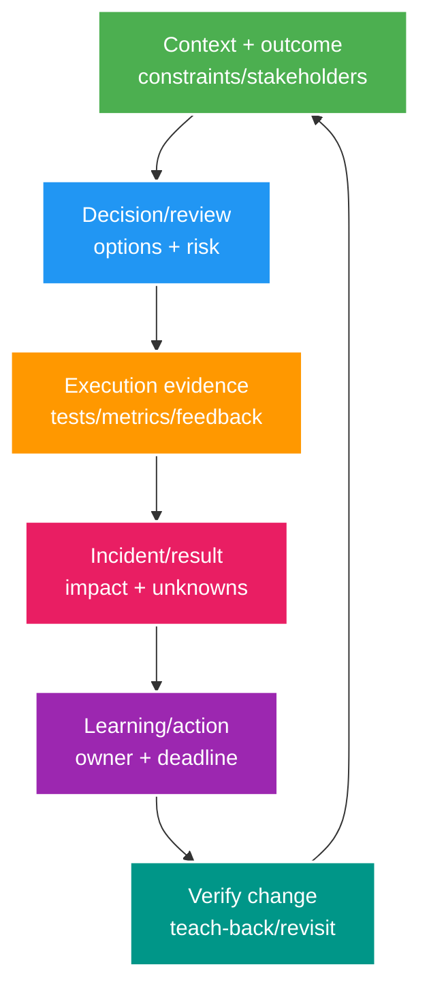

# Engineering Leadership Core: Review, ADR, Incident, Mentoring và Behavioral Evidence

> Type: `CORE` 
> Domain: `leadership` 
> Target depth: `D3 — dẫn review/decision/incident/mentoring bằng evidence và ownership` 
> Teaching readiness: `TEACHABLE_DRAFT` 
> Status: `DRAFT` 
> Evidence status: `NOT RUN` 
> Prerequisites: technical fundamentals; communication 
> Related cases: cross-cutting; [question bank](../../question-bank/review-adr-incident-mentoring-and-behavioral.md) 
> Owner: `Project learner; Codex teaches, learner writes back` 
> Updated: `2026-07-26`

## 1. Senior leadership is an evidence loop

Senior impact không chỉ “biết đáp án”: biến ambiguity thành decision, risk thành verification, incident thành learning, và giúp người khác tự làm tốt hơn. Loop: clarify outcome/constraints → make reasoning visible → execute/review with evidence → communicate impact/unknowns → learn/change system → verify.

Leadership claims phải nối artifact/outcome thật. Theory readiness không tạo behavioral story; learner tích lũy từ review/ADR/incident/case evidence.

## 2. Code review by risk

Trước tiên hiểu intent, acceptance criteria, diff và phạm vi uncommitted hiện có. Thứ tự review: security/auth/data loss/correctness; transaction/concurrency/distributed failure; API/schema compatibility; performance/capacity/operations; cuối cùng test/docs/maintainability. Lần theo critical use case end-to-end cùng negative/failure path.

Finding gồm location, concrete scenario, impact/severity, evidence/reasoning và minimal required fix/verification. **Blocker** ties merge to correctness/security/compatibility risk; **suggestion** optional improvement; **question** seeks missing context. Style preference không giả blocker. Prioritize few high-signal findings; separate follow-up scope.

Worked example: “consumer ack trước DB commit” blocker vì crash loses effect; show window and test. “Rename helper” suggestion. “Does provider retry 409?” question until contract known.

Reviewer không rewrite toàn solution; author owns change. Reviewer also confirms risk resolved, not comment count zero. Psychological safety means critique code/assumption, not soften material risk.

## 3. ADR as decision memory

ADR lưu context/problem, constraint/force, option khả thi kể cả không làm gì, decision/date/owner, consequence/trade-off, evidence/assumption và revisit trigger. Nó không phải biên bản họp hay luật bất biến. Link benchmark, incident và contract; ghi unknown cùng migration/rollback.

Dùng ADR cho quyết định khó đảo ngược, xuyên team hoặc ảnh hưởng security/data/architecture; lựa chọn local nhỏ có thể không cần. “Dùng Redis vì nhanh” là lý do yếu; phải nêu workload, owner, consistency/outage, alternative và validation. Evidence mới có thể supersede ADR nhưng vẫn giữ history.

Khi làm việc với stakeholder, làm rõ non-negotiable và success metric; phân biệt experiment đảo ngược được với commitment khó đảo; lượng hóa impact/cost/risk của option; chỉ định decider và ghi dissent/revisit. Nói technical detail ở mức engineer, còn outcome/risk/date ở mức Product/Business.

## 4. Incident leadership

Các role gồm incident commander điều phối/ra quyết định; technical responder chẩn đoán/mitigate; communication gửi update định kỳ; scribe ghi timeline. Incident nhỏ có thể gộp role nhưng phải nói rõ. Trước hết stabilize và contain harm, chưa vội chứng minh root cause. Nêu impact đã biết, unknown, action, risk và lần update tiếp; tránh nguyên nhân suy đoán.

Giữ observation, change và result có timestamp. Chọn mitigation dễ đảo, bảo vệ evidence/data invariant và gán owner. Recovery criteria gồm user/SLO/business/data consistency, backlog drain và monitoring, không chỉ một health check xanh. Thông báo đúng nhóm user/stakeholder bị ảnh hưởng.

Blameless postmortem tránh đổ lỗi cá nhân để condition/decision hệ thống lộ ra, nhưng không xóa accountability. Ghi impact, timeline, detection, contributing/root mechanism, điều giúp/cản và action có owner/deadline/verification. “Cẩn thận hơn” không phải action. Sau đó review cả completion lẫn effect.

## 5. Mentoring through prediction/evidence

Yêu cầu learner dự đoán mechanism/outcome và giải thích vì sao. Tạo counterexample/reproducer nhỏ nhất rồi để learner chạy và diễn giải. Yêu cầu họ sửa mental model, teach-back và áp dụng vào case gần; lên lịch follow-up. Cách này lộ gap và tạo ownership, còn đổ full answer chỉ tạo cảm giác quen chứ chưa tạo năng lực.

Điều chỉnh thử thách: scaffold vocabulary/diagram cho beginner, constraint/failure trade-off cho senior. Tách feedback correctness khỏi identity cá nhân. Ghi next step/evidence đã thống nhất. Mentor có thể giải thích đầy đủ khi learner bị block, sau đó yêu cầu họ tự dựng lại và ra quyết định.

## 6. Technical debt prioritization

Mô tả symptom quan sát được và “lãi nợ”: incident, lead time, change risk, capacity/cost, security exposure. Ước lượng blast, frequency, business effect, dependency bị chặn và option remediation. Ưu tiên payoff/guardrail tăng dần; gán owner/revisit và theo dõi outcome thật.

Không phải code xấu nào cũng khẩn; risk authorization hoặc data corruption ẩn quan trọng hơn cosmetic. Ngược lại, deploy delay lặp lại có thể là business debt cao. Tính opportunity cost và cả option chấp nhận với monitoring/deadline.

## 7. Behavioral story with evidence

STAR/CAR gồm Situation với constraint/stake; Task và trách nhiệm cá nhân; Action, decision, option, conflict; Result đo/kiểm chứng được; learning/failure và system change. Phân biệt team outcome với đóng góp bản thân mà không nhận hết công; nói điều sẽ thay đổi nếu làm lại.

Câu chuyện tốt có incident/decision cụ thể, số liệu hoặc artifact, trade-off và guardrail còn tồn tại. Câu yếu nói chung “tăng performance 50%” nhưng thiếu baseline/method, đổ lỗi đồng nghiệp hoặc chỉ kể happy result. Chuẩn bị khung 2 phút, detail follow-up và boundary trung thực.

Nếu quyết định của mình gây incident, hãy nhận impact; giải thích evidence/constraint ban đầu nhưng không bào chữa; chỉ ra missed assumption; kể containment/communication tức thời, guardrail/test/process change và result/revisit cho quyết định tương tự.

## 8. Self-check

> **Bài viết của tôi — `LEARNER TODO`:** convert one project review/decision into finding, ADR and STAR evidence after real work.

1. **Question:** Blocker khác suggestion? 
   **Đọc lại nếu bí:** mục 2. 
   **Một câu trả lời tốt phải có:** concrete scenario/impact/evidence, merge requirement vs optional, no taste inflation. 
   **My answer:** `LEARNER TODO`
2. **Question:** Blameless vẫn accountability ra sao? 
   **Đọc lại nếu bí:** mục 4. 
   **Một câu trả lời tốt phải có:** system conditions/decisions, no personal blame, owners/deadlines/verification, preserve impact/timeline. 
   **My answer:** `LEARNER TODO`
3. **Question:** Mentor không viết lời giải thay? 
   **Đọc lại nếu bí:** mục 5. 
   **Một câu trả lời tốt phải có:** prediction, counterexample/evidence, learner interpretation, teach-back/application/follow-up. 
   **My answer:** `LEARNER TODO`

## 9. References/teach-back

- [Google SRE Book — Postmortem Culture](https://sre.google/sre-book/postmortem-culture/)
- [Michael Nygard — Documenting Architecture Decisions](https://cognitect.com/blog/2011/11/15/documenting-architecture-decisions)

- [ ] Tôi review by risk/evidence.
- [ ] Tôi own decisions/incidents and verify actions.
- [ ] Tôi mentor/answer behavioral từ evidence thật.
- [ ] Evidence vẫn `NOT RUN`.
