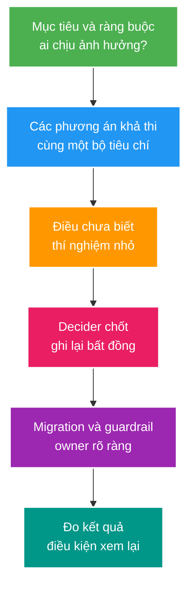

# Deep-dive: Dẫn dắt quyết định, điều phối incident và học từ lỗi hệ thống

> Type: `DEEP_DIVE` 
> Domain: `leadership` 
> Target depth: `D4 — dẫn dắt quyết định nhiều stakeholder, điều phối incident và biến failure thành thay đổi đã kiểm chứng` 
> Teaching readiness: `TEACHABLE_DRAFT` 
> Status: `DRAFT` 
> Evidence status: `NOT RUN` 
> Prerequisites: [Engineering leadership core](../core/review-adr-incident-mentoring-and-behavioral.md) 
> Related cases: cross-cutting; [question bank](../../question-bank/review-adr-incident-mentoring-and-behavioral.md) 
> Owner: `Project learner; Codex teaches, learner writes back` 
> Updated: `2026-07-26`

## 1. Mental model: leadership kỹ thuật là thiết kế hệ thống ra quyết định

Senior hoặc Architect không thắng một cuộc thảo luận bằng cách nói nhiều thuật ngữ hơn. Vai trò của họ là làm cho nhóm nhìn thấy cùng một bài toán, so sánh các phương án trên cùng tiêu chí, chỉ rõ điều chưa biết và chốt được người chịu trách nhiệm quyết định. **Facilitation** ở đây nghĩa là điều phối để quyết định có chất lượng, không phải ép mọi người đồng ý.

Trước khi tranh luận giải pháp, cần chốt: người dùng nào bị ảnh hưởng; invariant nào tuyệt đối không được phá; SLO, deadline và ngân sách; phạm vi quyết định; ai là decider; phần nào đảo ngược được; evidence nào đang có và assumption nào vẫn chưa kiểm chứng. Nếu thiếu những dữ kiện này, tranh luận “Kafka hay RabbitMQ”, “monolith hay microservice” chỉ là tranh luận sở thích.

Không phải assumption nào cũng có thể chứng minh hoàn toàn trước quyết định. Khi bằng chứng đắt hoặc mất nhiều thời gian, hãy chọn một bước reversible — có thể đảo ngược — với blast radius nhỏ, đo kết quả và ghi điều kiện dừng. Ghi lại dissent (ý kiến không đồng thuận) để bảo tồn tín hiệu; sau khi decider đã chốt, cả nhóm cùng thực hiện cho tới khi có evidence mới.

## 2. Walkthrough review xuyên lớp cho một gift endpoint

Review tốt không bắt đầu bằng tên class. Hãy lần theo lịch sử nghiệp vụ từ ngoài vào trong:

1. API contract có xác định authentication, authorization, idempotency key và lỗi trả về không?
2. Service đặt transaction boundary ở đâu; ledger invariant nào được bảo vệ?
3. Query nào chạy, lock nào được giữ, hai request đồng thời tạo history gì?
4. DB commit rồi outbox/event được phát ra bằng cách nào?
5. Cache, consumer và retry có thể làm side effect lặp lại không?
6. Log/metric có đủ điều tra mà không lộ secret hoặc dữ liệu nhạy cảm không?
7. Migration, rollback, negative test và tài liệu contract đã đi cùng thay đổi chưa?

Từ đó dựng các history đối nghịch: cùng idempotency key nhưng payload khác; hai request cùng trừ balance; DB đã commit nhưng response mất; relay phát duplicate; user A truy cập resource của user B. Ưu tiên finding có khả năng double-spend, bypass authorization hoặc mất dữ liệu trước naming/style.

Một finding chất lượng phải chỉ ra điều kiện kích hoạt, hậu quả và cách tái hiện đủ rõ. Reviewer không cần nhét một redesign lớn vào comment. Nếu contract bên thứ ba được viện dẫn, yêu cầu link guarantee chính thức; nếu chưa có, viết rõ “đây là assumption” và đề xuất guard an toàn. Nhiều approval không tự tạo trách nhiệm; cần owner, reviewer có đúng expertise và gate theo risk.

## 3. Pathology A — cuộc họp đồng thuận nhưng không có quyết định

Nhóm tranh luận ba tuần về tách microservice. Mỗi buổi thêm một tiêu chí mới, không có decider và không ai ghi assumption. Để “an toàn”, nhóm chọn phương án pha trộn: module cũ vẫn ghi database, service mới cũng ghi, request đi qua hai nơi. Kết quả là dual writer, không có rollback rõ và incident xảy ra khi hai schema lệch nhau.

**Nguyên nhân:** thiếu decision frame → tiêu chí thay đổi liên tục → compromise không bảo vệ invariant → hai nguồn ghi → dữ liệu phân kỳ.

**Biểu hiện:** meeting nhiều nhưng decision log trống; action item không có owner; architecture có cả shared table và API; rollback yêu cầu đồng bộ hai hệ thống.

**Cách xử lý:** quay lại chốt data owner và invariant; nêu 2–3 phương án thật sự khả thi trên cùng scorecard; biến điểm chưa biết thành spike/experiment có deadline; chỉ định decider; ghi rejected option và trigger xem lại. Nếu cần migration, dùng one-writer-at-a-time và reconciliation thay vì “tạm thời cả hai cùng ghi”.

**Bằng chứng hoàn thành:** ADR có context/options/decision/consequences; migration có owner và rollback trigger; contract test chứng minh đường ghi duy nhất. Số cuộc họp giảm không phải evidence nếu ownership vẫn mơ hồ.

## 4. Incident command dưới điều kiện thiếu thông tin

Khi incident bắt đầu, cần chỉ định severity, incident commander, channel, các role điều tra/mitigation/communication và nhịp cập nhật. Incident commander quản lý ưu tiên và nguồn lực; không nên tự chui vào debug sâu rồi bỏ trống điều phối.

Timeline phải phân biệt bốn loại bản ghi: **observation** — điều đã thấy; **hypothesis** — giả thuyết; **action** — thao tác; **result** — tín hiệu sau thao tác. Nếu gộp chúng, một correlation dễ bị tuyên bố nhầm thành root cause. Hạn chế nhiều thay đổi đồng thời vì sẽ mất khả năng biết thao tác nào có tác dụng.

Mẫu update ngắn: impact và phạm vi; thời điểm bắt đầu; điều đã biết/chưa biết; mitigation đang làm và rủi ro; workaround cho người dùng nếu có; thời điểm cập nhật tiếp. Nếu safety invariant có nguy cơ bị phá, dừng write có thể đúng hơn cố giữ availability.

Service “xanh” chưa đồng nghĩa incident đã recover. Cần có observation window đủ dài; error/latency/saturation ổn định; backlog drain mà không tạo overload mới; data/security đã reconcile hoặc có owner và deadline; cảnh báo và communication đã cập nhật.

## 5. Pathology B — rollback làm hỏng dữ liệu lần thứ hai

Một release mới ghi thêm enum value và phát event schema mới. Error rate tăng nên team rollback binary ngay. Binary cũ không đọc được enum mới; consumer cũ parse fail và đẩy message vào DLQ. Hệ thống HTTP có vẻ phục hồi nhưng pipeline dữ liệu tiếp tục sai.

**Chuỗi nhân quả:** mixed-version contract không tương thích → canary không chạy đúng consumer path → rollback chỉ xét application binary → reader cũ gặp dữ liệu mới → backlog/DLQ tăng → báo cáo và notification lệch.

**Evidence cần xem:** version nào đang chạy theo instance; schema/data đầu tiên được writer mới tạo; consumer lag/DLQ; deployment timeline; contract test giữa `old reader/new writer` và `new reader/old writer`.

**Mitigation:** dừng writer không tương thích; giữ reader tương thích cả old/new; quarantine event xấu thay vì redrive vô hạn; reconcile từ source of truth; chọn roll-forward hoặc rollback theo compatibility matrix. Sau incident, bổ sung expand-contract và mixed-version test vào release gate.

Đây là ví dụ vì sao commander không được chỉ hỏi “pod đã về version cũ chưa”. Recovery phải xác nhận invariant và toàn bộ data flow.

## 6. Postmortem: từ causal chain tới thay đổi có evidence

Không dừng ở “root cause là human error”. Hãy hỏi vì sao thao tác đó có vẻ hợp lý với tín hiệu, quyền và công cụ lúc ấy; guard nào đáng lẽ ngăn, giới hạn, phát hiện hoặc giúp phục hồi. Viết chuỗi: trigger → control gap → propagation/amplification → detection gap → response.

Action nên phủ nhiều lớp:

- sửa lỗi tức thời;
- prevention bằng constraint/validation;
- containment bằng permission, bulkhead hoặc limit;
- detection bằng SLO/invariant alert;
- recovery bằng runbook và reconciliation;
- learning bằng test, drill và teach-back.

Mỗi action cần owner, deadline và acceptance evidence. “Improve monitoring” không đạt; “alert khi ledger sum lệch, inject duplicate trong integration test và lưu raw result” mới kiểm chứng được. Quá nhiều action mơ hồ sẽ tạo một backlog đẹp nhưng không đổi hệ thống.

## 7. Kể câu chuyện quyết định gây incident một cách có trách nhiệm

Cấu trúc tốt gồm: context và constraint ban đầu; options/evidence; quyết định và risk đã chấp nhận; assumption bị sai; impact; cách nhận ownership, contain và communicate; permanent control; kết quả đo được; điều đã thay đổi trong quy trình quyết định.

Ví dụ: chọn cache fail-open để giữ session availability nhưng không mô hình hóa revocation lag. Khi incident xảy ra, thu hồi session và khóa đường nhạy cảm; sau đó đổi high-risk operation sang fail-closed hoặc epoch check, thêm fault test và cập nhật ADR. Không bịa “giảm 80% incident” nếu chưa đo. Cũng không tự tô mình thành người đã biết trước mọi thứ; phân biệt quyết định hợp lý với evidence thiếu và negligence mà không né trách nhiệm.

## 8. Mentoring tạo năng lực, không tạo người phụ thuộc

Trước tiên chẩn đoán learner thiếu kiến thức, thiếu cách reasoning, thiếu tự tin hay bị môi trường cản. Yêu cầu họ dự đoán kết quả trước khi chạy; quan sát cách họ tìm evidence; đưa hint nhỏ nhất đủ mở khóa. Sau worked example, giảm dần hướng dẫn để learner tự xử lý một case gần giống.

Teach-back phải có mechanism, failure, trade-off và evidence. Với senior mentee, cho họ điều phối một decision/review/incident trong safety rail rồi retrospective. Công khai rubric và ví dụ; không dùng “tiêu chuẩn ngầm” để gatekeep. Psychological safety cho phép báo sớm sự không chắc chắn, nhưng vẫn đi cùng chuẩn chất lượng và accountability.

## 9. Governance technical debt như một portfolio rủi ro

Mỗi debt item cần statement, evidence về “interest”, impact, dependency, option/estimate, owner và revisit trigger. Shared write, runtime hết hỗ trợ, thiếu DR/reconciliation và deploy thủ công thường có risk cao hơn một code smell thẩm mỹ.

Ưu tiên bằng incident data, change lead time, cost và security exposure. Có thể làm guardrail nhỏ để giảm interest trong khi chờ migration lớn. Xóa item đã mất value hoặc assumption không còn đúng. Khi chưa làm ngay, nói rõ residual risk và tín hiệu nào sẽ buộc đổi priority.

## 10. Diagnostic/experiment để kiểm chứng năng lực D4

Evidence không phải số ADR đã viết. Chọn một quyết định thật, lưu scorecard, assumption và experiment; sau release đo outcome theo revisit trigger. Trong game day, luân phiên role commander/investigator/communication, chèn thông tin mâu thuẫn và review timeline. Với postmortem, lấy một action rồi chạy test hoặc drill chứng minh control có hiệu lực.

Các artifact hiện chỉ là hướng dẫn; chưa có experiment thật nên `Evidence status` vẫn `NOT RUN`.

## 11. Bài tập diễn đạt lại và self-check

> **Bài viết của tôi — `LEARNER TODO`:** điều phối một quyết định có bất đồng và viết incident update/postmortem action từ evidence thật trong tương lai.

1. **Question:** Xử lý dissent thế nào mà không kéo dài vô hạn? 
   **Đọc lại nếu bí:** mục 1 và 3. 
   **Một câu trả lời tốt phải có:** tiêu chí chung, decider, thí nghiệm cho unknown, ghi dissent, commit và revisit trigger. 
   **My answer:** `LEARNER TODO`
2. **Question:** Vì sao service xanh chưa đủ để tuyên bố recover? 
   **Đọc lại nếu bí:** mục 4–5. 
   **Một câu trả lời tốt phải có:** observation window, SLO/capacity, backlog, data/security reconciliation, owner và communication. 
   **My answer:** `LEARNER TODO`
3. **Question:** Một postmortem action tốt khác “improve monitoring” ở đâu? 
   **Đọc lại nếu bí:** mục 6. 
   **Một câu trả lời tốt phải có:** causal layer, prevent/contain/detect/recover, owner/deadline và acceptance evidence. 
   **My answer:** `LEARNER TODO`

## 12. References và teach-back

- [Google SRE Workbook — Incident Response](https://sre.google/workbook/incident-response/)
- [Google SRE Book — Effective Troubleshooting](https://sre.google/sre-book/effective-troubleshooting/)

- [ ] Tôi điều phối được quyết định, không chỉ bảo vệ phương án mình thích.
- [ ] Tôi phân biệt observation, hypothesis, action và result trong incident.
- [ ] Tôi biến causal finding thành control có acceptance evidence.
- [ ] Evidence vẫn là `NOT RUN`.
