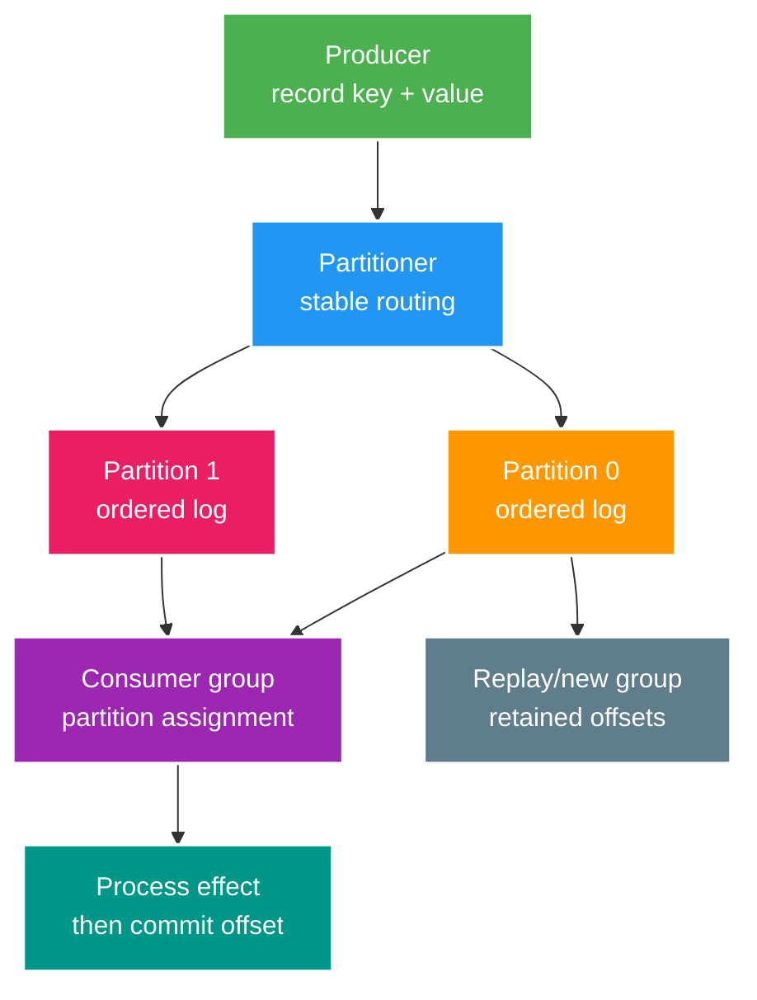

# Kafka Core: Partitioning, Ordering, Replay và Hot Partitions

> Type: `CORE` 
> Domain: `messaging` 
> Target depth: `D3 — chọn key/partition, vận hành consumer group, replay an toàn và chẩn đoán lag/skew` 
> Teaching readiness: `TEACHABLE_DRAFT` 
> Status: `DRAFT` 
> Evidence status: `NOT RUN` 
> Prerequisites: messaging delivery semantics; distributed systems basics 
> Related cases: `KFK-01` preview only; [question bank](../../question-bank/kafka-partitioning-ordering-replay-and-hot-partitions.md) 
> Owner: `Project learner; Codex teaches, learner writes back` 
> Updated: `2026-07-26`

## 1. Mental model: replicated append log

Kafka topic được chia thành partitions. Mỗi partition là ordered append log có offsets tăng trong partition; không có một offset/global order chung toàn topic. Broker giữ partition replicas; leader phục vụ reads/writes, followers replicate theo cluster protocol. Producer chọn partition, thường bằng key. Consumer group chia partitions giữa members: tại một thời điểm một partition được assign cho tối đa một consumer trong cùng group, nhưng nhiều groups đọc độc lập.

Khác work queue xóa message sau ack, Kafka giữ record theo retention/compaction; offset thể hiện consumer position. Điều này hỗ trợ replay, multiple projections và stream processing nhưng đưa partition/key/retention/schema/rebalance thành design concerns.

## 2. Ordering và partition key

Ordering chỉ trong một partition theo log order. Nếu mọi event của stream ID S cần ordered, dùng S làm stable key để cùng partition. Nhưng một stream 100k viewers có thể tạo hot key/partition trong khi partitions khác rảnh. Chọn key bằng business invariant cần order, cardinality/distribution, event size/cost và growth. Random UUID phân phối tốt nhưng phá per-entity order; user ID giữ wallet order nhưng celebrity/hot account có thể skew.

Thêm partitions tăng future parallel capacity nhưng cùng key có thể map partition khác nếu mapping/count thay đổi; records cũ/new của key có thể ở hai partitions và consumer thấy reorder qua migration. Không “thêm partition” trong incident mà giả ordering vẫn giữ. Cần versioned routing, drain/cutover hoặc downstream sequence reconciliation.

Cross-partition total order cần coordinator/sequence và giảm availability/throughput; thường domain chỉ cần per-aggregate version. Event mang aggregate ID/version; consumer idempotently ignore old, handle gap và conditional apply. Timestamp không phải total order khi clocks/skew/retries.

## 3. Producer guarantees

Producer `acks`, replication/min ISR, retries, delivery timeout, batching/compression và idempotence tương tác với durability/latency. Idempotent producer dùng producer ID/sequence để broker deduplicate retry trong supported session/partition semantics; không deduplicate hai business requests khác hoặc external DB write. Kafka transactions có thể atomically write multiple Kafka partitions và offsets cho read-process-write trong Kafka khi consumers use correct isolation, nhưng không atomically commit arbitrary PostgreSQL/HTTP.

Stable event/business ID vẫn cần. Producer callback success là broker-layer evidence, không business-consumer completion. If database commit + Kafka publish, use outbox/CDC or documented reconciliation, không gọi send bên trong `@Transactional` rồi claim atomic.

## 4. Consumer offsets và delivery semantics

Commit offset trước effect tạo loss window: crash sau commit trước effect, restart bỏ qua. Commit sau effect tạo duplicate window: crash sau effect trước commit, record xử lý lại. At-least-once dùng inbox/business unique key hoặc idempotent upsert; batch commit cần xử lý partial success. Auto-commit có thể commit position theo poll/time chứ không theo durable business result nếu handler async/config sai.

Consumer phải `poll` đủ thường xuyên theo group protocol. Processing quá lâu có thể vượt max poll interval, trigger rebalance; partition chuyển member khác trong khi old work còn chạy, tạo duplicates/concurrency. Tách poll/worker cần bounded queue, pause/resume partitions, track per-partition completion và commit contiguous offsets. Không commit offset 105 nếu 103 còn chưa durable.

Rebalance có stop-the-world/moving ownership cost. Static membership/cooperative assignor có thể giảm disruption theo version/config, nhưng handler vẫn phải idempotent. Shutdown cần stop polling, drain bounded work, commit durable contiguous offsets và release assignment trong deadline.

## 5. Retention, compaction và replay

Time/size retention xóa old log segments; replay chỉ đọc records còn retained. Compaction giữ latest record per key eventually, không tức thời và có thể còn multiple versions trong log. Tombstone biểu diễn delete nhưng cũng có retention; consumer offline quá lâu có thể miss delete nếu contract/retention sai. Compacted topic cần non-null stable keys và semantic snapshot/upsert handler.

Replay bằng new consumer group hoặc controlled offset reset. Production-safe plan: xác định source range/schema versions, new/shadow sink hoặc idempotent target, disable non-replayable external notifications, throttle theo downstream headroom, checkpoint, compare invariant rồi cutover. Reset production group giữa peak có thể duplicate effects và mất current progress.

Old events theo old schema/meaning cần compatible reader/upcaster hoặc versioned projection job. Retention là cả recovery và privacy/cost decision; audit/financial data không mặc nhiên dùng Kafka làm system of record.

## 6. Lag và capacity

Record lag thường là end offset trừ committed offset per partition. Nó không tự bằng wall-clock delay; message có event time/processing cost khác nhau, commit batch làm sawtooth. Theo dõi per-partition lag, oldest event age, produce/fetch/process/commit rates, rebalance, errors/retries và handler stages.

Tổng lag che hot partition. Nếu một partition lag tăng còn others zero, tìm top keys/bytes/cost, not just count. Consumer count lớn hơn partitions không tăng parallelism; database/downstream saturated làm thêm consumers xấu hơn. CPU thấp có thể chờ DB pool/lock/network. Throughput capacity phụ thuộc slowest stateful downstream và per-key ordering.

## 7. Hot partition responses

Trước tiên tối ưu serialization/handler/query, cache safe reads, batch writes và isolate external calls. Nếu one key truly hot, choices: accept/scale within one partition; isolate key/topic; shard key into buckets and reassemble sequence; split invariant so order required only within sub-key; aggregate at producer. Bucketing breaks simple order and needs sequence/gap/reconciliation. Migration needs routing version and drain old partitions.

Skew có thể đến từ số byte hoặc processing cost, không chỉ record count. Telemetry cho heavy hitter phải bounded/sampled để tránh metric cardinality cao. Không đặt raw user/resource ID làm label; dùng diagnostic sampling hoặc top-K có kiểm soát.

## 8. Kafka vs RabbitMQ trong project

Kafka phù hợp retained log, replay, multiple independent consumer groups, stream processing và high-throughput ordered partitions. RabbitMQ phù hợp command/work queue, flexible routing, per-message ack/retry/DLX. Có thể dùng cả hai nhưng dual-platform tăng skills, infrastructure, observability và contract governance. Current project RabbitMQ exists; Kafka here is knowledge/comparison only. Không thêm dependency cho đến khi active case có requirement/evidence.

## 9. Version/config boundary

Exact defaults/guarantees phụ thuộc Apache Kafka, broker mode, Java client/Spring Kafka versions: idempotence defaults, assignor, transaction, timeout, offset reset và isolation. Pin versions/config and use official docs. Evidence lab chưa chạy; không suy từ lý thuyết rằng cluster/project có Kafka.

## 9.1. Hai worked examples và phản ví dụ

**Worked example tối thiểu — key/order:** events của cùng `streamId` dùng một stable partition key nên một partition giữ order tương đối. Consumer vẫn phải handle duplicate/restart và không suy global order giữa streams.

**Worked example gần project — hot celebrity stream:** một stream tạo phần lớn traffic, key đúng semantics nhưng một partition nóng. Options gồm split substream/bucket với downstream merge hoặc chấp nhận serialized owner; mỗi option đổi ordering/reconciliation và phải đo lag/skew.

**Phản ví dụ:** tăng partitions rồi tin ordering vẫn toàn topic và replay miễn phí. Repartition đổi key mapping, consumer state/rebuild/cost tăng; “exactly-once” Kafka không bao phủ external payment/DB side effect tùy ý.

## 10. Interview ladder và learner self-check

Foundation cần topic, partition, offset, group, per-partition order và retention/compaction. Senior cần chọn key, hiểu commit crash window, lag/replay và EOS boundary. Architect cần platform choice cùng schema/partition growth. Expert cần hot-key migration, rebalance race, multi-region/DR và business reconciliation.

> **Bài viết của tôi — `LEARNER TODO`:** thiết kế key cho stream events và kể crash/replay/hot-partition histories.

1. **Question:** Kafka ordering ở đâu? 
   **Đọc lại nếu bí:** mục 1–2. 
   **Một câu trả lời tốt phải có:** partition scope, key mapping, consumer concurrency, version/gap và add-partition caveat. 
   **My answer:** `LEARNER TODO`
2. **Question:** Commit offset khi nào? 
   **Đọc lại nếu bí:** mục 4. 
   **Một câu trả lời tốt phải có:** before/after crash windows, durable effect, contiguous per-partition commit, idempotency. 
   **My answer:** `LEARNER TODO`
3. **Question:** Replay an toàn ra sao? 
   **Đọc lại nếu bí:** mục 5–6. 
   **Một câu trả lời tốt phải có:** group/range, schema, shadow/idempotent sink, suppress external effects, throttle/checkpoint/compare. 
   **My answer:** `LEARNER TODO`

## 11. Official references và teach-back

- [Apache Kafka Documentation — Introduction](https://kafka.apache.org/documentation/#introduction)
- [Apache Kafka — Producer Configs](https://kafka.apache.org/documentation/#producerconfigs)
- [Apache Kafka — Consumer Configs](https://kafka.apache.org/documentation/#consumerconfigs)
- [Apache Kafka Design](https://kafka.apache.org/documentation/#design)

- [ ] Tôi chọn partition key từ ordering invariant và skew.
- [ ] Tôi giải thích offset/EOS đúng boundary.
- [ ] Tôi lập replay/hot-partition plan có evidence.
- [ ] Evidence vẫn `NOT RUN`.
