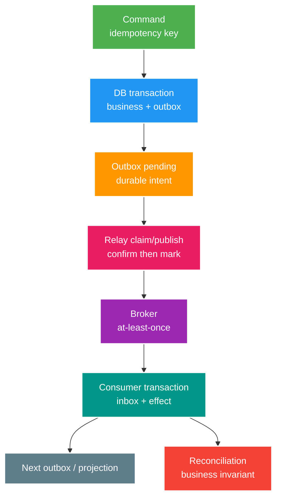

# Reliable Event Workflow Core: Outbox, Inbox, Saga và Event Contracts

> Type: `CORE` 
> Domain: `messaging` 
> Target depth: `D3 — thiết kế workflow at-least-once có durable intent, idempotency, compensation và reconciliation` 
> Teaching readiness: `TEACHABLE_DRAFT` 
> Status: `DRAFT` 
> Evidence status: `NOT RUN` 
> Prerequisites: DB transaction; RabbitMQ/Kafka delivery basics 
> Related cases: `EVT-01`; [question bank](../../question-bank/outbox-inbox-saga-and-event-contracts.md) 
> Owner: `Project learner; Codex teaches, learner writes back` 
> Updated: `2026-07-26`

## 1. Vấn đề dual write

Một use case vừa ghi PostgreSQL vừa publish broker có hai commits độc lập. Publish trước DB: broker nhận nhưng transaction rollback tạo ghost event. DB trước publish: crash sau commit trước send tạo lost event. Retry ở bất kỳ phía nào tạo duplicates. Gọi `rabbitTemplate.send()` hay Kafka send bên trong `@Transactional` không làm broker tham gia cùng database transaction.

Reliable workflow không xóa uncertainty; nó biến intent thành durable state có thể retry/reconcile và làm effects idempotent.

## 2. Transactional outbox

Trong một DB transaction, service ghi business rows và outbox row chứa stable event ID, type/version, aggregate ID/version, occurred time, payload/reference và status. Nếu commit, intent tồn tại; nếu rollback, cả hai biến mất. Relay polling hoặc CDC lấy committed rows, publish, chờ broker acceptance/confirm rồi mark processed.

Crash sau publish trước mark làm relay publish lại. Vì vậy outbox là at-least-once, không exactly-once. Multiple relay workers claim rows bằng conditional status/lease hoặc database locking pattern; lease expiry xử lý crashed worker. Claim không được giữ long DB transaction qua network publish. Mark phải verify owner/lease generation để old worker không overwrite new result.

Ordering: if per-aggregate order required, outbox carries aggregate version and relay/partition/routing respects it or consumer guards gaps. Parallel workers can reorder. Global created timestamp không đủ. Polling đơn giản/control được nhưng tạo query load/latency; CDC giảm polling and captures log order but adds connector/schema/ops. Cả hai cần lag, retry, poison, cleanup và recovery.

Cleanup only rows đã published/retained đủ audit/replay; partition/index by query. Outbox backlog age là SLO signal. Broker uptime không chứng minh intent complete nếu relay stuck.

## 3. Inbox và end-to-end idempotency

Consumer nhận duplicate do lost ack/offset, relay republish hoặc redrive. Trong cùng local transaction, insert unique inbox `(consumer, eventId)` và apply domain effect. Duplicate skips/returns stored outcome. Nếu marker commit tách effect, crash gap breaks correctness. Ack/offset chỉ sau durable commit.

Inbox ID chỉ dedup exact event. Business operation key cần bảo vệ semantic duplicate: two different messages representing same gift purchase must hit unique purchase/idempotency/ledger constraint. Domain state transition conditional on expected version/status prevents stale/out-of-order effect. External effect goes through next outbox or downstream idempotency/reconciliation.

Retention phải dài hơn tổng horizon của broker retry, DLQ/redrive và disaster recovery. Bloom filter/cache giảm DB read nhưng không thể là owner duy nhất vì false positive, eviction và restart. Payload hash giúp phát hiện cùng ID nhưng nội dung khác như một contract/security conflict.

## 4. Gift purchase worked example

API nhận `Idempotency-Key K`. Trong một transaction, hệ thống tạo command record unique K, ledger debit/credit giữ conservation, gift record và outbox `GiftPurchased v1`. Retry K trả cùng durable outcome; payload khác dùng lại K bị conflict. Relay publish cùng event ID theo at-least-once. Consumer notification/analytics có inbox riêng; consumer không trừ wallet lần nữa. Reconciliation nối command → ledger → gift → outbox → consumer status.

Linearization point là database commit của ledger/gift/outbox, không phải HTTP response hay broker delivery. Mất response thì client retry K để đọc result. Publish mất hoặc mơ hồ thì relay retry. Notification duplicate thì inbox chặn. Nếu cần downstream provider, dùng reservation/saga với state tường minh, không giấu HTTP call trong wallet transaction.

## 5. Saga và compensation

Saga phối hợp chuỗi local transaction. **Orchestration** có state machine trung tâm phát command và xử lý reply/timeout; **choreography** để service phản ứng với event mà không có coordinator trung tâm. Orchestration làm workflow/status/recovery dễ thấy nhưng tăng coupling vào coordinator; choreography giảm điều khiển trung tâm nhưng causal graph, loop và ownership có thể mờ.

Compensation là business transaction mới, không phải database rollback ngược thời gian. Refund có thể không khôi phục inventory/price/notification ban đầu; email đã gửi không thể thu hồi. Compensation phải idempotent, retryable, được authorize và audit. Với bước irreversible/pivot, sắp reserve/reversible step trước, yêu cầu approval hoặc chấp nhận manual recovery.

Saga state gồm workflow ID, step/status/version, deadline, attempt, outcome và correlation. Timeout cũng là event/command cần dedup; late success sau timeout/compensation phải được xử lý chứ không giả định bất khả thi. Không giữ DB transaction qua remote call.

## 6. Ordering, event contract và evolution

Event là immutable fact có semantic owner. Contract gồm event type/version, ID, occurred time, producer, aggregate ID/version, correlation/causation, tenant và payload. Không expose database entity hoặc secret. Event notification chỉ mang ID/fact tối thiểu rồi consumer query owner nên tăng runtime coupling; event-carried state giảm call nhưng nhân bản data/privacy/schema burden.

Compatible evolution ưu tiên thêm optional field với safe default và reader tolerant nhưng hữu hạn. Thêm enum value có thể phá consumer exhaustive; đổi meaning/unit của field hoặc tái dùng event type là semantic breaking dù JSON vẫn parse. Publish event/version mới, chạy consumer contract test, telemetry/deprecation và rollout xét retention: consumer hiểu bản mới trước khi producer gửi.

Ordering khác duplication. Aggregate version giúp consumer apply version kế tiếp, bỏ duplicate cũ và park/reconcile gap. Broker partition/routing hỗ trợ nhưng restart/retry/DLQ vẫn có thể reorder. Global order thường không cần.

## 7. Failure classification, DLQ và replay

Với transient dependency failure, retry backoff/jitter có giới hạn. Với permanent schema/invariant/auth failure, quarantine hoặc DLQ. Trường hợp unknown chỉ thử hữu hạn rồi giao operator. DLQ chứa metadata an toàn và payload được bảo vệ, có owner/alert/retention. Replay là privileged mutation cần actor, selection, dry-run, throttling, stable ID/idempotency và audit. Sửa payload có thể cần event version/ID mới cùng causal link, không âm thầm sửa immutable fact.

## 8. Reconciliation and observability

Trace correlation giúp chẩn đoán nhưng không chứng minh correctness. Đo API command state, tuổi outbox cũ nhất và publish attempt, broker queue/lag, inbox duplicate/conflict, saga state/timeout/compensation và DLQ. Metric label phải hữu hạn.

Reconciliation query business invariant: mọi gift đã commit có ledger cân bằng và durable intent; mọi outbox đạt broker/consumer outcome trong SLO; không duplicate gift theo idempotency key; projection version không ahead hoặc gapped. Nó phát hiện bug, retention hết hạn và manual change mà event không tự sửa được. Recovery cần owner và safe repair command.

## 9. Interview ladder

Foundation cần dual-write window, outbox/inbox/saga. Senior cần claim lease, idempotency key/ledger, ordering/schema/DLQ. Architect cần orchestration so với choreography, CDC, ownership/SLO/reconciliation. Expert cần kill matrix, late saga reply, multi-region/DR và boundary của claim exactly-once.

## 9.1. Hai worked examples và phản ví dụ

**Worked example tối thiểu — outbox:** transaction tạo gift và outbox event cùng commit. Relay publish có thể duplicate khi crash trước mark; consumer inbox/business identity làm effect idempotent. Oldest unpublished age là recovery signal.

**Worked example gần project — saga compensation:** debit wallet, notify creator và analytics không thành distributed ACID. State machine ghi từng step/outcome; failure có retry hoặc append compensation/refund, giữ audit và manual reconciliation cho unknown provider state.

**Phản ví dụ:** publish broker trước DB commit để “event không mất”. Consumer có thể xử lý fact của transaction sau đó rollback; đổi thứ tự chỉ chuyển crash gap, không loại bỏ two-resource problem.

## 10. Learner write-back/self-check

> **Bài viết của tôi — `LEARNER TODO`:** kể gift purchase từ idempotent API tới ledger, outbox, broker, inbox và reconciliation.

1. **Question:** Outbox giải và chưa giải gì? 
   **Đọc lại nếu bí:** mục 1–3. 
   **Một câu trả lời tốt phải có:** atomic intent with DB, relay retries, publish-mark duplicate, inbox/business idempotency, lag/cleanup. 
   **My answer:** `LEARNER TODO`
2. **Question:** Compensation khác rollback ra sao? 
   **Đọc lại nếu bí:** mục 5. 
   **Một câu trả lời tốt phải có:** new semantic transaction, irreversible effects, idempotency, late result/timeout, audit/manual. 
   **My answer:** `LEARNER TODO`
3. **Question:** Schema compatible có nghĩa gì? 
   **Đọc lại nếu bí:** mục 6. 
   **Một câu trả lời tốt phải có:** syntax + semantics, additive/default/enum, consumer-first rollout, contract tests/deprecation. 
   **My answer:** `LEARNER TODO`

## 11. References và teach-back

- [microservices.io — Transactional Outbox](https://microservices.io/patterns/data/transactional-outbox.html)
- [Debezium — Outbox Event Router](https://debezium.io/documentation/reference/stable/transformations/outbox-event-router.html)
- [Apache Kafka — Delivery Semantics](https://kafka.apache.org/documentation/#semantics)
- [RabbitMQ — Reliability](https://www.rabbitmq.com/docs/reliability)

- [ ] Tôi tách durable intent, delivery và business invariant.
- [ ] Tôi thiết kế inbox/outbox/saga crash-safe.
- [ ] Tôi có contract/replay/reconciliation ownership.
- [ ] Evidence vẫn `NOT RUN`.
