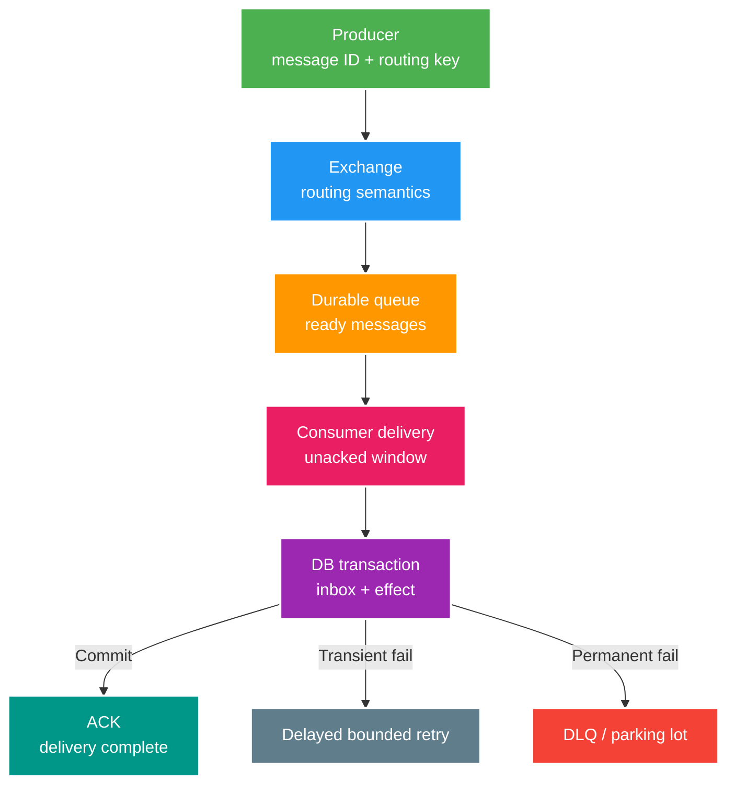

# RabbitMQ Core: Delivery, Ack, Retry và Idempotency

> Type: `CORE` 
> Domain: `messaging` 
> Target depth: `D3 — giải thích delivery lifecycle, triển khai idempotent consumer và chẩn đoán backlog/redelivery` 
> Teaching readiness: `TEACHABLE_DRAFT` 
> Status: `DRAFT` 
> Evidence status: `NOT RUN` 
> Prerequisites: Java transaction/concurrency basics; database unique constraint 
> Related cases: `MQ-01`; [question bank](../../question-bank/rabbitmq-delivery-ack-retry-and-idempotency.md) 
> Owner: `Project learner; Codex teaches, learner writes back` 
> Updated: `2026-07-26`

## 1. Mental model

RabbitMQ là message broker định tuyến message từ producer qua exchange tới một hoặc nhiều queue. Exchange không phải nơi consumer đọc; binding định nghĩa queue nào nhận routing key nào. Queue giữ delivery cho consumers. Với competing consumers trên cùng queue, mỗi message được giao cho một consumer tại một thời điểm, nhưng có thể được giao lại nếu chưa được acknowledged.

Hãy tách ba câu hỏi: message có được **route** tới queue không; broker có **durably accept** nó không; business effect có **commit đúng một lần về mặt invariant** không. Exchange/binding/mandatory return trả lời routing. Durable topology, persistent message, queue type và publisher confirm góp phần trả lời broker acceptance/survival. Ack, transaction và idempotency trả lời consumer effect. Không một flag đơn lẻ trả lời cả ba.

## 2. Topology và publish path

Direct exchange khớp routing key chính xác; topic exchange khớp pattern; fanout broadcast tới mọi bound queue; headers dựa header. Một queue cho nhiều consumer là load sharing, còn mỗi downstream độc lập cần queue riêng để mỗi nhóm nhận bản sao. Dùng chung một queue cho billing và notification khiến chúng tranh message thay vì cùng xử lý.

Durable queue giữ definition qua broker restart; persistent delivery mode yêu cầu broker lưu message theo guarantee của queue; publisher confirm báo producer broker đã accept/nack publish. Confirm không nói consumer đã xử lý. `mandatory`/return xử lý publish không route được; confirm có thể thành công dù không có queue nếu exchange accept rồi drop unroutable message theo cấu hình. Producer cần correlation giữa publish và confirm, timeout/retry bounded và stable message/business ID vì lost confirm có thể làm republish duplicate.

Queue type là decision vận hành. Quorum queue ưu tiên replicated safety/consistency hơn classic queue nhưng có resource/latency/feature trade-off; exact behavior phụ thuộc RabbitMQ version. Topology nên được quản lý declaratively với owner, TTL/length, DLX, permissions và compatibility; consumer tự động declare khác arguments có thể làm startup fail.

## 3. Delivery, ack và failure window

Broker giao message rồi giữ nó `unacked` cho channel/consumer. Ack nghĩa consumer nhận trách nhiệm hoàn tất; nếu connection/channel/process chết trước ack, broker có thể requeue/redeliver. `nack`/`reject` có thể requeue hoặc dead-letter theo topology. `redelivered=true` chỉ là hint đã từng giao, không phải global unique proof và không thay inbox.

Ack trước DB commit tạo window mất effect: process crash sau ack, broker không giao lại. Commit effect rồi ack tạo window duplicate: process crash sau commit trước ack, broker giao lại. Với business quan trọng, chọn at-least-once, commit inbox + domain effect trong cùng DB transaction rồi ack. Duplicate được nhận lại nhưng transaction thấy unique message/business key và không áp effect lần hai.

Không thể đạt end-to-end exactly-once chỉ bằng manual ack, durable queue hay transaction của broker. PostgreSQL và RabbitMQ là hai resource độc lập; publisher confirm không commit database, DB transaction không commit ack. Ta đạt “effectively once” cho invariant cụ thể bằng durable idempotency, unique constraints và reconciliation.

## 4. Idempotent consumer

Message cần stable `eventId`, event type/version, occurred time, aggregate/business key và payload. Consumer mở DB transaction, insert inbox row có unique `(consumer, eventId)` hoặc business operation key, validate/apply domain transition, ghi outbox tiếp nếu có, rồi commit. Duplicate conflict đọc/skip outcome và ack. Marker và effect tách transaction lại tạo gap: marker commit nhưng effect fail sẽ mất xử lý; effect commit nhưng marker fail sẽ double effect.

Idempotency key phải bám invariant. Hai event IDs khác nhau có thể cùng đại diện một purchase retry; khi đó unique command/purchase key ở domain cần thiết ngoài inbox. Retention inbox dài ít nhất retry/redrive horizon và audit requirement. Cleanup phải bounded, index phù hợp và không xóa marker trước message còn có thể quay lại.

External HTTP/email/storage side effect không nằm trong transaction. Ưu tiên ghi durable intent/outbox rồi worker gọi downstream bằng idempotency key. Nếu downstream không idempotent, cần state machine/reservation/reconciliation; “gọi rồi ack” vẫn có crash ambiguity.

## 5. Retry, DLQ và poison message

Phân loại failure: transient dependency timeout/capacity có thể retry; malformed schema, violated invariant hoặc unauthorized payload thường permanent; unknown có bounded retry rồi quarantine. `nack(requeue=true)` ngay lập tức có thể tạo hot loop chiếm consumer. Dùng delayed retry queue/plugin/topology theo version, exponential backoff + jitter, maximum attempts và next-at metadata đáng tin. Sau limit, đưa DLQ/parking lot với failure category và safe payload reference.

DLQ không phải thùng rác. Có owner, alert, retention/privacy, runbook inspect/fix/dry-run/throttled redrive, authorization và audit. Redrive giữ stable identity để inbox bảo vệ duplicate; sửa payload cần new repair/version semantics rõ ràng. Cả retry và DLQ topology phải tránh dead-letter cycle.

## 6. Prefetch, concurrency và backpressure

Prefetch giới hạn deliveries chưa ack. Quá thấp làm worker rảnh do network/latency; quá cao giữ nhiều message trên một consumer, giảm fairness, tăng memory và redelivery burst khi crash. Concurrency × prefetch tạo maximum unacked window; tune theo processing latency, payload size, DB pool/downstream capacity, không theo CPU riêng.

Tăng consumer không giúp khi database lock/pool là bottleneck và có thể làm collapse nhanh hơn. Measure ready/unacked, publish/deliver/ack/redelivery rates, consumer utilization, processing histogram, retry/DLQ và DB waits. Queue ready tăng + unacked thấp có thể thiếu consumers/routing; unacked cao + CPU thấp thường là I/O/lock/pool wait; redelivery cao gợi ý poison/crash/ack failure.

## 7. Spring AMQP boundary

Container ack mode, listener exception/retry, transaction synchronization và default requeue thay đổi theo configuration/version; pin behavior thay vì suy từ annotation. Business transaction ở service/repository, exception classification explicit. Ack chỉ sau durable result theo container contract. Không catch rộng rồi trả success nếu transaction đã rollback. Khi dùng concurrency, mọi handler dependency/state phải thread-safe và unique constraints là final race guard.

Project hiện có RabbitMQ nhưng tài liệu này không chứng minh topology/runtime config đã đúng. Case active sau này mới kiểm source, broker và fault injection; evidence hiện `NOT RUN`.

## 8. Worked failure histories

**Lost confirm:** broker nhận message, confirm mất, producer retry. Consumer nhận hai copies cùng event ID; inbox khiến một effect. **Consumer crash:** DB commit xong, ack chưa gửi; delivery lại, inbox skip rồi ack. **Poison loop:** schema invalid bị requeue immediate, delivery rate cao mà progress zero; classify permanent và park. **Backlog CPU thấp:** consumer chờ DB lock; thêm consumers tăng lock/pool pressure, cần tối ưu invariant/query hoặc shed retry trước.

## 9. Interview ladder

Foundation: exchange/queue/binding, ack, persistence/confirm. Senior: crash windows, inbox, retry/DLQ, prefetch. Architect: topology ownership, event versioning, broker-vs-DB boundary. Expert: diagnose rates/unacked/DB waits, failure injection và residual loss/duplicate horizons.

## 9.1. Hai worked examples và phản ví dụ

**Worked example tối thiểu — crash trước ACK:** consumer commit DB effect rồi chết trước ACK; broker redeliver. Inbox/unique business identity khiến second delivery trả stable no-op/outcome rồi ACK, không double effect.

**Worked example gần project — poison message:** validation/permanent contract error không được requeue vô hạn. Retry transient có bounded attempts/backoff, sau đó DLX có reason/owner/redrive policy; redrive cũng idempotent và throttled.

**Phản ví dụ:** ACK ngay khi nhận để tránh duplicate. Process chết trước DB effect làm message mất. ACK chỉ sau durable successful/terminal handling; prefetch/concurrency phải theo owner capacity, không chỉ tăng throughput knob.

## 10. Learner write-back và self-check

> **Bài viết của tôi — `LEARNER TODO`:** kể publish→route→deliver→DB commit→ack, chèn lost confirm và post-commit crash.

1. **Question:** Vì sao confirm + manual ack chưa phải exactly-once? 
   **Đọc lại nếu bí:** mục 2–4. 
   **Một câu trả lời tốt phải có:** broker boundaries, DB dual resource, lost confirm/post-commit crash, stable ID/inbox. 
   **My answer:** `LEARNER TODO`
2. **Question:** Retry/DLQ thiết kế theo nguyên tắc nào? 
   **Đọc lại nếu bí:** mục 5. 
   **Một câu trả lời tốt phải có:** classification, bounded backoff+jitter, parking owner, safe redrive/idempotency. 
   **My answer:** `LEARNER TODO`
3. **Question:** Queue lag nhưng CPU thấp kiểm gì? 
   **Đọc lại nếu bí:** mục 6 và 8. 
   **Một câu trả lời tốt phải có:** ready/unacked/rates, prefetch, redelivery, DB pool/lock/I/O, downstream capacity. 
   **My answer:** `LEARNER TODO`

## 11. Official references và teach-back

- [RabbitMQ — Consumer Acknowledgements and Publisher Confirms](https://www.rabbitmq.com/docs/confirms)
- [RabbitMQ — Queues](https://www.rabbitmq.com/docs/queues)
- [RabbitMQ — Dead Letter Exchanges](https://www.rabbitmq.com/docs/dlx)
- [Spring AMQP Reference](https://docs.spring.io/spring-amqp/reference/)

- [ ] Tôi tách routing, broker durability và business effect.
- [ ] Tôi thiết kế inbox + effect atomic và bounded retry.
- [ ] Tôi chẩn đoán backlog bằng broker-to-DB evidence.
- [ ] Evidence vẫn `NOT RUN`.
