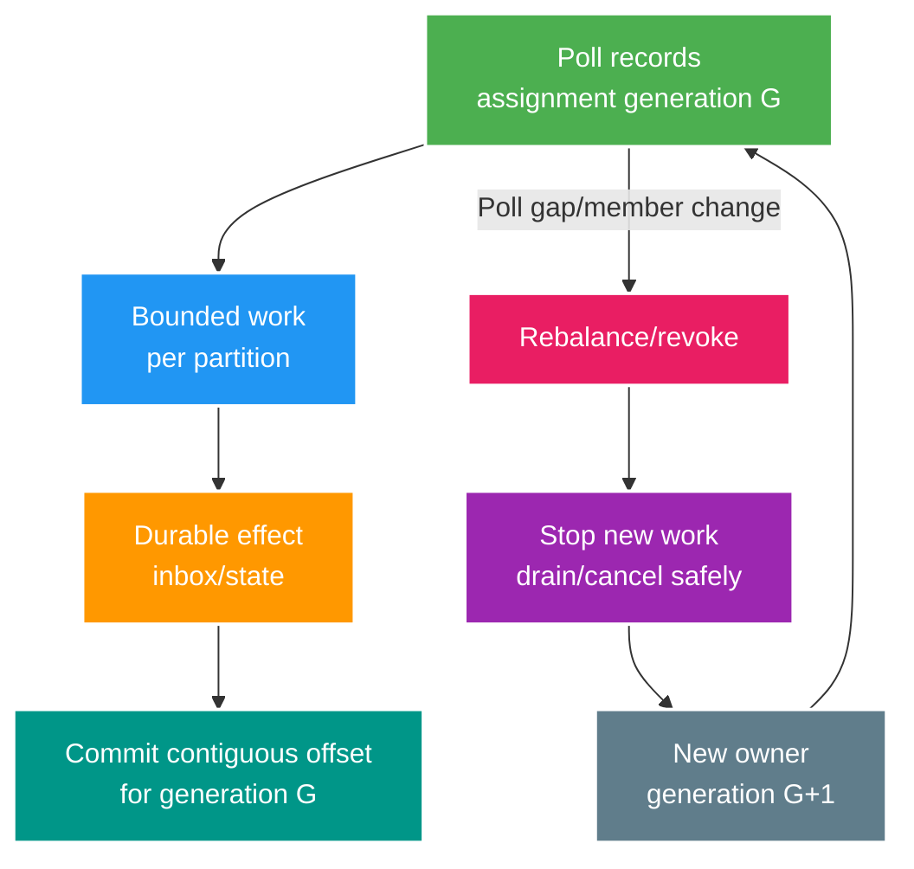

# Deep-dive: Kafka Rebalance, Offsets, Hot Partitions và Exactly-once Boundaries

> Type: `DEEP_DIVE` 
> Domain: `messaging` 
> Target depth: `D4 — dẫn dắt partition evolution, consumer recovery, replay và EOS qua capacity/failure constraints` 
> Teaching readiness: `TEACHABLE_DRAFT` 
> Status: `DRAFT` 
> Evidence status: `NOT RUN` 
> Prerequisites: [Kafka partitioning core](../core/kafka-partitioning-ordering-replay-and-hot-partitions.md) 
> Related cases: `KFK-01` preview only; [question bank](../../question-bank/kafka-partitioning-ordering-replay-and-hot-partitions.md) 
> Owner: `Project learner; Codex teaches, learner writes back` 
> Updated: `2026-07-26`

## 1. Câu hỏi trung tâm

Làm sao bảo toàn per-key semantics khi group rebalance và handler còn in-flight? Làm sao biết lag là capacity, skew, commit illusion hay retry? Kafka transactions giải “exactly-once” trong boundary nào? Khi partition count/key strategy phải đổi, migration nào không âm thầm reorder hoặc rebuild sai state?

## 2. Ownership generations

Partition assignment là lease theo group generation, không permanent ownership. Member cũ có thể vẫn hoàn tất external/DB work sau revoke trong khi member mới xử lý lại offset. Idempotency/conditional aggregate version là correctness layer; rebalance listener/drain chỉ giảm overlap. Với async workers, pause partition trước queue vượt bound, track completed offsets và chỉ commit contiguous prefix. Cancel không bảo đảm downstream call đã không effect.

Long processing phải fit `max.poll.interval.ms` hoặc architecture tách polling/work có backpressure đúng. Tăng timeout che stall lâu hơn và recovery chậm; giảm timeout tăng false rebalance. Heartbeat/session/poll configs và assignor behavior phụ thuộc client/version, nên lab bằng exact stack.

## 3. Offset truth và illusions

Có ba positions: fetched/consumer position, durable processed position và committed group offset. Auto commit hoặc async pipeline có thể làm committed chạy trước effect. Ngược lại batch commit giữ committed lag cao dù nhiều records đã processed; dashboard cần processing checkpoint/event age. Offset N convention thường là next record, nên commit arithmetic/off-by-one phải test.

Async commit callback có thể arrive out-of-order; commit older after newer depending client handling/retry can rewind position. Sync commit blocks but simpler boundary. On revoke, commit only durably completed contiguous offsets owned; failed commit does not justify dropping idempotency. External DB checkpoint stored with projection can be owner for custom recovery but coordinating it with Kafka assignment still requires care.

Lag zero không nghĩa fresh: producer can be stuck before Kafka, event-time old, or consumer commits early. Lag high không always business bad: replay group intentionally behind or compacted projection batch. SLO should be event creation→durable business completion by workflow, plus per-partition diagnostic lag.

## 4. EOS scope precisely

Idempotent producer xử lý duplicate write do retry bằng producer identity/sequence trong boundary Kafka. Kafka transaction gom record trên nhiều partition cùng consumed offset vào một Kafka commit nguyên tử; consumer `read_committed` không thấy record của transaction abort/chưa commit. Transactional-ID fencing ngăn producer epoch cũ tiếp tục sau khi bị thay. Semantics timeout/fencing/recovery chính xác cần official docs và test đúng version.

Pipeline đọc Kafka A → transform → ghi Kafka B cùng offset có thể đạt exactly-once processing trong phạm vi Kafka nếu mọi component/config theo protocol. Nếu handler còn ghi PostgreSQL, gửi email hoặc charge provider, Kafka transaction không rollback nguyên tử các effect đó; dual write vẫn còn. Dùng DB outbox, inbox/unique operation, state store được stream framework hỗ trợ hoặc saga/reconciliation theo owner.

Ngay trong Kafka, “exactly-once” không có nghĩa code chỉ execute một lần; transaction abort/retry có thể chạy transform lại. Nó nghĩa visibility của output/offset đã commit theo atomic protocol. External read không deterministic và side effect vẫn có thể khác. Khi phỏng vấn phải nêu business invariant quan sát được và scope của guarantee.

## 5. Hot partition diagnosis

Chẩn đoán theo từng partition: input record/byte, record size, lag/tuổi cũ nhất, processing latency, error/retry, fetch throttling, broker disk/network và consumer host. Tìm skew ở tần suất key, payload size hay handler cost. Một celebrity stream có thể tạo nhiều event; một malformed key có thể retry; một partition leader có thể nằm trên broker chậm. Top-K sampling và cardinality phải hữu hạn.

Nếu handler là bottleneck, tối ưu DB index/batching/cache và bỏ serial external call. Nếu key thật sự cần order và work không thể parallel, throughput ceiling đến từ semantics; bảo vệ hệ bằng admission/aggregation. Nếu operation có tính giao hoán/kết hợp, shard theo sub-key/bucket rồi aggregate. Nếu sequence quan trọng, thêm sequence, gap buffer/reconciliation và giới hạn memory/time. Cô lập super-hot tenant/topic giảm blast radius nhưng thêm topology và consumer governance.

Thêm partition chỉ ảnh hưởng mapping tương lai, không chuyển record cũ. Mapping của default partitioner đổi; key K có thể từ p2 sang p7 trong khi record cũ vẫn ở p2. Migration có thể stop/drain/cut-over theo sequence, thêm routing version để consumer merge, tạo topic mới cộng backfill/shadow compare, hoặc chấp nhận unordered window đã công bố cho dữ liệu không critical. Không giả định cluster tự phân phối lại record cũ.

## 6. Replay and state rebuild

Định nghĩa mục đích replay: rebuild projection, điều tra, sửa bug hay re-drive side effect. Pin topic, partition, offset range, schema registry/version đầu vào và code/image version. Dùng consumer group mới để không ảnh hưởng production. Ghi shadow table/topic hoặc projection idempotent có version; tắt external notification/payment trừ khi chủ đích. Throttle CPU/database/network và ưu tiên live traffic.

Replay compacted topic có thể không dựng đủ history; time-retained topic có thể đã xóa event. Upcaster phải giữ semantics cũ, không chỉ parse được JSON. Delete/tombstone và producer bug đều quan trọng. So aggregate count, checksum, domain invariant và sample lineage trước swap. Cutover dùng version/epoch để live consumer cũ không ghi đè projection vừa rebuild.

Nếu replay fail giữa chừng, checkpoint theo partition để restart an toàn. Chạy lại cùng range không được duplicate irreversible effect. Chỉ cleanup shadow data/group sau audit/rollback window.

## 7. Multi-region and disaster recovery

Kafka replication hoặc cluster linking xuyên region có ordering, offset translation, duplicate và failover semantics riêng theo product/setup. Application không thể hứa RPO/RTO bằng 0 chỉ vì “Kafka có replication”. Producer ghi lúc split, consumer group chạy ở cả hai region và failback có thể duplicate/reorder. Phải định nghĩa active-active hay active-passive, source-of-truth region, key routing, checkpoint và business reconciliation.

DR drill cần stop/partition region, làm producer/consumer fail rồi assert không thiếu business intent ngoài RPO đã khai, duplicate được contain và per-key version hợp lệ. Restore Kafka không khớp database checkpoint có thể apply lại event cũ hoặc bỏ effect cần thiết. Owner database, inbox/version và event lineage quyết định recovery.

## 8. Operational decision record

Ghi topic owner/semantics, key strategy, partition count/growth, retention/compaction, schema compatibility, producer durability/idempotence/transaction, consumer group/offset/idempotency, retry/DLQ, replay, SLO và DR. Đổi partitioner/count, schema meaning, isolation hoặc major framework/client cần migration plan và negative/fault test.

## 9. Experiment matrix

Chỉ tạo local lab khi case active: kill sau DB effect trước commit offset; vượt poll interval; ép rebalance khi record in-flight; load hot key; thêm partition; replay schema cũ; abort Kafka transaction; ghi external database trong transaction; restart broker/consumer. Evidence gồm version/config, offset/time theo partition, key đã sanitize và DB invariant cuối. Hiện evidence `NOT RUN`; dependency Kafka trong project vẫn `NOT ADDED`.

## 10. Trade-offs

Nhiều partition tăng parallel capacity nhưng cũng tăng metadata, rebalance, cost và độ phức tạp migration key. Strict order giới hạn scale hot key. Batch/async tăng throughput nhưng làm contiguous commit khó hơn. EOS thêm coordination/latency và vẫn chỉ trong Kafka. Retention dài hỗ trợ recovery nhưng tốn storage/privacy. Tự do multi-platform tăng operations cost. Chọn theo invariant, replay và SLO, không theo headline benchmark.

## 11. Learner/self-check

> **Bài viết của tôi — `LEARNER TODO`:** kể rebalance overlap, EOS boundary và hot-key migration cho one livestream.

1. **Question:** Member cũ/new overlap thế nào? 
   **Đọc lại nếu bí:** mục 2–3. 
   **Một câu trả lời tốt phải có:** generation lease, in-flight after revoke, bounded drain, contiguous commit, idempotency/version. 
   **My answer:** `LEARNER TODO`
2. **Question:** EOS không cover PostgreSQL vì sao? 
   **Đọc lại nếu bí:** mục 4. 
   **Một câu trả lời tốt phải có:** Kafka transaction scope, code re-execution, external resource, outbox/inbox/reconciliation. 
   **My answer:** `LEARNER TODO`
3. **Question:** Add partitions xử lý hot key không? 
   **Đọc lại nếu bí:** mục 5. 
   **Một câu trả lời tốt phải có:** future mapping only, same key remap/order gap, semantic ceiling, versioned migration/reassembly. 
   **My answer:** `LEARNER TODO`

## 12. Official references và teach-back

- [Apache Kafka — Consumer Group Protocol](https://kafka.apache.org/documentation/#consumerconfigs_group.protocol)
- [Apache Kafka — Exactly Once Semantics](https://kafka.apache.org/documentation/#semantics_eos)
- [Apache Kafka — Log Compaction](https://kafka.apache.org/documentation/#compaction)
- [Apache Kafka — Operations](https://kafka.apache.org/documentation/#operations)

- [ ] Tôi quản lý ownership generation và offset truth.
- [ ] Tôi giới hạn EOS đúng Kafka boundary.
- [ ] Tôi thiết kế hot-key/replay/DR migration.
- [ ] Evidence vẫn `NOT RUN`.
