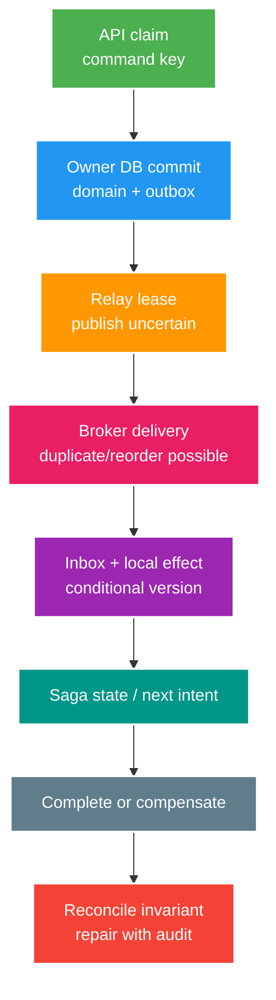

# Deep-dive: Outbox Relay, Inbox, Saga Compensation và Schema Evolution

> Type: `DEEP_DIVE` 
> Domain: `messaging` 
> Target depth: `D4 — formalize crash histories, workflow state, compatibility và recovery qua nhiều owners` 
> Teaching readiness: `TEACHABLE_DRAFT` 
> Status: `DRAFT` 
> Evidence status: `NOT RUN` 
> Prerequisites: [Reliable event workflow core](../core/outbox-inbox-saga-and-event-contracts.md) 
> Related cases: `EVT-01`; [question bank](../../question-bank/outbox-inbox-saga-and-event-contracts.md) 
> Owner: `Project learner; Codex teaches, learner writes back` 
> Updated: `2026-07-26`

## 1. Câu hỏi trung tâm

Làm sao chứng minh không mất durable intent và không double-spend qua mọi kill point? Relay nhiều workers claim/publish/mark không giữ network trong DB transaction ra sao? Saga xử lý timeout, late success và compensation failure thế nào? Event evolution/replay qua code generations nào vẫn giữ semantic invariant?

## 2. Workflow state and ownership

Mỗi state có owner/linearization point. API command claim + ledger/outbox commit owned by PostgreSQL. Relay lease không chuyển business authority; nó chỉ phân phối work. Broker delivery is transport. Consumer local DB owns its effect/inbox. Saga orchestrator owns workflow state, không sở hữu participant data. Reconciliation reads owners and issues explicit repair, không edit history tùy ý.

## 3. Relay concurrency protocol

Outbox row fields thường gồm ID, aggregate/version, type/schema, payload, createdAt, status, attempts, nextAt, leaseOwner/leaseUntil/generation, publishedAt và lastError bounded. Worker claim batch bằng `FOR UPDATE SKIP LOCKED` trong short transaction hoặc conditional update to leased. Nó commit claim, publish ngoài transaction, then conditional mark `WHERE leaseOwner/generation`. Nếu worker pauses past lease and old publish later succeeds, new worker may also publish; duplicate expected.

Không đánh dấu published trước khi broker xác nhận accept vì crash sẽ mất message. Đánh dấu sau confirm lại mở cửa duplicate nếu crash ở giữa. Vì vậy consumer idempotency là bắt buộc. Lease dài hơn thời gian publish dự kiến nhưng vẫn hữu hạn; heartbeat/renewal có thể gia hạn, song GC/network pause vẫn tạo trạng thái mơ hồ. Retry dùng backoff/jitter; lỗi serialization hoặc message quá lớn thường permanent. Batch size và polling index phải tránh scan/lock business table nóng.

Giữ ordering theo aggregate khi relay parallel là khó. Có thể partition claim theo aggregate hash; chỉ publish outbox sequence kế tiếp; dùng broker key/routing cộng consumer version; hoặc chấp nhận reorder. Ép `createdAt` toàn cục làm serialize throughput mà thường không phải business need. Nếu row n lỗi permanent, phải quyết định chặn n+1 hay cho qua với gap/reconciliation theo semantics.

CDC đọc WAL/change log của database nên tránh polling/claim status, nhưng delivery tới broker, connector offset và schema evolution vẫn có at-least-once/operational failure. Contract của outbox table phải ngăn connector expose secret/internal column. Cần snapshot/recovery và log retention đủ dài.

## 4. Inbox and business invariant

Inbox transaction bắt đầu bằng claim event ID duy nhất. Cùng ID nhưng payload hash khác là conflict. Aggregate transition phải conditional theo expected version/status, unique business key và ledger constraint. Lưu outcome/version để trả duplicate hoặc audit. ACK/offset chỉ sau commit. Nếu handler sinh event kế, ghi outbox tiếp theo trong cùng transaction.

Inbox một mình không ngăn hai event ID khác nhau cùng debit một command. Domain cần unique `(walletId, operationKey)` và invariant double-entry/conservation cân bằng. Khi nói “effectively once” phải gọi đúng effect: một gift purchase, một ledger operation hoặc projection version monotonic. Notification ở provider vẫn có thể at-least-once nếu provider thiếu idempotency.

Với duplicate đồng thời, unique constraint chọn winner. Loser có thể block rồi nhận conflict và đọc committed outcome. Việc catch constraint khi transaction đã rollback-only phải theo đúng framework boundary. Test bằng hai thread/process có barrier, không chỉ gửi duplicate tuần tự.

## 5. Saga temporal failures

Ví dụ gift flow: reserve wallet → ghi gift → credit creator → notify. Core monetary invariant có thể đặt trong một database transaction; đừng phân tán không cần thiết. Nếu bắt buộc gọi external payment/provider, saga có state rõ như `STARTED`, `RESERVED`, `CONFIRMED`, `COMPENSATING`, `COMPENSATED`, `MANUAL_REVIEW`, `COMPLETED` cùng version.

Timeout không chứng minh remote thất bại; request có thể thành công nhưng reply mất. Khi timeout, query theo idempotency key/status trước compensation nếu API hỗ trợ. Nếu compensation đã bắt đầu rồi late success tới, state machine quyết định hủy compensation, compensate success hay chuyển manual; không chạy hai nhánh thiếu version guard. Compensation cũng có thể fail/retry và phải idempotent. Notification irreversible chỉ chạy sau pivot/confirmation hoặc phải chấp nhận correction.

Orchestrator crash phải recover từ durable state, timer và outbox, không từ workflow trong memory. Nhiều orchestrator worker dùng optimistic version/lease; duplicate timer/response là bình thường. Choreography cần correlation/causation và loop guard; global graph/ownership thường khó thấy hơn. Chọn theo độ phức tạp workflow, tự chủ team và khả năng vận hành.

## 6. Event semantics and compatibility

Tool schema compatibility chỉ validate shape, không hiểu meaning. Đổi amount từ cent sang decimal, timezone, identity source hoặc event từ “created” thành “requested” là breaking dù JSON type giữ nguyên. Event owner phải publish semantic contract, example và invariant. Consumer khai version/feature đang dùng; contract test chạy example của producer qua reader của consumer.

Rollout additive theo consumer-first: deploy reader chịu được optional field mới và unknown enum an toàn; quan sát; sau đó producer mới emit; chỉ deprecate bản cũ sau toàn bộ consumer/replay horizon. Thêm required field cần default, backfill hoặc version mới. Xóa field cần usage telemetry và reader cho old event còn retention. Event name/type là immutable fact; meaning mới dùng type/version mới.

Upcast old event sang internal model hiện tại vẫn phải giữ semantics cũ; không bịa knowledge chưa tồn tại trừ khi projection chủ đích derive từ owner hiện hành. Replay bằng business rule mới có thể cho kết quả khác; phải chọn historical reconstruction hay recalculation. Lưu code/rule version để so sánh.

## 7. Failure matrix for `EVT-01`

Kill trước API transaction thì không có command/effect. Kill sau claim nhưng trước ledger/outbox trong cùng transaction thì rollback toàn bộ. Kill sau DB commit trước HTTP response thì retry key trả cùng result. Kill relay quanh broker accept/confirm/mark tạo một hoặc nhiều copy nhưng không mất intent. Kill consumer trước commit thì redelivery chưa có effect; kill sau commit trước ACK thì duplicate bị skip. Kill saga sau remote success trước reply/state cần status query/idempotency để giải mơ hồ. Mọi case phải assert ledger conservation, gift duy nhất, outbox/inbox durable và trace lineage.

Network partition khác process kill: hai phía có thể cùng tiếp tục hoặc timeout, clock/lease hết hạn và message trễ tới sau recovery. Test proxy delay/drop response, không chỉ exception. Database failover/replica lag có thể làm read sai nếu command/status dùng replica; consistency của critical owner read/write phải rõ.

## 8. Reconciliation and repair

Scheduled/operational query tìm domain row đã commit nhưng thiếu outbox, old pending outbox, published event không có consumer progress, inbox thiếu valid effect, projection version gap, saga overdue/contradictory và ledger imbalance. Một số check xuyên system có eventual consistency nên cần grace window và sample an toàn trước repair.

Repair là command có idempotency, authorization, dry-run, reason/actor và audit. Chỉ tái tạo missing intent từ evidence của owner; không âm thầm giả event timestamp/version. DLQ replay giữ identity; corrected event có ID mới cùng causation/original reference. Throttle và canary để bảo vệ live traffic.

## 9. Multi-region and DR

Active writer ở nhiều region làm phức tạp unique idempotency, aggregate ordering và ledger ownership. Chọn single owner/shard theo wallet/aggregate, global-consistent key service hoặc conflict rule; async replication thông thường không ngăn double-spend khi partition. Duplicate/reorder event qua replication là dự kiến; consumer version/inbox chỉ xử lý trong semantics business owner cho phép.

Restore database/outbox/broker ở các point khác nhau có thể republish hoặc thiếu transport copy. Business và outbox cùng backup giúp relay republish row chưa mark và inbox xử lý duplicate. Nếu inbox restore cũ hơn effect, domain unique invariant phải chặn lặp. DR test assert business state, không đòi queue giống hệt. RPO có thể buộc manual/global epoch cho operation mơ hồ.

## 10. Operational governance

Catalog mỗi event gồm producer owner, schema/meaning, privacy/classification, key/order, retention, consumer/SLO, compatibility, deprecation và replay. Dashboard nối command ID → domain commit → outbox → publish → consumer inbox/effect/saga. Alert theo oldest age, DLQ và invariant, không dùng raw ID label. Runbook có pause, inspect, repair, redrive, reconcile và exit criteria.

## 11. Trade-offs and version boundary

Outbox polling dễ nhưng tăng load/latency; CDC mạnh nhưng cần platform ops. Inbox tốn storage write nhưng dedup durable. Orchestration dễ quan sát nhưng centralized; choreography tự chủ nhưng hành vi emergent. Strict ordering giảm parallelism; tolerant gap cần repair. 2PC có thể hợp trường hợp hiếm với resource kiểm soát, nhưng availability/ops/coupling thường tệ hơn và external effect vẫn nằm ngoài.

Pin DB isolation/schema, hành vi transaction của framework, version broker/client và connector. Evidence vẫn `NOT RUN`; task này không implement case/source.

## 12. Learner/self-check

> **Bài viết của tôi — `LEARNER TODO`:** draw all kill points for gift workflow and specify invariant/evidence/recovery.

1. **Question:** Relay lease có loại duplicate không? 
   **Đọc lại nếu bí:** mục 3. 
   **Một câu trả lời tốt phải có:** publish/mark ambiguity, lease expiry/paused worker, conditional generation, same ID/inbox. 
   **My answer:** `LEARNER TODO`
2. **Question:** Timeout saga nói được gì? 
   **Đọc lại nếu bí:** mục 5. 
   **Một câu trả lời tốt phải có:** unknown outcome, status/idempotency, versioned late success, compensation failure/manual. 
   **My answer:** `LEARNER TODO`
3. **Question:** Replay old event bằng new code có risk nào? 
   **Đọc lại nếu bí:** mục 6 và 8. 
   **Một câu trả lời tốt phải có:** schema vs semantic compatibility, historical vs recalculation, upcaster/rule version, shadow compare/idempotency. 
   **My answer:** `LEARNER TODO`

## 13. References/teach-back

- [Debezium — Outbox Pattern](https://debezium.io/documentation/reference/stable/transformations/outbox-event-router.html)
- [PostgreSQL — Explicit Locking](https://www.postgresql.org/docs/current/explicit-locking.html)
- [RabbitMQ — Reliability](https://www.rabbitmq.com/docs/reliability)
- [Apache Kafka — Message Delivery Semantics](https://kafka.apache.org/documentation/#semantics)

- [ ] Tôi formalize owner/linearization/crash histories.
- [ ] Tôi xử lý saga late result và compensation failure.
- [ ] Tôi evolve/replay event theo semantic evidence.
- [ ] Evidence vẫn `NOT RUN`.
