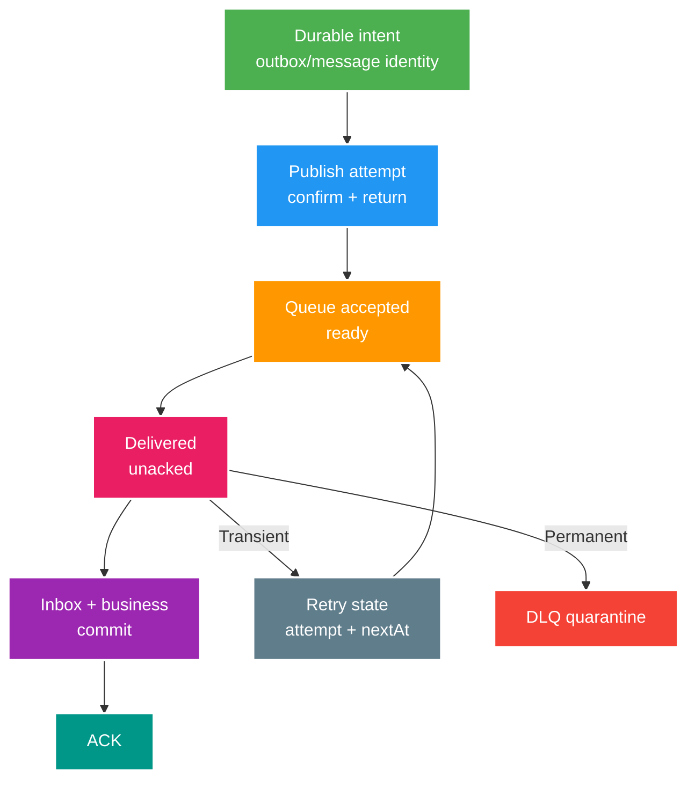

# Deep-dive: RabbitMQ Ack, Redelivery, DLX và Consumer Recovery

> Type: `DEEP_DIVE` 
> Domain: `messaging` 
> Target depth: `D4 — thiết kế và vận hành delivery workflow chịu crash, retry storm, broker failover và downstream saturation` 
> Teaching readiness: `TEACHABLE_DRAFT` 
> Status: `DRAFT` 
> Evidence status: `NOT RUN` 
> Prerequisites: [RabbitMQ delivery core](../core/rabbitmq-delivery-ack-retry-and-idempotency.md) 
> Related cases: `MQ-01`; [question bank](../../question-bank/rabbitmq-delivery-ack-retry-and-idempotency.md) 
> Owner: `Project learner; Codex teaches, learner writes back` 
> Updated: `2026-07-26`

## 1. Câu hỏi trung tâm

Một delivery workflow giữ invariant thế nào khi producer mất confirm, broker failover, consumer crash ở mọi điểm, retry reorder và database chậm? Làm sao phân biệt queue khỏe nhưng downstream nghẽn với topology/ack bug? D4 không chỉ biết `ack/nack`; phải có state model, fault matrix, capacity boundary và recovery procedure.

## 2. End-to-end state machine

Identity phải tồn tại trước attempt. Producer publish sequence per channel và confirm chỉ có ý nghĩa trong connection/channel generation; reconnect không biến uncertain publish thành known failure. Khi timeout, producer chọn retry với same event ID. Broker queue state và DB outbox state có thể lệch tạm thời; reconciliation dùng outbox age/status + broker/consumer evidence, không đoán từ one-side flag.

Consumer delivery tag scoped theo channel, không phải message ID. Multiple ack có thể ack một range delivery tags và làm failure blast radius lớn nếu xử lý song song/out-of-order sai. Ack/nack API exact phụ thuộc client/framework; business rule vẫn là chỉ acknowledge deliveries có durable outcome.

## 3. Crash matrix

| Điểm crash | Trạng thái có thể thấy | Recovery đúng |
| --- | --- | --- |
| Trước broker accept | Outbox pending, không message | Relay retry same ID |
| Sau accept, trước confirm | Message có thể đã queue, outbox pending | Retry; consumer dedup |
| Sau confirm, trước mark outbox | Message queue, outbox pending | Republish possible; dedup |
| Consumer trước DB commit | Delivery unacked, no effect | Redeliver/retry |
| Sau DB commit, trước ack | Effect + inbox committed | Redeliver; inbox skip |
| Sau ack | Effect durable, delivery complete | Normal |

Fault test cần kill thật tại barrier, restart connection/process và assert final invariant. Mock exception ngay đầu handler không bao phủ post-commit/pre-ack. Unique constraints/conditional business write phải chịu two-consumer race; local synchronized block không đủ. Nếu effect là debit, assertion là conservation/no duplicate ledger, không chỉ inbox row count.

## 4. Retry workflow sâu hơn

Attempt metadata không được tin header do arbitrary publisher nếu nó quyết định privileged redrive; derive/cap trong trusted workflow. Backoff cần jitter để tránh tất cả message thức cùng lúc. Retry queue TTL + DLX thường tạo nhiều queues per delay bucket; per-message expiration có ordering caveat, plugin/delayed exchange có version/ops trade-off. Không assume delay chính xác; design next-at as minimum/bounded.

Classification nên dựa exception/domain outcome: validation/version/auth permanent; optimistic conflict có thể retry bounded hoặc stale-ignore; timeout/connection transient; resource exhaustion cần load shedding, không nhân retry. Circuit open thường reschedule/delay chứ không consume-requeue hot loop. Retry budget tính original + all retries để tránh recovery traffic vượt healthy capacity.

DLQ entry cần original event ID/type/version, queue/source, bounded failure code, attempts/timestamps và payload protected. Nếu payload chứa secret/PII, restrict/encrypt/retention. Redrive tool là write privilege: selection, change ticket/actor, dry-run, destination/version, throttle, result và rollback/reconciliation.

## 5. Ordering và parallelism

RabbitMQ preserves queue order trong giới hạn, nhưng multiple consumers, requeue, redelivery và different retry queue làm observed processing order thay đổi. Nếu business cần per-aggregate order, encode aggregate version và conditional consumer state; single queue/single consumer là simple nhưng throughput/failure isolation kém. Consistent-hash/routing shards có operational complexity; global ordering hiếm khi đáng giá.

Prefetch N và concurrency C cho unacked window khoảng N×C theo container semantics. Long task giữ earlier delivery trong khi later hoàn tất; multiple ack/range cần thận trọng. Fair dispatch không đảm bảo equal work khi message cost khác. Measure processing cost distribution và heavy keys, không chỉ message count.

## 6. Broker durability và failover boundary

Durable exchange/queue definition, persistent messages, confirms và replicated queue giải failure khác nhau. Quorum queue commit/leader failover có availability/latency/partition behavior theo RabbitMQ release; đọc official doc cho exact guarantee. Publisher phải handle connection blocked/flow control, nack, timeout và return. Consumer recovery phải re-establish connection/channel/consumer/topology theo owner config mà không tạo duplicate queue/binding khác arguments.

Network partition tạo uncertain state. Producer không thể phân biệt “broker chưa nhận” với “broker nhận nhưng response mất”; retry + idempotency là resolution. Consumer mất connection sau commit cũng tương tự. Exactly-once claim bỏ qua uncertainty này là red flag.

## 7. Backlog diagnosis playbook

Bắt đầu bằng rates: publish, deliver, ack, redelivery; gauges ready/unacked; consumer count/utilization; connection/channel alarms. Ready tăng, deliver thấp: binding/consumer/flow/prefetch/topology. Deliver cao, ack thấp, unacked cao: handler blocked/slow hoặc ack config. Redelivery/DLQ tăng: exception/poison/recovery loop. Broker disk/memory alarm/flow control ảnh hưởng producer và delivery.

Qua application: handler timer tách deserialize, DB wait/query/lock, external call, commit và ack adapter. Thread dump cho blocked/waiting; connection pool metrics; PostgreSQL locks/slow query. Scale consumer chỉ khi per-partition/queue work parallelizable và downstream còn headroom. Nếu retry storm là nguồn load, pause/quarantine classifier trước khi scale.

Capacity model đơn giản: arrival λ, average service time S, effective workers C; utilization gần λS/C. Khi gần 1, tail/backlog nhạy; retries tăng effective λ. Prefetch không tăng database capacity. SLO nên đo event age/end-to-end completion, không chỉ queue length vì message sizes/cost khác nhau.

## 8. Recovery runbook

Contain: xác định queue/event types, pause producer/consumer phù hợp, stop immediate requeue, protect DB. Classify poison vs dependency vs broker. Repair config/data/code. Canary một bounded batch với idempotency/invariant assertions. Redrive throttle dưới downstream headroom; monitor duplicate skips, errors, queue age và DB. Reconcile owner database/outbox/inbox/business counts. Resume gradually và ghi timeline/root cause.

Broker restore không tự chứng minh workflow complete. Messages acknowledged trước backup nhưng business restored cũ, hoặc DB restored mới hơn broker, có thể lệch. Reconciliation dựa business invariant và durable intent; uncertain financial workflow có thể cần manual quarantine/global replay plan.

## 9. Design trade-offs

RabbitMQ hợp command/work queue và flexible routing; retained replay log không phải strength chính. Quorum safety đổi resource/latency. Higher prefetch/parallelism đổi failure burst/order. Long retry giữ automation nhưng giữ poison/capacity; DLQ nhanh cần operator. Inbox/outbox thêm writes/cleanup nhưng khóa dual-resource gaps. Chọn bằng loss/duplicate/order/recovery SLO.

## 10. Version boundary và evidence plan

Pin RabbitMQ, queue type, Spring AMQP và client versions. Ghi ack mode, requeue default, confirm/return, concurrency/prefetch, retry topology. Lab: lost confirm proxy; kill after commit; broker restart/failover; malformed message; DB slowdown; concurrency duplicate; DLQ redrive. Thu broker rates, sanitized message ID, DB invariant và timestamps. Hiện chưa chạy nên evidence `NOT RUN`.

## 11. Learner/self-check

> **Bài viết của tôi — `LEARNER TODO`:** lập crash matrix và runbook cho gift notification consumer.

1. **Question:** Lost confirm giải bằng gì? 
   **Đọc lại nếu bí:** mục 2–3 và 6. 
   **Một câu trả lời tốt phải có:** uncertain accept, same stable ID, retry, inbox/business idempotency, reconciliation. 
   **My answer:** `LEARNER TODO`
2. **Question:** Vì sao retry có thể làm outage nặng hơn? 
   **Đọc lại nếu bí:** mục 4 và 7. 
   **Một câu trả lời tốt phải có:** amplification, no jitter/hot requeue, exhausted dependency, retry budget/load shedding. 
   **My answer:** `LEARNER TODO`
3. **Question:** Backlog diagnosis đi qua lớp nào? 
   **Đọc lại nếu bí:** mục 7–8. 
   **Một câu trả lời tốt phải có:** broker rates/state, application stages, DB/downstream capacity, contain/canary/reconcile. 
   **My answer:** `LEARNER TODO`

## 12. Official references và teach-back

- [RabbitMQ — Reliability Guide](https://www.rabbitmq.com/docs/reliability)
- [RabbitMQ — Quorum Queues](https://www.rabbitmq.com/docs/quorum-queues)
- [RabbitMQ — Consumer Prefetch](https://www.rabbitmq.com/docs/consumer-prefetch)
- [Spring AMQP — Message Listener Container](https://docs.spring.io/spring-amqp/reference/amqp/containerAttributes.html)

- [ ] Tôi enumerate mọi uncertain/crash window.
- [ ] Tôi thiết kế retry/DLQ có capacity và recovery owner.
- [ ] Tôi chẩn đoán broker-to-DB bằng evidence.
- [ ] Evidence vẫn `NOT RUN`.
