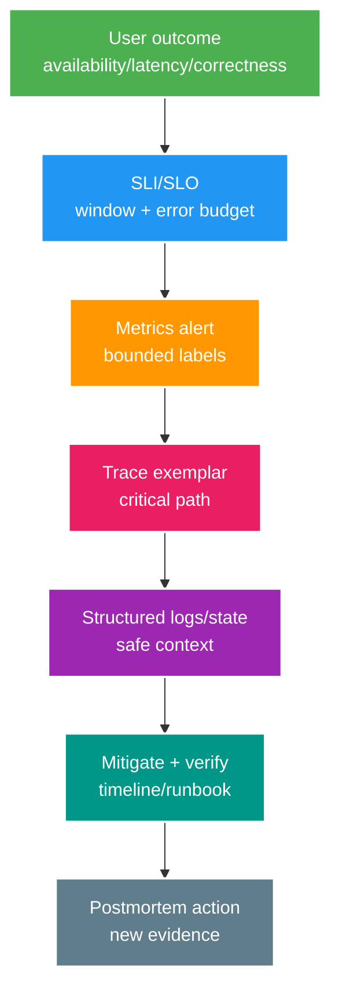

# Observability Core: Logs, Metrics, Traces, SLO và Incident Response

> Type: `CORE` 
> Domain: `observability` 
> Target depth: `D3 — thiết kế telemetry bounded/actionable và chẩn đoán incident từ user symptom tới dependency` 
> Teaching readiness: `TEACHABLE_DRAFT` 
> Status: `DRAFT` 
> Evidence status: `NOT RUN` 
> Prerequisites: HTTP/async basics; production safety 
> Related cases: `OBS-01`; [question bank](../../question-bank/logs-metrics-traces-slo-and-incident-response.md) 
> Owner: `Project learner; Codex teaches, learner writes back` 
> Updated: `2026-07-26`

## 1. Observability bắt đầu từ câu hỏi cần trả lời

**Log** ghi từng sự kiện kèm ngữ cảnh; **metric** tổng hợp số liệu theo các chiều có giới hạn để xem xu hướng và cảnh báo; **trace** nối các span của một request hoặc workflow được lấy mẫu. Không bắt một loại tín hiệu làm mọi việc: dashboard cho thấy triệu chứng, trace thu hẹp đường đi, còn log/state/query chứng minh chi tiết. Invariant nghiệp vụ bền vững vẫn cần bằng chứng riêng.

Observability là khả năng suy ra trạng thái bên trong từ các tín hiệu đã được thiết kế cho chẩn đoán. “Có log” nhưng thiếu correlation ID, version và error category thì vẫn khó điều tra; exporter bị quá tải rồi chặn request còn biến telemetry thành nguyên nhân gây lỗi.

## 2. Các loại metric và ý nghĩa đo lường

**Counter** chỉ tăng, ví dụ tổng request/error/byte; muốn biết tốc độ phải tính rate theo cửa sổ thời gian và xử lý trường hợp process restart làm counter reset. **Gauge** là giá trị hiện tại như queue depth hoặc số connection active, có thể tăng giảm và một snapshot có thể bỏ lỡ biến động ngắn. **Histogram** đếm phân phối vào các bucket, nhờ đó ước lượng percentile và cộng gộp giữa instance nếu bucket được chọn quanh ngưỡng SLO. `Timer` thường đóng gói count, sum và histogram của duration; `summary` hoặc client-side quantile có giới hạn cộng gộp phụ thuộc sản phẩm.

Mỗi metric phải nói rõ đơn vị, boundary đo và outcome. “HTTP đã trả”, “outbox đã commit”, “broker đã giao” và “side effect nghiệp vụ đã commit” là bốn mốc khác nhau. Latency của request, query database và tuổi end-to-end của event cũng không thể dùng chung một tên. RED gồm rate/error/duration; USE gồm utilization/saturation/error; cả hai vẫn cần đối chiếu với invariant nghiệp vụ.

Average che mất đuôi chậm. Percentile cần đủ volume, cửa sổ thời gian và histogram bucket phù hợp; không lấy trung bình p99 của nhiều instance. Hành vi chính xác của Micrometer, Prometheus và OpenTelemetry phụ thuộc version/config nên phải pin phiên bản khi kết luận.

## 3. SLI, SLO, SLA và error budget

**SLI** là phép đo tỷ lệ sự kiện tốt trên tổng sự kiện hợp lệ từ góc nhìn người dùng. **SLO** là mục tiêu cho SLI trong một cửa sổ, ví dụ 99,9% gift request hợp lệ thành công trong 30 ngày và p99 dưới ngưỡng. **SLA** là cam kết bên ngoài kèm hậu quả hợp đồng. **Error budget** là phần sai hỏng được phép để cân bằng tốc độ delivery với reliability, không phải “quota outage” để tiêu tùy ý.

Cần định nghĩa population hợp lệ, điều kiện một event được coi là tốt, nguồn dữ liệu, exclusion và cửa sổ. Health check xanh không có giá trị nếu người dùng vẫn nhận lỗi. Tách availability, latency, freshness như outbox/search lag và correctness khi có thể đo. Burn rate cho biết error budget đang bị tiêu nhanh đến đâu; alert nhiều cửa sổ bắt được cả lỗi bùng nhanh lẫn suy giảm chậm.

SLO quá chặt khi business không cần sẽ tăng chi phí và noise; quá lỏng lại che mất tổn hại. Phải xem lại cùng Product/stakeholder dựa trên hành vi và dữ liệu thật.

## 4. Correlation và truyền context

Khi nhận hoặc sinh correlation ID, phải giới hạn độ dài và charset; không dùng ID do client gửi làm dữ kiện authorization hoặc metric label. W3C Trace Context truyền `traceparent`/`tracestate` theo chuẩn. HTTP instrumentation tạo span; async executor phải capture/restore context rồi dọn MDC/ThreadLocal; broker inject/extract header. Event ID, correlation ID và causation ID của workflow là business lineage riêng.

Virtual thread hoặc reactive pipeline có thể đổi execution context; MDC thủ công sẽ rò sang request khác nếu không dọn. Dùng Reactor Context, instrumentation hoặc structured task context đúng mô hình. Log nên có trace/span/correlation, service/version/instance, route và error category, không chứa token, body hay PII. Message replay sau nhiều ngày nên tạo trace mới có link tới trace cũ thay vì kéo một trace sống nhiều ngày.

## 5. Cardinality, quyền riêng tư và chi phí

Mỗi tổ hợp label duy nhất tạo một time series. Đưa user ID, request ID, token, raw path, exception text hoặc event ID vào label sẽ làm cardinality, memory và chi phí tăng không giới hạn, thậm chí trở thành đòn DoS. Hãy dùng route đã normalize, status class và các enum hữu hạn cho error/dependency/region/version. Chi tiết cardinality cao nằm trong log/trace được lấy mẫu, kiểm soát truy cập và retention, hoặc top-K diagnostic có giới hạn.

Structured logging cần allowlist field an toàn và level phù hợp. Redact secret trước khi phát log; redaction ở collector chỉ là lớp phòng thủ thứ hai. Log có rate limit; trace có head sampling nền và tail sampling để giữ error/latency cao trong giới hạn collector; metric thường là aggregate không sampling. Luôn đo telemetry bị drop và sức khỏe pipeline.

## 6. Alert phải dẫn tới hành động

Chỉ page người trực khi triệu chứng khẩn cấp, ảnh hưởng user và có hành động: SLO burn, saturation kéo dài đe dọa SLO, invariant hoặc security critical. Trend, capacity và debt có thể tạo ticket. Alert cần service/environment, symptom, value/window, dashboard/dependency liên quan, runbook, owner và link deploy gần nhất. Không page theo từng nguyên nhân hoặc từng instance nếu người nhận không có hành động cụ thể.

Ngưỡng latency/error/lag cần điều kiện kéo dài, nhiều cửa sổ và traffic guard. Alert consumer lag phải có tuổi event, arrival/drain rate và downstream saturation, không chỉ tổng số message. Phải test alert/runbook; silence cần owner và expiry, không tắt vĩnh viễn.

## 7. Workflow xử lý incident

Khai báo severity, role và channel; nói rõ impact, điều chưa biết và thời điểm update tiếp. Ổn định hệ thống bằng rollback, load shedding, dừng retry/redrive hoặc failover theo safety rule. Dựng timeline nối SLI, deploy/config, resource saturation, dependency, broker/database và trace/log được lấy mẫu. Mỗi hypothesis phải dự đoán một signal; thay một biến có kiểm soát rồi quan sát.

Recovery phải xác minh SLI người dùng, capacity, backlog drain và invariant dữ liệu/security. Postmortem ghi causal chain cùng action có owner, deadline và cách kiểm chứng. Vì telemetry pipeline cũng có thể hỏng, cần giữ nguồn out-of-band như runtime/JFR/OS, metric do database/broker sở hữu và local log có giới hạn.

## 8. Ranh giới thiết kế observability platform

Platform cung cấp semantic convention chung, instrumentation SDK/agent, OpenTelemetry Collector, routing/storage/access control, tier retention/sampling và guardrail self-service. Mỗi service team vẫn sở hữu domain instrumentation, SLO, dashboard và runbook. Phân bổ chi phí ingest/storage/query bằng tag service/team hữu hạn và budget rõ.

Exporter phải asynchronous, có giới hạn và ưu tiên drop telemetry trước khi chặn request critical lúc outage. Queue/disk buffer của collector cũng hữu hạn và được quan sát bằng kênh out-of-band. Telemetry là một hệ dữ liệu nhạy cảm nên cần encryption, RBAC, retention và audit.

## 8.1. Hai worked examples và phản ví dụ

**Worked example tối thiểu — bounded metric:** counter `http_requests_total{route,status}` dùng route template và status class; không label raw user/stream/URL. Histogram latency nối SLI p99/error với pool/DB saturation mà không nổ cardinality.

**Worked example gần project — request-to-consumer trace:** propagate trace/correlation và business operation ID từ HTTP gift qua outbox/relay/Rabbit consumer. Retry attempts là spans/events riêng nhưng final operation outcome không double-count. Logs redact token/secret/payload nhạy cảm.

**Phản ví dụ:** log mọi request body và gắn `streamId/userId` vào metric để “debug dễ”. Chi phí/cardinality/PII tăng, dashboard chậm và secret leak; observability phải có data classification/sampling/retention budget.

## 9. Learner/self-check

> **Bài viết của tôi — `LEARNER TODO`:** define one gift SLO, metric labels, alert and incident timeline.

1. **Question:** Logs/metrics/traces khác nhau? 
   **Đọc lại nếu bí:** mục 1–2. 
   **Một câu trả lời tốt phải có:** discrete context, bounded aggregate/alert, sampled causal path, correlation/state evidence. 
   **My answer:** `LEARNER TODO`
2. **Question:** Cardinality explosion tránh thế nào? 
   **Đọc lại nếu bí:** mục 5. 
   **Một câu trả lời tốt phải có:** unbounded labels/attacker/cost, normalized dimensions, logs/traces protected, budgets/drop monitoring. 
   **My answer:** `LEARNER TODO`
3. **Question:** Alert actionable là gì? 
   **Đọc lại nếu bí:** mục 3 và 6–7. 
   **Một câu trả lời tốt phải có:** user SLO/burn or saturation, urgency/action/owner/runbook, window/noise and recovery verification. 
   **My answer:** `LEARNER TODO`

## 10. Tài liệu tham khảo và teach-back

- [OpenTelemetry Specification](https://opentelemetry.io/docs/specs/)
- [W3C Trace Context](https://www.w3.org/TR/trace-context/)
- [Google SRE Workbook — Alerting on SLOs](https://sre.google/workbook/alerting-on-slos/)

- [ ] Tôi định nghĩa signal ở đúng boundary.
- [ ] Tôi kiểm soát cardinality, privacy và cost.
- [ ] Tôi dẫn được chuỗi symptom → mitigation → verification.
- [ ] Evidence vẫn `NOT RUN`.
