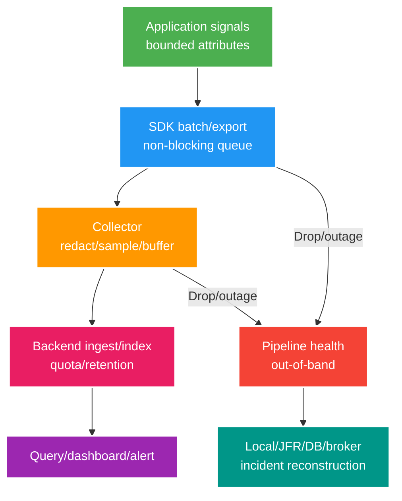

# Deep-dive: Telemetry Pipeline Failure, Tail Sampling và Incident Reconstruction

> Type: `DEEP_DIVE` 
> Domain: `observability` 
> Target depth: `D4 — vận hành telemetry platform khi overload/failure và reconstruct incident từ durable evidence` 
> Teaching readiness: `TEACHABLE_DRAFT` 
> Status: `DRAFT` 
> Evidence status: `NOT RUN` 
> Prerequisites: [Observability core](../core/logs-metrics-traces-slo-and-incident-response.md) 
> Related cases: `OBS-01`; [question bank](../../question-bank/logs-metrics-traces-slo-and-incident-response.md) 
> Owner: `Project learner; Codex teaches, learner writes back` 
> Updated: `2026-07-26`

## 1. Telemetry có data path riêng

Instrumentation trong application tạo dữ liệu; SDK gom batch; exporter gửi tới collector; processor sample, redact và enrich; backend ingest/index; query và alert đọc dữ liệu. Mỗi tầng đều có queue, drop, retry và tiêu thụ CPU/memory/network. Khi incident xảy ra, telemetry thường tăng mạnh; nếu không có giới hạn, nó làm production tệ hơn hoặc biến mất đúng lúc cần nhất.

## 2. Cơ chế và trade-off của tail sampling

**Head sampling** quyết định ngay khi trace bắt đầu nên rẻ và nhất quán, nhưng có thể bỏ mất lỗi hiếm. **Tail sampling** giữ các span trong buffer rồi mới quyết định theo error, latency, route hoặc attribute; nó giữ được trace giá trị hơn nhưng tốn memory/time và phải xử lý span tới muộn. Toàn bộ span của một trace cần đến cùng decision point hoặc một cơ chế phối hợp; số trace, byte và thời gian chờ đều phải có giới hạn và có metric cho lý do drop.

Việc truyền sampling decision giữa service rất quan trọng vì downstream có thể chỉ record tối thiểu. Giữ error trace không đồng nghĩa được phép giữ attribute nhạy cảm. Tail sampler có thể bị cardinality cao hoặc DoS khi attacker tạo vô số trace. Ưu tiên rule deterministic cho lỗi quan trọng, sau đó áp probabilistic cap và quota theo service/team; đo accepted/dropped theo reason cùng decision latency.

Exemplar nối một mẫu trong metric bucket tới trace, nhưng sampling bias khiến trace đó không đại diện cho toàn bộ traffic. Dùng aggregate để biết mức độ phổ biến, dùng trace để hiểu đường đi.

## 3. Các failure mode của telemetry pipeline

Backend down làm queue collector tăng, disk buffer đầy và retry khuếch đại tải. Collector crash làm SDK queue drop. DNS/TLS/certificate/config sai có thể làm cả fleet mất telemetry. Cardinality spike khiến backend reject/throttle và query chậm. Redaction sai làm lộ dữ liệu; instrumentation bug còn có thể tạo recursion hoặc chặn từng request.

Control cần có queue memory/disk hữu hạn, retry budget/backoff, quota mỗi tenant, drop theo priority, circuit/export timeout, health metric/log độc lập, config canary/rollback và fallback local ring/OS/JFR. Request nghiệp vụ không bao giờ được chờ telemetry vô hạn. Event nghiệp vụ cần durability không được dùng observability pipeline như message bus.

Evidence security/audit mức nghiêm trọng cao có thể cần một kênh durable, được audit riêng; kênh đó vẫn phải thiết kế privacy và availability.

## 4. Dựng lại incident khi telemetry bị thiếu

Trước tiên xác định khoảng trống: signal, service, region và thời gian nào bị thiếu; drop metric nói gì. Dùng counter của load balancer/ingress, local log hữu hạn, JVM JFR/thread/heap/GC, OS/container cgroup, PostgreSQL stats/log/WAL/lock, metric riêng của Redis/RabbitMQ, audit deploy/config, business DB/outbox/inbox và phản ánh từ client. Căn clock thận trọng; ưu tiên monotonic/order ID khi có.

Dựng timeline và gắn mức tin cậy cho từng evidence. Không thấy request trong trace đã bị drop không có nghĩa request không tồn tại. Dựng lại rate từ durable row/counter, so ingress với completion, biến động queue/backlog và sample. Bảo quản artifact an toàn; ưu tiên mitigate production, không bật DEBUG hoặc raw body toàn fleet lúc overload.

Sau recovery, replay collector buffer nếu an toàn, đánh dấu data gap trên dashboard và áp dụng policy tính SLO cho dữ liệu thiếu thay vì giả vờ đầy đủ. Postmortem phải coi telemetry failure là contributing factor và kiểm chứng fallback bằng drill.

## 5. Pathology A — incident do cardinality bùng nổ

Một deployment đưa `userId` hoặc raw URI vào label làm số series và memory collector bùng nổ; backend tăng bill, throttle và query lỗi. Contain bằng emergency config loại label ở collector, cap ingestion và rollback instrumentation. Xác định source/version, ước lượng exposure/cost/privacy rồi expire series/storage theo policy. Sửa bằng normalized route, bounded enum và test semantic convention/cardinality trong CI.

Không hash user ID rồi tiếp tục dùng làm metric label: cardinality vẫn cao và nó vẫn là dữ liệu cá nhân. Nếu cần top user/room, dùng top-K log/analytics có access/retention kiểm soát. Đặt series budget mỗi service và alert anomaly.

## 6. Tính đúng của SLO và alert

Nguồn SLI phải sống đủ lâu qua incident hoặc phải ghi rõ uncertainty. Đo ở client/edge bắt được lúc app telemetry hỏng; đo business completion ở server phản ánh correctness. Nên dùng cả hai. Burn rate khi traffic thấp có nhiều noise nên kết hợp minimum event/time; maintenance và exclusion phải định trước, có audit.

Test alert bằng synthetic event tốt/xấu và time acceleration; xác minh page routing, runbook và dashboard. Dùng nhiều cửa sổ cho fast/slow burn. Page theo symptom; dependency alert có thể chỉ tạo ticket nếu chưa ảnh hưởng service. Khi telemetry outage, pipeline health page platform owner thay vì làm ngập mọi team.

## 7. Governance và chi phí platform

Governance cần version semantic convention, attribute được phép, phân loại secret/PII, tier sampling/retention, access/RBAC, service ownership và budget. Nâng SDK/agent/collector có thể đổi field name hoặc default instrumentation nên cần mixed-version test và canary; đồng thời xét data residency, vendor egress và lock-in.

Chargeback/showback dùng tag service/team/environment hữu hạn; dashboard theo dõi cardinality, ingest, storage, query và retention. Tối ưu verbose log hoặc sampling healthy trace trước, không cắt mù evidence critical cho SLO/error. Cung cấp template self-service để giảm fragmentation.

## 8. Experiment và runbook có thể lặp lại

Hãy fault network tới collector/backend, làm đầy queue, inject label cardinality cao và tạo burst trace lỗi/chậm. Xác minh request latency không vượt ngưỡng, drop được đo, không lộ secret, tail rule giữ sample có giới hạn, alert chạy và fallback evidence đủ dựng timeline. Ghi chính xác version/config OTel, agent và backend. Evidence hiện vẫn `NOT RUN`.

### 8.1. Walkthrough khi dashboard trống đúng lúc production lỗi

Đầu tiên đừng bật DEBUG toàn fleet. Xác định data gap bằng exporter drop counter, collector queue, backend ingest reject và thời điểm config/deploy. Tiếp theo lấy các nguồn độc lập: ingress request/completion counter, container restart/OOM, JFR, database session/lock, broker lag và durable business row. Căn timeline theo event/order ID nếu clock giữa hệ thống không chắc chắn.

Ví dụ ingress ghi nhận 10 nghìn request nhưng app metric chỉ có 6 nghìn. Collector drop 40% trong cùng cửa sổ cho thấy phần thiếu có thể do pipeline, không được kết luận 4 nghìn request “không tới app”. Nếu database có 8 nghìn committed command, response completion chỉ 7 nghìn và outbox có 8 nghìn row, history hợp lý là một phần response/telemetry mất sau commit. Reconciliation theo business ID mới xác định duplicate hoặc unknown outcome; trace sample chỉ giúp tìm path.

Sau mitigation, đánh dấu rõ cửa sổ dashboard thiếu dữ liệu và policy tính SLO; không nội suy rồi trình bày như số thật. Fault test phải chứng minh exporter queue hữu hạn, request không bị block, drop metric còn sống qua kênh out-of-band và secret không lọt vào local fallback. Lưu config sampling/redaction, version agent/collector/backend, raw timeline và query dùng để dựng số. Một system “có dashboard đẹp” nhưng không biết chính telemetry đã drop bao nhiêu vẫn chưa đạt observability.

## 9. Learner/self-check

> **Bài viết của tôi — `LEARNER TODO`:** reconstruct one imagined outage using only edge/JFR/DB/broker evidence and declare gaps.

1. **Question:** Tail sampling failure modes? 
   **Đọc lại nếu bí:** mục 2. 
   **Một câu trả lời tốt phải có:** buffering/completeness/routing/late spans, resource caps/drop, privacy/decision metrics. 
   **My answer:** `LEARNER TODO`
2. **Question:** Telemetry outage không kéo app down ra sao? 
   **Đọc lại nếu bí:** mục 1–3. 
   **Một câu trả lời tốt phải có:** non-blocking bounded queues, retry/circuit/drop priority, out-of-band health, separate durable audit. 
   **My answer:** `LEARNER TODO`
3. **Question:** Reconstruct incident thiếu traces? 
   **Đọc lại nếu bí:** mục 4. 
   **Một câu trả lời tốt phải có:** define gap, edge/runtime/DB/broker/deploy/business state, confidence/timeline, no absence inference. 
   **My answer:** `LEARNER TODO`

## 10. Tài liệu tham khảo và teach-back

- [OpenTelemetry Collector — Resiliency](https://opentelemetry.io/docs/collector/resiliency/)
- [OpenTelemetry Collector — Tail Sampling Processor](https://github.com/open-telemetry/opentelemetry-collector-contrib/tree/main/processor/tailsamplingprocessor)

- [ ] Tôi vận hành telemetry như một hệ thống có giới hạn.
- [ ] Tôi giữ evidence hữu ích trong budget cost/privacy.
- [ ] Tôi dựng lại incident và ghi trung thực data gap.
- [ ] Evidence vẫn `NOT RUN`.
