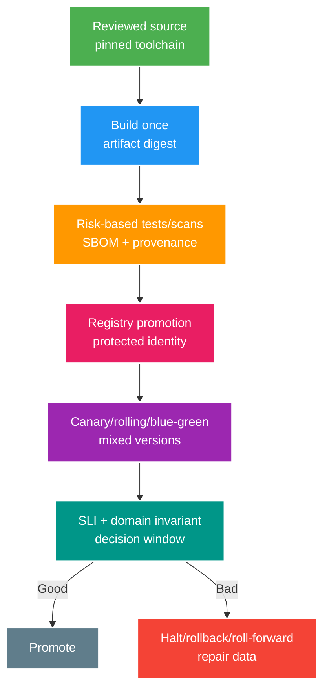

# Nền tảng delivery: CI/CD, SBOM, deployment và rollback

> Type: `CORE` 
> Domain: `operations` 
> Target depth: `D3 — xây pipeline risk-based, immutable artifact, progressive delivery và rollback compatible` 
> Teaching readiness: `TEACHABLE_DRAFT` 
> Status: `DRAFT` 
> Evidence status: `NOT RUN` 
> Prerequisites: build/testing; database/event compatibility 
> Related cases: `OPS-02`; [question bank](../../question-bank/cicd-sbom-deployment-and-rollback.md) 
> Owner: `Project learner; Codex teaches, learner writes back` 
> Updated: `2026-07-26`

## 1. Build một lần và promote cùng bằng chứng

Continuous Integration (CI) tích hợp thay đổi thường xuyên và chạy các kiểm tra có kết quả ổn định. `Continuous delivery` luôn giữ một immutable artifact sẵn sàng phát hành nhưng production còn có bước phê duyệt; `continuous deployment` tự động phát hành thay đổi đã qua gate. Dù chọn cách nào, artifact phải được build một lần, định danh bằng digest và promote **đúng cùng byte** qua các môi trường; config được cung cấp bên ngoài. Build lại ở production có thể lấy JDK, plugin, dependency, base image hoặc timestamp khác và làm mất khả năng truy vết.

## 2. Supply-chain evidence

Trong khả năng thực tế, hãy pin Maven Wrapper, JDK, plugin, dependency repository, base-image digest và CI action; kiểm checksum/signature của input. SBOM (`Software Bill of Materials`) là danh mục component/version thật sự có trong artifact hoặc image cuối, phục vụ tra CVE, license và điều tra incident. Provenance ghi nguồn, builder, tham số build và digest đầu ra. Signature xác nhận artifact đến từ identity được tin và không bị đổi sau khi ký. Không bằng chứng nào trong số này tự chứng minh code an toàn, test chạy đúng hay builder không bị xâm nhập; chúng phải đi cùng branch review, builder/signer cô lập với least privilege và policy kiểm soát.

Reproducible build cho phép một bên độc lập build lại và so digest, nhưng timestamp, generated file hoặc native input có thể làm output khác; cần ghi rõ môi trường và nguồn sai khác. Lưu SBOM/provenance cùng artifact. Khi scanner báo lỗ hổng, ưu tiên theo reachability, exposure và impact; mọi suppression phải có owner và ngày hết hạn.

## 3. Quality gates by risk

Pipeline nên chạy compile, static analysis, unit test và format nhanh trước để feedback sớm. Sau đó chọn gate theo rủi ro của change: migration cần integration/rollback/clean-bootstrap test; API/event cần contract và mixed-version test; auth cần negative test, SCA và secret scan; concurrency/idempotency cần race/retry test; container/IaC cần validation riêng. End-to-end, load và fault test rộng hơn có thể chạy nightly hoặc trước release. Test phải hermetic và deterministic; flaky test chỉ được quarantine khi có owner/deadline, không được retry vô hạn tới lúc xanh.

Compile/test failure và lỗi critical có thể reachable, phá security hoặc business invariant phải chặn release. Ngoại lệ phải có thời hạn, người phê duyệt, compensating control và monitoring. Có thể song song hóa/cache để giữ feedback nhanh, nhưng không dùng artifact/cache từ job không tin cậy cho release. Mọi gate output phải versioned và gắn với đúng artifact digest.

## 4. Deployment strategies

Rolling deployment thay từng nhóm instance nên tiết kiệm tài nguyên, đổi lại có thời gian old/new version cùng chạy và rollback diễn ra dần. Blue-green duy trì hai môi trường đầy đủ rồi chuyển routing, cho phép đổi route nhanh nhưng tốn capacity và thường vẫn chia sẻ database. Canary chỉ đưa một cohort/traffic nhỏ vào version mới để so sánh; nó chỉ phát hiện được lỗi có đủ lưu lượng đại diện, còn đường low-volume, xử lý async hoặc data corruption trễ có thể lọt.

Cả ba chiến lược đều cần backward/forward compatibility ở API/event reader, database expand-contract, session và cache serialization; old instance không được gãy khi đọc dữ liệu new instance vừa ghi. Cần readiness/drain đúng và capacity đủ khi mất một zone hoặc đang rollout. Feature flag tách deploy khỏi release, nhưng chính flag cũng cần owner, authorization, test và ngày dọn bỏ.

Canary gate nên theo dõi error, latency, saturation, startup/restart, dependency, outbox/consumer lag và lỗi business như authorization/ledger theo version hoặc cohort với label bounded. Phải so với baseline cùng điều kiện, chờ đủ cửa sổ và traffic, rồi tự động halt khi vượt ngưỡng. Đường ít traffic cần synthetic check và invariant query thay vì chờ lỗi người dùng.

## 5. Schema/event rollback

Rollback code chỉ an toàn nếu version cũ đọc/ghi được schema, event và cache mà version mới đã tạo. Với database, hãy `expand` trước: thêm column/default tương thích, deploy reader/writer, backfill, chuyển behavior, rồi mới `contract` ở release sau khi hết rollback window. Event consumer phải hiểu field/version mới trước khi producer phát; không tái sử dụng một field cũ với nghĩa khác. Destructive migration không thể hoàn tác bằng image rollback, nên khi dữ liệu mới không tương thích thường phải roll-forward, tắt feature hoặc repair data.

Phải diễn tập rollback trước incident, đo thời gian tối đa và chỉ rõ owner. Restore backup không phải nút undo tức thời và có thể làm mất những write tốt xảy ra sau mốc backup. Repair script phải idempotent, có phạm vi rõ, hỗ trợ dry-run và tạo audit trail.

## 6. CI/CD security

Code từ pull request chưa tin cậy không được nhận production, cloud hoặc signing secret. Tách job validate fork khỏi release job có đặc quyền; dùng workload identity sống ngắn, least privilege, protected environment approval, runner cô lập/ephemeral và kiểm soát egress/artifact. Pin action/plugin và thiết kế chống cache/artifact poisoning. Plan, log và error output phải redacted.

Release signer nên thuộc policy tách biệt; registry cần immutable digest/tag protection, còn admission control xác minh digest/provenance trước deploy. Quyền break-glass phải tối thiểu và được audit; sau xử lý khẩn cấp phải build lại theo pipeline chuẩn để khôi phục chuỗi bằng chứng.

## 7. Corruption incident

Một canary lỗi có thể đã ghi một phần dữ liệu sai trước khi metric báo động. Việc đầu tiên là chặn feature/traffic/write mới, xác định version, khoảng thời gian, cohort và command bị ảnh hưởng, đồng thời giữ log/data phục vụ điều tra. Chỉ rollback application nếu schema/data vẫn tương thích. Sau đó xác định invariant và source of truth, dry-run repair hoặc compensation idempotent, reconcile event/cache/search downstream, kiểm chứng kết quả rồi mới mở lại traffic và thông báo bên liên quan. Rollback binary không tự xóa dữ liệu hay external side effect đã phát sinh.

Postmortem tốt phải bổ sung invariant check sớm hơn, canary đại diện hơn, migration guard, feature flag an toàn và owner rõ; “lần sau rollout chậm hơn” không đủ sửa nguyên nhân hệ thống.

## 8. Governance metrics

Platform team cung cấp template, mức provenance/security tối thiểu, progressive delivery và policy. Service team vẫn sở hữu SLO, contract, migration, rollback và runbook của mình. Ngoại lệ phải được audit. Theo dõi lead time, deploy frequency, change-failure rate, recovery time, flaky-test rate, gate time và lỗi invariant/security lọt production; không tối ưu riêng số lần deploy.

## 8.1. Hai worked examples và phản ví dụ

**Worked example tối thiểu — immutable promotion:** CI build một artifact/image digest, test/sign/SBOM rồi promote cùng digest qua environments. Rebuild ở production có thể lấy dependency/base khác và phá provenance.

**Worked example gần project — canary rollback:** deploy cohort nhỏ, gate bằng error/p99/resource/domain invariant, pause/rollback artifact khi breach. Schema/event/cache changes phải backward-compatible vì rollback binary không rollback data đã ghi.

**Phản ví dụ:** pipeline xanh nên auto deploy toàn fleet, rồi khi lỗi build lại “commit cũ” với latest dependencies. Không có digest/provenance, rollback không reproducible và supply-chain evidence mất.

## 9. Learner/self-check

> **Bài viết của tôi — `LEARNER TODO`:** thiết kế pipeline, canary và rollback cho một feature có thay đổi schema.

1. **Question:** SBOM/provenance/signature prove gì? 
   **Đọc lại nếu bí:** mục 2. 
   **Một câu trả lời tốt phải có:** danh mục component, nguồn/quy trình build, identity/integrity của artifact và giới hạn khi builder bị xâm nhập hoặc dependency có lỗ hổng. 
   **My answer:** `LEARNER TODO`
2. **Question:** Rollback schema/event? 
   **Đọc lại nếu bí:** mục 4–5. 
   **Một câu trả lời tốt phải có:** mixed version, expand-contract hoặc consumer-first, compatibility của write mới và khi nào cần roll-forward/repair. 
   **My answer:** `LEARNER TODO`
3. **Question:** Canary metrics? 
   **Đọc lại nếu bí:** mục 4 và 7. 
   **Một câu trả lời tốt phải có:** technical signal cùng domain invariant, baseline theo version/cohort, cửa sổ/volume đủ, halt/repair và synthetic check cho low-volume. 
   **My answer:** `LEARNER TODO`

## 10. References/teach-back

- [SLSA Specification](https://slsa.dev/spec/)
- [CycloneDX Specification](https://cyclonedx.org/specification/overview/)
- [NIST SSDF](https://csrc.nist.gov/pubs/sp/800/218/final)

- [ ] Tôi promote cùng một immutable artifact có chuỗi bằng chứng tin cậy.
- [ ] Tôi thiết kế gate/deployment dựa trên rủi ro và evidence.
- [ ] Tôi khôi phục cả application, dữ liệu và external effect, không chỉ đổi binary.
- [ ] Evidence vẫn `NOT RUN`.
