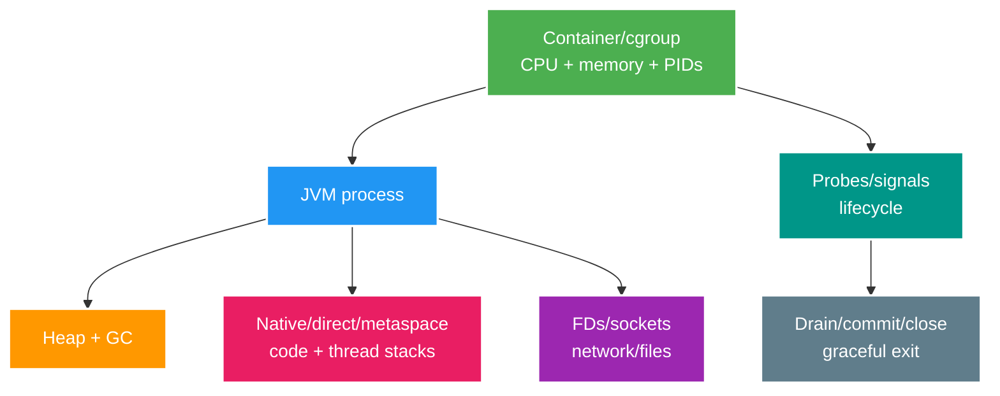

# Nền tảng vận hành: Linux, JVM, container runtime và giới hạn tài nguyên

> Type: `CORE` 
> Domain: `operations` 
> Target depth: `D3 — chẩn đoán CPU/memory/FD/probe/shutdown từ cgroup tới JVM` 
> Teaching readiness: `TEACHABLE_DRAFT` 
> Status: `DRAFT` 
> Evidence status: `NOT RUN` 
> Prerequisites: JVM memory/thread basics 
> Related cases: `OPS-01`; [question bank](../../question-bank/linux-jvm-container-runtime-and-resource-limits.md) 
> Owner: `Project learner; Codex teaches, learner writes back` 
> Updated: `2026-07-26`

## 1. Mental model về process và tài nguyên

JVM trước hết là một **process của hệ điều hành**, chứ không phải một chiếc hộp chỉ có Java heap. Bên trong process có Java thread, native thread, heap, metaspace, vùng chứa mã do JIT sinh ra (`code cache`), bộ nhớ `direct/native` và các thư viện đã nạp. File và socket đều chiếm `file descriptor` (FD), tức một “tay cầm” hữu hạn mà kernel cấp cho process. Signal là thông điệp từ hệ điều hành yêu cầu process dừng hoặc tạo thông tin chẩn đoán, tùy loại signal và cách JVM xử lý.

Container cô lập tên tài nguyên bằng `namespace` và thống kê/giới hạn tài nguyên bằng `cgroup`, nhưng vẫn dùng chung kernel của host. Container image chỉ là mẫu filesystem nhiều lớp, thường bất biến; nó không phải một máy ảo có kernel riêng và cũng không phải ranh giới bảo mật tuyệt đối. Mental model cần nhớ là: **cgroup quyết định ngân sách của cả process, còn JVM chỉ quản lý một phần ngân sách đó**.

CPU usage thấp chưa chứng minh hệ thống khỏe: thread có thể đang bị throttle hoặc đang chờ lock/I/O. Heap bình thường cũng chưa chứng minh process còn đủ memory vì phần native có thể tăng. Tăng limit khi chưa tìm ra thành phần sở hữu tài nguyên chỉ trì hoãn lần hỏng tiếp theo.

## 2. CPU request/limit and throttling

`CPU request` là lượng CPU scheduler dùng để xếp chỗ và chia phần tương đối cho workload. `CPU limit` thường được hiện thực bằng quota theo chu kỳ: khi container dùng hết quota sớm, thread runnable phải đợi sang chu kỳ sau. Vì vậy thời gian thực thi nhìn từ người dùng tăng lên dù host có thể vẫn còn core nhàn, tùy runtime và cấu hình.

Khi chẩn đoán, phải đặt cạnh nhau CPU usage, số chu kỳ/thời gian bị throttled, run queue, JFR hoặc thread profile và request latency. GC, business code, mã hóa TLS và compression cùng tranh một ngân sách CPU; nhìn một metric riêng lẻ dễ quy sai nguyên nhân.

Giá trị request/limit phải xuất phát từ load evidence. Request quá thấp khiến scheduler dồn nhiều pod lên một node, làm chúng cạnh tranh; request quá cao gây lãng phí hoặc khiến pod không tìm được node phù hợp. Limit thấp bảo vệ khỏi `noisy neighbor` nhưng cắt mất khả năng burst. Nếu HPA chỉ nhìn CPU, một pod bị throttle có thể làm hệ thống tạo thêm replica; tổng connection pool tăng theo số replica và đẩy database vào quá tải. Do đó quyết định scale phải kèm bounded concurrency và signal bão hòa ở dependency.

## 3. Memory budget

Memory hard limit của container bao phủ toàn bộ phần kernel tính cho cgroup: heap, metaspace, JIT code cache, direct buffer, stack của thread, native allocator/thư viện, mapped page và có thể cả sidecar trong cùng pod. Nếu tổng phần này vượt giới hạn, kernel có thể `OOMKill` process ngay; JVM không nhất thiết kịp ném `OutOfMemoryError` hay tạo heap dump. Chiều ngược lại, một vùng Java cụ thể có thể cạn và ném OOME dù tổng cgroup chưa chạm limit.

Hãy lập memory budget tường minh cho heap max, non-heap/direct memory, số thread và stack, native library cùng headroom. Cách JVM tự nhận biết container và tính heap phụ thuộc JDK/version/flag, nên phải pin runtime và kiểm tra giá trị JVM thực sự dùng. Trình tự điều tra bắt đầu từ termination reason và event của platform, rồi so working set/RSS với limit, GC/heap occupancy, số class/thread, direct buffer và `Native Memory Tracking` (NMT)/JFR nếu đã bật. Heap dump có thể rất lớn và chứa dữ liệu nhạy cảm, vì vậy bản thân thao tác lấy dump cần đủ disk, quyền truy cập và chính sách bảo mật.

Memory leak thường thể hiện bằng live set hoặc RSS tiếp tục tăng dưới tải ổn định và không quay về nền sau các chu kỳ thu hồi. Ngược lại, capacity spike do concurrency hoặc buffer lớn có thể giảm khi tải rút. Muốn phân biệt, phải tái hiện đúng phân phối payload/concurrency và tìm object hoặc native owner, không chỉ nhìn một ảnh chụp tại đỉnh.

## 4. FDs, sockets and threads

Khi cạn FD, thao tác `accept` hoặc `open` thất bại với lỗi kiểu “too many open files”; HTTP client, DNS lookup hoặc ghi file cũng có thể hỏng theo. Hãy kiểm tra limit của process, đếm descriptor theo loại, phân biệt socket `ESTABLISHED` với `TIME_WAIT`, rồi đối chiếu connection pool, keepalive và đường code có thể quên đóng resource. Pool phải có giới hạn và timeout. Tăng `ulimit` có thể cần cho capacity hợp lệ, nhưng không chữa leak và vẫn bị chặn bởi giới hạn kernel/network khác.

Platform thread chiếm stack và native resource đáng kể. Virtual thread nhẹ hơn ở số lượng thread chờ, nhưng không làm `ThreadLocal` payload, carrier thread hay downstream connection pool trở nên vô hạn. Cgroup cũng có thể giới hạn PID/thread. Một thread dump cho biết trạng thái `RUNNABLE`, `BLOCKED`, `WAITING` và deadlock tại một thời điểm; nhiều snapshot theo thời gian hoặc JFR mới giúp phân biệt kẹt kéo dài với biến động tạm thời.

## 5. Probes

`Startup probe` cho ứng dụng thời gian khởi tạo trước khi liveness được phép kết luận nó bị kẹt. `Readiness probe` quyết định pod có nhận traffic mới hay không; nó nên false khi đang startup, drain hoặc không thể phục vụ an toàn. Tuy nhiên nếu mọi pod cùng đánh readiness false chỉ vì một database dùng chung chập chờn, toàn bộ service có thể biến mất khỏi routing và mất luôn khả năng quan sát/phục hồi. `Liveness probe` chỉ nên restart khi process thật sự không thể tự hồi phục, không phải mỗi lần downstream tạm lỗi.

CPU throttle hoặc GC pause có thể làm probe timeout. Platform tưởng process chết và restart; cold start, warm cache và reconnect lại tăng tải, tạo vòng lặp restart. Probe endpoint vì thế phải rẻ, bounded và không cấp phát nặng. Behavior của Spring Actuator phụ thuộc version/config, nên phải kiểm tra đúng baseline và thử tình huống startup chậm, throttle và dependency lỗi.

## 6. Graceful shutdown

Khi nhận termination signal, ứng dụng cần chuyển unready để ngừng nhận traffic mới và chờ routing cập nhật. Sau đó nó dừng nhận HTTP work, consumer delivery và scheduler mới; cho phần đang chạy hoàn tất trong `termination grace period`; chỉ commit/ack công việc đã bền vững; rồi đóng producer, pool và flush telemetry trong một deadline hữu hạn trước khi platform cưỡng bức kill. Công việc dài phải có durable checkpoint và idempotency vì grace có thể hết hoặc node có thể chết mà không gửi signal.

Capacity khi rolling deployment phải tính cả pod đang drain. Consumer nên dừng poll/delivery mới rồi mới commit phần offset liên tục đã xử lý bền vững. WebSocket client cần được reconnect có jitter và cơ chế resume/gap recovery để tránh reconnect storm. Shutdown hook không được đảm bảo khi `SIGKILL`, OOMKill hoặc node mất điện.

## 7. Image/config hardening

Dùng base image tối thiểu từ nguồn tin cậy, pin bằng digest và rebuild khi có bản vá. Multi-stage build giúp loại compiler và artifact trung gian khỏi runtime image. Process nên chạy non-root, chỉ giữ capability cần thiết, dùng read-only filesystem và volume tạm có kiểm soát; shell/package manager không nên tồn tại nếu runtime không cần. Tuy vậy vận hành vẫn cần con đường debug được phê duyệt như ephemeral container, JFR hoặc tool image. Scan, SBOM, signature và provenance bổ sung bằng chứng supply chain; chữ ký không chứng minh artifact không có lỗ hổng.

Cùng một immutable artifact phải được promote qua các môi trường; config và secret nằm ngoài artifact, được validate/fail-fast và luôn redacted khi log. Không bake credential vào image. Process PID 1 phải forward signal đúng; health state và JVM flag cần quan sát được theo cách không làm lộ secret.

## 8. Capacity/headroom

Benchmark phải bám đúng concurrency và workload distribution, đồng thời đo CPU, heap/native memory, thread/FD/connection, latency và error. Chọn request từ tải thường, policy peak và yêu cầu placement; chọn limit/headroom từ burst cùng failure scenario. Phải chừa capacity cho rolling rollout và mất node/zone. HPA nên dùng leading signal phù hợp như saturation, throughput hoặc queue age thay vì chỉ CPU. Luôn kiểm tổng `pool mỗi pod × số replica` không vượt ngân sách database/broker.

## 8.1. Hai worked examples và phản ví dụ

**Worked example tối thiểu — memory budget:** container limit 1 GiB không thể dành toàn bộ cho `-Xmx1g`; còn metaspace, code cache, thread stacks, direct buffers, native libs và kernel accounting. Budget heap thấp hơn, đo RSS/native/GC và để headroom.

**Worked example gần project — graceful drain:** readiness off trước, ngừng nhận traffic, drain HTTP/WebSocket/consumer theo deadline, stop intake trước in-flight, ACK chỉ sau durable handling và process exit trước platform kill grace. Test reconnect/redelivery/unknown operation.

**Phản ví dụ:** thấy `OOMKilled` rồi tăng heap/limit mà không phân biệt Java heap, native/direct, thread/FD leak hay cgroup pressure. Có thể làm node pressure tệ hơn và che root cause.

## 9. Learner/self-check

> **Bài viết của tôi — `LEARNER TODO`:** chẩn đoán một pod restart dù heap bình thường và viết thứ tự shutdown an toàn.

1. **Question:** Heap normal nhưng OOM kill? 
   **Đọc lại nếu bí:** mục 3. 
   **Một câu trả lời tốt phải có:** cgroup RSS, direct memory/metaspace/stack/native/sidecar, termination reason, NMT/JFR và cách phân biệt thiếu budget với leak. 
   **My answer:** `LEARNER TODO`
2. **Question:** Probe khác nhau? 
   **Đọc lại nếu bí:** mục 5. 
   **Một câu trả lời tốt phải có:** vai trò startup/readiness/liveness, vòng lặp downstream/throttle/restart và yêu cầu probe rẻ, bounded. 
   **My answer:** `LEARNER TODO`
3. **Question:** Drain consumer? 
   **Đọc lại nếu bí:** mục 6. 
   **Một câu trả lời tốt phải có:** chuyển unready, dừng việc mới, commit/ack bền vững, grace/forced kill/idempotency và thứ tự đóng resource. 
   **My answer:** `LEARNER TODO`

## 10. References/teach-back

- [OpenJDK — Container Support](https://docs.oracle.com/en/java/javase/21/core/java-core-libraries-developer-guide.pdf)
- [Kubernetes — Resource Management for Pods and Containers](https://kubernetes.io/docs/concepts/configuration/manage-resources-containers/)
- [Kubernetes — Pod Lifecycle](https://kubernetes.io/docs/concepts/workloads/pods/pod-lifecycle/)

- [ ] Tôi tính đủ tài nguyên của cả process, không chỉ Java heap.
- [ ] Tôi chẩn đoán được evidence xuyên từ cgroup tới JVM.
- [ ] Tôi thiết kế được probe, drain và headroom.
- [ ] Evidence vẫn `NOT RUN`.
