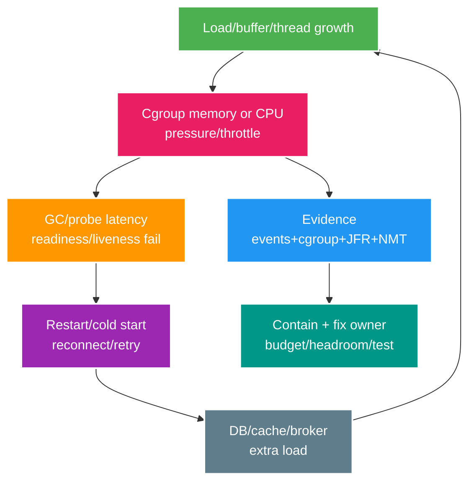

# Deep-dive: cgroup memory, vùng native của JVM và lỗi graceful drain

> Type: `DEEP_DIVE` 
> Domain: `operations` 
> Target depth: `D4 — điều tra restart loop/throttling/FD leak và dẫn capacity recovery` 
> Teaching readiness: `TEACHABLE_DRAFT` 
> Status: `DRAFT` 
> Evidence status: `NOT RUN` 
> Prerequisites: [Linux/JVM/container core](../core/linux-jvm-container-runtime-and-resource-limits.md) 
> Related cases: `OPS-01`; [question bank](../../question-bank/linux-jvm-container-runtime-and-resource-limits.md) 
> Owner: `Project learner; Codex teaches, learner writes back` 
> Updated: `2026-07-26`

## 1. Vòng lặp restart hình thành như thế nào?

Hãy bắt đầu từ một pod đang chạy gần sát memory hoặc CPU limit. Memory pressure làm GC thường xuyên hơn; CPU quota cạn làm GC thread và probe handler phải chờ. Probe vì thế phản hồi chậm, liveness kết luận nhầm rằng process không thể hồi phục và platform restart pod. Pod mới phải cold start, warm cache và nhận reconnect; auth/database/broker cùng chịu thêm tải. Tải phụ này lại làm pod mới chạm limit nhanh hơn, tạo một feedback loop.

Khi điều tra phải tách **termination đầu tiên** khỏi các restart về sau. Event đầu có thể là OOMKill do native memory, nhưng sau đó dashboard chỉ còn thấy liveness timeout. Nếu bắt đầu phân tích ở restart thứ ba, ta rất dễ “sửa probe” và bỏ sót resource leak ban đầu.

## 2. Trình tự điều tra memory

Bước đầu tiên là đọc `last state` và event của pod/container: `OOMKilled`, exit code, signal, probe failure, timestamp, node, limit và các sidecar dùng chung ngân sách. Đây là bằng chứng ở layer platform. Sau đó đặt trên cùng timeline các đồ thị RSS/working set và cgroup event, heap committed/used sau GC, GC pause, số thread/class, direct-buffer estimate và traffic. Nếu kernel kill trong khi heap còn cách xa `-Xmx`, phần chênh giữa RSS và heap là dấu hiệu cần phân rã **native gap**.

Native gap có thể đến từ Netty/direct buffer, request body hoặc decompression buffer, `mmap`, metaspace/classloader, thread stack, JNI/native client, arena của allocator, JIT code cache hoặc monitoring agent. Sidecar có thể cùng chia pod limit. Cấu hình heap theo phần trăm mà không chừa headroom khiến JVM tưởng heap hợp lệ nhưng tổng process vẫn bị kill. Virtual thread làm giảm số OS thread trong workload chờ, nhưng không giới hạn số request in-flight, `ThreadLocal` payload hay buffer gắn với chúng.

Evidence cần chọn theo loại failure. Với heap OOME và live graph tăng, dùng histogram, allocation profile hoặc heap dump; dump phải được bảo vệ vì có thể chứa PII/secret. Với direct/native OOME, xem buffer pool metric và NMT nếu đã bật trước. Với kernel OOMKill, có thể không có Java exception nào; cgroup/node event mới là source. Để phân biệt leak chậm với burst capacity, so độ dốc theo cùng workload và xem memory có quay về nền sau khi tải rút hay không.

Containment có thể là giảm concurrency, giới hạn payload/buffer hoặc dừng retry amplification. Chỉ tăng memory limit khi node còn headroom và đã ghi rõ rủi ro; tăng limit không thay thế việc tìm owner. Fix hoàn chỉnh phải gắn resource với lifecycle/bound, rồi chạy lại sustained-load và fault test để chứng minh đường cong đạt plateau.

### Pathology A — heap bình thường nhưng pod bị OOMKill

Ban đầu heap dùng 450 MiB trên `-Xmx512m`, nhưng container limit là 700 MiB. Một đợt upload tạo thêm 180 MiB direct buffer, 60 MiB metaspace/code cache và stack; tổng RSS vượt limit. Kernel kill process ngay nên không có heap OOME hay dump. Symptom phân biệt là platform ghi `OOMKilled`, RSS chạm limit trong khi heap-after-GC ổn định. Mitigation trước mắt là bound buffer/concurrency; fix lâu dài là memory budget đầy đủ và load test đúng payload. Residual risk là native allocator/sidecar vẫn có thể tạo đỉnh ngoài model, nên cần headroom và cgroup alert.

### Pathology B — classloader hoặc native leak tăng qua từng chu kỳ

Sau mỗi lần reload/deploy, listener hoặc thread từ parent giữ classloader cũ; metaspace và class count sau GC tăng theo bậc. Một biến thể khác là native client không giải phóng arena nên RSS tăng nhưng heap plateau. Một snapshot duy nhất không đủ phân biệt. Evidence mạnh là lặp cùng lifecycle nhiều lần, lấy classloader retained path hoặc NMT diff và thấy phần tương ứng tăng đều; sau khi cleanup đúng owner, đường tăng phải dừng. Residual risk là tool không theo dõi mọi native allocation, vì vậy vẫn cần đối chiếu RSS/cgroup.

## 3. Pathology do CPU throttle

Giả sử quota cho mỗi chu kỳ bị dùng hết sớm bởi compression và GC. Các thread vẫn `RUNNABLE` nhưng kernel buộc chúng đợi; p99 và probe timeout, client retry và làm arrival rate tăng. CPU graph có thể chỉ nằm đúng ở limit trong khi host còn rảnh, khiến người vận hành tưởng ứng dụng “dùng CPU hiệu quả”. Evidence phân biệt là tỷ lệ/thời gian throttled cao, run queue, JFR hot method/GC và tình trạng contention của node.

Nếu limit vô tình quá thấp, sửa sizing hoặc policy; nếu code thật sự nóng, tối ưu code và dùng admission/bounded concurrency. Liveness timeout không nên chặt tới mức một chu kỳ throttle biến thành restart. Tạo thêm pod không phải lúc nào cũng chữa được vì tổng DB pool và retry cũng tăng. Java tính số processor khả dụng dựa trên container support, JDK version và flag; cấu hình sai có thể làm GC/ForkJoin pool quá lớn hoặc quá nhỏ. Pin runtime flag và kiểm `ActiveProcessorCount`; nhớ rằng CPU request ảnh hưởng placement/share, còn CPU limit ảnh hưởng quota.

## 4. Incident cạn FD/socket

Symptom có thể xuất hiện ở nhiều chỗ: server không `accept` được connection, HTTP client không mở socket, DNS hoặc file operation thất bại. Chụp `/proc` hoặc tool tương ứng để đếm descriptor theo target, socket state và so với process limit. Sau đó đối chiếu HTTP client pool, keepalive, số WebSocket, file watcher/temp file và tốc độ tạo-hủy connection. Nhiều `TIME_WAIT` cho thấy churn và port pressure, không đồng nghĩa một FD leak trong process; nhiều `ESTABLISHED` không còn request owner có thể do thiếu timeout/close.

Reproducer phải đi qua connect, disconnect, retry, exception và cancellation, đồng thời xác nhận response/body luôn được đóng. Pool cần giới hạn acquisition wait, idle time và lifetime. Chỉ tăng FD limit khi đã tính thêm memory, kernel và ephemeral-port capacity và đã loại trừ leak. Signal vận hành tốt là tỷ lệ FD sử dụng cùng connection count theo nhóm bounded, không phải một tổng số không có owner.

## 5. Các failure khó của graceful shutdown

### Pathology C — đã unready nhưng request vẫn tới

Pod chuyển unready, nhưng load balancer chưa kịp nhận thay đổi nên vẫn gửi request trong vài giây. Nếu application đóng pool ngay, request đang tới nhận lỗi 5xx; nếu tiếp tục nhận vô hạn, pod không bao giờ drain. Cần một state machine rõ: chuyển unready, chờ propagation bounded, từ chối việc mới theo contract, cho in-flight hoàn tất tới deadline rồi đóng dependency. `preStop` hoặc grace dài hơn chỉ có ích khi được đo, không phải sleep mù.

### Pathology D — deadline lệch nhau làm mất hoặc lặp công việc

Nếu platform grace là 30 giây nhưng handler timeout là 60 giây, process có thể bị kill giữa transaction. Consumer ack trước durable commit sẽ làm mất message; commit xong nhưng chưa ack sẽ tạo duplicate, nên consumer cần inbox/idempotency. Tương tự, hàng nghìn WebSocket reconnect cùng fixed delay gây storm; client phải jitter và resume theo session epoch. Telemetry flush cũng phải bounded, nếu không việc “ghi nốt log” có thể giữ process tới lúc forced kill.

Thứ tự shutdown và budget phải đo được. State machine cần idempotent vì signal có thể lặp. Khi dừng scheduler hoặc lease renewal, công việc có thể được node khác nhận; fencing token bảo vệ downstream khỏi old holder thức dậy. Database pool chỉ đóng sau khi transaction được phép hoàn tất hoặc bị cancel rõ. Job dài quan trọng cần checkpoint/outbox; không thể dựa vào hy vọng grace luôn đủ.

Hãy test rolling deployment dưới tải, `SIGTERM`, forced kill và mất node. Assertion phải gồm business invariant không bị phá, error/recovery/backlog bounded và capacity còn đủ khi một zone hoặc một nhóm pod đang drain.

## 6. Policy capacity

Với mỗi pod ở target concurrency, lập bảng heap max/typical, native/direct memory, thread/stack, FD/connection, CPU p95/peak và DB/broker pool. Nhân với số replica trong cả trạng thái bình thường, rollout và failure. Ở cấp node còn phải trừ system reserve và DaemonSet khỏi allocatable. Request giúp scheduler đặt chỗ, limit bảo vệ ranh giới, còn headroom cho burst và failure.

Autoscaling cần signal phù hợp, cooldown và warm-up window; scale tối đa bị chặn bởi capacity downstream. Connection pool phải có global budget chứ không chỉ per-pod default. VPA có thể yêu cầu restart và tạo feedback loop tùy platform/version. Load test phải dùng payload distribution, connection lifetime và cold-start behavior đại diện, không chỉ request nhỏ đều nhau.

## 7. Runbook và evidence

Khi incident đang diễn ra, trước hết chặn restart amplification: pause rollout/autoscale hoặc retry gây bão, chỉnh probe thận trọng và shed tải ít quan trọng. Bảo toàn event, JFR/dump phù hợp rồi tìm resource owner. Canary bản sửa trên một cohort nhỏ và phục hồi traffic dần. Exit criteria gồm utilization/p99/probe ổn định, không còn leak slope và dependency trở về bình thường.

Artifact evidence phải ghi JDK/platform version, request/limit, JVM flag, workload, raw graph và lệnh chẩn đoán. Procedure ở trên chưa được chạy cho project, nên trạng thái vẫn `NOT RUN`; không được biến số minh họa thành kết quả thật.

## 8. Learner/self-check

> **Bài viết của tôi — `LEARNER TODO`:** lập một RSS budget và timeline của restart loop.

1. **Question:** Phân biệt kernel OOMKill với heap OOME như thế nào? 
   **Đọc lại nếu bí:** mục 2. 
   **Một câu trả lời tốt phải có:** termination/cgroup event so với Java exception, cách phân rã native gap, tool evidence và xử lý dump an toàn. 
   **My answer:** `LEARNER TODO`
2. **Question:** Probe tạo restart amplification theo chuỗi nào? 
   **Đọc lại nếu bí:** mục 1, 3, 5. 
   **Một câu trả lời tốt phải có:** throttle/GC → probe → cold start/retry, cách contain và cách kiểm lại probe/budget/drain. 
   **My answer:** `LEARNER TODO`
3. **Question:** Vì sao scale thêm pod có thể làm database sập? 
   **Đọc lại nếu bí:** mục 3 và 6. 
   **Một câu trả lời tốt phải có:** `replica × pool/concurrency/retry`, downstream cap, autoscale/headroom và admission control. 
   **My answer:** `LEARNER TODO`

## 9. References/teach-back

- [JEP 8182070 — Container Awareness](https://openjdk.org/jeps/8182070)
- [Native Memory Tracking](https://docs.oracle.com/en/java/javase/21/vm/native-memory-tracking.html)
- [Kubernetes — Termination of Pods](https://kubernetes.io/docs/concepts/workloads/pods/pod-lifecycle/#pod-termination-flow)

- [ ] Tôi phân biệt được resource/termination evidence theo từng layer.
- [ ] Tôi phá restart feedback loop mà không che root cause.
- [ ] Tôi chứng minh drain/capacity dưới fault bằng experiment có thể lặp lại.
- [ ] Evidence vẫn `NOT RUN`.
