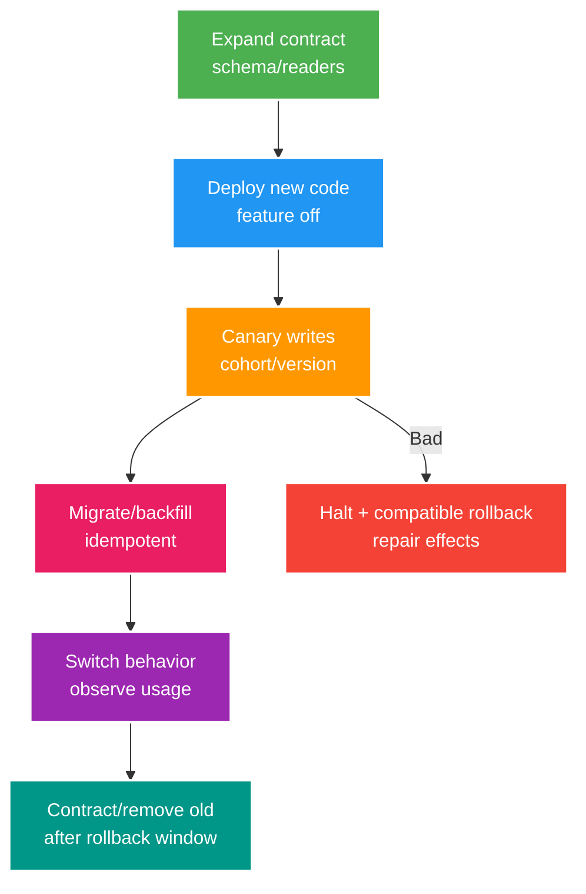

# Deep-dive: rollout nhiều version, supply chain và phục hồi data corruption

> Type: `DEEP_DIVE` 
> Domain: `operations` 
> Target depth: `D4 — dẫn progressive delivery/rollback khi schema/data/event và artifact trust cùng thay đổi` 
> Teaching readiness: `TEACHABLE_DRAFT` 
> Status: `DRAFT` 
> Evidence status: `NOT RUN` 
> Prerequisites: [CI/CD delivery core](../core/cicd-sbom-deployment-and-rollback.md) 
> Related cases: `OPS-02`; [question bank](../../question-bank/cicd-sbom-deployment-and-rollback.md) 
> Owner: `Project learner; Codex teaches, learner writes back` 
> Updated: `2026-07-26`

## 1. Ma trận compatibility

Deployment thực chất là một distributed protocol giữa application cũ/mới, schema, event consumer, cache và client. Trong một khoảng thời gian, old reader có thể đọc dữ liệu do new writer tạo và ngược lại. Vì vậy cần lập ma trận `old/new reader × old/new writer`; chỉ chuyển sang bước rollout tiếp theo khi mọi tổ hợp còn cùng tồn tại đều an toàn, hoặc routing/fencing đã chứng minh tổ hợp nguy hiểm không thể xảy ra.

Ma trận còn phải bao gồm cache serialization/key version và claim trong session/JWT. Chỉ một enum mới hoặc required field mới cũng có thể làm old instance deserialize thất bại. Feature flag tắt không vô hiệu code khởi tạo, migration hoặc schema binding của version mới. Trước khi xóa contract cũ, telemetry phải chứng minh không còn client/instance sử dụng nó trong suốt rollback window.

## 2. Giới hạn thống kê và ngữ nghĩa của canary

Canary phải nhận route, tenant, dữ liệu và số event đủ đại diện. Một tỷ lệ 1% có thể không bao giờ chạm admin route, migration job hay async consumer hiếm. Cohort nên ổn định để so sánh; chỉ loại bot nếu định nghĩa SLI thực sự loại bot. Hãy so với baseline cùng thời điểm/region và xét độ tin cậy thống kê, nhưng không để thống kê che business invariant: chỉ một lần double charge hoặc bypass authorization cũng phải halt rollout.

Phải quan sát delayed effect vượt quá request window, chẳng hạn outbox lag, consumer rơi DLQ, memory leak hoặc sai billing/search projection. Thời lượng canary dựa trên feedback/retry cycle dài nhất cần bảo vệ, không chỉ vài phút p99 đẹp. Với đường low-volume, dùng synthetic probe, shadow comparison và invariant query. Threshold tự động phải dừng mở rộng; người chịu trách nhiệm quyết định rollback hay tắt flag phải được ghi trước rollout.

Label theo version/cohort phải bounded, không đưa user ID vào metric. Nếu canary 1% vẫn ghi vào một shared database toàn cục, lỗi trigger hoặc migration có thể corrupt 100% dữ liệu; traffic percentage không tự giới hạn data blast radius. Khi rủi ro này tồn tại, cần feature/data partition, shadow write hoặc fencing cụ thể.

## 3. Đồ thị tin cậy của supply chain

Chuỗi tin cậy đi từ source review/branch tới wrapper, JDK, plugin, dependency/repository, CI runner/action/secret, base image, registry/signing và cuối cùng là deployment admission. Mỗi material input quan trọng nên được pin và verify khi có thể; code chưa tin cậy chạy cô lập với least privilege. SBOM phải được tạo từ artifact cuối, provenance phải trỏ đúng subject digest và admission phải verify signature trước khi cho workload chạy.

Nếu authorized builder đã bị chiếm quyền, nó vẫn có thể ký một artifact độc hại hợp lệ. Do đó cần branch protection, release builder cô lập, tách policy khỏi signing key, reproducible comparison và runtime detection. Một dependency có chữ ký vẫn có thể chứa CVE. Emergency update vẫn phải giữ tối thiểu identity, test và audit; sau sự cố cần canonical rebuild qua pipeline chuẩn.

Update dependency hoặc plugin có thể thay đổi cả build và test behavior, nên vẫn cần compatibility check, canary và rollback plan. Vulnerability triage phải dựa trên artifact chính xác đang chạy và reachability thực tế. Nếu secret từng lọt vào git history, phải rotate dù đã rewrite history, vì không thể chứng minh mọi bản sao đã biến mất.

## 4. Cây quyết định rollback

Nếu version mới chưa tạo write, schema hoặc event không tương thích, có thể rollback route/image rồi verify. Nếu dữ liệu mới vẫn backward-compatible, old code phải đọc được nó và new writer phải bị tắt. Nếu thay đổi destructive hoặc không tương thích, trước hết halt feature; sau đó roll-forward adapter/fix hoặc repair dữ liệu trước khi đưa old code trở lại. External side effect cần compensation/reconciliation. Restore cả database hiếm khi là lựa chọn đầu vì nó làm mất những write tốt không liên quan; scoped repair thường an toàn hơn.

Rollback cũng là một deployment: instance phải startup, warm up và drain, nên chính rollback có thể thất bại. Phải giữ artifact/config cũ, capacity khi mất một zone và trạng thái migration cần thiết. Config rollback phải versioned/audited. Old image có thể chứa secret đã revoke hoặc CVE nghiêm trọng, vì vậy không được quay lại mù quáng chỉ vì digest cũ còn tồn tại.

## 5. Phục hồi khi chỉ một phần dữ liệu bị corrupt

Trạng thái ban đầu thường là một version mới đã ghi sai một phần row trước khi alert. Hãy chặn writer/feature/consumer/redrive để corruption không lan, nhưng bảo toàn row, event, log và artifact digest phục vụ điều tra. Xác định impact window bằng deployment/config version và operation ID, không chỉ timestamp. Sau khi chốt invariant/source of truth, viết query dry-run để chia dữ liệu thành: không ảnh hưởng, sửa tự động an toàn, có external effect, và ambiguous cần xử lý thủ công. Repair command phải idempotent, có backup/audit, chạy canary và throttle để không gây incident thứ hai.

Sau khi sửa authoritative store, phải reconcile outbox, broker, inbox, cache, search, analytics và external provider; nếu không, projection sai sẽ tái xuất hiện. Verify bằng count/checksum, domain invariant, negative sample và bằng chứng không còn corruption mới. Thông báo cho user/compliance khi cần, rồi mở traffic dần. Action item trong postmortem phải có owner và evidence đã kiểm tra, không chỉ là lời hứa.

Không chạy destructive SQL một lần duy nhất mà thiếu review, backup và rollback plan. Nếu repair liên quan tiền, hãy tạo double-entry compensating record có audit trail thay vì sửa lịch sử giao dịch tại chỗ.

## 6. Các tình huống tấn công CI

Một fork PR có thể sửa workflow để lấy token. Job chạy code từ fork không được có secret hoặc write permission; mọi pattern đặc quyền như `pull_request_target` phải được tránh hoặc review rất kỹ. Với cache poisoning, untrusted job ghi cache rồi release job dùng lại; cách giảm thiểu là namespace riêng, read-only cache và verify content. Với artifact substitution hoặc overwrite tag, dùng immutable digest, registry protection và admission verification. Plan output cũng có thể làm lộ secret, nên provider phải secret-aware và log bị hạn chế quyền.

Self-hosted runner có thể giữ malware hoặc credential giữa các job; ưu tiên runner ephemeral, isolation, patching và egress control. Cloud workload identity phải scope theo repo/ref/environment và có TTL ngắn. Production approval phải phê duyệt đúng digest/provenance đã kiểm tra, không phê duyệt một source commit rồi build lại tùy ý.

## 7. Governance không trở thành nút thắt

Golden pipeline module/template phải được version hóa và có escape hatch được kiểm soát: service team được mở rộng nhưng không được bỏ gate tối thiểu nếu chưa có exception được review và hết hạn. Policy as code cho feedback sớm. Platform team sở hữu SLO hỗ trợ, tài liệu và adoption metric; service team sở hữu compatibility, canary và runbook. Central team không nên phê duyệt thủ công mọi change ít rủi ro.

Phân loại rủi ro quyết định loại test, approval và progressive strategy. Đo queue time, gate time và change-failure rate; chỉ đơn giản hóa gate khi evidence chứng minh nó dư thừa, không bỏ safety control vì pipeline chậm.

## 8. Lab thu thập evidence

Thiết kế lab chạy old/new version cùng lúc với một schema additive rồi một fixture breaking; mô phỏng lost event, old consumer, cache serialization mismatch, canary tạo corruption trễ, rollback và repair dry-run. Xác minh artifact digest, SBOM, provenance và admission; đồng thời mô phỏng quyền của untrusted job. Ghi lại pipeline version, config, lệnh và raw result. Hiện evidence vẫn `NOT RUN`; phần này là procedure, không phải kết quả giả.

## 9. Learner/self-check

> **Bài viết của tôi — `LEARNER TODO`:** viết ma trận old/new compatibility và cây quyết định khi có corruption incident.

1. **Question:** Vì sao chỉ rollback binary là chưa đủ? 
   **Đọc lại nếu bí:** mục 1 và 4–5. 
   **Một câu trả lời tốt phải có:** dữ liệu/schema/event/external effect mới, mixed reader, tiêu chí chọn roll-forward, repair và reconcile. 
   **My answer:** `LEARNER TODO`
2. **Question:** Canary có thể bỏ lọt những lỗi nào? 
   **Đọc lại nếu bí:** mục 2. 
   **Một câu trả lời tốt phải có:** lỗi hiếm, trễ, async hoặc shared data; volume/window đại diện; synthetic/invariant check và điều kiện halt. 
   **My answer:** `LEARNER TODO`
3. **Question:** Khi nào artifact đã ký vẫn không an toàn? 
   **Đọc lại nếu bí:** mục 3. 
   **Một câu trả lời tốt phải có:** authorized builder/source bị chiếm, logic/component có lỗ hổng và vai trò của provenance, review, isolation, runtime evidence. 
   **My answer:** `LEARNER TODO`

## 10. References/teach-back

- [Kubernetes — Deployments](https://kubernetes.io/docs/concepts/workloads/controllers/deployment/)
- [SLSA — Build Track](https://slsa.dev/spec/v1.0/levels)
- [OWASP CI/CD Security Cheat Sheet](https://cheatsheetseries.owasp.org/cheatsheets/CI_CD_Security_Cheat_Sheet.html)

- [ ] Tôi quản lý được mixed-version compatibility.
- [ ] Tôi bảo vệ được chuỗi tin cậy của artifact.
- [ ] Tôi phục hồi dữ liệu và external effect trong đúng phạm vi ảnh hưởng.
- [ ] Evidence vẫn `NOT RUN`.
