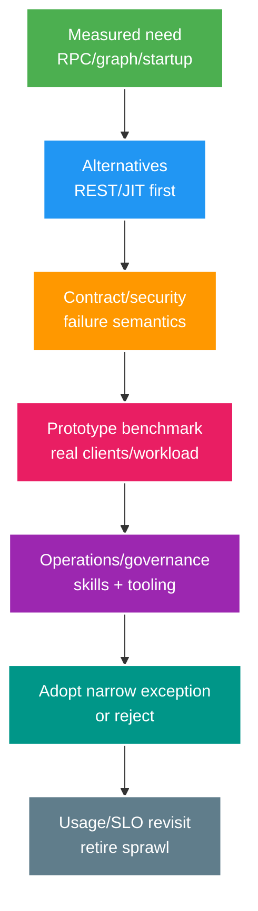

# Nền tảng cốt lõi: lựa chọn gRPC, GraphQL và Native Image

> Type: `CORE` 
> Domain: `platform` 
> Target depth: `D3 — đánh giá protocol/runtime P3 từ measured need, contract/security và operational cost` 
> Teaching readiness: `TEACHABLE_DRAFT` 
> Status: `DRAFT` 
> Evidence status: `NOT RUN` 
> Prerequisites: HTTP/API; JVM; architecture decision 
> Related cases: `PLAT-01` preview only; [question bank](../../question-bank/grpc-graphql-native-image-and-platform-specific-stack.md) 
> Owner: `Project learner; Codex teaches, learner writes back` 
> Updated: `2026-07-26`

## 1. Đây là lựa chọn có điều kiện, không phải mặc định

gRPC, GraphQL và native image giải ba bài toán khác nhau. Chỉ áp dụng khi có nhu cầu đã đo và có owner vận hành. Luôn so với phương án đơn giản REST/JSON trên JIT JVM, đồng thời tính chi phí team, library, client, proxy, observability, security, deploy và đường thoát. Đây vẫn là topic P3 dạng preview; có tài liệu không có nghĩa project đã thêm stack hoặc dependency.

## 2. gRPC và Protobuf hoạt động thế nào?

gRPC dùng IDL để mô tả service/message, sinh stub và truyền Protobuf nhị phân trên HTTP/2; nó hỗ trợ unary, server/client streaming và bidirectional streaming. Lợi ích là contract có kiểu cho nhiều ngôn ngữ và RPC nội bộ hiệu quả. Chi phí nằm ở browser, proxy, debug, load balancer, tooling, tương thích code sinh và vòng đời stream.

Field number của Protobuf là identity trên wire: không tái sử dụng number đã xóa mà phải `reserve`. Thêm field cần tương thích; hành vi unknown field, enum, default và presence phụ thuộc version/language. Đổi ý nghĩa hoặc type có thể phá client cũ, vì vậy cần contract fixture và test mixed-version client/server.

Mỗi RPC cần deadline và downstream chỉ nhận phần budget còn lại. Cancellation là hợp tác, không hoàn tác side effect đã commit. Map status/detail an toàn; chỉ retry lỗi transient trên operation idempotent với budget và operation ID ổn định. Streaming cần flow control/backpressure, giới hạn message/byte, keepalive, resume cursor/sequence và reconnect; không tự nhiên có exactly-once.

Xác thực qua TLS/mTLS, token hoặc service identity; vẫn authorize theo method/resource, không tin request chỉ vì nó đến từ mạng nội bộ. Interceptor có thể gắn trace/metric nhưng không được log metadata chứa secret.

## 3. GraphQL giải quyết gì và tạo rủi ro gì?

Schema định nghĩa type/field; query đọc, mutation thay đổi; resolver lấy dữ liệu cho field. Client tự chọn hình dạng graph nên giảm over-fetch/under-fetch cho UI đa dạng, nhưng một endpoint có thể che execution rất đắt. GraphQL không thay thế ownership của service, domain và API.

Authenticate request rồi authorize theo use case, object, field và tenant; batch kiểm tra nhưng tránh làm lộ sự tồn tại resource. Input qua allowlist/DTO. Giới hạn depth, complexity, alias, fragment, pagination, batch, rate, result và time; persisted query phù hợp với trusted client. DataLoader batch/cache trong phạm vi request để giảm N+1, nhưng không sửa được data ownership sai hoặc query không giới hạn.

Resolver không được tự mở DB/remote call không kiểm soát. Quan sát normalized operation name/hash thay vì raw query hoặc user label; đo latency/error/cost theo resolver. Mutation vẫn cần idempotency, transaction và error semantics rõ.

Khi evolution schema, ưu tiên thêm field/type và deprecate có lý do; đo client còn dùng field/operation trước khi xóa; không đổi meaning/nullability tùy tiện. Federation bổ sung ownership, gateway, cross-subgraph failure và governance chứ không làm chúng biến mất.

## 4. Native image và giới hạn của AOT

GraalVM native image biên dịch trước (AOT) phần code có thể tới được thành executable: startup nhanh và thường giảm memory footprint, hữu ích cho scale-to-zero, CLI hoặc mật độ cao. JIT JVM warm-up rồi profile-optimize throughput và hỗ trợ tự nhiên reflection, proxy, class loading, resource động. Native phải trả chi phí build/toolchain, reachability metadata, debug/profile và giới hạn library/JNI.

Spring AOT sinh hint/config cho reflection, resource, proxy và serialization. Class/resource/proxy thiếu thường chỉ lộ khi chạy đúng code path. Ưu tiên hint từ framework/library thay vì include rộng; test JSON, JPA, security, crypto, agent và native library. So sánh cả JIT với CDS/AppCDS và tối ưu startup.

Benchmark trên workload thật: startup tới readiness, RSS, peak throughput, p99, CPU, build time, artifact, compatibility và operability. Native có hành vi GC/JDK/GraalVM khác; phải pin version.

## 5. Ví dụ ra quyết định áp dụng

RPC nội bộ QPS cao, nhiều ngôn ngữ, cần streaming và có network kiểm soát có thể hợp lý với gRPC. Dashboard cần graph biến đổi từ nhiều read model có thể hợp lý với GraphQL, nhưng REST BFF/query endpoint đôi khi đơn giản hơn. Hàng trăm worker sống ngắn, scale-to-zero và nghẽn startup/RSS có thể hợp lý với native; service sống lâu, throughput cao có thể hợp JIT hơn.

Time-box prototype với acceptance threshold và exit rõ. Không đưa cả ba vào cùng lúc; mỗi lựa chọn thêm một protocol/runtime skill cùng đường observability/security mới.

## 6. Kiểm soát protocol sprawl

Đặt mặc định REST/JSON + JVM và tiêu chí/owner cho exception. Chia sẻ rule auth, identity, deadline, error, telemetry, contract và version giữa protocol. Catalog consumer, endpoint, SLO và cost. Giới hạn translation ở gateway; không tạo chuỗi REST → GraphQL → gRPC vì xu hướng. Retire protocol thừa bằng usage telemetry, migration client và deprecation.

Chỉ dùng native cho workload đã chọn; giữ JVM mode hoặc reproducer khi cần. Mỗi artifact cần build provenance và SBOM riêng.

## 6.1. Hai worked examples và phản ví dụ

**Worked example tối thiểu — gRPC:** internal unary/streaming contract dùng protobuf field numbers ổn định, deadlines/cancellation và status mapping. Add field tolerant không cho phép reuse removed field number; client/server mixed-version matrix vẫn cần.

**Worked example gần project — GraphQL feed:** client chọn fields giảm overfetch nhưng resolver N+1/cost/depth và field-level authorization có thể tạo abuse. DataLoader/batching, persisted/query limits và observability theo operation—not raw query—là phần platform contract.

**Phản ví dụ:** chuyển toàn backend sang native image/gRPC/GraphQL chỉ để startup nhanh hoặc thêm keyword. Reflection/proxy/resources/tooling, protocol sprawl, debugging và team ownership cost có thể lớn hơn benefit; cần spike + ADR + exit strategy theo workload thật.

## 7. Learner/self-check

> **Bài viết của tôi — `LEARNER TODO`:** evaluate one realistic need against REST/JIT alternatives and adoption threshold.

1. **Question:** gRPC vs REST? 
   **Đọc lại nếu bí:** mục 2 and 5. 
   **Một câu trả lời tốt phải có:** IDL/binary/HTTP2/streaming vs ubiquity/cache/debug/browser, deadline/contract/ops/client need. 
   **My answer:** `LEARNER TODO`
2. **Question:** GraphQL abuse control? 
   **Đọc lại nếu bí:** mục 3. 
   **Một câu trả lời tốt phải có:** object/field auth, cost/depth/alias/pagination/rate, DataLoader/N+1, normalized observability. 
   **My answer:** `LEARNER TODO`
3. **Question:** Native image choose by what? 
   **Đọc lại nếu bí:** mục 4–5. 
   **Một câu trả lời tốt phải có:** startup/RSS need, reachability/AOT/library, JIT throughput alternatives, exact benchmark/toolchain. 
   **My answer:** `LEARNER TODO`

## 8. Tài liệu tham khảo và teach-back

- [gRPC Documentation](https://grpc.io/docs/)
- [Protocol Buffers — Updating a Message Type](https://protobuf.dev/programming-guides/proto3/#updating)
- [GraphQL Specification](https://spec.graphql.org/)
- [GraalVM Native Image](https://www.graalvm.org/latest/reference-manual/native-image/)

- [ ] Tôi giữ default và chỉ mở exception khi có số đo.
- [ ] Tôi bảo vệ và evolution protocol contract an toàn.
- [ ] Tôi benchmark native/runtime trung thực.
- [ ] Evidence vẫn `NOT RUN`.
