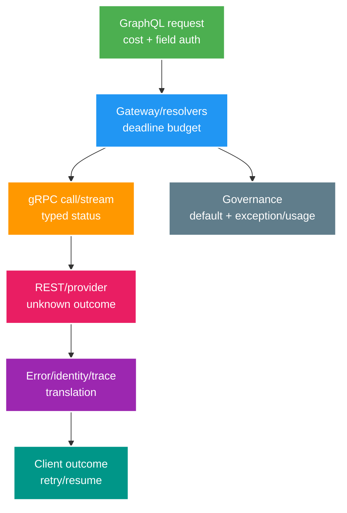

# Deep-dive: Protocol sprawl, phục hồi stream và tương thích native image

> Type: `DEEP_DIVE` 
> Domain: `platform` 
> Target depth: `D4 — govern mixed protocols/runtime và chẩn đoán cross-layer failure/compatibility` 
> Teaching readiness: `TEACHABLE_DRAFT` 
> Status: `DRAFT` 
> Evidence status: `NOT RUN` 
> Prerequisites: [Platform options core](../core/grpc-graphql-native-image-and-platform-specific-stack.md) 
> Related cases: `PLAT-01` preview only; [question bank](../../question-bank/grpc-graphql-native-image-and-platform-specific-stack.md) 
> Owner: `Project learner; Codex teaches, learner writes back` 
> Updated: `2026-07-26`

## 1. Pathology A — chuỗi protocol làm mất semantics

Chuỗi client GraphQL → gateway resolver → gRPC service → REST provider tạo nhiều bộ deadline, error, auth và retry semantics. Mỗi bước translation có thể làm mất cancellation, identity hoặc idempotency và nhân số lần retry. Trước khi gom hoặc thay protocol, phải inventory đúng consumer và use case.

Cả chuỗi chỉ có một end-to-end deadline được chia budget, một retry owner, mapping rõ identity/actor/service và audience giới hạn. Error category phải giữ được retryability mà không lộ internals; trace context phải truyền xuyên suốt. Contract và invariant vẫn thuộc domain owner, gateway không trở thành “business god”.

## 2. Phục hồi gRPC streaming sau đứt kết nối

HTTP/2 flow control giới hạn byte ở transport, nhưng buffer/message ở application vẫn cần cap. Khi stream đứt, outcome mơ hồ; client gửi resume cursor hoặc sequence cuối đã ack, server replay dữ liệu còn retention hoặc gửi snapshot đầy đủ. Command cần message ID/sequence ổn định và idempotency; retry cả bidirectional stream có thể gửi command trùng.

Deadline/cancel phải propagate nhưng remote vẫn có thể đã commit. Unary RPC cần idempotency key và operation status; ack của streaming command gắn stable ID. Keepalive quá gắt làm quá tải proxy; cần max connection age, drain và reconnect jitter. Load balancer phải hỗ trợ HTTP/2 stream; connection sống lâu có thể làm phân phối tải lệch.

Khi bridge Reactor, gRPC và broker, phải hiểu demand, flow control và prefetch ở từng tầng để tìm hidden queue. Slow-client policy phụ thuộc semantics dữ liệu. Test connection drop, reorder, duplicate và server restart.

## 3. Pathology B — Protobuf evolution làm client cũ hiểu sai dữ liệu

Tái sử dụng field number đã xóa làm byte cũ bị hiểu thành ý nghĩa mới. Đổi numeric/string encoding hoặc type có thể parse sai; unknown enum phụ thuộc language/version. Validation kiểu “required” nên làm ở application thay vì phá wire compatibility. Reserve number/name đã xóa, thêm field theo hướng additive và chọn default/presence an toàn.

Version code sinh và JSON mapping ở gateway có thể khác. Cần fixture contract cho old/new producer/consumer, unknown field, `oneof` evolution và message size limit. Semantic thay đổi nên có field/message/method/version mới; trước khi xóa phải xét event còn retention và replay horizon.

## 4. Pathology C — GraphQL nhân chi phí và làm lộ authorization boundary

Attacker có thể alias một field đắt hàng trăm lần; fragment sâu và nested list nhân số resolver. DataLoader batch được call nhưng vẫn chịu hàng loạt key duy nhất. Cần depth/complexity check trước execution, runtime budget cho time/row/remote call, pagination, persisted-query allowlist khi phù hợp và rate limit theo identity/toàn cục. Tắt introspection không phải lớp phòng thủ chính.

Authorize field sau khi fetch có thể lộ timing/sự tồn tại và lãng phí tài nguyên. Đẩy filter tenant/resource vào query của owner và kiểm tra object policy trước resolver nhạy cảm; error không được tiết lộ. DataLoader cache theo request và tenant để tránh rò chéo user. Mutation dùng task input, validation, idempotency và transaction.

Raw GraphQL query vừa nhạy cảm vừa cardinality cao; quan sát bằng operation name hoặc persisted hash, field/error/cost hữu hạn và sampled trace.

## 5. Chẩn đoán tương thích native image

Tái hiện đúng GraalVM, JDK, Spring, dependency, build argument và runtime path bị lỗi. Với class-not-found/reflection, xem AOT report/hint; với resource thiếu, khai báo resource bundle; kiểm tra dynamic proxy, JNI và serialization. Ưu tiên Spring AOT/runtime hint upstream; reflection config quá rộng làm image/attack surface tăng và che code thừa.

Metadata do tracing agent sinh có thể bỏ lỡ path hiếm; chạy integration, negative và security test đại diện rồi curate. Build-time initialization có thể đóng băng environment, secret, random, time hoặc state không an toàn; chọn build-time/run-time init cẩn thận. Kiểm tra riêng TLS, crypto, certificate, locale, timezone, native library và agent.

So sánh cùng code trên JVM; nếu compatibility/cost lớn hơn lợi ích startup thì từ chối hoặc giới hạn native. Security patch native yêu cầu rebuild. Debug symbol, crash dump, JFR và profiling phụ thuộc version nên runbook phải pin toolchain.

## 6. Pathology D — benchmark startup che mất chi phí dài hạn

Benchmark startup nhanh trên endpoint rỗng không nói được throughput của service sống lâu. Đo cold start tới readiness, p99/CPU/RSS lúc warm và steady, concurrency, GC, build duration, CI cost và image size. JIT có thể vượt sau warm-up; profile-guided optimization và native flag lại tăng complexity. So sánh cả tần suất cold start/billing serverless với always-on.

So memory bằng RSS, không lấy heap JVM so với toàn bộ native process. Đặt container request/limit tương đương. Với scale-to-zero, cold dependency hoặc mở DB connection có thể chiếm phần lớn startup. Đừng bỏ qua CDS/AppCDS và tiered JIT.

## 7. Gom và loại bỏ protocol thừa

Catalog endpoint, client, traffic, SLO, giá trị riêng, owner và dependency. Đặt default, chỉ giữ exception có số đo. Khi retire gateway GraphQL/gRPC, tạo replacement tương thích, đo client usage, deprecate, dual/shadow/canary rồi mới xóa; tránh big bang. Native workload có thể quay lại JIT artifact cùng contract/data nếu có capacity plan.

Có thể chia sẻ tooling auth, telemetry và schema registry nhưng không tạo abstraction “mẫu số chung thấp nhất” che semantics. Chuẩn bị training, on-call và runbook; revisit ADR dựa trên usage, cost và incident.

## 8. Phòng thí nghiệm evidence

Thử gRPC deadline/cancel/response loss/stream resume; Protobuf old/new; GraphQL cost/tenant/N+1; native reflection/resource/security path và benchmark đối chứng. Lưu version, config và raw result. Task này không implement dependency nên evidence vẫn `NOT RUN`.

### 8.1. Walkthrough một failure xuyên GraphQL → gRPC → REST

Giả sử client đặt deadline 2 giây. Gateway dùng 300 ms để parse, authorize và resolve field; gRPC service chỉ còn khoảng 1,7 giây trừ cleanup margin. Nếu gateway vô tình cấp lại 2 giây đầy đủ, REST provider có thể tiếp tục charge sau khi client đã timeout. Client retry GraphQL mutation, gateway retry gRPC và gRPC client retry REST sẽ khuếch đại một operation thành nhiều external call.

Thiết kế an toàn cần stable operation ID đi xuyên mọi protocol, một retry owner và status query cho outcome mơ hồ. Mapping error phải giữ category `transient`, `permanent`, `conflict`, `unknown` mà không expose stack. Cancellation được propagate để tiết kiệm work nhưng không được coi là rollback. Authorization principal và audience được map tường minh; không biến “request nội bộ” thành trusted mặc định.

Experiment đặt proxy trước REST provider: cho provider commit ở 1,2 giây rồi delay response quá deadline. Ghi trace/span, operation ID, số attempt từng tầng và final provider state. Kết quả đúng không phải “client nhận lỗi” mà là chỉ có một charge, retry cùng key đọc stored outcome và total attempt nằm trong budget. Chạy thêm old/new Protobuf fixture để chứng minh unknown field không phá reader; GraphQL query alias sâu để chứng minh runtime cost budget chặn trước khi downstream quá tải. Với native image, chạy đúng security/serialization path hiếm thay vì chỉ health endpoint. Chưa chạy các bước này thì mọi claim performance/compatibility vẫn là dự kiến.

## 9. Learner/self-check

> **Bài viết của tôi — `LEARNER TODO`:** trace GraphQL→gRPC→REST deadline/retry/auth and one native failure.

1. **Question:** Streaming retry safely? 
   **Đọc lại nếu bí:** mục 2. 
   **Một câu trả lời tốt phải có:** stable IDs/sequence/acks, resume cursor/replay, flow/application buffers, unknown committed commands. 
   **My answer:** `LEARNER TODO`
2. **Question:** GraphQL DataLoader enough? 
   **Đọc lại nếu bí:** mục 4. 
   **Một câu trả lời tốt phải có:** batching not authorization/cost cap, alias/depth/unique keys, owner filter, request/tenant cache. 
   **My answer:** `LEARNER TODO`
3. **Question:** Native missing reflection diagnose? 
   **Đọc lại nếu bí:** mục 5–6. 
   **Một câu trả lời tốt phải có:** exact toolchain/path/report/hints, representative tests, no broad include, JVM comparison/decision. 
   **My answer:** `LEARNER TODO`

## 10. Tài liệu tham khảo và teach-back

- [gRPC — Deadlines](https://grpc.io/docs/guides/deadlines/)
- [GraphQL — Security](https://graphql.org/learn/security/)
- [Spring Boot — GraalVM Native Image](https://docs.spring.io/spring-boot/reference/packaging/native-image/index.html)

- [ ] Tôi giữ end-to-end protocol semantics qua mọi translation.
- [ ] Tôi bảo vệ resource trước stream/query không giới hạn.
- [ ] Tôi chẩn đoán và chọn native bằng evidence.
- [ ] Evidence vẫn `NOT RUN`.
