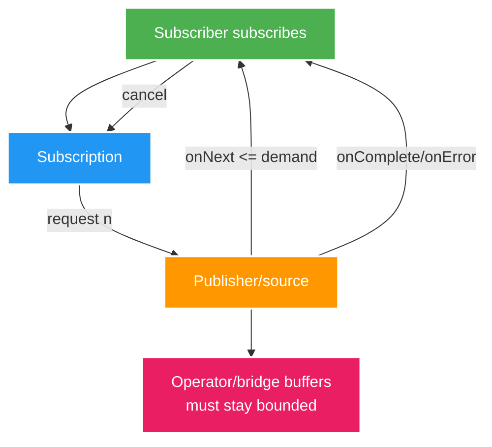

# Reactive Core: Reactive Streams, WebFlux và Virtual-thread Decision

> Type: `CORE` 
> Domain: `reactive` 
> Target depth: `D3 — hiểu demand/context/event-loop và chọn MVC/virtual threads/WebFlux bằng workload evidence` 
> Teaching readiness: `TEACHABLE_DRAFT` 
> Status: `DRAFT` 
> Evidence status: `NOT RUN` 
> Prerequisites: Java concurrency; HTTP; Java 21 virtual threads 
> Related cases: `REACT-01`; [question bank](../../question-bank/reactive-streams-webflux-and-virtual-thread-decision.md) 
> Owner: `Project learner; Codex teaches, learner writes back` 
> Updated: `2026-07-26`

## 1. Terms are not synonyms

**Blocking** giữ thread gọi cho tới khi operation xong. API **non-blocking** trả về mà không chờ và báo readiness/completion sau. **Asynchronous** chỉ nói kết quả đến sau qua callback/future; implementation bên dưới vẫn có thể dùng blocking worker. **Reactive** mô hình hóa stream/signal bất đồng bộ, composition, cancellation/error và demand/backpressure theo Reactive Streams. Một hệ có thể async nhưng không reactive, hoặc bọc blocking call bằng reactive API.

Backpressure chỉ có tác dụng ở nơi producer hoặc bridge tôn trọng demand. Callback từ broker/database có thể tiếp tục đẩy vào buffer dù downstream không request thêm.

## 2. Reactive Streams contract

Sau khi subscribe, Publisher phát signal tới Subscriber. Subscription điều khiển `request(n)` và cancel. Số `onNext` không vượt demand; terminal complete/error chỉ một lần; signal được serialize theo spec. Invalid demand, reentrancy và race có rule cụ thể. Operator biến đổi hoặc truyền demand/cancellation; async boundary dùng scheduler/queue.

Trong Reactor, `Mono<T>` biểu diễn 0..1 phần tử, `Flux<T>` là 0..N. Cold pipeline là lazy: dựng chain chưa chạy gì cho tới subscription; mỗi subscription có thể lặp DB/HTTP/side effect. `cache/share/publish` đổi hot/multicast/lifecycle và có thể giữ memory hoặc dữ liệu stale. Error là terminal signal; `onErrorResume/retry` có thể resubscribe và lặp side effect, nên cần idempotency.

Không gọi `subscribe()` trong service chỉ để “cho nó chạy”; framework phải sở hữu subscription, lifecycle, error và context. Tránh `block()` trên event loop.

## 3. Event-loop starvation

WebFlux/Netty thường chỉ có ít event-loop thread. Một JDBC/file/blocking HTTP call chiếm loop làm nhiều socket không liên quan phải chờ; tail latency tăng dù CPU có thể thấp. Chuyển blocking không tránh được sang bounded elastic/scheduler chỉ như cầu tương thích; nếu blocking chiếm đa số, imperative hoặc virtual-thread model đơn giản hơn. Scheduler và connection pool hữu hạn vẫn là capacity limit.

Phát hiện bằng tên/stack thread, JFR, test kiểu BlockHound khi phù hợp, event-loop task/latency dưới concurrency và instrumentation DB/client call. Happy path trên máy dev không lộ starvation.

Concurrency của `parallel/flatMap` có thể làm downstream quá tải. `publishOn` đổi nơi thực thi phần downstream; `subscribeOn` ảnh hưởng source subscription; phải đọc đúng chain. Thêm scheduler không tạo thêm capacity cho database hoặc remote service.

## 4. Context, transaction and security

Assumption về ThreadLocal, MDC, SecurityContext và JPA transaction hỏng khi signal đổi thread. Reactor Context đi theo mỗi subscription; reactive security/transaction manager của Spring bind qua reactive context/Publisher. Imperative `@Transactional` với JPA/blocking repository không phải reactive transaction. R2DBC là reactive SQL nhưng có ORM/ecosystem/semantics khác.

Version instrumentation truyền context có ảnh hưởng. Không giấu actor/token trong mutable global. Test auth/correlation qua `flatMap`, scheduler và error/retry; dọn hoặc tránh leakage. Cancellation có thể xảy ra sau DB/external effect nên vẫn cần idempotency và operation state.

## 5. Backpressure policies by semantics

Buffer hữu hạn hấp thụ burst ngắn khi average service rate bắt kịp. Nếu không bắt kịp, buffer chỉ trì hoãn OOM. Drop/sample/coalesce/latest có thể chấp nhận cho telemetry, presence và view count; chat/payment durable phải persist/replay hoặc reject/disconnect, không silent drop. Quan sát buffer size/byte/age, demand, cancellation/drop và downstream saturation.

Operator như `flatMap`, `buffer`, `window`, `groupBy`, prefetch và multicast có thể tạo nhiều queue/group. Key cardinality không giới hạn hoặc group không được consume làm tăng memory. Bridge tới RabbitMQ/WebSocket có thể bỏ qua demand; broker prefetch và outbound buffer phải được căn chỉnh.

## 6. Execution model decision

**Spring MVC + platform threads:** simplest mature blocking JPA stack, moderate concurrency; threads/memory/context switch under high blocking. **MVC + virtual threads (Java 21):** imperative style, high blocking concurrency, but pinned synchronized/native sections, ThreadLocal memory, connection pools/DB still bounded; measure JFR. **WebFlux:** end-to-end non-blocking clients/drivers/streaming/high concurrent idle I/O, compositional cancellation/backpressure; higher cognitive/debug/context/library complexity.

Không trộn execution model theo xu hướng. Project hiện dùng Spring MVC/JPA và JDK-01 đang đánh giá Java 21. WebFlux không biến JPA blocking thành non-blocking; virtual thread không tạo thêm DB connection. Một endpoint/module streaming có thể hợp lý với reactive ở boundary rõ, kèm adapter và governance.

## 7. Fair benchmark

Khi benchmark phải giữ cùng endpoint, business logic, data, dependency, security, serialization, connection/pool limit, máy và JDK. Warm-up JIT; dùng open arrival thực tế, dependency chậm và nhiều mức concurrency. Đo throughput, p50/p95/p99, error/timeout, CPU/memory/thread/carrier, GC, DB/client pool, event-loop block, virtual-thread pinning, queue age và recovery; tính cả complexity implement/ops/debug.

Load tới saturation và failure; average ở concurrency thấp không đủ ra quyết định. Pin version, config, command và raw result. Evidence hiện `NOT RUN`.

## 8. Governance

Mặc định chọn imperative model đơn giản nhất. Chỉ dùng reactive cho end-to-end path có lý do; rollout virtual thread theo từng workload sau compatibility và pin version. Chuẩn hóa driver/library, cấm blocking trên event loop, giới hạn concurrency/buffer, thống nhất context/observability pattern và review/test. Một service có thể expose protocol boundary mà không làm Reactor type lan qua domain không liên quan.

## 8.1. Hai worked examples và phản ví dụ

**Worked example tối thiểu — demand:** subscriber request 32 items; publisher không được emit unbounded. Nếu operator/prefetch/buffer ẩn giữ hàng triệu messages, backpressure contract ở edge không bảo memory; quan sát queue/buffer thực.

**Worked example gần project — WebFlux với blocking JDBC:** event-loop handler gọi JPA/JDBC làm thread ít bị block, throughput collapse. Offload bounded scheduler chỉ là bridge và vẫn cần DB bulkhead; MVC + virtual threads có thể đơn giản hơn cho predominantly blocking stack.

**Phản ví dụ:** chuyển controller sang `Mono` nhưng giữ blocking clients, ThreadLocal context/transactions và `subscribe()` side effects. Syntax reactive không tạo non-blocking end-to-end, còn làm error/cancellation/context khó reason hơn.

## 9. Learner/self-check

> **Bài viết của tôi — `LEARNER TODO`:** compare one blocking JPA endpoint under platform threads, virtual threads and WebFlux constraints.

1. **Question:** Reactive backpressure là gì? 
   **Đọc lại nếu bí:** mục 1–2 và 5. 
   **Một câu trả lời tốt phải có:** request(n)/cancel/signals, source honors demand, hidden buffers/semantics. 
   **My answer:** `LEARNER TODO`
2. **Question:** Blocking event loop symptoms? 
   **Đọc lại nếu bí:** mục 3. 
   **Một câu trả lời tốt phải có:** few loop threads, JDBC/file wait, unrelated tail, JFR/thread/load evidence, bounded isolate/model choice. 
   **My answer:** `LEARNER TODO`
3. **Question:** Chọn virtual thread vs WebFlux? 
   **Đọc lại nếu bí:** mục 4, 6–7. 
   **Một câu trả lời tốt phải có:** stack/workload, end-to-end blocking/nonblocking, pinning/pools/context, fair benchmark/complexity. 
   **My answer:** `LEARNER TODO`

## 10. References/teach-back

- [Reactive Streams Specification](https://www.reactive-streams.org/)
- [Project Reactor Reference](https://projectreactor.io/docs/core/release/reference/)
- [Spring WebFlux Reference](https://docs.spring.io/spring-framework/reference/web/webflux.html)
- [JEP 444 — Virtual Threads](https://openjdk.org/jeps/444)

- [ ] Tôi model signals/demand/context.
- [ ] Tôi find hidden blocking/buffer.
- [ ] Tôi choose execution model with evidence.
- [ ] Evidence vẫn `NOT RUN`.
