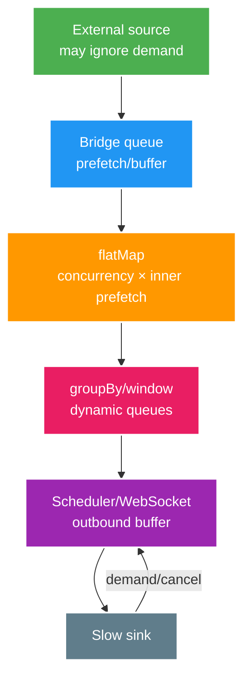

# Deep-dive: Buffer ẩn, mất context và migration execution model

> Type: `DEEP_DIVE` 
> Domain: `reactive` 
> Target depth: `D4 — diagnose reactive OOM/starvation/context bugs và dẫn migration dựa benchmark` 
> Teaching readiness: `TEACHABLE_DRAFT` 
> Status: `DRAFT` 
> Evidence status: `NOT RUN` 
> Prerequisites: [Reactive core](../core/reactive-streams-webflux-and-virtual-thread-decision.md) 
> Related cases: `REACT-01`; [question bank](../../question-bank/reactive-streams-webflux-and-virtual-thread-decision.md) 
> Owner: `Project learner; Codex teaches, learner writes back` 
> Updated: `2026-07-26`

## 1. Vẽ demand graph, đừng chỉ liệt kê operator

Hãy vẽ source → operator → async boundary → sink. Với từng điểm, ghi demand vào/ra, concurrency/prefetch, giới hạn message/byte/tuổi của queue, producer có hỗ trợ cancellation không, overflow policy và metric. Cả chain chỉ an toàn khi mọi boundary đều hữu hạn hoặc có durability.

## 2. Pathology A — backpressure vẫn OOM vì buffer ẩn

Nguồn vào 10 nghìn/s nhưng sink chỉ xử lý 5 nghìn/s; `onBackpressureBuffer()` không giới hạn chỉ trì hoãn lỗi trong lúc heap tăng. Backpressure không thể tự làm chậm HTTP webhook hoặc broker có prefetch cao nếu admission, ack hoặc pause không tác động ngược được. Phải chọn giới hạn buffer, persist hoặc load shedding theo semantics.

`flatMap` concurrency 256 nhân với inner prefetch làm số payload in-flight phình lớn, nhất là response body nặng. `groupBy(userId)` tạo số group không giới hạn nếu key cardinality cao và group không được drain. `window` bị giữ, `cache` thiếu expiry/size, replay sink, slow subscriber trên hot multicast và scheduler queue đều là buffer. Xác định bằng heap dump, operator metric, JFR, arrival/drain rate và queue age.

Cách sửa phải theo semantics: giảm concurrency/prefetch; buffer hữu hạn kèm overflow; giữ latest hoặc drop cho dữ liệu ephemeral; persist và cursor cho dữ liệu durable; ngắt slow client; giới hạn/evict group key; admission ở upstream. Sau đó test tải vào lớn hơn capacity đủ lâu và quá trình recovery, không chỉ burst ngắn.

## 3. Pathology B — một blocking call làm đói cả event loop

Một mapper gọi JPA/JDBC hoặc `.block()` ngay trên Netty event loop. Khi concurrency tăng, stack của loop cùng chờ, mọi connection trên loop bị trễ dù CPU có thể chưa cao; timeout rồi retry làm nặng thêm. Xác định qua tên thread, stack, JFR và endpoint correlation. Chuyển sang `boundedElastic` tránh làm đói loop nhưng tạo queue/thread mới và vẫn bị trần DB pool; cần giới hạn concurrency và cân nhắc MVC/virtual thread.

Code `synchronized` hoặc native có thể pin carrier của virtual thread tùy JDK; xem JFR pinned event và carrier utilization. Sửa critical section/library hoặc giới hạn đường gọi, đồng thời pin JDK version khi kết luận. Virtual thread tăng khả năng scale số thread chờ, không tăng CPU, DB, remote capacity hay tạo backpressure.

## 4. Pathology C — resubscribe làm side effect chạy hai lần

Một cold `Mono` bọc thao tác charge được response path và audit path subscribe riêng sẽ chạy hai lần. `retry` cũng resubscribe sau khi mất response và có thể lặp external side effect. Dùng operation/status idempotent; chỉ `share/cache` khi hiểu lifecycle, error và memory; tốt nhất đặt side effect một lần trong durable service workflow. `doOnNext` có thể không chạy khi empty/error; `doFinally` chạy lúc cancel/error/complete nhưng không tạo transaction magic.

Nested `subscribe` tách error, context và cancellation khỏi chain; method trả về trước khi việc xong và test trở nên flaky. Hãy compose bằng `flatMap/then` và để framework subscribe. Fire-and-forget cần durable queue/outbox, không phải subscription mồ côi.

## 5. Mất context và hiểu sai transaction

Security principal trong ThreadLocal có thể mất sau scheduler hop; fallback sai có thể biến request thành anonymous hoặc admin. MDC từ task trước cũng có thể rò. Dùng reactive SecurityContext/Reactor Context và instrumentation truyền context được hỗ trợ; test qua scheduler/operator. Trace/actor do client gửi không phải identity đáng tin.

Reactive transaction bắt đầu khi subscribe và chỉ áp dụng cho publisher dùng reactive manager/connection. Imperative repository gọi bên trong vừa blocking vừa có thể nằm ngoài transaction ấy. Các nhánh parallel không mặc nhiên chia sẻ một connection/transaction. Không kéo transaction qua remote wait; giữ invariant trong local DB và dùng outbox.

Cancellation có thể ngừng nhận kết quả nhưng remote/database đã commit. Cần operation status và idempotency. Timeout operator phát cancellation/error signal, không bảo đảm tác vụ vật lý dừng; phải mô hình hóa unknown outcome.

## 6. Chiến lược migration execution model

Khi sang virtual thread: xác minh Java 21 compatibility; bật có kiểm soát ở executor/server; inventory ThreadLocal, `synchronized`, native code và library; sizing DB/HTTP pool; xem JFR pinning; load canary và có rollback flag. Tách preview structured concurrency khỏi baseline và không âm thầm yêu cầu feature JDK 25.

Khi sang WebFlux: chỉ chọn path streaming/concurrency cao; bảo đảm driver, client và storage non-blocking; cô lập domain khỏi Reactor khi có ích; triển khai đúng reactive security/transaction/context/observability; giới hạn operator; so contract/load/fault. Không đổi controller nhưng vẫn gọi JPA trên event loop. Mixed MVC/WebFlux phụ thuộc version/hành vi Spring; ưu tiên boundary service/edge rõ.

Đo migration bằng SLO, resource, cost và outcome của team; sau khi telemetry chứng minh ổn định, xóa adapter/dual model. Giữ MVC và tuning vẫn là một quyết định hợp lệ.

## 7. Benchmark có fault và so sánh công bằng

Dùng open workload với cùng arrival rate; inject dependency delay/timeout/error, slow client và cancellation; giữ cùng pool limit. Warm JIT trước khi đo. Platform thread, virtual thread và WebFlux phải chạy cùng logic nghiệp vụ. Thu JFR, thread/heap/GC, event-loop lag/pinning, queue, DB/HTTP pool, throughput/p99/error và thời gian recovery; đánh giá cả code complexity, debug và runbook.

Công cụ tải phải tránh coordinated omission. Kết quả của một endpoint không đủ làm quyết định platform cho mọi workload. Evidence hiện vẫn `NOT RUN`.

## 8. Guardrail kiến trúc

Duy trì registry compatibility library; cấm blocking call trên event loop; review concurrency/operator có giới hạn; chuẩn hóa context/security/transaction; có owner cho scheduler; cấm raw `subscribe`; load/fault test cho streaming; dashboard buffer/demand/cancel. Mỗi lần nâng version phải chạy lại negative/concurrency test.

### 8.1. Walkthrough chẩn đoán từ triệu chứng tới bằng chứng

Giả sử production tăng memory đều 200 MB mỗi phút nhưng throughput không đổi. Đừng kết luận “memory leak” ngay. Trước tiên đặt các đồ thị arrival rate, completion rate, buffer size/age và heap theo cùng timeline. Nếu arrival lớn hơn completion đúng bằng tốc độ queue tăng, đây là **backlog được giữ trong memory**, không nhất thiết là object bị mất reference. Heap histogram cho biết payload nằm trong `Queue`, `GroupedFlux`, response buffer hay cache; JFR và operator metric chỉ ra async boundary nào sở hữu chúng.

Sau đó giảm tải vào nhưng giữ service chạy. Nếu queue drain và heap giảm sau GC, nguyên nhân là capacity mismatch. Nếu arrival bằng 0 mà object vẫn bị giữ, lần theo reference chain để tìm cache/subscription/lifecycle leak. Hai failure này có mitigation khác nhau: backlog cần admission và buffer semantics, còn leak cần đóng lifecycle hoặc xóa reference.

Khi sửa, không chỉ chứng minh “không OOM trong 30 giây”. Chạy tải lớn hơn capacity đủ lâu để overflow policy kích hoạt, rồi giảm tải và đo thời gian recovery. Assert loại dữ liệu ephemeral bị drop/coalesce theo contract; dữ liệu durable được persist/replay; cancellation release connection/semaphore; metric không dùng key cardinality cao. Lưu raw command, JDK/Reactor/Spring version, heap/JFR và cấu hình prefetch/concurrency. Nếu chưa có các artifact đó, kết luận vẫn là hypothesis và `Evidence status` không được nâng.

## 9. Learner/self-check

> **Bài viết của tôi — `LEARNER TODO`:** draw demand graph and diagnose one OOM + one context leak.

1. **Question:** Backpressure vẫn OOM vì sao? 
   **Đọc lại nếu bí:** mục 1–2. 
   **Một câu trả lời tốt phải có:** demand-unaware source/bridge, operator queue multiplication, unbounded group/cache/outbound, semantic fix/evidence. 
   **My answer:** `LEARNER TODO`
2. **Question:** Timeout/cancel có undo effect? 
   **Đọc lại nếu bí:** mục 4–5. 
   **Một câu trả lời tốt phải có:** signal vs physical execution, resubscription, unknown outcome, idempotency/status/transaction boundary. 
   **My answer:** `LEARNER TODO`
3. **Question:** Migrate execution model safely? 
   **Đọc lại nếu bí:** mục 6–7. 
   **Một câu trả lời tốt phải có:** end-to-end compatibility, staged workload, context/pools/buffers, JFR/load/fault/canary/rollback and complexity. 
   **My answer:** `LEARNER TODO`

## 10. Tài liệu tham khảo và teach-back

- [Reactor Reference — Threading and Schedulers](https://projectreactor.io/docs/core/release/reference/coreFeatures/schedulers.html)
- [Spring — Context Propagation](https://docs.spring.io/spring-framework/reference/web/webflux-callbacks.html)
- [JEP 491 — Synchronize Virtual Threads without Pinning](https://openjdk.org/jeps/491)

- [ ] Tôi audit mọi demand/buffer boundary.
- [ ] Tôi giữ đúng context/transaction semantics.
- [ ] Tôi migration bằng fault evidence công bằng.
- [ ] Evidence vẫn `NOT RUN`.
