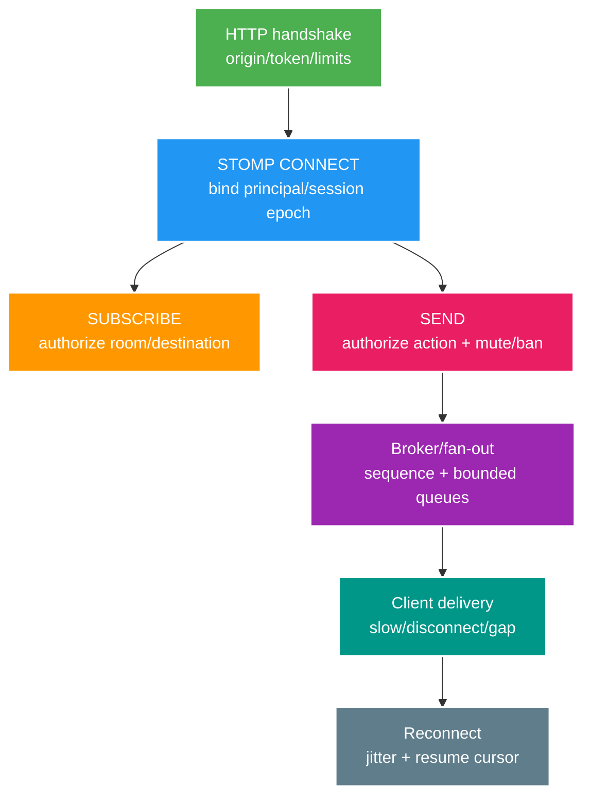

# Realtime Core: WebSocket/STOMP Auth, Reconnect và Backpressure

> Type: `CORE` 
> Domain: `realtime` 
> Target depth: `D3 — bảo vệ connect/subscribe/send, bounded fan-out và reconnect recovery` 
> Teaching readiness: `TEACHABLE_DRAFT` 
> Status: `DRAFT` 
> Evidence status: `NOT RUN` 
> Prerequisites: HTTP/auth; messaging; capacity basics 
> Related cases: `RT-01`; [question bank](../../question-bank/websocket-stomp-auth-reconnect-and-backpressure.md) 
> Owner: `Project learner; Codex teaches, learner writes back` 
> Updated: `2026-07-26`

## 1. Choose protocol by interaction

Polling lặp request/response, đơn giản và cache được nhưng có latency/overhead. SSE là text event stream sống lâu từ server tới browser, có reconnect/last-event semantics nhưng không duplex cùng channel. WebSocket upgrade thành frame full-duplex; application protocol như STOMP thêm `CONNECT/SUBSCRIBE/SEND`, destination và header. Đổi lại phải quản lý connection lifecycle, proxy/timeout, gia hạn auth, buffer và scale.

Connection không phải authorization vĩnh viễn, và WebSocket không cung cấp durable exactly-once delivery.

## 2. Authorization boundaries

Handshake validate transport, origin, cookie/token theo browser/client model, giới hạn size/rate và bind identity ban đầu. Origin là boundary kiểu CSRF của browser, không phải authentication. STOMP `CONNECT` validate header/token nếu dùng rồi tạo principal/session metadata; không bao giờ tin user ID/role do client tự khai.

`SUBSCRIBE` authorize destination cùng membership, tenant và state hiện tại của resource. Destination do client gửi là untrusted; parse/map theo pattern allowlist và cấm subscribe queue của user khác. `SEND` authorize từng message theo role/owner/room, mute/ban/current stream state, payload/schema/rate. Quyền subscribe không mặc nhiên là quyền send.

Connection sống lâu có thể vượt tuổi token, role hoặc ban state. Strategy gồm revalidation/epoch/cache có cửa sổ ngắn hữu hạn, event-driven disconnect/restrict và kiểm tra action rủi ro tại lúc `SEND`; PostgreSQL là owner, Redis là projection hữu hạn. Định nghĩa Redis outage policy, thường deny `SEND` rủi ro, và maximum revocation lag. Connection/session epoch loại delivery từ reconnect/node cũ.

## 3. Heartbeat, timeout and reconnect

TCP có thể half-open; STOMP/WebSocket heartbeat, application ping và idle timeout giúp phát hiện/reclaim. Tuning theo proxy, load balancer, mobile network và scale: quá dày tốn traffic, quá thưa giữ ghost connection. Phân biệt heartbeat với business message.

Client reconnect bằng exponential backoff, full jitter và cap, chỉ reset sau một khoảng ổn định. Server admission/rate limit theo account/IP/device/toàn cục và tránh DB work nặng trước gate. Khi resume, client gửi durable room sequence/message ID cuối cùng cùng connection epoch; server replay phần gap còn retention nếu contract cho phép, ngược lại báo gap/full refresh. Resubscribe phải idempotent. Fixed delay tạo synchronized storm.

Khi deploy, drain bằng cách đánh dấu node không nhận connection mới, cho grace period hoặc close kèm retry hint/jitter và rollout lệch giữa zone. Không đóng cả fleet cùng lúc.

## 4. Delivery/order semantics

Frame WebSocket/STOMP có thể mất khi disconnect. Semantics chính xác của ACK mode phụ thuộc protocol/broker; receipt chỉ xác nhận một boundary, không chứng minh người dùng đã thấy. Nếu chat cần durability, commit message với stable ID/room sequence trước fan-out; reconnect query/replay. Duplicate do reconnect/retry được dedup bằng message/client command ID. Ordering thường theo room/partition sequence, không theo wall clock toàn cục.

Presence/typing ephemeral có thể at-most-once, drop hoặc coalesce. Chat message có thể durable/replay. Moderation và financial control cần workflow mạnh hơn. Semantics của state quyết định buffer, drop hay persist.

## 5. Slow consumer/backpressure

Nếu producer/fan-out nhanh hơn socket client, outbound queue làm memory và latency tăng tới OOM. Giới hạn message/byte/age theo session và node. Với presence/view counter, giữ latest, coalesce hoặc drop. Với durable chat, chỉ queue cursor hoặc ít frame rồi ngắt slow client và resume từ store. Với dữ liệu critical không replay được, reject/close trước khi silent loss và redesign persistence.

Fan-out không được để một slow socket chặn mọi client. Partition execution, async write với buffer hữu hạn và write timeout. Giới hạn payload/frame, xét risk CPU/memory do compression và đặt quota. Metric dùng chiều hữu hạn: connection, connect rate, subscription, send, outbound queue byte/age, drop/disconnect reason, auth deny và room-size bucket; không dùng raw room/user label.

## 6. 100k hot room architecture

Gateway gần stateless sở hữu connection; registry partition theo room/node và presence approximate. Broker/topic shard phân phối message; hot room có thể dùng broadcast tree, serialize/batch một lần trên node, không DB read/write theo từng viewer. Durable message store cung cấp sequence/replay; gateway fan-out live. Queue hữu hạn cô lập node, room và client.

Capacity gồm connection/node từ memory, FD, event loop và load test; auth/reconnect QPS; message nhân recipient, byte/egress; broker/gateway CPU và heartbeat. Dành headroom cho mất zone và deploy. Chia hot room/fan-out nhưng giữ room sequence qua source sequencer hoặc version; không cần global order.

## 7. Negative/fault tests

Negative test gồm token thiếu/hết hạn/sai audience, origin, room/tenant cấm, destination traversal, giả sender, mute/ban trước và sau connect, token revoke, frame quá lớn/sai, send rate, slow client, broker/Redis outage, reconnect duplicate, stale epoch và gap. Assert close/error cùng **không broadcast/side effect**, không chỉ status.

Load reconnect với jitter, room skew và zone restart thực tế; đo recovery time, auth/database/cache, memory/FD, outbound queue và drop. Evidence hiện `NOT RUN`.

## 8. Spring boundary

Channel interceptor WebSocket/STOMP, destination matching, simple broker so với broker relay và executor buffer có hành vi phụ thuộc version/config. HTTP `SecurityConfig` không tự bảo vệ mọi STOMP frame. Cần authentication/authorization ở inbound channel cộng service invariant và outbound user-destination safety. Pin đúng version Spring Boot/Security/Messaging và test qua proxy thật.

## 8.1. Hai worked examples và phản ví dụ

**Worked example tối thiểu — authorization lifecycle:** token valid ở handshake không đủ; subscribe kiểm room/ban/ownership và mỗi message/state transition kiểm quyền hiện tại hoặc epoch. Logout/ban phải revoke active session theo policy.

**Worked example gần project — reconnect storm:** node/network flap làm 100k clients reconnect đồng thời, auth/session/subscribe và replay tải spike. Exponential backoff+jitter, session epoch/resume token, admission và bounded catch-up bảo vệ owner; gap lớn chuyển snapshot/resync.

**Phản ví dụ:** broadcast fanout vào unbounded per-client queue để không drop. Slow consumer giữ memory vô hạn và cuối cùng làm cả room/node OOM; cần queue limit, coalesce/drop/disconnect và client recovery contract.

## 9. Learner/self-check

> **Bài viết của tôi — `LEARNER TODO`:** trace CONNECT→SUBSCRIBE→SEND→fan-out→reconnect for one banned user and slow client.

1. **Question:** Auth check ở đâu? 
   **Đọc lại nếu bí:** mục 2. 
   **Một câu trả lời tốt phải có:** handshake/CONNECT identity, SUBSCRIBE resource, SEND action/current ban, revocation/Redis outage. 
   **My answer:** `LEARNER TODO`
2. **Question:** Slow consumer xử lý thế nào? 
   **Đọc lại nếu bí:** mục 4–5. 
   **Một câu trả lời tốt phải có:** bounded bytes/age, semantics drop/coalesce/persist, disconnect/resume, isolation/metrics. 
   **My answer:** `LEARNER TODO`
3. **Question:** Reconnect storm giảm ra sao? 
   **Đọc lại nếu bí:** mục 3 và 6–7. 
   **Một câu trả lời tốt phải có:** exponential jitter, admission, light resume, stagger/drain, auth capacity/load evidence. 
   **My answer:** `LEARNER TODO`

## 10. References/teach-back

- [RFC 6455 — WebSocket Protocol](https://www.rfc-editor.org/rfc/rfc6455)
- [STOMP 1.2 Specification](https://stomp.github.io/stomp-specification-1.2.html)
- [Spring Security — WebSocket Security](https://docs.spring.io/spring-security/reference/servlet/integrations/websocket.html)

- [ ] Tôi secure all protocol boundaries.
- [ ] Tôi define delivery/resume semantics.
- [ ] Tôi bound fan-out/reconnect resources.
- [ ] Evidence vẫn `NOT RUN`.
