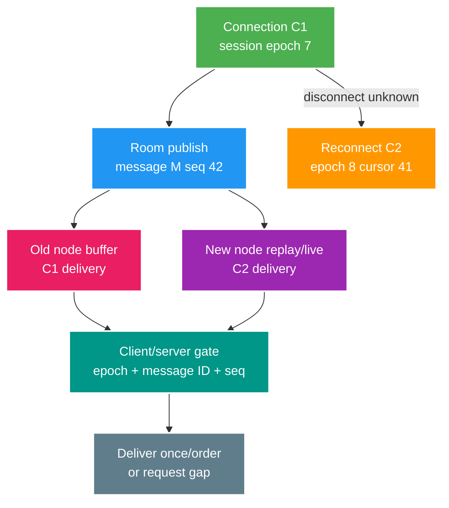

# Deep-dive: Fan-out phòng nóng, session epoch và phục hồi khoảng trống

> Type: `DEEP_DIVE` 
> Domain: `realtime` 
> Target depth: `D4 — chẩn đoán duplicate/out-of-order/revocation/reconnect qua nhiều gateway nodes` 
> Teaching readiness: `TEACHABLE_DRAFT` 
> Status: `DRAFT` 
> Evidence status: `NOT RUN` 
> Prerequisites: [Realtime core](../core/websocket-stomp-auth-reconnect-and-backpressure.md) 
> Related cases: `RT-01`; [question bank](../../question-bank/websocket-stomp-auth-reconnect-and-backpressure.md) 
> Owner: `Project learner; Codex teaches, learner writes back` 
> Updated: `2026-07-26`

## 1. Identity thay đổi thế nào khi reconnect?

Phải tách user ID, authenticated session ID/epoch, WebSocket connection ID và room subscription epoch. Reconnect tạo connection mới nhưng node cũ vẫn có thể phát frame còn trong buffer. Server/client cần từ chối frame hoặc command mang connection/session epoch cũ khi protocol hỗ trợ, đồng thời dùng message ID ổn định và room sequence để dedup/order.

Wall-clock timestamp không phân biệt chắc chắn clock giữa node và retry. Cần sequence authority theo room/shard cùng stable ID. Epoch phải do trusted owner cấp và validate, không cho client tự tăng.

## 2. Protocol xử lý gap và duplicate

Khi durable chat commit, hệ thống gán message ID và room sequence. Live fan-out có thể giao sequence 42 rồi 44, hoặc giao 42 hai lần. Client giữ cursor liên tục cao nhất cùng out-of-order buffer hữu hạn; duplicate nhỏ hơn hoặc bằng cursor bị bỏ; gap kích hoạt replay theo range. Nếu vượt buffer/time/retention, client tải lại state/history đầy đủ. Khi reset sequence phải gắn room generation mới.

Nếu nhiều writer cùng sinh room sequence, cần partition, single sequencer hoặc DB sequence và protocol failover. Broker partition giữ publish order trong phạm vi nó, nhưng retry, DLQ và nhiều đường giao vẫn tạo duplicate. Idempotency key phía client ngăn reconnect gửi cùng chat thành hai ID; server ánh xạ key tới outcome đã lưu.

Event ephemeral không replay nên gap được bỏ qua hoặc lấy latest state. Trộn ephemeral và durable dưới cùng sequence tạo false gap nếu semantics từng type không rõ.

## 3. Pathology A — ban đã commit nhưng connection cũ vẫn gửi được

User `CONNECT` ở epoch 7, sau đó ban commit tăng authorization epoch lên 8. Invalidation event bị trễ; node hiện tại còn cache 7 nên vẫn nhận `SEND`. Security lag tối đa bằng event lag cộng TTL/fallback policy. Với action rủi ro, `SEND` phải kiểm tra ban epoch hiện hành; event ngắt mọi connection; cache compare-version ngăn event unban cũ ghi đè. Redis outage cần fail policy rõ.

Authorize chỉ lúc handshake là chưa đủ. `SUBSCRIBE` có thể sống tiếp sau khi room chuyển private hoặc đổi owner; cần reauthorize theo event liên quan hoặc lease có giới hạn. Node registry giúp tìm connection theo user/room nhưng Redis set không trở thành nguồn quyền; index thiếu phải repair/revalidate.

Evidence incident gồm ban commit/version, publish/apply lag, node/cache/connection epoch, quyết định `SEND`, message commit và broadcast. Xử lý message trái quyền theo policy, ngắt connection, sửa invalidation và thêm test.

## 4. Fan-out tree và phòng có tải nóng

Một logical message nên serialize một lần trên mỗi node/room shard rồi local loop ghi tới connection. Broker liên node phân phối tới gateway shard đã subscribe. Hierarchical fan-out giảm serialize/network lặp nhưng thêm membership, routing và failure mode. Registry change có thể race với publish; durable cursor/replay bù connection bị bỏ lỡ tạm thời.

Với hot room, có thể chia subscriber shard cùng nhận một message, dựng tree node, fan-out theo region, batching hoặc compression; tải broadcast vẫn tỷ lệ với viewer. Tách sequencing của chat input khỏi distribution output. Presence count thường xấp xỉ bằng sharded counter, HLL hoặc heartbeat expiry, không transaction chính xác cho từng viewer.

Cô lập failure bằng queue room/node/session hữu hạn, quota, CPU/egress budget và đóng slow consumer. Một hot room không được chiếm toàn executor hoặc broker partition; cần bulkhead. Admission control cho connection/subscription mới; shed typing/presence trước durable chat và moderation.

## 5. Pathology B — reconnect storm sau khi mất node

Deploy hoặc mất zone đóng 30 nghìn connection; client retry cùng nhịp làm quá tải auth, Redis và database; timeout tạo thêm retry trong khi node mới còn lạnh. Control gồm drain/stagger, close code và retry hint, full jitter ở client, token bucket toàn cục/theo identity, cache key/session với owner fallback hữu hạn, lightweight resume, prewarm và ưu tiên operation cốt lõi. Queue connect chỉ được ngắn và hữu hạn.

Capacity test dùng open arrival theo connection/s và room skew thực tế, không spawn tất cả ở thời điểm 0. Đo connect success/latency/reject, auth dependency, subscription rate, FD/memory, outbound queue, replay rate/lag và time-to-recover. Phải có headroom khi mất một zone.

## 6. Tìm các boundary không giới hạn bị ẩn

Spring inbound/outbound executor, broker relay buffer, servlet/container/WebSocket session, per-session send buffer, application sink và client library đều có thể queue. Backpressure ở một tầng không điều khiển bridge bỏ qua demand. Inventory mọi queue: owner, max message/byte/age, overflow và metric. Compression có thể khuếch đại tấn công memory/CPU nên cần frame/message limit.

Chặn event-loop hoặc I/O writer bằng DB call làm socket không liên quan cũng stall; xác định qua thread dump, JFR và latency. Dùng worker/model hữu hạn, không dùng `CompletableFuture` hoặc executor vô hạn. Hủy fan-out work khi disconnect để tránh ghost load.

## 7. Security và abuse control

Với browser cần origin validation, TLS/proxy header đúng và tránh token trong query/log. Giới hạn size/duplicate STOMP header, allowlist destination, validate payload, rate limit theo user/IP/room/toàn cục và chống spoof. Broker/internal destination cần ACL. Moderation nội dung không thay thế authorization.

Attacker có thể ép subscription, cardinality, reconnect hoặc compressed frame lớn; phải giới hạn state và telemetry label. Close reason không làm lộ resource; moderation/admin action được audit riêng.

## 8. Kế hoạch fault và chẩn đoán

Inject response/frame drop, broker duplicate, reorder/gap, node cũ bị delay, ban event trễ hoặc Redis outage, slow socket, gateway kill/zone drain và reconnect burst. Ghi connection/session epoch, message ID/room sequence, cursor, broker publish/consume và durable store. Assert không có side effect trái quyền, memory hữu hạn, gap phục hồi và SLO đạt. Evidence hiện `NOT RUN`.

### 8.1. Walkthrough dựng lại một duplicate xuyên hai gateway

Triệu chứng: client hiển thị message sequence 42 hai lần sau reconnect. Timeline tối thiểu phải có thời điểm durable commit của message 42, broker publish, gateway G1/G2 consume, connection C1/C2, epoch và cursor do client gửi. Nếu chỉ có timestamp từ hai node, không thể phân biệt clock skew với duplicate; stable message ID và room sequence mới là evidence.

Một history hợp lệ có thể là: G1 đã buffer 42 cho C1; network đứt nhưng G1 chưa biết; client mở C2 ở G2 với cursor 41; G2 replay 42; sau đó frame cũ từ G1 vẫn tới. Broker không nhất thiết giao duplicate. Gate theo connection epoch loại frame của C1 hoặc client dedup theo message ID/sequence. Nếu client đã nhận 44 trước 42, bounded gap buffer giữ 44 trong thời gian ngắn và yêu cầu range replay; quá retention thì full refresh.

Khi fault test, cố tình delay frame ở G1, reconnect sang G2 và phát replay. Assert client chỉ materialize một bản 42, cursor cuối liên tục, buffer không vượt max byte/age và stale epoch bị reject. Lặp với ban epoch: commit ban ở owner, delay invalidation tới G1 rồi gửi `SEND`; high-risk check phải deny hoặc tài liệu phải chỉ rõ maximum lag đã chấp nhận. Raw result cần lưu version Spring/WebSocket/broker, close code, epoch/sequence log đã sanitize và final durable state; screenshot UI một mình chưa phải evidence.

## 9. Learner/self-check

> **Bài viết của tôi — `LEARNER TODO`:** explain duplicate seq42 across C1/C2 and ban epoch race.

1. **Question:** Duplicate/out-of-order diagnose bằng gì? 
   **Đọc lại nếu bí:** mục 1–2. 
   **Một câu trả lời tốt phải có:** connection/session epoch, stable ID/room sequence, broker/store/cursor, gap replay—not clock. 
   **My answer:** `LEARNER TODO`
2. **Question:** Ban after connect enforced? 
   **Đọc lại nếu bí:** mục 3. 
   **Một câu trả lời tốt phải có:** owner version, message-time/subscribe check, event disconnect/cache bounded, outage and evidence. 
   **My answer:** `LEARNER TODO`
3. **Question:** Hot room isolated thế nào? 
   **Đọc lại nếu bí:** mục 4–6. 
   **Một câu trả lời tốt phải có:** shard/tree/local fanout, bounded queues/bulkheads, slow/drop semantics, admission/capacity/replay. 
   **My answer:** `LEARNER TODO`

## 10. Tài liệu tham khảo và teach-back

- [Spring Framework — WebSocket/STOMP](https://docs.spring.io/spring-framework/reference/web/websocket.html)
- [RFC 6455 — Closing Handshake](https://www.rfc-editor.org/rfc/rfc6455#section-7)

- [ ] Tôi xác định đúng epoch/sequence authority.
- [ ] Tôi phục hồi gap và thu hồi live permission.
- [ ] Tôi giới hạn mọi queue dưới hot-room/reconnect fault.
- [ ] Evidence vẫn `NOT RUN`.
