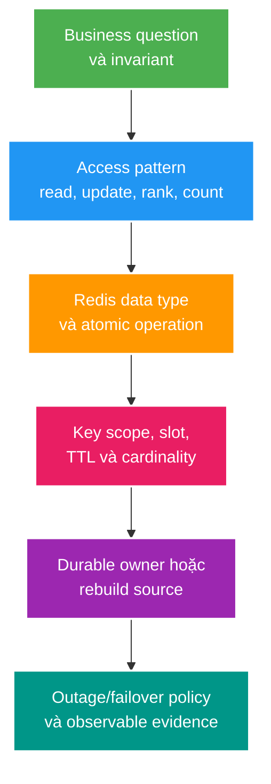

# Cấu trúc dữ liệu nguyên tử trong Redis, rate limiting và leaderboard

> Type: `CORE`<br>
> Domain: `redis`<br>
> Target depth: `D3 — chọn data structure theo access pattern, compose atomic operation và kiểm chứng rate/viewer/leaderboard semantics dưới concurrency/failover`<br>
> Teaching readiness: `TEACHABLE_DRAFT`<br>
> Status: `DRAFT`<br>
> Evidence status: `NOT RUN`<br>
> Prerequisites: command/key/TTL cơ bản và [cache consistency core](cache-consistency-stampede-and-outage.md)<br>
> Related cases: roadmap owner `RED-01`; [question bank](../../question-bank/atomic-data-structures-rate-limiting-and-leaderboards.md)<br>
> Owner: `Project learner; Codex teaches, learner writes back`<br>
> Version boundary: project dùng `redis:alpine` chưa pin; exact Redis server/client/topology phải được capture khi case active<br>
> Updated: `2026-07-26`

## 0. Cách dùng tài liệu này

Redis không chỉ là key-value String store. Mỗi data type cung cấp một tập operations và complexity/failure semantics khác nhau. Đọc bài theo ba lớp: chọn structure từ access pattern; giữ nhiều bước atomic đúng phạm vi; đặt structure vào lifecycle/topology nơi nó có thể mất, lag hoặc thành hot key.

Sau khi đọc, bạn phải thiết kế được ba bài toán: rate limiter có burst/fairness contract, current/unique viewers có meaning rõ, và leaderboard real-time có durable rebuild source. Đây chưa phải implementation `RED-01`; script, latency, memory và failover evidence đều `NOT RUN`.

## 1. Vì sao topic này tồn tại?

Nếu serialize mọi thứ thành JSON String, application phải read-modify-write cả blob và dễ lost update. Nếu dùng HLL để đếm “đang xem”, số sẽ không giảm khi viewer rời. Nếu dùng ZSET như ledger durable, restart/failover/eviction có thể làm mất rank không rebuild được. Nếu `INCR` và `EXPIRE` là hai round trips, crash giữa chúng để lại key không TTL. Lua sửa race nhưng long script block Redis shard và multi-key script trong Cluster phải tuân slot.

Điểm mạnh Redis là server thực hiện operation gần dữ liệu với semantics chuyên biệt. Điểm yếu là một key/shard có finite CPU/memory/network, replication/failover không mặc định linearizable, và dữ liệu ephemeral cần owner/rebuild policy. Senior phải bảo vệ business meaning, không chỉ biết command name.

## 2. Mục tiêu học

Sau bài này, bạn có thể:

1. Chọn String, Hash, Set, Sorted Set, List, Stream, Bitmap và HyperLogLog từ operations/cardinality/lifecycle.
2. Phân biệt single-command atomicity, pipeline, `MULTI/EXEC`, `WATCH` và Lua/Functions.
3. So sánh fixed window, sliding log/counter và token bucket theo burst, fairness, precision và memory.
4. Thiết kế ZSET heartbeat cho current viewers, HLL cho approximate unique reach và ZSET leaderboard có tie/rebuild contract.
5. Chẩn đoán hot/large key, rolling serialization change và cluster slot/topology boundary.
6. Giải thích replication/failover có thể làm mất recent ephemeral coordination state và invariant nào cần durable owner/fencing.

## 3. Từ vựng và cấu trúc dữ liệu

**String** giữ bytes/scalar, dùng cho cached JSON, counter, bitmap-compatible value hoặc lease token. Atomic `INCR` tránh client-side read-modify-write, nhưng lifecycle/overflow/key scope vẫn cần rule.

**Hash** lưu fields dưới một key, phù hợp object nhỏ cần read/update từng field. TTL thường áp dụng ở key level trên baseline phổ biến; exact field-expiration features phụ thuộc Redis version nên không giả định khi image chưa pin.

**Set** giữ members unique, hỗ trợ membership và set algebra. Nó có thể liệt kê members nên memory tỷ lệ cardinality. **Sorted Set (ZSET)** giữ member unique với floating-point score, hỗ trợ rank/range; update cùng member thay score. Ties có deterministic ordering theo member ở command semantics liên quan, nhưng product tie-breaking phải explicit và không nên nhét nhiều đại lượng vào float mà không phân tích precision.

**List** là sequence hai đầu, phù hợp queue/stack đơn giản; nó không thay durable broker có ACK/retry/DLQ contract. **Stream** là append-only log có IDs và consumer groups trong Redis; mạnh hơn List cho event processing nhưng retention/persistence/failover/ownership khác Kafka/RabbitMQ và vẫn cần idempotent consumer.

**Bitmap** biểu diễn flags theo bit offset, hiệu quả khi identity map được tới bounded dense integers. **HyperLogLog (HLL)** ước lượng cardinality với memory bounded; không lưu danh sách có thể enumerate và có sai số. Nó trả lời “xấp xỉ bao nhiêu unique identities đã thấy”, không trả lời “ai đang active”.

**Hot key** nhận tỷ lệ lớn operations/bytes trên một shard. **Large key** có nhiều members/bytes làm command, transfer, delete, persistence hoặc failover đắt. Một key vừa có thể hot vừa large nhưng hai vấn đề cần signal khác nhau.

## 4. Mô hình tư duy cốt lõi



Ví dụ câu hỏi “bao nhiêu người đang xem stream 42?” dẫn tới access pattern heartbeat + remove/expire by time, ZSET `score=lastSeen`, key per stream, cleanup window và bounded cardinality. “Bao nhiêu user unique từng xem?” dẫn tới HLL. Hai con số không thể dùng thay nhau dù cùng gọi là viewer count.

Câu cần nhớ: **data type chỉ đúng khi operation, lifecycle, topology và rebuild source cùng khớp business meaning**.

## 5. Atomicity: command, pipeline, transaction và script

Redis xử lý một command trên server theo atomic command semantics: client khác không thấy nửa chừng của command. Điều này không làm chuỗi `GET` rồi tính ở client rồi `SET` atomic. Hai clients có thể đọc cùng old value và ghi đè nhau.

**Pipeline** gửi nhiều commands không chờ từng response, giảm network round-trip. Nó là batching/throughput tool, không tạo isolation cho cả nhóm.

**`MULTI/EXEC`** queue commands rồi thực thi tuần tự khi `EXEC`; client khác không chen command giữa transaction block. Redis transaction không rollback kiểu relational database khi một command runtime error: các command hợp lệ khác có thể đã chạy. **`WATCH`** cung cấp optimistic check: nếu watched key đổi trước `EXEC`, transaction abort để client retry. Retry budget/backoff và high contention vẫn cần xử lý.

**Lua script** hoặc Redis Functions chạy server-side và có thể đọc/ghi nhiều keys atomically trong execution, loại network interleaving. Nhưng script chạy lâu block progress trên shard/event loop, phải deterministic theo allowed APIs và không gọi database/network bên ngoài. Trên Redis Cluster, keys của multi-key operation/script thường phải cùng hash slot; hash tag `{streamId}` giúp colocate nhưng có thể tạo hotspot nếu lạm dụng.

Chọn đơn giản nhất: một built-in atomic command trước; optimistic transaction khi composition nhỏ và conflicts hiếm; Lua/Function cho atomic state transition có bounded work. Không dùng script để loop unbounded members hoặc thay business transaction ở PostgreSQL.

## 6. Các thuật toán giới hạn tần suất

### 6.1. Fixed window

Key theo subject+operation+window, `INCR`, đặt expiry trong cùng atomic operation. Ưu điểm: đơn giản, memory bounded theo active subjects. Nhược điểm: request có thể burst gần gấp đôi limit quanh boundary — 100 requests cuối giây 59 và 100 đầu giây 60.

`INCR` rồi `EXPIRE` hai commands riêng có crash/race window. Lua có thể increment và chỉ set TTL khi key mới, trả allowed/remaining/reset. Key identity phải chống cardinality attack: authenticated user/API key/IP scope, normalized operation và bounded lifetime.

### 6.2. Sliding log và sliding counter

Sliding log dùng ZSET timestamp/request ID: remove old, add current, count range, expire key — atomically. Nó chính xác hơn nhưng memory/CPU tăng theo requests và cleanup. Timestamp trùng cần unique member. Sliding counter dùng buckets và weighted approximation, giảm cost nhưng boundary/precision cần product chấp nhận.

### 6.3. Token bucket

State gồm tokens còn lại và last-refill time. Mỗi request tính tokens mới theo elapsed×rate, cap ở capacity, trừ cost nếu đủ rồi lưu state/TTL. Capacity cho burst; refill rate kiểm soát average. Atomic script cần validate negative/overflow, dùng time source có contract, return retry/reset information và không tin client timestamp nếu abuse-relevant.

Distributed rate limiter luôn có outage policy. Fail-open tăng availability nhưng attacker có window; fail-closed có thể chặn legitimate traffic. Có thể local emergency limiter + bounded central failure policy, nhưng global limit sẽ approximate. Security/cost-critical operation cần stakeholder chấp nhận explicit semantics.

## 7. Ví dụ phân tích từng bước

### 7.1. Fixed-window limiter nguyên tử

Conceptual script:

```lua
local current = redis.call('INCR', KEYS[1])
if current == 1 then
  redis.call('PEXPIRE', KEYS[1], ARGV[1])
end
return {current <= tonumber(ARGV[2]), current}
```

Script minh họa update+expiry không bị client interleaving. Production script còn phải validate `ARGV`, define reset/remaining, bound key namespace, handle cluster slot và test first-hit/last-hit/over-limit/expiry/concurrency. Đây chưa phải code project và chưa benchmark.

### 7.2. Đếm người xem hiện tại bằng ZSET heartbeat

Key `stream:{42}:viewers:v1`; member là stable viewer/session identity; score là server-observed lastSeen milliseconds. Heartbeat dùng `ZADD`; query current count remove/read members có score cũ hơn `now-activeWindow`, rồi `ZCOUNT` active range. Cleanup và count cần atomic/bounded sequence nếu exact same instant matters. Key có TTL sau stream end/crash safety; hot stream có write amplification nên heartbeat interval, batching/sampling và shard strategy cần capacity test.

Nếu disconnect event bị mất, viewer tự biến mất khi heartbeat cũ qua window. Đổi lại count luôn trễ khoảng window và network jitter có thể tạo false leave/rejoin. Product phải gọi đây là estimated current viewers, không tuyệt đối exact.

### 7.3. Đếm gần đúng người xem duy nhất bằng HLL

`PFADD stream:{42}:unique:v1 viewerIdentity`; `PFCOUNT` trả approximate cardinality. Memory không tăng tuyến tính như Set ở cùng mức, phù hợp unique reach lớn. Không thể lấy danh sách viewers, xóa một member hoặc dùng nó làm billing/audit exact. HLL có thể merge các buckets/partitions theo command semantics; identity privacy/retention vẫn cần policy.

### 7.4. Leaderboard bằng ZSET

`ZINCRBY event:{eventId}:leaderboard:v1 amount creatorId` cập nhật real-time score. Read top N qua reverse range with scores. PostgreSQL ledger/event log vẫn là durable owner; Redis leaderboard là projection có thể rebuild. Ties cần product contract: equal score thì displayed ordering theo secondary data/query/application, không tuyên bố business rank chỉ từ incidental lexicographic member order.

Rebuild cần snapshot/watermark hoặc idempotent event replay để không double count. Trong rebuild, dùng versioned new key, validate totals/sample ranks, atomic pointer/switch rồi để old key expire; không `FLUSHALL`.

### 7.5. Phản ví dụ distributed lock

Worker A acquire `SET lock tokenA NX PX 5000`, pause 8 giây; lease expire. Worker B acquire tokenB và xử lý. A tỉnh lại và vẫn ghi downstream. Compare-and-delete bảo đảm A không xóa lock của B, nhưng không ngăn stale A side effect. Correctness-critical resource cần fencing token monotonic mà downstream reject token cũ, hoặc durable DB version/constraint. Redis lease chủ yếu điều phối; nó không tự sở hữu invariant.

## 8. Invariant và ranh giới

1. Rate-limit update và expiry thuộc cùng atomic transition; không có immortal key do partial sequence.
2. Current viewer và unique viewer có definitions khác; dashboard/API phải gọi đúng metric.
3. Leaderboard mất Redis vẫn rebuild được từ durable source với deterministic rule.
4. Mọi unbounded member structure có cardinality cap, retention/cleanup và large-key policy.
5. Multi-key atomic operation xác định cluster slot/co-location; topology change không được âm thầm phá semantics.
6. Redis lease expiration không chứng minh old owner đã dừng; downstream invariant cần version/fencing khi critical.
7. Failover có thể mất recent async-replicated state; rate/lock behavior trong window phải explicit.

Boundary persistence: RDB snapshot/AOF thay đổi recovery window và latency/ops cost, nhưng không biến Redis thành PostgreSQL ledger. Boundary replication: primary acknowledgement có thể đi trước replica nhận write; promotion có thể mất key/token/counter gần nhất. Boundary eviction: key có TTL vẫn có thể bị evict theo maxmemory policy. Boundary clock: rate/heartbeat phụ thuộc time semantics và skew; test phải kiểm soát time source.

## 9. Các kiểu hỏng theo chuỗi nguyên nhân

### 9.1. Hot ZSET trên celebrity stream

Heartbeat frequency × 100.000 viewers dồn vào một key/slot → event-loop CPU/network và memory churn tăng → latency của unrelated keys cùng shard tăng → clients timeout/retry → load tăng thêm. Chứng minh bằng per-command latency, ops/bytes, key cardinality/memory và shard CPU, không chỉ aggregate Redis CPU. Options: giảm heartbeat, batch/sample, bucket ZSET rồi merge approximate count, separate workload/cluster hoặc redesign protocol. Sharding mất single-key exact count/rank và tăng merge cost.

### 9.2. Large delete/blocking operation

Xóa/scan toàn large Set/ZSET bằng command không phù hợp → server giữ CPU lâu/free memory cost → latency spike. Dùng bounded `SCAN`/incremental cleanup, `UNLINK` khi semantics/version phù hợp và key-size guard; exact behavior phải re-check runtime. Không chạy `KEYS *` hoặc `FLUSHALL`.

### 9.3. Serializer/key rollout

New deployment thay JSON/schema/score meaning trong cùng namespace → old/new instances đọc sai hoặc overwrite → fallback/rebuild storm. Dùng versioned key/payload, compatible reader hoặc dual-read có deadline. Với derived projection, rebuild new namespace thường đơn giản hơn mutate in-place. Metrics cần phân biệt v1/v2 fallback mà không gắn raw key/user gây cardinality leak.

### 9.4. Failover mất limiter/lock state

Primary ACK increment/lease nhưng replica chưa nhận → primary fail → replica promote không có state → request vượt limit hoặc second owner acquire. `WAIT` có thể tăng xác suất replicas acknowledge nhưng không tự tạo strict durable/linearizable guarantee qua mọi partition/failover. Mitigation dựa risk: accept bounded window, fail closed, local secondary guard, durable owner/fencing và fault-injection quantification.

## 10. Các mẫu giải pháp và đánh đổi

Set exact/listable nhưng memory tuyến tính; HLL memory bounded nhưng approximate/non-listable. ZSET cho ordering/time range nhưng hot-key cost. Lua cho atomic composition nhưng tăng server blocking/debug/version governance. Client pipeline tăng throughput nhưng không correctness. Redis Cluster tăng aggregate capacity nhưng một key vẫn một slot; bucketing tăng capacity nhưng mất simple global atomicity.

Persistence/replica tăng recoverability nhưng tăng I/O/latency/ops và vẫn phải define RPO. Separate Redis deployments cho cache, security coordination và rate state tăng cost nhưng tạo resource/failure isolation. Một shared instance đơn giản lúc nhỏ nhưng expiry storm hoặc hot key có thể ảnh hưởng mọi feature.

## 11. Áp dụng vào dự án và thí nghiệm

Khi `RED-01` active, đối chiếu [Redis key catalog](../../../../../engineering/redis-guide.md): current code đang dùng HLL `stream:{streamId}:viewers` nhưng guide đã ghi nó là unique reach, không phải concurrent count. Candidate lab nên:

- capture exact server image digest/version, Lettuce/Spring Data version, standalone/cluster/persistence/eviction config;
- viết contract cho HLL unique và candidate ZSET heartbeat current viewers;
- viết atomic rate-limit script/tests trên disposable Redis;
- test 1/100/100.000 logical viewers với representative heartbeat distribution, không bịa capacity;
- đo command latency distribution, ops/bytes, key memory/cardinality, cleanup cost và unrelated-key latency;
- inject timeout/restart/failover theo topology thật, xác minh policy/rebuild;
- giữ PostgreSQL/event log là owner cho durable leaderboard/gift effects.

## 12. Góc nhìn phỏng vấn

### 12.1. Câu trả lời 30 giây

“Tôi chọn Redis type theo operation: Set cho exact membership, ZSET cho score/time range, HLL cho approximate unique. Một command atomic; pipeline chỉ giảm RTT; MULTI không rollback như DB; Lua compose bounded atomic transition nhưng có thể block shard. Rate limiter cần atomic update+TTL và outage policy. Viewer/leaderboard phải có meaning, cardinality và durable rebuild source.”

### 12.2. Câu trả lời Senior khoảng 2 phút

Lấy một bài toán: current viewers dùng ZSET heartbeat, giải thích lastSeen window/cleanup/TTL và vì sao HLL chỉ unique reach. Nêu hot-key feedback, evidence và bucketing trade-off. Sau đó rate limiter: chọn token bucket/fixed/sliding theo burst/fairness, script atomic, bound key cardinality, define 429/reset và fail-open/closed. Kết thúc bằng failover: async replication có thể mất recent limiter/lease, critical invariant dùng durable version/fencing và fault test.

### 12.3. Follow-up

- Pipeline khác transaction thế nào? Đọc mục 5.
- `MULTI/EXEC` có rollback không? Đọc mục 5.
- HLL có liệt kê/xóa user không? Đọc mục 3 và 7.3.
- Thêm Redis Cluster có chữa một hot key không? Đọc mục 9.1 và 10.
- Redlock/lease có bảo vệ money invariant không? Đọc mục 7.5 và 8.

## 13. Tóm tắt cô đọng

- Chọn data type từ business question và access pattern.
- Built-in command atomic không làm client sequence atomic.
- Pipeline tối ưu network; transaction/script giải quyết vấn đề khác nhau.
- Lua phải bounded; long script làm chậm cả shard.
- Fixed/sliding/token bucket khác burst, precision, memory và fairness.
- HLL đo approximate unique; ZSET heartbeat đo active window.
- ZSET leaderboard là projection, không phải ledger.
- Một hot key không tự được chia bởi thêm cluster nodes.
- Lease TTL bảo vệ liveness, không ngăn stale holder; fencing bảo vệ downstream order.
- Failover/outage semantics và rebuild source là một phần data structure design.

## 14. Bài tập diễn đạt lại — phần của tôi

1. Bối cảnh: chọn một use case viewer/rate/leaderboard.
2. Mental model: business question → access pattern → type → key/lifecycle → owner/failure.
3. Mechanism: kể atomic transition và time/cardinality rule.
4. Failure: hot key, failover loss hoặc stale lease gây gì?
5. Decision: alternative nào bị loại và vì sao?

> **Bài viết của tôi — `LEARNER TODO`:** viết 12–18 câu cho một use case, rồi trình bày lại không nhìn tài liệu.

## 15. Tự kiểm tra có hướng dẫn

1. **Question:** Pipeline, MULTI/EXEC, WATCH và Lua khác nhau về mục tiêu/atomicity thế nào?<br>
   **Đọc lại nếu bí:** mục 5.<br>
   **Một câu trả lời tốt phải có:** RTT batching, queued isolation/no DB rollback, optimistic abort/retry, server-side bounded script và cluster slot.<br>
   **My answer:** `LEARNER TODO`
2. **Question:** Chọn algorithm rate limit cho API cho phép burst nhỏ nhưng giới hạn average ra sao?<br>
   **Đọc lại nếu bí:** mục 6.<br>
   **Một câu trả lời tốt phải có:** token bucket capacity/refill, identity/key/TTL, atomicity, response contract, outage policy và memory abuse.<br>
   **My answer:** `LEARNER TODO`
3. **Question:** HLL và ZSET viewer heartbeat khác nhau thế nào?<br>
   **Đọc lại nếu bí:** mục 3, 7.2–7.3.<br>
   **Một câu trả lời tốt phải có:** approximate total unique vs time-aware membership, enumerate/delete, memory/write/cleanup và product naming.<br>
   **My answer:** `LEARNER TODO`
4. **Question:** Redis failover có thể phá lock/rate state thế nào và bạn chứng minh ra sao?<br>
   **Đọc lại nếu bí:** mục 7.5, 8 và 9.4.<br>
   **Một câu trả lời tốt phải có:** async replication/promotion window, stale owner/duplicate acquire, fencing/durable invariant, explicit fail-open/closed và injected evidence.<br>
   **My answer:** `LEARNER TODO`

## 16. Nguồn chính thức

- [Redis — Data types](https://redis.io/docs/latest/develop/data-types/)
- [Redis — Transactions](https://redis.io/docs/latest/develop/using-commands/transactions/)
- [Redis — Pipelining](https://redis.io/docs/latest/develop/using-commands/pipelining/)
- [Redis — Scripting with Lua](https://redis.io/docs/latest/develop/programmability/eval-intro/)
- [Redis — Replication](https://redis.io/docs/latest/operate/oss_and_stack/management/replication/)
- [Redis — Persistence](https://redis.io/docs/latest/operate/oss_and_stack/management/persistence/)

Exact command/features/topology behavior phải re-check theo runtime captured vì project chưa pin Redis image.

## 17. Checklist trình bày lại

- [ ] Tôi chọn structure từ operations/cardinality chứ không từ thói quen.
- [ ] Tôi phân biệt command atomicity, pipeline, MULTI/WATCH và Lua.
- [ ] Tôi thiết kế rate limiter gồm outage/abuse policy.
- [ ] Tôi không gọi HLL là current viewer count.
- [ ] Tôi giải thích hot key và cluster-slot boundary.
- [ ] Tôi bảo vệ critical invariant bằng durable owner/fencing thay vì chỉ lease.
- [ ] Tôi biết mọi benchmark/failover evidence vẫn `NOT RUN`.
