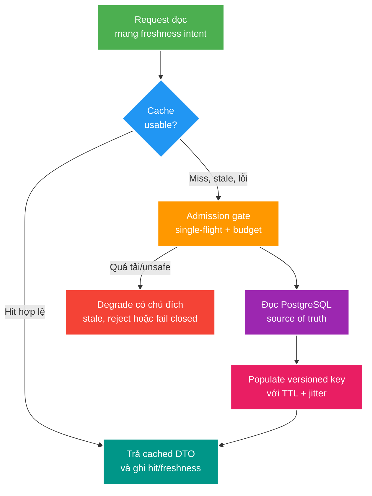

# Redis Cache Consistency, Stampede và Outage

> Type: `CORE` 
> Domain: `redis` 
> Target depth: `D3 — thiết kế cache có source of truth, tái hiện race/stampede/outage và chứng minh degraded mode bằng evidence` 
> Teaching readiness: `TEACHABLE_DRAFT` 
> Status: `DRAFT` 
> Evidence status: `NOT RUN` 
> Prerequisites: transaction/after-commit, latency/timeout cơ bản và [project Redis guide](../../../../../engineering/redis-guide.md) 
> Related cases: roadmap owner `RED-01`, tái sử dụng boundary từ `TX-01` và `SEC-02`; [question bank](../../question-bank/cache-consistency-stampede-and-outage.md) 
> Owner: `Project learner; Codex teaches, learner writes back` 
> Version boundary: project dùng `redis:alpine` chưa pin; phải capture exact server/client version khi case active 
> Updated: `2026-07-26`

## 0. Cách dùng tài liệu này

Tài liệu dành cho developer đã biết `GET`/`SET` nhưng chưa có mental model về cache consistency. Đọc theo thứ tự: source of truth → read/write lifecycle → race → stampede → outage/recovery. Sau mỗi worked example, tự vẽ timeline reader/writer và chỉ ra state nào là durable, derived, stale hoặc unknown.

Đây là preview theory cho Stage 4, không active `RED-01`. Project chưa có stampede/outage experiment và exact Redis version chưa được pin, vì vậy mọi số liệu, timeout, TTL hay capacity threshold đều `NOT RUN`, không được lấy các con số minh họa thành production recommendation.

## 1. Vì sao topic này tồn tại?

Cache giảm latency và origin load bằng cách giữ bản sao gần nơi đọc. Chính chữ “bản sao” tạo vấn đề: PostgreSQL có thể đã chứa title mới nhưng Redis còn title cũ; nhiều request cùng miss có thể đồng loạt đánh PostgreSQL; Redis down có thể biến endpoint vốn chịu 10.000 requests/s thành 10.000 database queries/s. Cache thường không phá khi mọi thứ bình thường mà phá trong transition: commit, expiry, deploy, failover và recovery.

Senior không bắt đầu bằng “TTL bao nhiêu?”. Họ bắt đầu bằng bốn câu hỏi:

1. State nào là source of truth và invariant nào tuyệt đối không được giao cho cache?
2. Ai đọc, ai ghi, ai invalidate và cache entry có lifecycle nào?
3. Khi cache sai/chậm/mất, request được phép stale, fallback, reject hay fail closed?
4. Signal nào chứng minh cache giúp hệ thống thay vì chỉ chuyển failure sang database?

Cache không biến một database query xấu thành data model đúng, không làm DB+Redis atomic và không thay authorization source of truth. Nó là optimization/derived state có failure policy.

## 2. Learning objectives

Sau bài này, bạn có thể:

1. Phân biệt cache-aside, read-through, write-through và write-behind bằng ownership/failure window.
2. Thiết kế key/value/TTL/version/invalidation/rebuild contract.
3. Kể chính xác race stale repopulation dù invalidation diễn ra after commit.
4. Phân biệt penetration, hot-key breakdown và stampede; chọn single-flight, jitter hoặc stale-while-revalidate có điều kiện.
5. Thiết kế degraded mode không khiến PostgreSQL sập dây chuyền và không fail-open security invariant.
6. Đặt metrics cho freshness, origin load, loader concurrency, timeout, eviction và recovery.

## 3. Từ vựng tối thiểu

**Source of truth** là owner durable dùng để quyết định correctness và rebuild. Trong project, PostgreSQL sở hữu durable session/business state; Redis là derived/ephemeral state.

**Cache-aside** để application tự `GET`; miss thì load origin rồi `SET`; mutation thường commit origin rồi invalidate. **Read-through** để cache abstraction gọi loader. **Write-through** ghi cache và store đồng bộ qua abstraction. **Write-behind** nhận write ở cache rồi flush origin bất đồng bộ, tăng availability/throughput nhưng có data-loss/order/recovery problem. Tên pattern không tự nói strong consistency; phải xem atomic boundary thật.

**TTL** là thời gian key còn sống. Nó giới hạn lifetime và có thể bound staleness/memory, nhưng trước expiry entry vẫn có thể stale. **Jitter** thêm phân bố ngẫu nhiên có kiểm soát để nhiều keys không expire cùng lúc.

**Cache penetration** là request lặp cho identity không tồn tại xuyên cache xuống origin. **Breakdown** thường chỉ một hot key vừa mất/expire. **Stampede** là nhiều concurrent request cùng rebuild một hoặc nhiều keys. **Cold-start/flush storm** là stampede diện rộng sau deploy, flush hoặc outage recovery.

**Single-flight** gom concurrent loads cùng key để một loader chạy, các request khác chờ/chia sẻ result. Local single-flight chỉ gom trong một process; multi-instance cần coordination khác hoặc vẫn chấp nhận một loader mỗi instance.

**Stale-while-revalidate (SWR)** cho phép phục vụ value cũ trong bounded window trong khi một worker refresh. SWR phù hợp title/public metadata hơn balance, revocation hoặc authorization decision.

## 4. Mental model cốt lõi

Flow không nói mọi miss đều được fallback. `Admission gate` bảo vệ origin bằng timeout ngắn, loader concurrency/rate budget, circuit state và request priority. `freshness intent` phân biệt public metadata có thể stale với revoked session phải fail closed hoặc kiểm tra durable state. Câu cần nhớ: **cache hit là một bản sao tiện dụng; quyền fallback và stale phải do business semantics quyết định**.

## 5. Cơ chế từng bước

### 5.1. Read path

Application tạo key từ namespace, version và stable identity, ví dụ `stream:v2:{streamId}:summary`. Typed cached DTO tách khỏi JPA entity để schema/serialization rõ. `GET` có deadline nhỏ hơn request budget. Hit phải validate format/version và, với state nhạy cảm, có thể cần durable version/revocation rule. Miss đi qua loader admission, đọc PostgreSQL, map DTO rồi populate với TTL/jitter. Empty result chỉ negative-cache khi identity space bị bound và stale-not-found có thể chấp nhận.

### 5.2. Write và invalidation

Mutation commit PostgreSQL trước. Invalidate trước commit tạo window rollback nhưng cache đã mất hoặc writer khác repopulate. Invalidate after commit tránh publish state chưa durable, nhưng không loại mọi race và có crash gap commit→invalidate. Nếu invalidation không được mất, ghi outbox/change event cùng DB transaction rồi consumer idempotent xóa/update cache; TTL vẫn là safety bound, không thay durable delivery.

Update-cache thay delete có vẻ giảm miss nhưng writer có thể không biết toàn read-model fields, concurrent writers reorder và cache write có thể thành owner ngoài ý muốn. Delete-on-write + load-on-read đơn giản hơn, song cần chống stale repopulation và stampede.

### 5.3. Stampede control

TTL jitter phân tán expiry nhưng không gom requests cho cùng hot key. Single-flight gom loader nhưng cần deadline và cleanup khi loader fail. Distributed lease giảm loaders xuyên nodes, nhưng lock holder chết/expire và waiters cần fallback; cache correctness không nên phụ thuộc lease duy nhất. SWR giữ origin sống khi refresh chậm nhưng đòi value có soft-expiry/hard-expiry, chỉ một refresher và metric stale age.

Prewarm chỉ dùng cho bounded hot set biết trước; full scan/warm tạo chính storm cần tránh. Admission control quyết định tối đa loaders vào PostgreSQL; khi đầy, reject/degrade thay vì queue vô hạn giữ connection/thread.

### 5.4. Outage và recovery

Redis timeout phải nhanh; retry nhiều lần trong request thường khuếch đại outage. Circuit breaker ngừng gọi dependency đang fail nhưng không tự bảo vệ DB fallback. Cần bulkhead/semaphore/rate limit cho origin loads, load shedding theo priority, bounded stale/local cache nếu semantics cho phép và explicit response khi không thể bảo đảm invariant.

Khi Redis trở lại, đóng circuit dần, tránh mọi process cùng warm. Ramp loader budget, ưu tiên hot keys theo traffic thật, giữ jitter, quan sát database pool/latency và cache error/eviction. Recovery kết thúc khi origin load, hit/miss và stale age ổn định, không chỉ khi `PING` thành công.

## 6. Worked examples

### 6.1. Cache-aside tối thiểu

Luồng đọc stream summary:

1. `GET stream:v2:42:summary` miss.
2. Single-flight cho key 42 được claim.
3. Query PostgreSQL trả title/status/version.
4. Map sang `StreamSummaryCacheDTO`, `SET` với TTL + bounded jitter.
5. Concurrent waiters nhận cùng result.

Nếu DB trả not-found, negative entry cần TTL ngắn và namespace chỉ nhận UUID/ID đã validate. Nếu attacker gửi vô hạn random strings, negative cache mỗi string biến penetration thành memory attack; request validation/rate limit vẫn cần.

### 6.2. Race stale repopulation sau commit

Ban đầu DB/cache đều title `A`.

1. Reader R miss cache và bắt đầu query DB, nhìn snapshot title `A`.
2. Writer W update title `B`, commit, rồi delete cache.
3. R hoàn tất và `SET A` sau lệnh delete.
4. Các reader sau thấy `A` tới TTL dù invalidation “đúng after commit”.

Mitigation có nhiều mức: cache value mang DB version và conditional-populate không ghi đè version mới; invalidation event/version watermark; single-flight/fencing quanh loader; delayed second delete như heuristic có residual window; TTL bound. Chọn theo freshness SLO và complexity. Evidence cần synchronized interleaving, không chỉ load test ngẫu nhiên.

### 6.3. Redis outage trên live-status endpoint

Sai: catch mọi Redis exception rồi query PostgreSQL không giới hạn. Khi 5.000 requests cùng timeout, chúng giữ threads/connections rồi đổ xuống DB, pool đầy, cả write APIs fail. Thiết kế tốt hơn: Redis deadline ngắn; breaker; tối đa N concurrent DB fallbacks; request vượt budget nhận stale local value nếu safe hoặc explicit degraded response; write/security paths có policy riêng. Đo database QPS/pool wait và fallback rejected, không chỉ cache error count.

### 6.4. Phản ví dụ session cache fail-open

Redis chứa session `ACTIVE`, PostgreSQL đã revoke. Nếu auth chỉ tin cache hit đến TTL thì revoked token còn dùng được. Đây không chỉ là stale UX mà là security violation. Có thể dùng short-lived positive cache gắn durable session version/revocation epoch, invalidation durable, hoặc kiểm tra PostgreSQL trên operation nhạy cảm. Khi Redis down, policy không được mặc định “cho qua để availability cao”.

## 7. Invariants và boundaries

1. Redis mất sạch vẫn không làm mất durable business state; rebuild source và procedure phải tồn tại.
2. Mỗi key có namespace/version/type/TTL/cardinality/reader/writer/invalidation owner/outage policy.
3. Cache failure không được tạo unbounded fallback load lên source of truth.
4. Security/money invariant không được quyết định chỉ từ potentially stale cache nếu chưa có bounded proof.
5. Value serialization phải tương thích mixed-version deployment hoặc đổi namespace; không cache JPA entity mặc định.
6. Không có DB transaction nào atomic với Redis command; mọi cross-boundary claim cần crash/reorder analysis.

Boundary multi-node: local single-flight không gom loaders ở nodes khác. Boundary multi-region: invalidation/event có lag/order/failover và RYW requirement. Boundary eviction: TTL chưa tới vẫn có thể mất key vì memory policy/restart; code phải coi miss là bình thường.

## 8. Khái niệm dễ nhầm

TTL là lifecycle bound, không phải invalidation guarantee. Hit ratio cao không chứng minh freshness hoặc cost saving: 99% hits cho query rẻ có thể không đáng operational complexity; 80% hits cho query rất đắt có thể cực kỳ giá trị. Redis availability cũng không đồng nghĩa data correctness sau failover vì async replication/persistence policy có thể mất recent writes.

Distributed lock không phải stampede solution bắt buộc. Nó thêm lease/ownership/failover modes; đôi khi local single-flight + origin budget đủ. Nếu lock bảo vệ durable invariant, database constraint/version/fencing owner vẫn phải tồn tại.

## 9. Failure modes theo causal chain

**Expiry wave:** cùng TTL → hàng nghìn keys expire cùng giây → miss/loaders tăng → DB pool wait/latency tăng → request timeout/retry → thêm load. Chứng minh bằng expiry histogram, loader concurrency, DB QPS/pool và synchronized fixture. Xử lý bằng jitter, single-flight, loader budget, stale serve và controlled warmup.

**Serializer rollout:** deploy mới ghi payload mới vào cùng key → old instances deserialize fail hoặc hiểu sai → cache errors/fallback tăng → DB overload. Chứng minh bằng cross-version round-trip test và error labels. Xử lý bằng compatible DTO hoặc versioned namespace/dual-read có deadline; old keys tự hết TTL/rebuild.

**Hot key:** celebrity livestream tập trung reads/writes vào một key/shard → CPU/network/event loop latency tăng → unrelated keys trên shard chậm. Đo per-command latency, key size/ops và shard metrics. Có thể local-cache safe reads, batch/sample updates, bucket/shard với merge trade-off hoặc redesign state; thêm cluster node không tự chia một key.

## 10. Solution patterns và trade-offs

TTL ngắn giảm stale horizon nhưng tăng miss/origin load. TTL dài giảm load nhưng tăng stale/migration window. Event invalidation giảm stale trung bình nhưng có lag/duplicate/missed-event recovery. Versioned value/key tránh old writer overwrite hoặc serializer conflict nhưng tạo memory overlap/cold cache. SWR tăng availability và origin survival nhưng chỉ hợp khi stale có business bound. Mọi option cần degraded-mode test.

## 11. Áp dụng vào project

Khi `RED-01` active:

- chụp exact Redis server image/version, Spring Data Redis/Lettuce version, eviction/persistence config;
- chọn một key từ [Redis guide](../../../../../engineering/redis-guide.md), ghi đầy đủ contract;
- tạo deterministic stale-repopulation interleaving;
- tạo expiry wave và Redis timeout/down fault test trên disposable infrastructure;
- đo cache latency/hit/miss/error, loader concurrency, fallback admitted/rejected, DB QPS/pool wait, stale age và recovery ramp;
- không dùng `FLUSHALL`, không xóa shared volume và không bịa output.

## 12. Góc nhìn phỏng vấn

### 12.1. Câu trả lời 30 giây

“Tôi coi Redis cache là derived state; PostgreSQL vẫn sở hữu invariant. Mỗi key có version, typed DTO, TTL/jitter và invalidation/rebuild owner. Cache-aside mutation commit DB rồi invalidate, nhưng vẫn có stale-repopulation race nên cần version/fencing tùy SLO. Khi Redis down, fallback phải có timeout, breaker và bounded origin concurrency; security state không fail-open.”

### 12.2. Câu trả lời Senior khoảng 2 phút

Bắt đầu bằng source of truth và read/write timeline. Kể race reader đọc old DB trước writer commit nhưng set cache sau writer delete. Nêu lựa chọn versioned entry/event invalidation/TTL bound. Sau đó kể stampede feedback loop và outage protection: jitter, single-flight, loader bulkhead, stale-while-revalidate khi safe, controlled warmup. Kết thúc bằng evidence: synchronized reproducer, hit/miss chưa đủ; cần loader concurrency, origin QPS/pool, stale age và recovery.

### 12.3. Follow-up

- Vì sao double delete chỉ là heuristic? Đọc lại mục 6.2.
- Local single-flight đủ khi nào? Đọc mục 5.3 và 7.
- Cache security session khác public metadata ra sao? Đọc mục 6.4.
- Redis failover có thể mất recent cache/lock state thế nào? Nối sang theory data structures mục replication boundary.

## 13. Tóm tắt cô đọng

- Cache là bản sao; phải biết source, freshness và failure policy.
- TTL giới hạn lifetime nhưng không thay invalidation/versioning.
- After-commit invalidation vẫn có stale-repopulation và crash gap.
- Jitter phân tán expiry; single-flight gom loaders; origin budget ngăn collapse.
- Stale serve chỉ dùng khi business cho phép và có hard bound.
- Redis outage cần breaker cộng bulkhead/load shedding; breaker một mình không bảo vệ DB.
- Versioned key/DTO bảo vệ rolling deployment và serializer changes.
- Recovery phải ramp có kiểm soát và đo origin impact.
- Security/money invariant không được fail-open từ cache stale.

## 14. Bài tập diễn đạt lại — phần của tôi

1. Bối cảnh: cache giải quyết latency/load gì và PostgreSQL sở hữu state nào?
2. Mental model: kể read path từ key tới hit/miss/loader/degrade.
3. Mechanism: kể race stale repopulation theo bốn bước.
4. Failure: kể expiry wave hoặc Redis outage thành DB collapse.
5. Decision: khi nào dùng jitter, single-flight, SWR, versioned entry?

> **Bài viết của tôi — `LEARNER TODO`:** viết 12–18 câu theo scaffold. Lần hai đóng tài liệu và nói lại trong hai phút.

## 15. Self-check có hướng dẫn

1. **Question:** TTL giải quyết gì và không giải quyết gì? 
   **Đọc lại nếu bí:** mục 3, 5.1 và 8. 
   **Một câu trả lời tốt phải có:** lifecycle/memory, stale window, expiry wave, invalidation/versioning và business SLO. 
   **My answer:** `LEARNER TODO`
2. **Question:** Vì sao DB commit rồi delete cache vẫn có thể trả old value? 
   **Đọc lại nếu bí:** mục 5.2 và 6.2. 
   **Một câu trả lời tốt phải có:** exact reader/writer interleaving, populate-after-delete, version/fencing alternatives và residual TTL. 
   **My answer:** `LEARNER TODO`
3. **Question:** Redis down nhưng fallback DB vì sao có thể làm outage rộng hơn? 
   **Đọc lại nếu bí:** mục 5.4, 6.3 và 9. 
   **Một câu trả lời tốt phải có:** timeout/retry amplification, concurrency budget, pool saturation, load shedding và recovery ramp. 
   **My answer:** `LEARNER TODO`
4. **Question:** Thiết kế experiment chứng minh chống stampede thế nào? 
   **Đọc lại nếu bí:** mục 5.3, 9 và 11. 
   **Một câu trả lời tốt phải có:** synchronized expiry, representative concurrency, loader/origin metrics, before/after, failure path và không chỉ average latency. 
   **My answer:** `LEARNER TODO`

## 16. Official references

- [Redis — Client-side caching introduction](https://redis.io/docs/latest/develop/clients/client-side-caching/)
- [Redis — Key eviction](https://redis.io/docs/latest/develop/reference/eviction/)
- [Redis — EXPIRE command and options](https://redis.io/docs/latest/commands/expire/)
- [Spring Data Redis reference](https://docs.spring.io/spring-data/redis/reference/)

Exact behavior/config phải được re-check theo runtime captured vì project hiện dùng floating image tag.

## 17. Teach-back checklist

- [ ] Tôi phát biểu source of truth và cache contract trước khi nói TTL.
- [ ] Tôi vẽ được stale-repopulation timeline không nhìn notes.
- [ ] Tôi phân biệt penetration, breakdown và stampede.
- [ ] Tôi thiết kế degraded mode không làm DB collapse.
- [ ] Tôi giải thích security cache không được fail-open mù quáng.
- [ ] Tôi biết experiment/evidence nào vẫn `NOT RUN`.
